# Innovation Beta : Container aaS #

## La promesse

’Container as a Service’ (CaaS) est un service en mode Béta qui fournit l'ensemble des éléments logiciels nécessaires pour déployer des applications Dockerisées au sein d'un environnement OpenStack KVM. 
Il bénéficie de la flexibilité grâce au IaaS de CloudWatt, la sécurité grâce à l'isolation des réseaux virtualisés dans OpenStack et la simplicité grâce au contenu de ce bundle. \
Regardez le teasing dans la vidéo [*why-devops-with-dockerized-micro-services*](https://www.dailymotion.com/video/x4cinix_caas-teasing-why-devops-with-dockerized-micro-services_tech) pour comprendre ce changement vers le DevOps!

***Les promesses sont***
- One-Click deploy & 5 minutes: vous déployez votre infrastructure **Docker-based ContainerAAS**.
- One click & 3 minutes: vous déployez votre premier cluster (*Magnum Bay*) à base de l'orchestrateur **COE** (*Container Orchestration Engine*) Docker **Swarm** ou Google **Kubernetes**.
- Quelques clicks: vous intégrez CaaS au sein de votre environnement **Jenkins** afin d'exécuter des processus **DevOps**

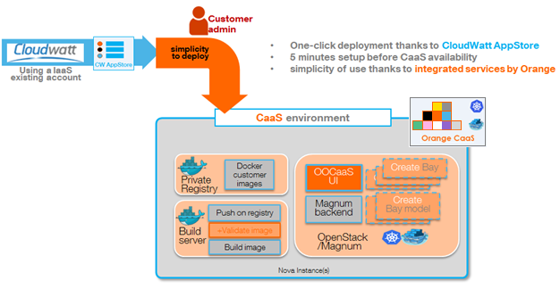

CaaS est un package simple à déployer, disponible dans *l'Application store* de CloudWatt.\
Trois composants principaux seront installés:
- Une instance KVM qui fournit une ‘Private Docker registry’ pour stocker vos futures images Docker.
- Une instance KVM qui fournit un ‘Build server’ afin de générer vos images.
- Une instance KVM qui fournit le *Backend* CaaS disponible en API et IHM.

Plus d'informations et de tutos sur [*https://www.cloudwatt.com/fr/labs/caas.html*](https://www.cloudwatt.com/fr/labs/caas.html).
Des vidéos sont disponibles sur [*https://www.dailymotion.com/Cloudwatt*](https://www.dailymotion.com/Cloudwatt).

Grâce à cet environnement CaaS, vous bénéficiez du projet OpenStack/Magnum qui encapsule la gestion des *clusters* clusters for Kubernetes or Docker Swarm. 
Un ‘Cluster’ (’*Magnum **Bay***’) est constitué d'une instance KVM ‘*Master*’ qui fournit les API & IHM pour le COE (Container Orchestrator Engine) Docker sélectionnée plus un ou plusieurs ‘*Nodes*’ en tant qu'instances KVM qui hébergerons vos containers Docker.

Si vous sélectionnez un cluster Kubernetes comme COE, quelques services complémentaires sont disponibles: 
- Le dashboard Kubernetes standard, permettant de tracker vos containers en cours d'exécution.
- Un système de Logging à base d'ELK (ELastic Search / Kibana).
- Un système d'analytics ‘Collect’D / Graphana.

## Parcours client DevOps simplifié
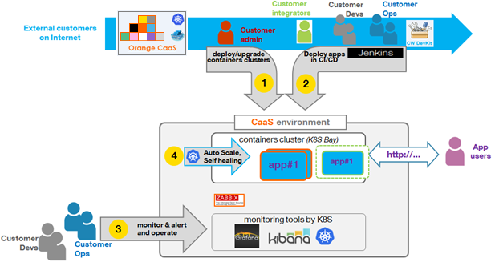

En tant que ‘Customer Admin’, après avoir déployé en ‘One-Click’ l'infrastructure CaaS dans votre tenant existant, vous pourrez:
-   Allouer votre premier ‘BayModel’ puis votre première ‘Bay’ :cf puce ‘***1***’.
-   Puis configurer votre environnement DevOps (cf Jenkins avec l'exemple de 'playbook' Ansible fourni dans les exemples PetClinic ou Tweet): cf puce ‘***2***’.

Ensuite, pour chacune des applications à Dockeriser, l'équipe DevOps va générer puis déployer l'application avec CaaS suivant les rôles proposées ci-dessous: cf puce ‘2’:
-   En tant que **customer senior developer== architecte**, vous mettez au point les descripteurs de l'application dockerisée:
	-   Le fichier classique POM.XML utilisée par Jenkins pour compiler l'application à partir des sources versionnés dans GIT.
    -   Le fichier ‘*docker file*’ qui décrit le contenu des futures images Docker
    -   Le *descripteur COE YML*, permettant de définir comment le COE Swarm ou Kubernetes doit déployer ou mettre à jour votre application au sein d'une Bay.

-   En tant que **customer developer**, vous modifiez le code source de l'application puis exécutez le job ‘**All in one’ Jenkins** qui exécute en séquence les étapes suivantes pour un environnement de 'non Production':
    -   Compilation des éléments applicatifs: dans notre exemple ‘PetClinic’ vous trouverez une application Java Spring qui construit un ficher WAR.
    -   Génération de(s) image(s) Docker: dans l'exemple ‘PetClinic’ vous découvrirez que l'on construit une image 'PetClinic' à partir d'une image 'latest' Tomcat disponible sur le 'Docker Hub' sur Internet, de ce fichier WAR et de quelques paramètres. Cette image Docker référencera ensuite une image 'latest' mySql du 'Docker Hub'.
    -   Déploiement de l'application Dockerisée au sein de la Bay.

-   En tant que **customer integrator**, vous créez optionnellement un job Jenkins partiel qui ne génère ni l'application ni les images Docker mais déploie une application dans un environnement de test afin que exécutiez des tests de non régression, de performances...

-   En tant que **customer OPerationS**, vous pouvez optionnellement dupliquer le job Jenkins ‘All in one’ afin de définir votre propre processus de mise en production(paramétrant par exemple la validation des images Docker) et la mise à jour du référenciel des 'changes' de l'entreprise.

Tout membre de l'équipe ***DevOps*** (et particulièrement les OPS) pourra bénéficier des add-ons Kubernetes (*Logging, metering and dashboarding*) et de la fonction d'auto-monitoring de CaaS (*intégrant Zabbix comme moteur de monitoring pour les éléments d'infrastructure CaaS et optionnellement les containers des clients*): cf puce ‘***3***’.

En tant que membre de l'équipe, vous bénéficierez de la fonction Kubernetes d'auto-scale Up&Down de vos containers (en fonction des critères de charge que vous aurez défini dans le descripteur K8S de votre application) ainsi que de l'auto-réparation via le 'self-healing : cf puce ‘***4***’.

## Préparation

### Les versions
-   Magnum 1.1
-   Docker v1.10
-   Kubernetes v1.2.2
-   Swarm 1.1.3

### Les prérequis au déploiement de la stack

Les éléments habituels:
-   Accès Internet
-   credentials CloudWatt ainsi qu'une KeyPair valide pour allouer de nouvelles instances
-   la compréhension de l'usage de l'AppStore de CW: le **'one-click deploy’**

### Taille des instances
Le bundle ‘One-Click’ sous forme de stack Heat. Par défaut les trois instances qui seront créées sont paramétrées pour utiliser le  'Flavour' ‘m1.small’. Nous vous recommendons de ne pas minorer cette 'Flavour'.
Pour chacune de ces 3 instances, un volume Cinder y sera attaché afin de stocker les données persistantes.

### Que trouverez vous dans le répertoire CaaS
Une fois que vous aurez consulté ou cloné le repository GitHub de CloudWatt
[*/cloudwatt/applications/application-caas*](https://github.com/cloudwatt/applications/tree/master/application-caas), vous trouverez:
-   **application-caas_beta1.0.heat.yml**: le temple d'orchestration HEAT. Il permet de déployer l'infrastructure CaaS sans le '1-click' en mode CW/Console.
-   **PetClinic\_sample.zip**: exemple Java Spring, qui build une image Docker à base du 'latest' Tomcat et pointe une image 'latest' Docker 'mySql'.
-   **Tweet\_sample.zip**: une 'vraie' 'Cloud Native application en tant que composite d'images Docker existantes.
-   **README.md** and **README-EN.md** (ce document)
-   **CaaS\_howToTroubleshoot.pdf:** futur document.

## Procédure d'installation CaaS en mode '1-click':
==>Regardez la vidéo [*one-click-caas-deployment*](https://www.dailymotion.com/video/x4cinqb_one-click-caas-deployment_tech) !

CaaS s'installe en mode '1-click' via la page web [*Apps page*](https://www.cloudwatt.com/fr/applications/application-caas). Choisissez 'CaaS', pressez DEPLOY. Après la saisie de vos login / password pour vous authentifier, le wizard apparaît:

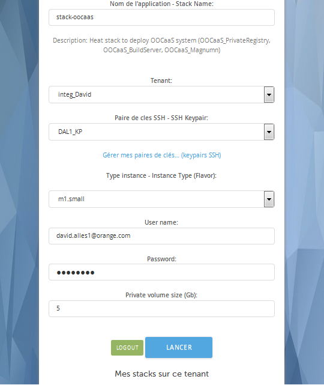

Par défaut le wizard sélection la flavor “m1.small” pour les instances à instancier. D'autres tailles d'instances sont disponibles,en lien avec leur facturation (voir [*Pricing page*](https://www.cloudwatt.com/en/pricing.html) ).
N'oubliez pas de pointer sur votre KeyPair qui sera utilisée lors de la postConfiguration de CaaS pour définir votre connexion SSh (et vous permettre d'inviter vos collègues sur ces VMs si nécessaire)..\
/!\ **Chez CloudWatt laissez les champs 'Proxy' vierges si vous utilisez l'exposition du service sur Internet**

**Press DEPLOY**. Le framework '1-click' se charge de lancer la stack Heat avec les paramètres adHoc. Cela entraîne la création de trois instances KVM et des éléments OpenStack associés(cinder volumes, neutron internal private network…)

Vous pouvez voir la progression de l'installation en cliquant sur le nom de la stack, ce qui vous amène dans la CWConsole sur l'onglet 'Stacks'. Quand la création est achevée en succès alors l'icone de la stack passe à 'vert'.

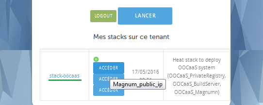

Vous pouvez alors trouver l'affichage de trois URLS accessibles via des floatingIPs allouées par le 1-click:
-   ‘Magnum\_public\_ip’, qui vous mène au portail CaaS, en tant qu'extension du portail Magnum\_UI.
-   ‘PrivateRegistry UI’, à utiliser une fois que le certificat auto-signé sera accepté en lien avec le compte auto-généré: voir plus bas.
-   ‘Zabbix UI’, à utiliser pour accéder au service de monitoring en lien avec le compte auto-généré: voir plus bas.

Dans l'interface standard CWConsole, vous devrez visualiser les attributs 'outputs' de la stack afin de consulter en plus des ces URLS le ***password généré*** pendant l'installation, devant servir pour 3 fonctions.\
**… Gardez bien en tête ce password généré  =&lt;**StackAutoGeneratedPassword**&gt;!!!**

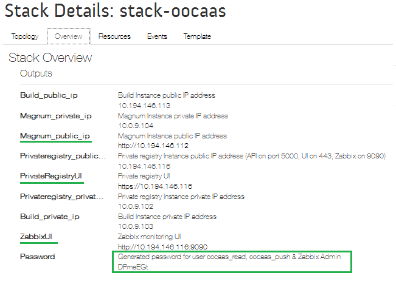01

## Terminez l'installation de CaaS:
==>Deuxième partie de la vidéo [*one-click-caas-deployment*](https://www.dailymotion.com/video/x4cinqb_one-click-caas-deployment_tech) *

Comme démontré dans cette vidéo, il faut suivre les explications de la page ‘*Getting started*’ après vous être authentifier sur le portail CaaS dédié (*astuce: grâce à votre compte habituel CloudWatt car le CaaS est fédéré avec l'annuaire OpenStack/KeyStone*)

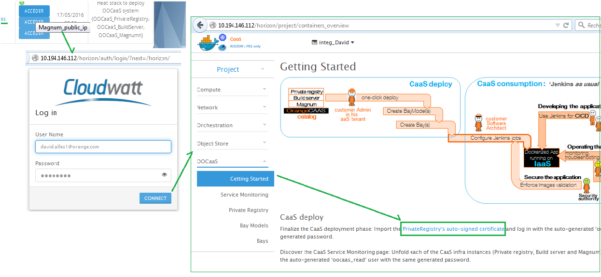

Terminer l'installation de l'infrastructure CaaS est simple:
1)  Connectez vous sur l'URL de CaaS\_UI==Magnum\_UI URL avec vos credentials CW habituels.
2)  Au sein de la page par défaut ‘*CaaS/Getting’*, cliquez sur le lien ‘PrivateRegistry’s auto-signed certificate’ lpour accepter le certificat auto-signé généré par CaaS, puis connectez-vous avec le login=’*oocaas\_read*’, pwd=&lt;**StackAutoGeneratedPassword**&gt;

***=>Et voilà, vous avez votre CaaS infrastructure!***\
/!\ ***Veuillez noter que le compte d'accès en SSH aux trois VMs de CaaS_infra est 'cloud', avec votre clef privée!***

## Créez votre premier cluster de Container

### Création de BayModel: 
==>cf vidéo [*managing-baymodels*](https://www.dailymotion.com/video/x4cinwm_caas-managing-baymodels_tech) .\
L'infrastructure CaaS vous permet de créer des ‘BayModel’ pour définir les templates de cluster Docker avec des paramètres par défault: saisissez simplement le nom du template et sélectionnez le COE ‘Kubernetes’ ou ‘Swarm’.
Si vous être curieux, vous pourrez visualiser les paramètres *advanced*...

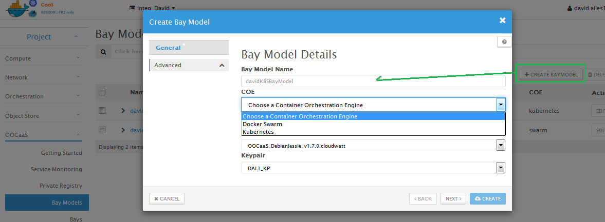

### Création de la première Bay(s):
==> Cf les vidéos[*creating-and-updating-swarm-bay*](https://www.dailymotion.com/video/x4cisjo_caas-creating-and-updating-swarm-bay_tech) et [*creating-and-updating-k8s-bay*](https://www.dailymotion.com/video/x4b0bii_creating-and-updating-k8s-bay_tech) .\
Grâce à vos BayModel(s), il vous reste à déployer vos cluster Docker (c'est à dire les *Bays* pilotés par OpenStack/Magnum) en quelques clicks

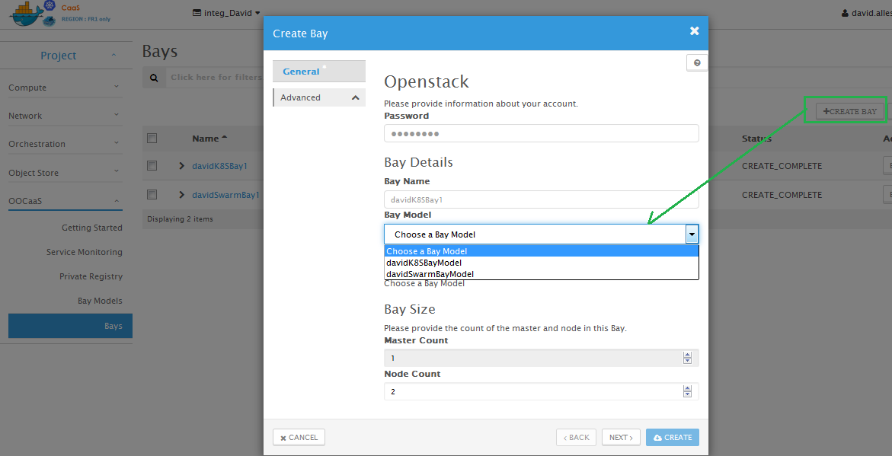

-   Ce wizard entraîne le lancement d'une stack Heat:vous devez donc rappeler votre password
-   Nommez votre bay, selectionnez votre template de BayModel, selectionnez le nombre de ‘Nodes’ qui sont des instances KVM pour exécuter vos containers docker de vos applications.
-   Suite à 'Create', la Stack Heat est lancée. Attendez la fin de création de ces 3 instances pour visualiser le panneau 'Bay' et l'affichage des attributs.

En résultat, un cluster pour chacun des COE sera similaire à la copie d'écran suivante\
/!\ ***Veuillez noter que le compte d'accès en SSH aux trois VMs de CaaS_infra est 'minion', avec votre clef privée!***

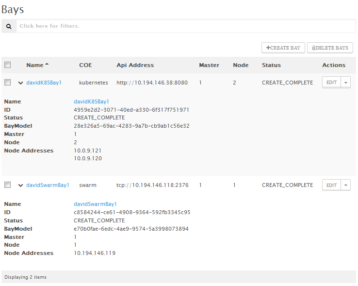

-	Le statut est 'completed' (indiquant que la stack s'est correctement configurée OK et que la post-configuration de Bay est aussi en succès (*synchronisation entre le ‘Master’ et ses ‘Nodes’*):
-   Un seul master est alloué (*dans cette version Beta, nous avons désactivé la possibilité de mettre en *haute disponibilité* les masters native dans Magnum; dans le futur cette fonction sera réactivée)
-   Suivant votre choix, un ou plusieurs ‘Nodes’ sont alloués. Dans la terminologie K8S cela s'appelle des ‘*Minions’.*
-	/!\Si vous avez choisi ***Kubernetes, n'oubliez pas d'ouvrir le security group *K8S Master* pour le flux TCP:8080*** pour vous et vos collègues afin d'accéder à l'API K8S et les services ajoutés!

***=>Et voilà, vous avez votre premier environnement Cluster Docker pour vos micro services***

### Comprendre les possibilités, en fonction du COE sélectionné: ‘Swarm is simple’ vs ‘Kubernetes is features rich’***
#### Swarm Bay
La technologie Docker Swarm en version v1.1.3 est simple et facile à utiliser (*voir le chapitre sur 'how to deploy PetClinic sample' et la vidéo*).

Ce COE propose un descripteur compatible ‘Docker Compose' en format YML afin de décrire les applications dockerisées. **Swarm pilote le déploiement des containers**: C'est (*uniquement*) cela!

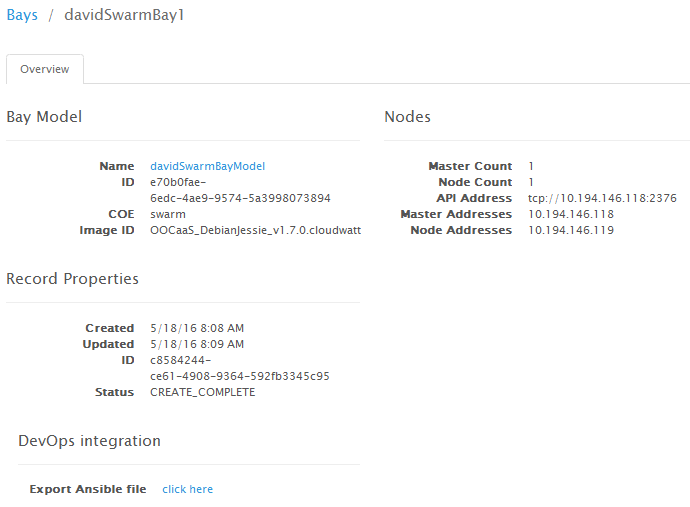

Dans l'IHM CaaS, l'affichage de la bay Swarm fournit:
-   You have the API address of the Swarm API service (hosted on the ‘*Master’* instance).
-   You must dig into the nodes in order to discover which one is run which deploy container
-   You must expose your container on the external world via OpenStack/Neutron network features (Load balancer and/or FloatingIp)
-	/!\ You must adjust the security group on 'Swarm Nodes' in order to open the external flows
-   You can allocate an OpenStack/Cinder volume and give it to one container (as an example, the ‘*mySql’* database container in order to persist the data )
***=> In one work: Simple: YOU DO the job!***

#### Kubernetes
Google Kubernetes technology in this v1.2.2 version is feature rich and easy to use (*see the following chapter on how to deploy PetClinic sample with it, or the related video*).
This COE provides a ‘Docker Compose compatible YML file to describe the Dockerized application. **Kubernetes drives the deployment of the containers PLUS the configuration of the OpenStack external context**: That’s (*plenty of*) it!

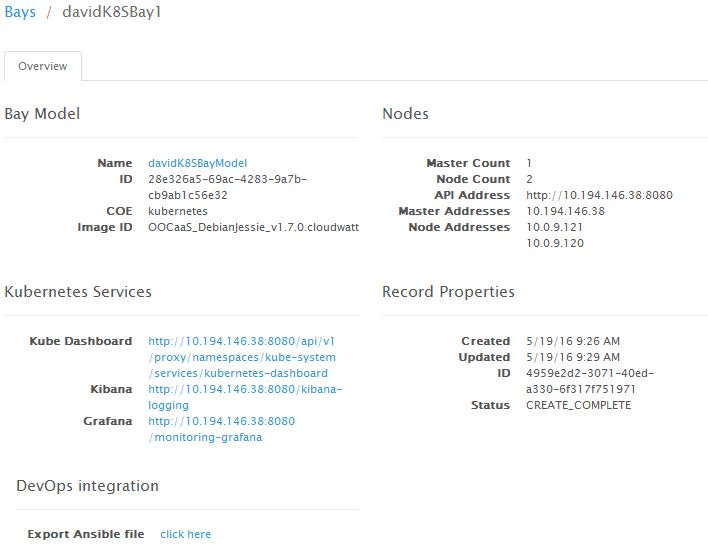

Like Swarm, Kubernetes panel show the API url. But it provides plenty of additional features as soon as you open the flow onto this
-   Kube UI, as a dashboard to manage the deployed container K8S PODs in the cluster
-   Kube DNS, as a container service locator to identify the K8S services.
-   Kube ELK technology, in order to kepp track of the logs of the running containers
-   Kube Collect’D & Graphana for stats on the containers
-   Kube configuration inside Magnum-based CaaS offer: K8S encapsulates to use of OpenStack APIs for Storage (see Cinder) and Network (see Neutron/LB and Neutron/FloatingIPs)
-	/!\ You must adjust the security group on 'Minions Nodes' in order to open the external flows. In the current OpenStack implementation, there is no means to use SecurityGroups on LoadBalancer to fine-track the exposure if your micro-service is expose via LB.
***=> In one work: features rich: K8S DO the job for you!***

## DevOps chain integration:
==>See [*devops-and-caas-integration*](https://www.dailymotion.com/video/x4b0brh_devops-and-caas-integration_tech) video.

### Retrieving the Bay’s parameters
Every bay is providing a ‘*simple but magic*’ dialog Box:

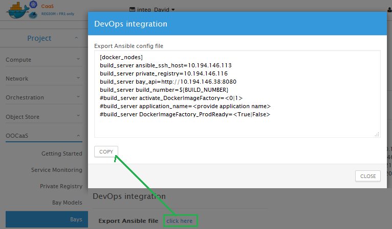

Please click on ‘DevOps integration: the content of the Dialog box corresponds to **the parameters for your future Ansible PlayBook**!

/!\ As the creator of the CaaS infrastructure, your KeyPair was used to configure the CaaS_BuildServer machine: access via SSH is OK with the 'cloud' user and privateKey. \
***But if you want to allow your colleagues to use their own keyPair, you must grant them*** by\
vi of the */home/cloud/.ssh/authorized_keys* and add the relevant ssh-rsa key(s) like\
*ssh-rsa AAAAB3NzaC1yc2EAAAABJQAAAQEA0t°°°UqQ== rsa-key-20160218 *.

### Configuring your Jenkins job and its Ansible cookbook
See subset of **Jenkins setup in Annex1 at the end of the document**. …***create your new Jenkins job configure it with few technical params, but the Developers are used to this!***

/!\ ***take care with the credentials*** of the Jenkins Job, in link with the authorized_keys in the CaaS_BuildServer, see Above

### Building and deploying your first PetClinic application:
==>See [*deploying-petclinic-in-swarm-bay*](https://www.dailymotion.com/video/x4b0bmo_caas-deploying-petclinic-in-swarm-bay_tech) and [*deploying-petclinic-in-k8s-bay*](https://www.dailymotion.com/video/x4b0auc_caas-deploying-petclinic-in-k8s-bay_tech) videos.

Once you setup the Jenkins job, then launch it and follow the logs progress.

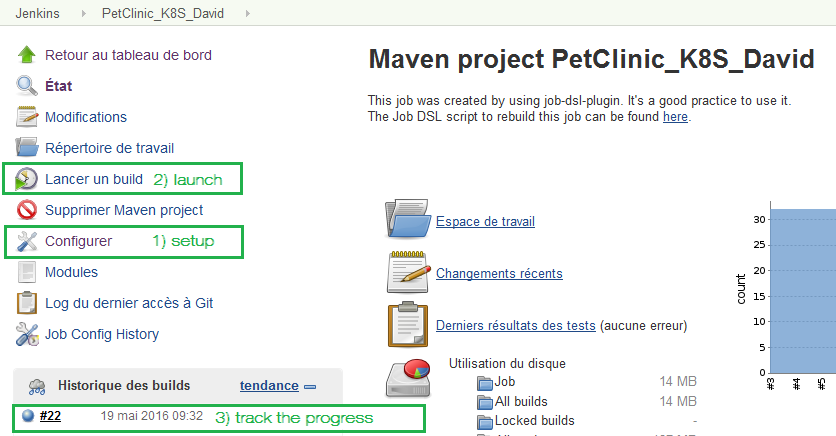

As an example, CaaS is providing an example with the PetClinic ‘AllInOne’ Jenkins and related Ansible cookbook is driving:
-   The build of the standard Java Spring application, producing a java War file to be onboarded inside a Tomcat web server.
-   The build of the ‘PetClinic’ Docker image that will be based on a ‘latest’ tomcat Docker image from the Docker Hub on Internet plus some glue to deploy and configure the PetClinic War
-   The tag then push of this image inside the CaaS private registry
-   And then the deployment of the application in a Swarm or Kubernetes Bay

In the following screenshot, the Kubernetes COE is used:
-   The first line corresponds to the BuildServer’s request to deploy the PetClinic application in the bay: Kubectl command.
-   Then later, when the build is in success, the Kubernetes bay is giving back plenty of info on the features rich content of the bay (already shown in the CaaS ‘Bay’ panel)
-   In blue: as a result the URL of the PetClinic service is given back (Developers know the URI of /petclinic )

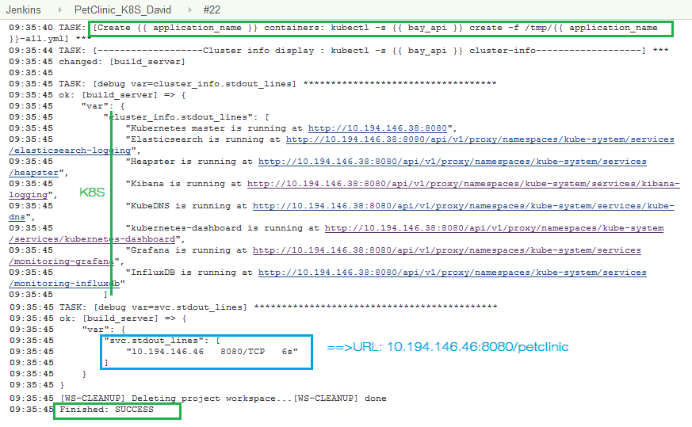

***=> Watch the videos: many more details inside them!!!***

### How to use the Private registry?
The CaaS UI is providing a ‘Docker dashboard’ integrated as an iFrame. In the Beta Release 1, only Read-only feature is available. Next release will provide Docker ‘Portus’ UI with Read-Write’ functions.\

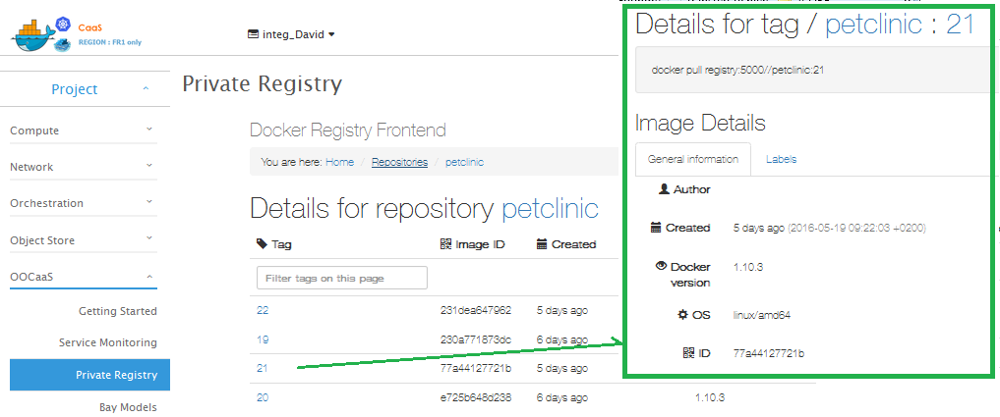

Please browse the registry: as an example see the PetClinic Docker image with multiple versions (because plenty of Jenkins jobs which tag each time with the Job’s tag). Each version provides some infos.

### How to use the Docker images factory?
In the DevOps integration dialog box, two attributes are configuring the use (or not) of the embedded Orange image factory framework.

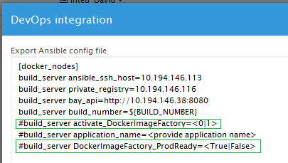

If DockerImageFactory is set to ‘0’, no use of it… See subset of **Docker image factory setup in Annex2 at the end of the document**.

### How to use the auto-monitoring feature in CaaS with the embedded Zabbix?
CaaS innovation contains an auto-monitoring feature, see ‘service monitoring’ tab.

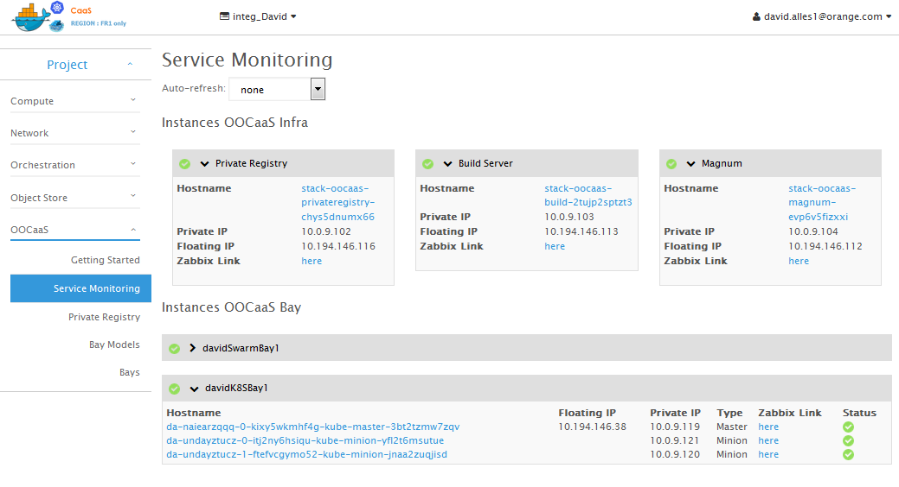

By design, every KVM instance deployed inside the customer’s tenant is discovered by the CaaS embedded Zabbix system and assigned to a monitoring template according to their role.
The service monitoring page is classifying the instances into two groups: the ‘CaaS infra’ for the PrivateRegistry, BuildServer and Magnum… and the bays with one entry per bay with their Master and nodes…
When clicking on the related ‘Zabbix link’ on one element, a new tab is open and displays the filtered monitoring element: Please login with ‘admin’ and pwd=&lt;**StackAutoGeneratedPassword**&gt;

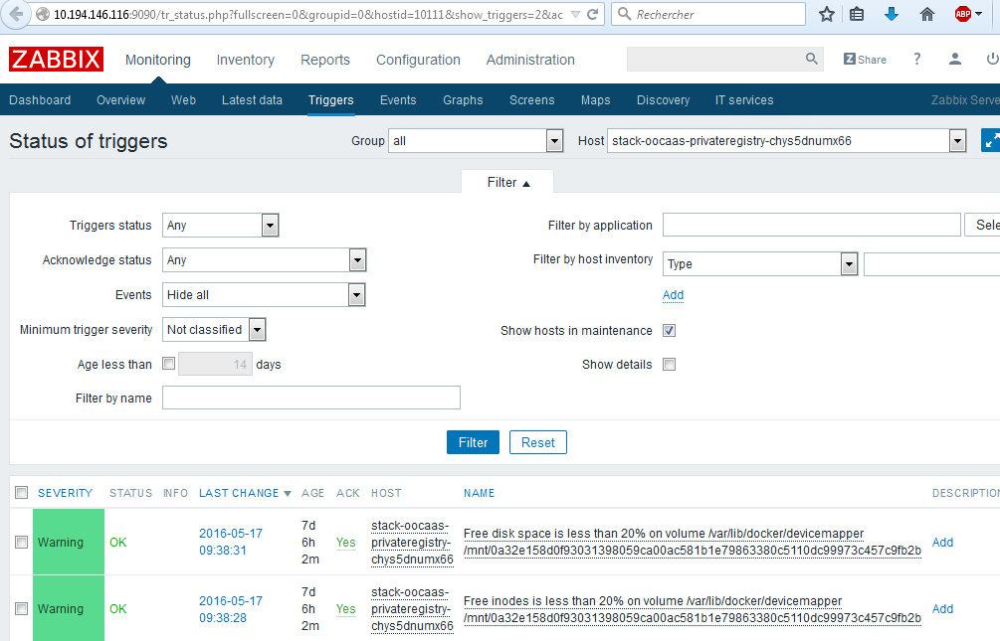

## And Watt else?
Next document will detail some more info on
-   Understanding the CaaS infrastructure: see [*understanding-caas-infrastructure*](https://www.dailymotion.com/video/x4cio3y_understanding-caas-infrastructure_tech)     video
-   How to manage namespaces and repositories inside Docker PrivateRegistry?
-   How to fine tune the blacklists in the Docker image factory?
-   Operating the dockerized application with Kubernetes focus :
    -   How to use Kube UI?
    -   How to use Grafana?
    -   How to use Kibana?
-   Operating the OOCaaS deliverables
    -   How to troubleshoot the service?
    -   How to use the embedded Zabbix to monitor your application?

## And the future?
This article will allow you to dive into the Dockerized world on CloudWatt. This beta service is currently free of charge for the Docker layer.
Please do not hesitate to provide us with your feedback on the current services as well as your ideas for bugFixes, features enhancements or a ‘managed service’ by Orange Business services ^tm^.

***=>Get in touch with [*apps@cloudwatt.com*](mailto:apps@cloudwatt.com)***

.
.
.
# Annex 1: complete setup of Jenkins and related Ansible
==>See [*devops-and-caas-integration*](https://www.dailymotion.com/video/x4b0brh_devops-and-caas-integration_tech) video

- Add the [*Ansible Plugin*](https://wiki.jenkins-ci.org/display/JENKINS/Ansible+Plugin) to your Jenkins. (Nb : Read the Jenkins documentation : [*How to add a plugin*](http://faas.forge.orange-labs.fr/documentation/master/userguide/index.html#jenkins-ajout-plugin))\
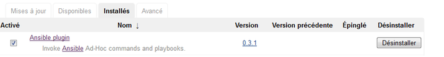

- Add the custom tools : Ansible 1.9. (Nb: Read the Jenkins documentation : [*How to add a custom tools*](http://faas.forge.orange-labs.fr/documentation/master/userguide/index.html#jenkins-custom-tools))\
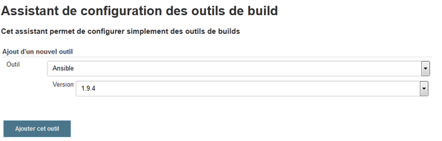

- Create a new Job.

- Configure the job to pull the source code of your application on the Git of your source control.\
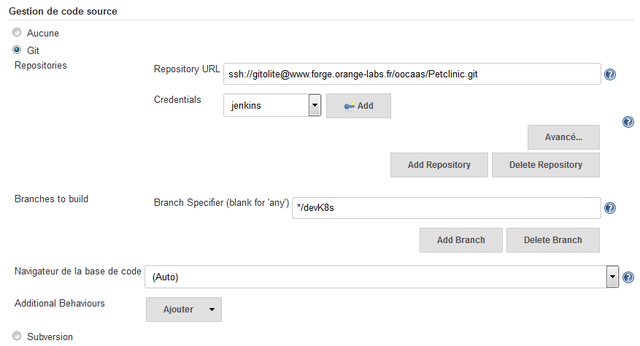

- Check the box 'Install custom tools' and select 'Ansible 1.9' as tool selection.\

- Add an post build step : 'Invoke Ansible Playbook' and use the exported parameters from your Bay.\
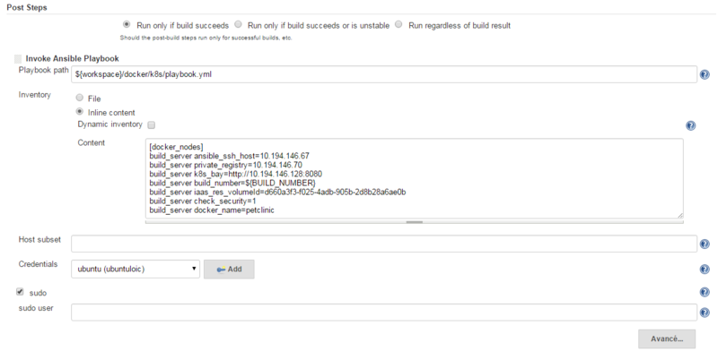

- Configure the step to execute your playbook ansible.

- Add the keypair of the Build Server instance in order that Ansible can connect to it.\
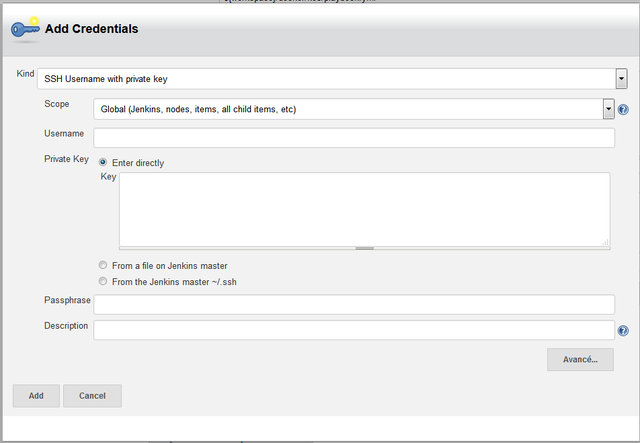

.
.
.

# Annex 2: Using the Docker image factory framework
### Selecting the level of image validation
In the DevOps integration dialog box, two attributes are configuring the use (or not) of the embedded Orange image factory framework 

-   If ‘build\_server activate\_DockerImageFactory’ is set to ‘0’, then no image validation is made.\ As a consequence the build server is only building the docker images and pushing them on the Private Registry
-   If ‘build\_server activate\_DockerImageFactory’ is set to ‘1’, then the complementary attribute is use to define with ‘*validation blacklist’* is used:\
    … ‘build\_server DockerImageFactory\_ProdReady =&lt;True|False&gt;’

### Understanding the configuration of the blacklists
On the CaaS\_BuildServer KVM instance, two files are provided with default Orange values for blacklists:
-   ‘Insecure level == **nonProduction** :’ The file can be modified in /home/cloud/imagefactory/run/**filch-insecure.json**
-   ‘**Production** level’ : The file can be modified in /home/cloud/imagefactory/run/**filch.json**

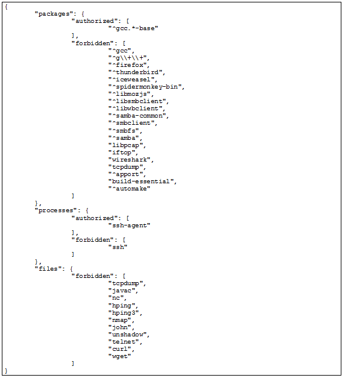

### Examples of validation
-   If validation is running well\
    

-   If validation is KO\
    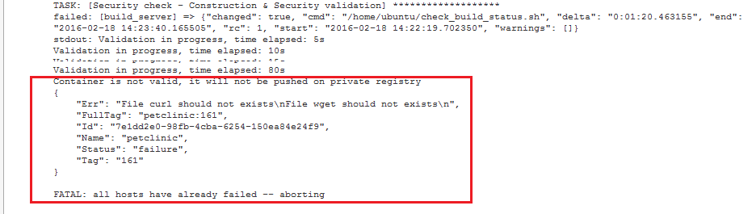

