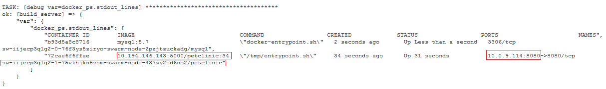
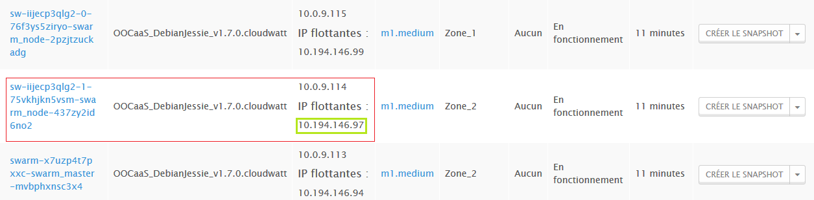

# Innovation Beta : Container aaS #

## La promesse

’Container as a Service’ (CaaS) est un service en mode Béta qui fournit l'ensemble des éléments logiciels nécessaires pour déployer des applications Dockerisées au sein d'un environnement OpenStack KVM. 
Il bénéficie de la flexibilité grâce au IaaS de CloudWatt, la sécurité grâce à l'isolation des réseaux virtualisés dans OpenStack et la simplicité grâce au contenu de ce bundle. \
Regardez le teasing dans la vidéo [*why-devops-with-dockerized-micro-services*](https://www.dailymotion.com/video/x4cinix_caas-teasing-why-devops-with-dockerized-micro-services_tech) pour comprendre ce changement vers le DevOps!

***Les promesses sont***
- One-Click deploy & 5 minutes: vous déployez votre infrastructure **Docker-based ContainerAAS**.
- One click & 3 minutes: vous déployez votre premier cluster (*Magnum Bay*) à base de l'orchestrateur **COE** (*Container Orchestration Engine*) Docker **Swarm** ou Google **Kubernetes**.
- Quelques clicks: vous intégrez CaaS au sein de votre environnement **Jenkins** afin d'exécuter des processus **DevOps**

CaaS est un package simple à déployer, disponible dans *l'Application store* de CloudWatt.\
Trois composants principaux seront installés:
- Une instance KVM qui fournit une ‘Private Docker registry’ pour stocker vos futures images Docker.
- Une instance KVM qui fournit un ‘Build server’ afin de générer vos images.
- Une instance KVM qui fournit le *Backend* CaaS disponible en API et IHM.

Plus d'informations et de tutos sur [*https://www.cloudwatt.com/fr/labs/caas.html*](https://www.cloudwatt.com/fr/labs/caas.html).
Des vidéos sont disponibles sur [*https://www.dailymotion.com/Cloudwatt*](https://www.dailymotion.com/Cloudwatt).

Grâce à cet environnement CaaS, vous bénéficiez du projet OpenStack/Magnum qui encapsule la gestion des *clusters* clusters for Kubernetes or Docker Swarm. 
Un ‘Cluster’ (’*Magnum **Bay***’) est constitué d'une instance KVM ‘*Master*’ qui fournit les API & IHM pour le COE (Container Orchestrator Engine) Docker sélectionnée plus un ou plusieurs ‘*Nodes*’ en tant qu'instances KVM qui hébergerons vos containers Docker.

Si vous sélectionnez un cluster Kubernetes comme COE, quelques services complémentaires sont disponibles: 
- Le dashboard Kubernetes standard, permettant de tracker vos containers en cours d'exécution.
- Un système de Logging à base d'ELK (ELastic Search / Kibana).
- Un système d'analytics ‘Collect’D / Graphana.

## Parcours client DevOps simplifié

En tant que ‘Customer Admin’, après avoir déployé en ‘One-Click’ l'infrastructure CaaS dans votre tenant existant, vous pourrez:
-   Allouer votre premier ‘BayModel’ puis votre première ‘Bay’ :cf puce ‘***1***’.
-   Puis configurer votre environnement DevOps (cf Jenkins avec l'exemple de 'playbook' Ansible fourni dans les exemples PetClinic ou Tweet): cf puce ‘***2***’.

Ensuite, pour chacune des applications à Dockeriser, l'équipe DevOps va générer puis déployer l'application avec CaaS suivant les rôles proposées ci-dessous: cf puce ‘2’:
-   En tant que **customer senior developer== architecte**, vous mettez au point les descripteurs de l'application dockerisée:
	-   Le fichier classique POM.XML utilisée par Jenkins pour compiler l'application à partir des sources versionnés dans GIT.
    -   Le fichier ‘*docker file*’ qui décrit le contenu des futures images Docker
    -   Le *descripteur COE YML*, permettant de définir comment le COE Swarm ou Kubernetes doit déployer ou mettre à jour votre application au sein d'une Bay.

-   En tant que **customer developer**, vous modifiez le code source de l'application puis exécutez le job ‘**All in one’ Jenkins** qui exécute en séquence les étapes suivantes pour un environnement de 'non Production':
    -   Compilation des éléments applicatifs: dans notre exemple ‘PetClinic’ vous trouverez une application Java Spring qui construit un ficher WAR.
    -   Génération de(s) image(s) Docker: dans l'exemple ‘PetClinic’ vous découvrirez que l'on construit une image 'PetClinic' à partir d'une image 'latest' Tomcat disponible sur le 'Docker Hub' sur Internet, de ce fichier WAR et de quelques paramètres. Cette image Docker référencera ensuite une image 'latest' mySql du 'Docker Hub'.
    -   Déploiement de l'application Dockerisée au sein de la Bay.

-   En tant que **customer integrator**, vous créez optionnellement un job Jenkins partiel qui ne génère ni l'application ni les images Docker mais déploie une application dans un environnement de test afin que exécutiez des tests de non régression, de performances...

-   En tant que **customer OPerationS**, vous pouvez optionnellement dupliquer le job Jenkins ‘All in one’ afin de définir votre propre processus de mise en production(paramétrant par exemple la validation des images Docker) et la mise à jour du référenciel des 'changes' de l'entreprise.

Tout membre de l'équipe ***DevOps*** (et particulièrement les OPS) pourra bénéficier des add-ons Kubernetes (*Logging, metering and dashboarding*) et de la fonction d'auto-monitoring de CaaS (*intégrant Zabbix comme moteur de monitoring pour les éléments d'infrastructure CaaS et optionnellement les containers des clients*): cf puce ‘***3***’.

En tant que membre de l'équipe, vous bénéficierez de la fonction Kubernetes d'auto-scale Up&Down de vos containers (en fonction des critères de charge que vous aurez défini dans le descripteur K8S de votre application) ainsi que de l'auto-réparation via le 'self-healing : cf puce ‘***4***’.

## Préparation

### Les versions
-   Magnum 1.1
-   Docker v1.10
-   Kubernetes v1.2.2
-   Swarm 1.1.3

### Les prérequis au déploiement de la stack

Les éléments habituels:
-   Accès Internet
-   credentials CloudWatt ainsi qu'une KeyPair valide pour allouer de nouvelles instances
-   la compréhension de l'usage de l'AppStore de CW: le **'one-click deploy’**

### Taille des instances
Le bundle ‘One-Click’ sous forme de stack Heat. Par défaut les trois instances qui seront créées sont paramétrées pour utiliser le  'Flavour' ‘m1.small’. Nous vous recommendons de ne pas minorer cette 'Flavour'.
Pour chacune de ces 3 instances, un volume Cinder y sera attaché afin de stocker les données persistantes.

### Que trouverez vous dans le répertoire CaaS
Une fois que vous aurez consulté ou cloné le repository GitHub de CloudWatt
[*/cloudwatt/applications/application-caas*](https://github.com/cloudwatt/applications/tree/master/application-caas), vous trouverez:
-   **application-caas_beta1.0.heat.yml**: le temple d'orchestration HEAT. Il permet de déployer l'infrastructure CaaS sans le '1-click' en mode CW/Console.
-   **PetClinic\_sample.zip**: exemple Java Spring, qui build une image Docker à base du 'latest' Tomcat et pointe une image 'latest' Docker 'mySql'.
-   **Tweet\_sample.zip**: une 'vraie' 'Cloud Native application en tant que composite d'images Docker existantes.
-   **README.md** and **README-EN.md** (ce document)
-   **CaaS\_howToTroubleshoot.pdf:** futur document.

## Procédure d'installation CaaS en mode '1-click':
==>Regardez la vidéo [*one-click-caas-deployment*](https://www.dailymotion.com/video/x4cinqb_one-click-caas-deployment_tech) !

CaaS s'installe en mode '1-click' via la page web [*Apps page*](https://www.cloudwatt.com/fr/applications/application-caas). Choisissez 'CaaS', pressez DEPLOY. Après la saisie de vos login / password pour vous authentifier, le wizard apparaît:

Par défaut le wizard sélection la flavor “m1.small” pour les instances à instancier. D'autres tailles d'instances sont disponibles,en lien avec leur facturation (voir [*Pricing page*](https://www.cloudwatt.com/en/pricing.html) ).
N'oubliez pas de pointer sur votre KeyPair qui sera utilisée lors de la postConfiguration de CaaS pour définir votre connexion SSh (et vous permettre d'inviter vos collègues sur ces VMs si nécessaire)..\
/!\ **Chez CloudWatt laissez les champs 'Proxy' vierges si vous utilisez l'exposition du service sur Internet**

**Press DEPLOY**. Le framework '1-click' se charge de lancer la stack Heat avec les paramètres adHoc. Cela entraîne la création de trois instances KVM et des éléments OpenStack associés(cinder volumes, neutron internal private network…)

Vous pouvez voir la progression de l'installation en cliquant sur le nom de la stack, ce qui vous amène dans la CWConsole sur l'onglet 'Stacks'. Quand la création est achevée en succès alors l'icone de la stack passe à 'vert'.

Vous pouvez alors trouver l'affichage de trois URLS accessibles via des floatingIPs allouées par le 1-click:
-   ‘Magnum\_public\_ip’, qui vous mène au portail CaaS, en tant qu'extension du portail Magnum\_UI.
-   ‘PrivateRegistry UI’, à utiliser une fois que le certificat auto-signé sera accepté en lien avec le compte auto-généré: voir plus bas.
-   ‘Zabbix UI’, à utiliser pour accéder au service de monitoring en lien avec le compte auto-généré: voir plus bas.

Dans l'interface standard CWConsole, vous devrez visualiser les attributs 'outputs' de la stack afin de consulter en plus des ces URLS le ***password généré*** pendant l'installation, devant servir pour 3 fonctions.\
**… Gardez bien en tête ce password généré  =&lt;**StackAutoGeneratedPassword**&gt;!!!**

01

## Terminez l'installation de CaaS:
==>Deuxième partie de la vidéo [*one-click-caas-deployment*](https://www.dailymotion.com/video/x4cinqb_one-click-caas-deployment_tech) *

Comme démontré dans cette vidéo, il faut suivre les explications de la page ‘*Getting started*’ après vous être authentifier sur le portail CaaS dédié (*astuce: grâce à votre compte habituel CloudWatt car le CaaS est fédéré avec l'annuaire OpenStack/KeyStone*)

Terminer l'installation de l'infrastructure CaaS est simple:
1)  Connectez vous sur l'URL de CaaS\_UI==Magnum\_UI URL avec vos credentials CW habituels.
2)  Au sein de la page par défaut ‘*CaaS/Getting’*, cliquez sur le lien ‘PrivateRegistry’s auto-signed certificate’ lpour accepter le certificat auto-signé généré par CaaS, puis connectez-vous avec le login=’*oocaas\_read*’, pwd=&lt;**StackAutoGeneratedPassword**&gt;

***=>Et voilà, vous avez votre CaaS infrastructure!***\
/!\ ***Veuillez noter que le compte d'accès en SSH aux trois VMs de CaaS_infra est 'cloud', avec votre clef privée!***

## Créez votre premier cluster de Container

### Création de BayModel: 
==>cf vidéo [*managing-baymodels*](https://www.dailymotion.com/video/x4cinwm_caas-managing-baymodels_tech) .\
L'infrastructure CaaS vous permet de créer des ‘BayModel’ pour définir les templates de cluster Docker avec des paramètres par défault: saisissez simplement le nom du template et sélectionnez le COE ‘Kubernetes’ ou ‘Swarm’.
Si vous être curieux, vous pourrez visualiser les paramètres *advanced*...

### Création de la première Bay(s):
==> Cf les vidéos[*creating-and-updating-swarm-bay*](https://www.dailymotion.com/video/x4cisjo_caas-creating-and-updating-swarm-bay_tech) et [*creating-and-updating-k8s-bay*](https://www.dailymotion.com/video/x4b0bii_creating-and-updating-k8s-bay_tech) .\
Grâce à vos BayModel(s), il vous reste à déployer vos cluster Docker (c'est à dire les *Bays* pilotés par OpenStack/Magnum) en quelques clicks

-   Ce wizard entraîne le lancement d'une stack Heat:vous devez donc rappeler votre password
-   Nommez votre bay, selectionnez votre template de BayModel, selectionnez le nombre de ‘Nodes’ qui sont des instances KVM pour exécuter vos containers docker de vos applications.
-   Suite à 'Create', la Stack Heat est lancée. Attendez la fin de création de ces 3 instances pour visualiser le panneau 'Bay' et l'affichage des attributs.

En résultat, un cluster pour chacun des COE sera similaire à la copie d'écran suivante\
/!\ ***Veuillez noter que le compte d'accès en SSH aux trois VMs de CaaS_infra est 'minion', avec votre clef privée!***

-	Le statut est 'completed' (indiquant que la stack s'est correctement configurée OK et que la post-configuration de Bay est aussi en succès (*synchronisation entre le ‘Master’ et ses ‘Nodes’*):
-   Un seul master est alloué (*dans cette version Beta, nous avons désactivé la possibilité de mettre en *haute disponibilité* les masters native dans Magnum; dans le futur cette fonction sera réactivée)
-   Suivant votre choix, un ou plusieurs ‘Nodes’ sont alloués. Dans la terminologie K8S cela s'appelle des ‘*Minions’.*
-	/!\Si vous avez choisi ***Kubernetes, n'oubliez pas d'ouvrir le security group *K8S Master* pour le flux TCP:8080*** pour vous et vos collègues afin d'accéder à l'API K8S et les services ajoutés!

***=>Et voilà, vous avez votre premier environnement Cluster Docker pour vos micro services***

### Comprendre les possibilités, en fonction du COE sélectionné: ‘Swarm is simple’ vs ‘Kubernetes is features rich’***
#### Swarm Bay
La technologie Docker Swarm en version v1.1.3 est simple et facile à utiliser (*voir le chapitre sur 'how to deploy PetClinic sample' et la vidéo*).\
Ce COE propose un descripteur compatible ‘Docker Compose' en format YML afin de décrire les applications dockerisées. **Swarm pilote le déploiement des containers**: C'est (*uniquement*) cela!

Dans l'IHM CaaS, l'affichage de la bay Swarm fournit les infos suivantes:
-   L'adresse de l'API du service Swarm (porté par l'instance ‘*Master’*).
-   Il vous faut rentrer dans chacun des 'Nodes' afin de découvrir celui qui porter le container qui vous intéresse. Voir le chapitre '*déploiement d'application avec Swarm*'
-   Vous devez exposer votre application au monde externe via les fonctions OpenStack/Neutron (Load balancer et/ou FloatingIp)
-	/!\ Vous devez aussi ajuster le SecurityGroup 'Swarm Nodes' afin de permettre ces fluxs externes
-   Vous pouvez optionnellement créer un volume OpenStack/Cinder et l'affecter à votre application (Par exemple pour la base de données ‘*mySql’* afin de persister vos données)\
***=> En un mot: Simple: c'est VOUS qui faites le Job!***

#### Kubernetes Bay
La technologie Google Kubernetes dans cette version v1.2.2 est riche en fonctionnalités et facile d'usage. Voir le chapitre '*déploiement d'application avec Kubernetes*).\
Ce COE fournit son descripteur YML spécifique pour decrire les éléments d'application et les fonctions du IaaS à associer. **Kubernetes pilote les déploiement des containers PLUS la configuration des éléments OpenStack réseau et stockage optionnel**: C'est (*tout*) cela!

Comme pour Swarm, le panneau de bay Kubernetes détaille l'UTL de l'API K8S. Mais il fournit plein d'autres fonctionnalités supplémentaires dès lors que vous avez ouvert le flux d'accès sur le SecurityGroup (*tcp 8080!*)
-   Kube UI, en tant que dashboard pour gérer les *pods* de services K8S déployés dans le cluster.
-   Kube DNS, en tant qu'annuaire des services K8S déployés.
-   Kube ELK technology, afin de fournir un système de gestion externe des logs des containers.
-   Kube Collect’D & Graphana pour les stats concernant ces containers
-   Kube configuration, au sein de l'offre basée sur OpenStack/Magnum: K8S encapsule l'usage des APIs OpenStack pour les fonctions de stockage (cf Cinder) et réseau (cf Neutron/LB et Neutron/FloatingIPs).
-	/!\ N'oubliez pas d'ajuster le SecurityGroup sur les 'Minions Nodes' pour ouvrir les flux des services non load-balancés. Dans l'implémentation actuelle OpenStack, il n'y a pas possibilité de gérer les securityGroups pour les loadBalancers.\
***=> En un mot: riche fonctionnellement: K8S FAIT LE JOB pour vous!***

## Intégration à la chaîne DevOps:
==>cf vidéo [*devops-and-caas-integration*](https://www.dailymotion.com/video/x4b0brh_devops-and-caas-integration_tech) .

### Récupération des paramètres de la Bay
Chaque Bay fournit une boîte de dialogue ‘*simple mais magique*’:

Cliquez sur le boutonn 'DevOps integration': Le contenu de cette boite de dialogue affiche les **paramètres de configuration de votre futur Playbook Ansible!**!

/!\ En tant que créateur de l'infrastructure CaaS, votre KeyPair a été utilisée pour configurer le serveur *CaaS_BuildServer*: accès via SSH avec l'utilisateur **'cloud'** et votre privateKey. \
***Et si vous voulez autoriser vos collègues à s'y connecter avec leur keyPair, vous devez les y autoriser*** par\
vi du fichier */home/cloud/.ssh/authorized_keys* et ajout des clefs ssh-rsa ressemblant à\
*ssh-rsa AAAAB3NzaC1yc2EAAAABJQAAAQEA0t°°°UqQ== rsa-key-20160218 *.

### Configurez votre job Jenkins job et son Playbook
Consulter l'ensemble de **l'Annexe 1 Jenkins setup** à la fin de ce document. …***créez votre job Jenkins job et configurez le avec quelques paramètres, mais vos développeurs ont l'habitude!***

/!\***Attention aux credentials*** du job Jenkins, associés aux *authorized_keys* dans le CaaS_BuildServer, comme décrit plus haut!

### Buildez et déployez votre application PetClinic:
==>cf vidéo [*deploying-petclinic-in-swarm-bay*](https://www.dailymotion.com/video/x4b0bmo_caas-deploying-petclinic-in-swarm-bay_tech) et [*deploying-petclinic-in-k8s-bay*](https://www.dailymotion.com/video/x4b0auc_caas-deploying-petclinic-in-k8s-bay_tech) .

Une fois que vous avez configuré votre Job Jenkins, et bien lancez-le et consultez ses logs.

Dans cet exemple, le packaging CaaS fournit pour le job jenkins PetClinic un playbook ‘AllInOne’ Ansible qui enchaîne:
-   La compilation de l'application standard Java Spring application, produisant un fichier java War à insérer au sein d'un server web Tomcat.
-   Le build de l'image Docker ‘PetClinic’ basée sur une image ‘latest’ tomcat depuis le Docker Hub sur Internet plus quelques scripts pour déployer le War PetClinic.
-   [optionnellement l'activation de la validation des images produites: voir **l'Annexe2: validation d'images Docker**]
-	Le tag puis le push de cette image dans la PrivateRegistry.
-   Et finalement le [re]déploiement de l'application dans la bay Swarm ou Kubernetes.

**Dans la copie d'écran suivante, le COE Kubernetes est utilisé**:
-   La première ligne correspond à la requète faite par le BuildServer pour déployer l'application PetClinic: commande *Kubectl*.
-   Ensuite, quand la commande est en succès, la Bay Kubernetes renvoie les informations concernant les multiples contenus additionnels (présentés bien sûr aussi dans le panneau ‘Bay’).
-   En bleu: en résultat l'URL du service PetClinic is given back (Developers know the URI of /petclinic )

**Dans la copie d'écran suivante, le COE Swarm est utilisé**:

-	les **docker_ps.stdout_lines décrivent pour chacun des containers quel est le 'node' le portant (cf *CONTAINER_ID* correspondant à l'ID de l'instance KVM: '72cae6f6ffae' pour l'unique container utilisant l'image 'PetClinic' stockée sur la privateRegistry, s'exposant sur le port tcp:8080 sur l'@IP interne '10.0.9.14')
-	en consultant le panneau OpenStack/compute/instances, on retrouve l'@IP publique associée à ce 'node' (ici '10.194.146.94').    Concernant le container 'mySql' fonctionnant sur le 'node' d'ID='b93d5a8c8716', il est accédé par le container TomCat Petclinic sur le réseau interne sur le port TCP 3306...

***=> Regardez les videos: Tous les détails y sont!!!***

### Comment utiliser la Private registry?
L'IHM CaaS intègre une IHM ‘Docker dashboard’ en tant qu'iFrame. Dans cette version Beta 1, des fonctions de visualisation sont dispobinles. La prochaine version à base d'IHM Docker ‘Portus’ permettra des fonctions de read/write et la gestion de nameSpaces et repositories.\

Browsez la registry: dans l'exemple de l'image Docker PetClinic vous verrez de multiple versions (en lien avec chacun des tags produits lors du lancement de vos jobs Jenkins).

### Coment utiliser la validation des images Docker?
Dans la boite de dialogue 'DevOps integration', deux attributs controllent l'usage (ou non) de cette factory d'images.

Si le paramètre *DockerImageFactory* est configuré à ‘0’, la validation est ignorée… Plus de détails dans l'Annexe2 à la fin du document**.

### Comment utiliser la fonctionnalité d'auto-monitoringavec l'outil Zabbix intégré?
Le service CaaS intègre une fonction d'auto-monitoring, cf l'onglet ‘service monitoring’.

Par construction, chaque instance KVM déployée dans le tenant du client est découverte automatiquement et associée dans le service Zabbix à un profil de monitoring en fonction de son rôle.\
Les instances sont classées en deux groupes: Celles de l'infrastructure ‘CaaS infra’ pour les PrivateRegistry, BuildServer et Magnum… et les 'bays' avec une entrée par bay regroupant le Master et ses nodes…\
En cliquant sur le lien ‘Zabbix link’ d'un élément, un onglet complémentaire s'ouvre et affiche les informations de monitoring avec le filtre adhoc: Connectez-vous avec le login ‘admin’ et le password=&lt;**StackAutoGeneratedPassword**&gt;

## Et Watt else?
Un prochain document détaillera quelques infos complémentaires concernant:
-   Comprendre l'infrastructure CaaS: cf vidéo [*understanding-caas-infrastructure*](https://www.dailymotion.com/video/x4cio3y_understanding-caas-infrastructure_tech) 
-   Comment gérer les namespaces et repositories au sein du PrivateRegistry?
-   Comment configurer les blacklists dans la factory d'images Docker?
-   Comment gérer finement vos services applicatifs avec un focus sur Kubernetes:
    -   Comment utiliser Kube UI?
    -   Comment utiliser Grafana?
    -   Comment utiliser Kibana?
-   Comment opérer les livrables CaaS:
    -   Comment troubleshooter?
    -   Comment reconfigurer le serveur Zabbix pour monitorer vos micro-services d'application?

## Et notre futur?
Cet article vous permet de plongerdans le monde de la Dockerisation dans CloudWatt. Ce service Beta est actuellement gratuit pour la couche Docker.
Please do not hesitate to provide us with your feedback on the current services as well as your ideas for bugFixes, features enhancements or a ‘managed service’ by Orange Business services ^tm^.

***=>Get in touch with [*apps@cloudwatt.com*](mailto:apps@cloudwatt.com)  ou [*CaaSTeam*](mailto:david.alles@orange.com)***

.
.
.
# Annexe 1: Configuration complète de Jenkins et de son Playbook Ansible
==>cf vidéo [*devops-and-caas-integration*](https://www.dailymotion.com/video/x4b0brh_devops-and-caas-integration_tech) 

- Ajoutez le [*Plugin Ansible *](https://wiki.jenkins-ci.org/display/JENKINS/Ansible+Plugin) dans votre Jenkins. (lisez la doc standard de Jenkins: [*How to add a plugin*](http://faas.forge.orange-labs.fr/documentation/master/userguide/index.html#jenkins-ajout-plugin))\

- Sélectionnez les *custom tools* : Ansible 1.9. ( [*How to add a custom tools*](http://faas.forge.orange-labs.fr/documentation/master/userguide/index.html#jenkins-custom-tools))\

- Créez un nouveau Job.

- Configurez ce job pour pointer sur le code source de votre application dans votre Git d'entreprise.\

- Cochez la case 'Install custom tools' et selectionnez l'outil 'Ansible 1.9'.\

- Pointez sur votre playbook ansible.

- Ajoutez une étape de post-configuration : 'Invoke Ansible Playbook' et utilisez les paramètres exportés de votre Bay.\

- /!\ n'oubliez-pas de déclarer votre keypair pour que Ansible accède au BuildServer.\

.
.
.

# Annexe 2: Utilisez le framework de validation des images Docker
### Selectionnez le niveau de validation des images
Dans les paramètres de configuration du Playbook Ansible, deux attributs are configuring the use (or not) of the embedded Orange image factory framework 

-   Si ‘build\_server activate\_DockerImageFactory’ est configuré à ‘0’, alors aucune validation d'image.\ En consequence le build server ne fait que builder les images puis les pousser sur la Private Registry
-   Si ‘build\_server activate\_DockerImageFactory’ est configuré à ‘1’, alors l'attribut complémentaire est utilisé afin de définir quelle ‘*validation blacklist’* doit être utilisée:\
    … ‘build\_server DockerImageFactory\_ProdReady =&lt;True|False&gt;’

### quelques détails sur ces blacklists
Au sein de l'instance KVM CaaS\_BuildServer, deux fichiers sont fournis en standard par Orange:
-   ‘Insecure level == **nonProduction** :’ ce fichier se situe ici: /home/cloud/imagefactory/run/**filch-insecure.json**
-   ‘**Production** level’ : ce fichier se situe ici: /home/cloud/imagefactory/run/**filch.json**

### Exemples de validation
-   Si la validation se déroule bien\
    

-   En cas de problème\
    

