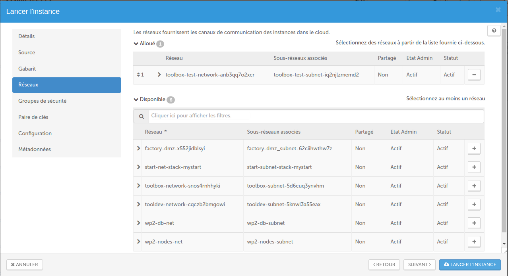

# Innovation Beta: MyCloudManager

This version of MyCloudManager (Beta) is a different stack of everything the team was able to share with you so far. It aims to bring you a set of tools to **unify, harmonize and monitor your tenant**. In fact it contains a lot of different applications that aims to help you manage day by day your **Linux** instances :
* Monitoring and Supervision
* Log management
* Jobs Scheduler
* Mirror ClamAV - Antivirus
* Repository app manager
* Backup snapshot or backup soft
* Time synchronization
* Mutli-tenant, Multi-region management

MyCloudManager has been completely developed by the CAT team ( Cloudwatt Automation Team).
* MyCloudManager is fully HA (High Available)
* it is based on a CoreOS instance
* all applications are deployed via Docker containers orchestrated by Kubernetes
* The user interface is developed by React
* Also you can install or configure, from the GUI, all the applications on your instances via Ansible playbooks.
* To secure maximum your Cloudmanager, no port is exposed on the internet apart from port 22 to the management of the stack of bodies and port 1723 for PPTP VPN access.

## Preparations

### The prerequisites

 * Internet access
 * A Linux shell
 * A [Cloudwatt account](https://www.cloudwatt.com/cockpit/#/create-contact) with a [valid keypair](https://console.cloudwatt.com/project/access_and_security/?tab=access_security_tabs__keypairs_tab)
 * The tools [OpenStack CLI](http://docs.openstack.org/cli-reference/content/install_clients.html)

### Initialize the environment

Have your Cloudwatt credentials in hand and click [HERE](https://console.cloudwatt.com/project/access_and_security/api_access/openrc/).
If you are not logged in yet, you will go thru the authentication screen then the script download will start. Thanks to it, you will be able to initiate the shell accesses towards the Cloudwatt APIs.

Source the downloaded file in your shell. Your password will be requested.

~~~ bash
$ source COMPUTE-[...]-openrc.sh
Please enter your OpenStack Password:
~~~

Once this done, the Openstack command line tools can interact with your Cloudwatt user account.

## Install MyCloudManager

### The 1-click

MyCloudManager start with the **1-click** of **Cloudwatt** via the web page [Apps page](https://www.cloudwatt.com/en/apps/) on the Cloudwatt website.
Choose MyCloudManager apps, press **DEPLOY**.

After entering your login / password to your account, launch the wizard appears:

As you may have noticed the 1-Click wizard asked to reenter your password Openstack. This information will allow the stack to save the configuration of the cluster in a Swift container on your tenant.

By default, the wizard deploys three instances of type "n2.cw.standard-2" who will be the `node` cluster instances based on CoreOS. They will support all your *"pods "(applications)* on this stack and all the applications proposed by MyCloudManager.

This `node` instances should be size according to the use you want to make of MyCloudManager because a variety of other instance types exists to suit your various needs, allowing you to pay only for the services you need. Instances are charged by the minute and capped at their monthly price (you can find more details on the [Pricing page](https://www.cloudwatt.com/en/pricing.html) on the Cloudwatt website).

Two storage nodes will be deployed by the stack. They will host the storage services by Ceph.
Ceph is a software allowing the management of volumes, here `Cinder`, to persist the   application data in case of cluster crash.

Now that you know all the stack ressources, you can press **DEPLOY**.

The **1-click** handles the launch of the necessary calls on Cloudwatt API :

* Start all cluster instances based on CoreOS,
* Start the **toolbox-backend** container,
* Start the **toolbox-frontend** container,
* Start the **rethinkdb** container,
* Start the **rabbitmq** container,
* Start the **traefik** container

The stack is created automatically. You can see its progression by clicking on its name which will take you to the Horizon console. When all modules become "green", the creation is finished.

Wait **10 real minutes** that the entire stack is available.

### Finish VPN access

In order to have access to all functionalities, we have set up a VPN connection.

Here are the steps to follow :

* First retrieve the output information of your stack, one FloatingIP and the VPN login, password.

#### Windows 7

* Must now create a VPN connection from your computer , go to "Control Panel > All Control Panel > Network and share center". Click " Set up a connection ....."

* Entry now the retrieved information in the output stack. Initially the *FloatingIP*  and then *login* and *password* provided.

After following this procedure you can now start the VPN connection.

-----
#### Windows 10

* Go to Settings> NETWORK AND INTERNET > Virtual Private Network

* Now enter the information retrieved out of the stack : firstly the FloatingIP and then login and password provided.

After following this procedure you can now start the VPN connection.

-----

You can now access in the MyCloudManager administration interface via the URL **http://private-ip-instance-cluster:30000** (exemple: **http://10.1.1.10:30000**) and begin to reap the benefit.

It's (already) done !

## Enjoy

Interface access and the various applications is via **IP** address. You can access on the different web interfaces applications by clicking **Go** or via URL request (ex: http://10.1.1.10:30601/).

As previously mentioned, Cinder block storage volumes have been provisioned within the cluster in order to save all **datas**  of the application containers. This makes our stack to be much more robust. For information the entire `Ceph` data is accessible from any machine in the cluster.

#### Interface Overview

Here is the home of the MyCloudManager, each thumbnail representing an application ready to be launched. In order to be as scalable and flexible as possible, all applications of MyCloudManager are Docker's containers.

A menu is present in the top left of the page, it can move through the different sections of MyCloudManager, we'll detail them later.
* Apps: Application List
* Instances: list of visible instances of MyCloudManager
* Tasks : all ongoing or completed tasks
* Audit: list of actions performed
* Backups: list all backup jobs
* Volumes: List all Ceph volumes
* Networks: list all tenants or regions in use for MyCloudManager
* My Instances> Console: access to the console Horizon
* My account> Cockpit ; access to the dashboard
* Support: allows sending mail to support and cloud coach

All of the applications in the **Apps** section are configurable through by **Settings** button  on each thumbnail.

As you can see, we have separated them into different sections.

In the **Info** section you will find a presentation of the application with some useful links on the application.

In the **Parameters** section You can here modify the configuration file that will be launched when the container is created, available only for Rundeck. For all applications, the configuration will be done directly from the interface.

To identify the applications running on those that are not, we have set up a color code : An application is started will be surrounded by a **green halo** and a **yellow halo** during installation.

The **tasks** make the tracking of actions performed on MyCloudManager. It is reported in relative time.

It is possible for you to cancel pending on error spot in the **tasks** menu by clicking  which will then show you what logo .

We also implemented a **audit** section so you can see all actions performed on each of your instances and export to Excel (.xlsx ) if you want to make a post-processing or keep this information for safety reasons via the button .

The menus **My Instances** and **My Account** are respectively used to access the Cloudwatt Horizon console and to manage your account via the Cockpit interface.

The **Support** section will allow you, as the name implies, contacts the Cloudwatt support organization if requested or incident in your MyCloudManager. You can also contact a **cloud coach** to have more information regarding our ecosystem or feasibility of your projects that you want to focus on the Cloudwatt public cloud.

Email :
* Choose your need **Email Support** or  **Contact a Cloud Coach**,
* The  **type** field will allow you to choose between **demand** ** or **incident**,
* The **Reply Email Address** field will allow the support or cloud coach to have your address in order to respond,
* The  **Request / Problems Encountered** field constitutes the body of the email.

Sending email is via the button . This becomes  if the email has been sent or  if the server encountered an error while sending.

### Volumes Management

In order to make it easy as possible for you to manage your Cloudwatt resources, we have created a volume management interface that you will find in your MyCloudManager menu.

In this interface you will find the details of your different Ceph volumes.

You can resize them according to your need by clicking on resize button

Warning: In this interface you will only find all the Ceph volumes. This page doesn't allow you to resize a Cinder storage volume. This part is still possible but it will have to be done from the Cloudwatt horizon console.

### Cluster Monitoring

This will allow you to see all the activity of the cluster and thus to make sure that your MyCloudManager is fully functional.

We have provided you by default  several dashboards. They will allow you to have an overview of the activity of your cluster, but they will also allow you to go down much lower in the layers to analyze in depth the behavior of your MyCloudManager.

You can access it, if you have chosen the monitoring option when launching your stack, from any private address of the cluster on port 31000 (ex: http://10.1.1.10:31000)

**Monitoring Ceph**

**Monitoring Docker**

### Add a new Network for monitoring

To add a new tenant or a new region to be monitored, you must go to the `Network` part of your MyCloudManager's menu.

To add a holding or a region to be monitored you will have to click on the button
.

Now enter all of the tenant information as shown below:

Once you have entered your OpenStack Username as well as your OpenStack Password and the desired region, just click on the button  to autorize MyCloudManager to query the Cloudwatt API to retrieve all the information you need to complete the following parameters.

Define on which network you want to attach your MyCloudManager, the security group and keypair that will apply to the CoreOS instance of type "s1.cw.small-1" which will deploy in the tenant or region. Because, MyCloudManager needs an `worker` instance in the tenant destination to communicate with all instances attached on this network.

**Warning:**
The network of your `worker` instance must have access to internet. As you know all the functionality of MyCloudManager are container. They are hosted on the hub.docker. Your instance have to download them.

To be sure that your `worker` instance communicate with the rest of the world, you have two options: the SNAT must be enabled on your neutron router, or your` worker` instance must have a public ip address.

To enable snat, when creating your router in the Cloudwatt horizon console, specify the `public` network on the external interface of your router, as below:

You didn't understand? Do not panic, we have provided you with a stack heat to do all this actions:

* Create a keypair,
* Create a network,
* Create Router with internet access via your Public network,

You can find this stack her:  

Vous pourrez la retrouver 

Once this information is added, a line with the holding information appear like this:

All you have to do is activate the yellow **toggle** to deploy the `worker` instance in the destination.

 When the instance was successfully created and joined the cluster, the **toggle** become blue and you can see his IP in the status colomn.  

You have in a few clicks to add the management of a new region or a new tenant in your MyCloudManager cluster !

#### Delete Network

We've also given you the ability to delete a region or a tenant. To do this, simply click on the blue **toggle**.
This will remove the `worker` instance on your tenant. Once this is done, you will only have to remove the line with the button .

### Add instances to MyCloudManager

To add instances to MyCloudManager, 3 steps:

  1. Attach your instance To the `worker` router added in the tenant
  1. Run the curl command or the cloudconfig as needed
  3. Start the desired services

#### 1. Attach the instance at the instance of router:

~~~bash
$ neutron router-interface-add $Worker_ROUTER_ID $Instance_subnet_ID
~~~

Once this is done you are now in the ability to add your instance to MyCloudManager to instrumentalize.

#### 2. Start the attachment script:

On MyCloudManager, go to the **instance** menu and click the button  at the bottom right.

We offer two commands to choose: one **Curl** and one **Copy to Clipboard** command to run a script in instance build.

Once the script is applied to the selected instance it should appear in the menu **instance** of your MyCloudManager .

**Trick** If you want to create an instance via the console horizon Cloudwatt and declare **directly** in your MyCloudManager, you should to select - in step 3 of the instance launch wizard - MyCloudManager network and the Security Group and - in step 4 - you can paste the command **Copy to Clipboard** command in the Custom Script field.

#### 3. Start the required services on the instance :

To help you maximum we created playbooks Ansible to automatically install and configure the agents for different applications.

To do this, simply click on the application you want to install on your machine. The playbook Ansible concerned will be automatically installed.
Once the application is installed, the application logo switch to color, allowing you to identify the applications installed on your instances.

### Instances Backup

The **Backups** section allows you to backup all instances by your MyCloudManager. The backup may be performed in two ways, via a **snapshot** or via **duplicity** that has been called **soft**.
* The snapshot backup will take a picture of the instance when you have schedule the backup.
Then you can find it in the list of your images on your tenant.
* The soft backup will deploy a duplicity container and backup all data in the repository (`/data`or `/config`) in a **swift** container which can also be found in **containers** section of your tenant (object storage).
If you want to save a server group, then you have to select when creating the backup.
Regarding the scheduling of backups, several choices are available to you:

* **Daily**: one backup per day at the desired time,
* **weekly**: one backup per week at day and time desired,
* **Monthly**: one backup per month at day and time desired.

To start a new backup configuration you must click on the button

Give a name to your backup configuration:

Select the servers to be added:

Set now **when** and **how** the backup of those servers will be made:

* Snapshot : Takes a "picture" of your instance and deposited in your image library on your tenant (Warning: a snapshot runs cold as mentioned in this article [End of the hot snapshot place to the cold snapshot!](https://dev.cloudwatt.com/en/blog/end-of-the-hot-snapshot-place-to-the-cold-snapshot.html))

* Soft: Copy all the selected directories in a swift container

Once you have clicked the button FINISH your configuration is now saved:

You can always change the configuration of a backup via the button **edit** that allows you to add or remove servers, change the backup directory and when it will run.
The **delete** button , for its part, allows to completely remove the selected backup job.

#### Who said backup said restore:

To restore a backup  **soft** or **snapshot** the approach stays the same. You must go to the menu **instances** of your MycloudManager. As you can see a new  button appeared on all servers that have been saved.

When you click on a pop-up open, you can now choose from the list the backup to restore  .

Once this has been done, if your backup was **snapshot**, the selected image will be restored instead of the current instance, if the backup is **soft** the selected files will be restored in the `restore` directory of your instance.

## The MyCloudManager services provided by applications

In this section, we will present different service MyCloudManager.

### Monitoring and supervision
We have chosen to use *Zabbix*, the most popular application for monitoring, supervision and alerting .
Zabbix application is free software **to monitor the status of various network services , servers and other network devices** but also **applications and software** worn on the supervised servers; and producing dynamic graphics resource consumption.
Zabbix uses MySQL, PostgreSQL or Oracle to store data. According to the large number of machines and data to monitor the choice of SGBD greatly affects performance. Its web interface is written in PHP and provided a real-time view on the collected metrics.

To go further, here are some helpful links :
* http://www.zabbix.com/
* https://www.zabbix.com/documentation/3.0/start

### Log Management

We chose Graylog which is the product of the moment for log management , here is a short presentation :
Graylog is an open source **log management** platform capable of manipulating and presenting data from virtually any source. This container is the offer officially by Graylog teams.
  * The Graylog Web Interface is a powerful tool that allows anyone to manipulate the entirety of what Graylog has to offer through an intuitive and appealing web application.
  * At the heart of Graylog is it's own strong software. Graylog Server interacts with all other components using REST APIs so that each component of the system can be scaled without comprimising the integrity of the system as a whole.
  * Real-time search results when you want them and how you want them: Graylog is only able to provide this thanks to the tried and tested power of Elasticsearch. The Elasticsearch nodes behind the scenes give Graylog the speed that makes it a real pleasure to use.

Enjoying this impressive architecture and a large library of plugins, Graylog stands as a strong and versatile solution for **log management both instances** but also worn **applications and software** on monitored instances.

To go further, here are some helpful links :
* https://www.graylog.org/
* http://docs.graylog.org/en/1.2/pages/getting_started.html#get-messages-in
* http://docs.graylog.org/en/1.3/pages/architecture.html
* https://www.elastic.co/products/elasticsearch
* https://docs.mongodb.org/manual/tutorial/install-mongodb-on-ubuntu/

### Job Scheduler
We have chosen to use *Rundeck*.
The Rundeck application will allow you **to schedule and organize all jobs** that you want to deploy consistently on all of your holding via its web interface.

In next version of MyCloudManager, we give you the possibility to backup your servers like as we saw in the *bundle* Duplicity.

To go further, here are some helpful links :
* http://rundeck.org/
* http://blog.admin-linux.org/administration/rundeck-ordonnanceur-centralise-opensource-vient-de-sortir-sa-v2-0
* http://dev.cloudwatt.com/fr/blog/5-minutes-stacks-episode-vingt-trois-duplicity.html

### Mirror Antivirus
This application is a Ngnix server. A *CRON* script will run every day to pick up the latest **virus** definition distributed by *ClamAV*. The recovered packet will be exposed to your instances via Ngnix allowing you to have customers **ClamAV** update without your instances not necessarily have access to the internet.

To go further, here are some helpful links :
* https://www.clamav.net/documents/private-local-mirrors
* https://github.com/vrtadmin/clamav-faq/blob/master/mirrors/MirrorHowto.md

### Software repository
We have chosen to use *Artifactory*.
Artifactory is an application that can display any type of directory server via a Ngnix . Here our aim is to offer an application that can **expose a repository** for all of your instances.

To go further, here are some helpful links :
* https://www.jfrog.com/open-source/
* https://www.jfrog.com/confluence/display/RTF/Welcome+to+Artifactory

### Time Synchronisation
We have chosen to use NTP.
NTP container is used here so that all of your instances without access to the internet can be synchronized to the same time and access to **a server time**.

To go further, here are some helpful links :
  * http://www.pool.ntp.org/fr/

### The MyCloudManager versions **v3** (Beta)

- CoreOS Stable 1010.6
- Docker 1.10.3
- Kubernetes 1.3
- Zabbix 3.0
- Rundeck 2.6.2
- Graylog 2.0
- Artifactory 4.9.1
- Nginx 1.11.2
- SkyDNS 2.5.3a
- Etcd 2.0.3

### List of distributions supported by MyCloudManager

* Ubuntu 16.04
* Ubuntu 14.04
* Debian Jessie
* Debian Wheezy
* CentOS 7.2
* CentOS 7.0
* CentOS 6.7

### Application configuration (by default)

As explained before, we left the possibility via the button **Settings**  on each thumbnail, enter all application settings to launch the container.
However, the login and password can't be changed everywhere, it will do inside the application once it started.

Login and password by default of MyCloudManager applications :
* Zabbix - Login : **admin** - Password : **zabbix**
* Graylog - Login : **admin** - Password : **admin**
* Rundeck - Login : **admin** - Password: **admin**

Other applications have no web interface, so no login/ password, except **Artifactory** which has no authentication.

### Deployment examples

#### Mono-tenant, Mono-region

#### Mono-tenant, Multi-region

#### Multi-tenant, mutli-region

## So watt?

The goal of this tutorial is to accelerate your start. At this point **you** are the master of the stack.

You now have an SSH access point on your virtual machine through the floating-IP and your private keypair (default user name `core`).

You can access the MyCloudManager administration interface via the URL **[MyCloudManager](http://10.1.1.10:30000)**

## And after?

This article will acquaint you with this first version of MyCloudManager. It is available to all Cloudwatt users in **Beta mode** and therefore currently free.

The intention of the CAT ( Cloudwatt Automation Team) is to provide improvements on a bimonthly basis. In our roadmap, we expect among others:

* Instrumentalisation of Windows instances,
* A French version,
* many other things

Suggestions for improvement ? Services that you would like ? do not hesitate to contact us [apps.cloudwatt@orange.com](mailto:apps.cloudwatt@orange.com)

-----
Have fun. Hack in peace.

The CAT
