# 5 Minutes Stacks, episode 27 : Blueprint 3 tier with instance autoscaling  via Zabbix alert #

## Episode 27 : Blueprint 3 tier with instance autoscaling via Zabbix alert

This blueprint will help you to set up a 3-tier architecture.
We have automated the deployment of various nodes component architecture.
Through this blueprint we propose to set up web front-end, the glusterfs with a database cluster.
You can choose to deploy on different Web front-end applications (Apache & php, tomcat 8 or nodejs).
Here is the architecture diagram.

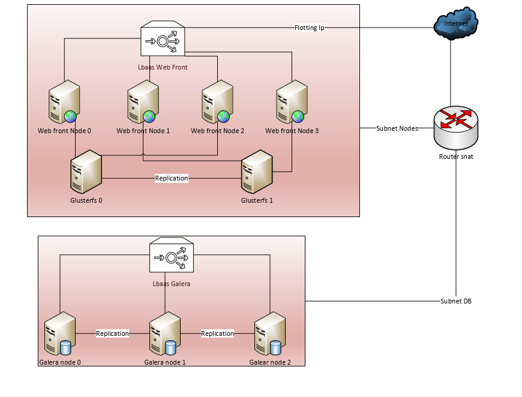

## Preparations

### The version
 - Ubuntu Trusty 14.04
 - Ubuntu Xenial 16.04
 - Debian Jessie
 - Centos 7.2
 - Glustefs 3.8
 - Mariadb 10.1
 - Lvm2
 - Mylvmbackup
 - Galeracluster 3
 - Nodejs 6.x
 - Apache 2.4
 - Php 5 & 7
 - Openjdk 8
 - Tomcat 9
 - Nginx 1.10
 - Zabbix 3.2

## Preparations

### The prerequisites

  * Internet access
  * A Linux shell
  * A [Cloudwatt account](https://www.cloudwatt.com/cockpit/#/create-contact) with a [valid keypair](https://console.cloudwatt.com/project/access_and_security/?tab=access_security_tabs__keypairs_tab)
  * The tools [OpenStack CLI](http://docs.openstack.org/cli-reference/content/install_clients.html)

### Initialize the environment

 Have your Cloudwatt credentials in hand and click [HERE](https://console.cloudwatt.com/project/access_and_security/api_access/openrc/).
 If you are not logged in yet, you will go thru the authentication screen then the script download will start. Thanks to it, you will be able to initiate the shell accesses towards the Cloudwatt APIs.

 Source the downloaded file in your shell. Your password will be requested.

 ~~~ bash
 $ source COMPUTE-[...]-openrc.sh
 Please enter your OpenStack Password:
 ~~~

 Once this done, the Openstack command line tools can interact with your Cloudwatt user account.

## Initialize Blueprint

### The 1-click

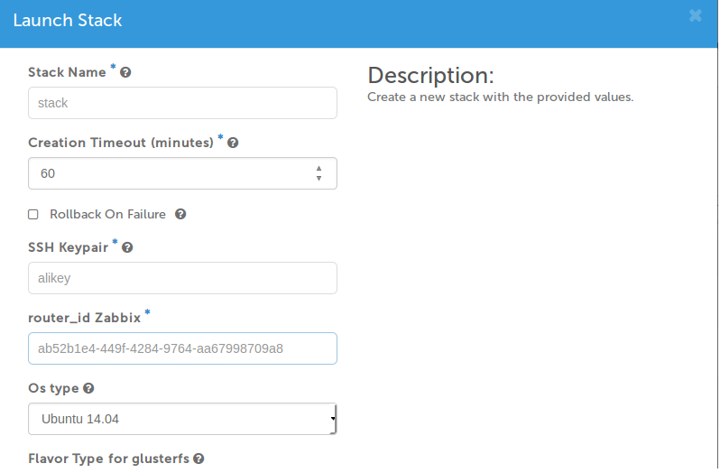
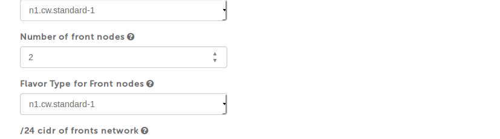

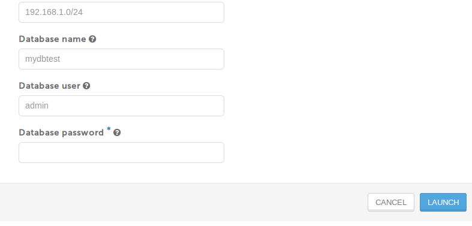

Complete this fields and click LAUNCH.

**SSH Keypair :** your key pair.

**router-id Zabbix :** MyCloudManger Router Id.

**Artefact in zip ,git, tar.gz or war :** Put the url artifact of your application, it must be in git, zip or tar.gz for PHP and nodejs applications and war for tomcat applications.

**Application type :** If you choose php, you are going to have apache2 server and php environment, if you choose nodejs you are going to have an environment that runs nodejs applications with reverse proxy nginx and if you choose tomcat you will have a tomcat environment 8 and openjdk8 with nginx as a reverse proxy.

**Flavor Type for nodes :** Web front nodes flavor.

**Number of front nodes :** Number of front web nodes.
You can now retrieve the public key of your MyCloudManager by logging in ssh on the node master of your MyCloudManager and type this command.

**Flavor Type for glusterfs :**  Nodes Glusterfs flavor.

**/24 cidr of fronts network :** The network address of the web front nodes and glusterfs (like 192.168.0.0/24).

**Database user :** Database user.

**Database password :** Database password user.

**Database name :** Database name.

**Flavor Type for databases :** Database nodes flavor

**Number of database clusters :** Number of databases nodes

**/24 cidr of databases network :** The network address of database nodes (like 192.168.0.0/24)

**OS type :** You may choose the OS Ubuntu 14.04, Ubuntu 16.04, Debian or Centos 7.2 Jessie

Stack form :

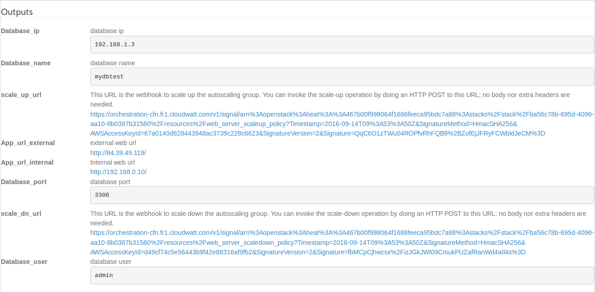

Outputs:

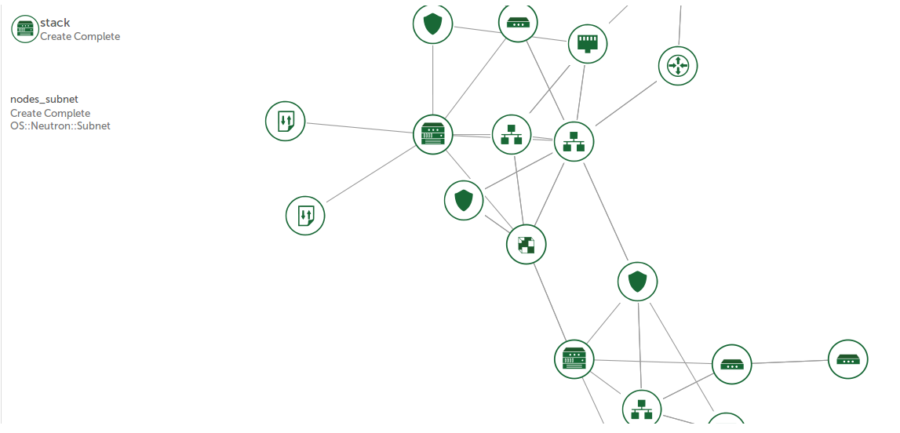

**Database_ip :** Load blancer database cluster ip addresse.

**Database_name :** Database name.

**Database_user :** Database username.

**Database_port :** Database port.

**App_url_external :** Your application external url.

**App_url_internal :** Your application internal url.

**scale_up_url :** Scale up url.

**scale_dn_url :** Scale down url.

## Enjoy

#### Front nodes configuration Folders and files:

* php

`/etc/apache2/sites-available/vhost.conf`: Default apache configuration on Debian and Ubuntu.

`/etc/http/conf.d/vhost.conf`: Default apache configuration on Centos.

`/var/www/html`: The php application deployment directory.

* tomcat

`/usr/share/tomcat`: Tomcat directory.

`/user/share/tomcat/webapps`: The java application deployment directory.

`/etc/nginx/conf.d/default`: Reverse proxy configuration.

* nodejs

`/nodejs`: The nodejs application deployment directory.

`/etc/nginx/conf.d/default`: Reverse proxy configuration.

#### Two Glusterfs nodes configuration Folders and files :

`/srv/gluster/brick`: le répertoire qui est repliqué entre les deux noeuds glusterfs.

#### Galera nodes configuration Folders and files :

`/DbStorage/mysql`: Mariadb nodes datadir is a cinder volume.

`/etc/mysql`: Mariadb configuration directory on Debian and Ubuntu.

`/etc/mysql.cnf`: Mariadb configuration file on Centos.

`/etc/my.cnf.d`: Mariadb configuration directory on Centos.

#### Restart services for every application

* php

On Debian & ubuntu :
~~~ bash
service apache2 restart
~~~
On Centos :
~~~ bash
service httpd restart
~~~
* nodejs
~~~ bash
service nginx restart
/etc/init.d/nodejs restart
~~~

* tomcat
~~~ bash
service tomcat restart
service nginx restart
~~~

* Glasterfs

On Debian & Ubuntu :
~~~ bash
service glusterfs-server restart
~~~
On Centos :
~~~ bash
service glusterd restart
~~~
* Galera

On the first node :
~~~ bash
service mysql restart --wsrep-new-cluster
~~~
On the others :
~~~ bash
service mysql restart
~~~

#### Exploitation

**Front Nodes :**

`/root/deploy.sh` :is a cron for deploying the application, you can stop it if your application is well deployed,
if you want to redeploy the application, just delete the older application, run this commands:
~~~bash
rm -rf /var/www/html/*
##if php.
/root/deploy.sh /var/www/html php url_artifact
##if tomcat
/root/deploy.sh /opt/tomcat/webapps tomcat war_url
##if nodejs
/root/deploy.sh /nodejs nodejs url_artifact
~~~
**Les deux noeuds Glusterfs:**

Gluster volume is in the form ip:/gluster, for testing it works well, type the following command:
~~~bash
gluster volume info
~~~
**Les noeuds de Galeracluster :**

`/root/sync.sh`:is a cron  to start Mariadb nodes, you can stop if the nodes are well started,
for testing, type the following command:
~~~bash
mysql -u root -e 'SELECT VARIABLE_VALUE as "cluster size" FROM INFORMATION_SCHEMA.GLOBAL_STATUS  WHERE VARIABLE_NAME="wsrep_cluster_size"'
+--------------+
| cluster size |
+--------------+
| number mariadb nodes |
+--------------+
~~~

**Backup Galeracluster nodes :**
You have two solutions for backuping the database :

1) Run a cron in order to make snapshots of cinder volumes that are attached to database nodes :

~~~bash
cinder snapshot-create --display-name snapshot_name.$(date +%Y-%m-%d-%H.%M.%S) id_volume
~~~
2) Run a cron in order to make database datadir snapshots then upload it in swift containers :
~~~bash
#/bin/bash
mylvmbackup --user=root --mycnf=/etc/mysql/my.cnf --vgname=vg0 --lvname=global --backuptype=tar
swift upload your_back_contenair /var/cache/mylvmbackup/backup/*
rm -rf /var/cache/mylvmbackup/backup/*
~~~
**Configuration autoscaling via MyCloudManager Zabbix:**

#### Install Zabbix Agent in nodes.

See [bundle-xenial-zabbix](https://github.com/dalitun/applications/tree/master/bundle-xenial-zabbix) article.

#### Update OS Linux Zabbix template

 Update the Linux OS template, this template contains a new `item`, two new triggers` and two new `macors` in order to calculate the percentage use of the CPU(s) in every minute.

Click on `Configuration` then `Templates`.

 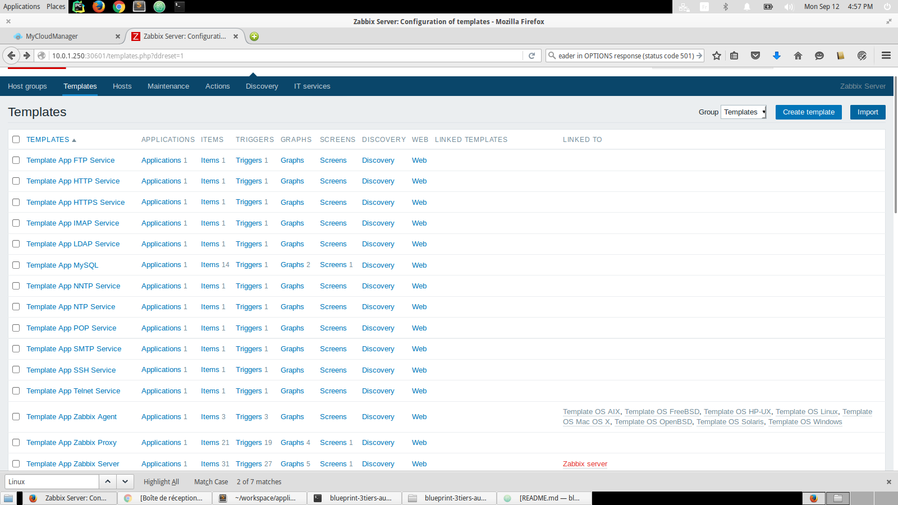

 Then select the `template_os_linux.xml`template and click on `Import`.

 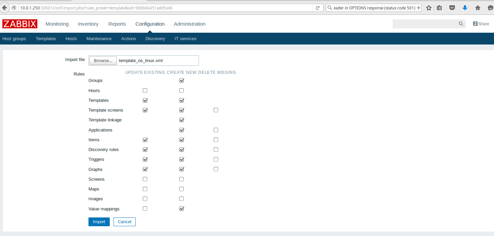

#### Create the both actions scale up and scale down

 First of all you need to have the urls to scale up and down, you find them in the output portion of your stack autoscaling of Cloudwatt horizon console or through the following CLI commands:

   - Url de scale up :

 ~~~bash
 openstack stack output show -f json `your_stack_name` scale_up_url | jq '.output_value'
 ~~~

   - Url de scale down :

 ~~~bash
 openstack stack output show -f json `your_stack_name` scale_dn_url | jq '.output_value'
 ~~~

Now we can go to scale Up steps and Scale Down.

 * Create `host groups` who represents your instances.

 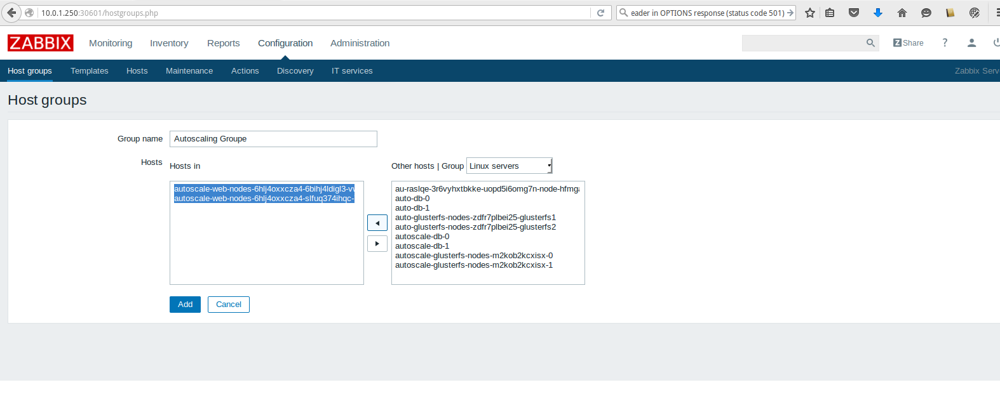

 * Create an action of scale down (for scale up do the same things juste your change the URL scale down by URL scale up) and
add the desired conditions.

 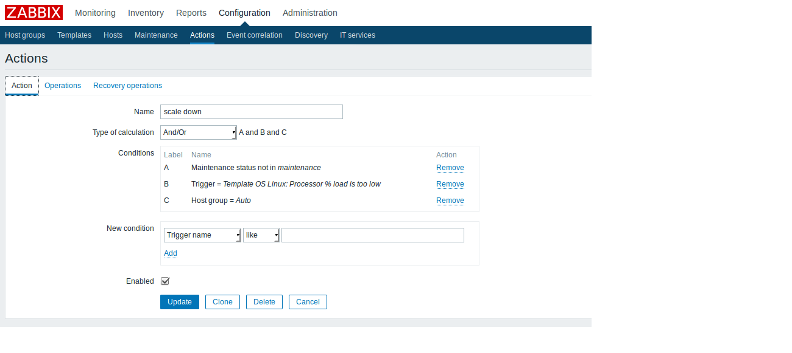

* Add the desired operation.

 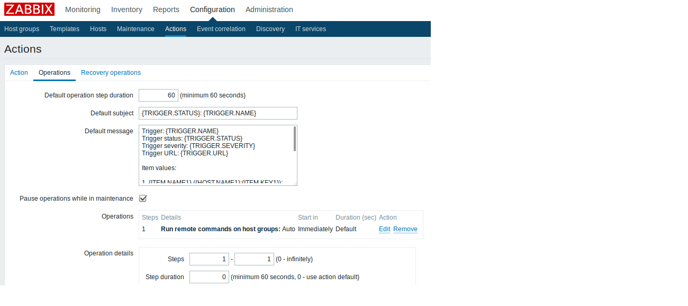

 In order to create the action in Zabbix to scale up or down.

* Recover your OpenStack identifying via CLI, with that you should copy the profile file of your current user and scale your URL (up or down), form the block below.

~~~bash
 curl -k -X POST “url de scaling down ou scaling up“
~~~

 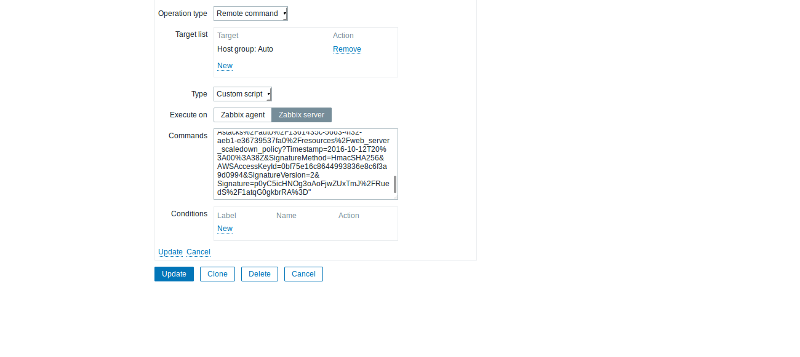

 Now your action is created.

 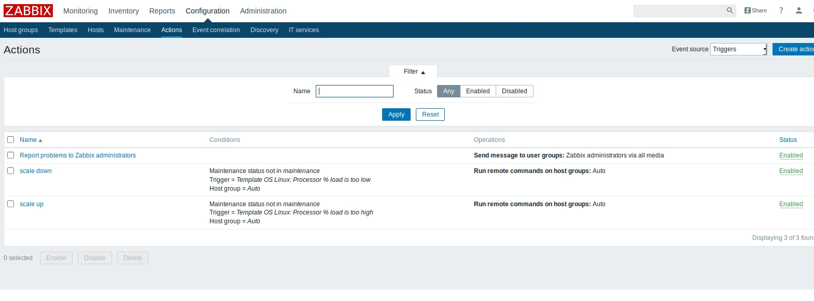

#### For testing the scaling up and scaling down, try `Stress` your instances by typing the following command in the server:

~~~bash
$ sudo apt-get install stress
$ stress --cpu 90 --io 2 --vm 2 --vm-bytes 512M --timeout 600
~~~

Don't forget to add each new stack appeared in the `Host Groupe` of your stack.

#### How to customize your template

In this article we used as `system.cpu.util [,, AVG1]` item in order to calculate cpu usage poucentage.
You can use others items (usage of RAM or disk ...) for the autoscaling.
That [a list of items](https://www.zabbix.com/documentation/2.0/manual/config/items/itemtypes/zabbix_agent)

 * For creating item.

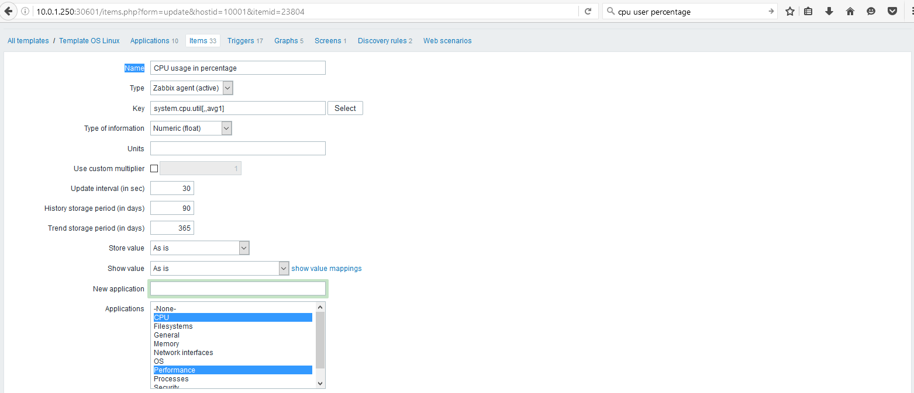

* You can also change or create others.

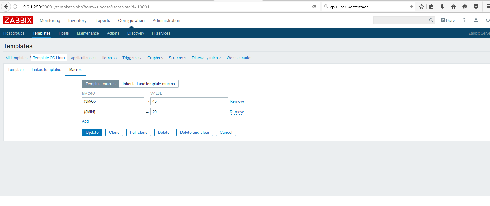

* You can create a trigger.

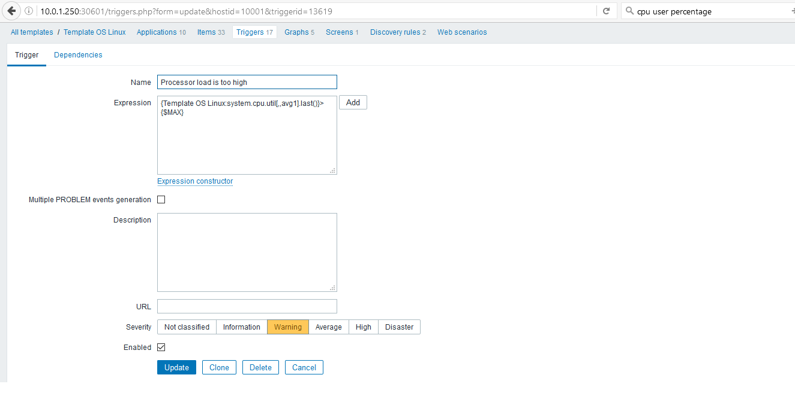

## So watt ?

The goal of this tutorial is to accelerate your start. At this point **you** are the master of the stack.

You now have an SSH access point on your virtual machine through the floating-IP and your private keypair (default user name `cloud`).

### Resources you could be interested in:
* [ Apache Home page](http://www.apache.org/)
* [ Galera Documentation](http://galeracluster.com/support)
* [ Glusterfs Documentation](https://www.gluster.org/)
* [ Tomcat Documentation](http://tomcat.apache.org/)
* [ Nodejs Documentation](https://nodejs.org/en/)
* [ Nginx Documentation](https://www.nginx.com/resources/wiki/)
* [ Autoscaling ](https://dev.cloudwatt.com/fr/blog/passez-votre-infrastructure-openstack-a-l-echelle-avec-heat.html)
* [ Zabbix](https://www.zabbix.com/documentation/3.0/manual/introduction/features)

----
Have fun. Hack in peace.
