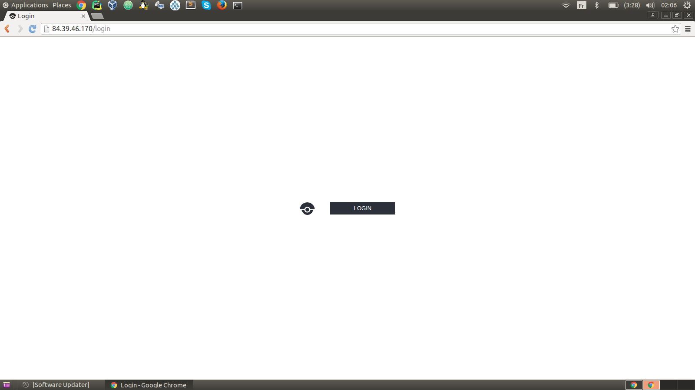
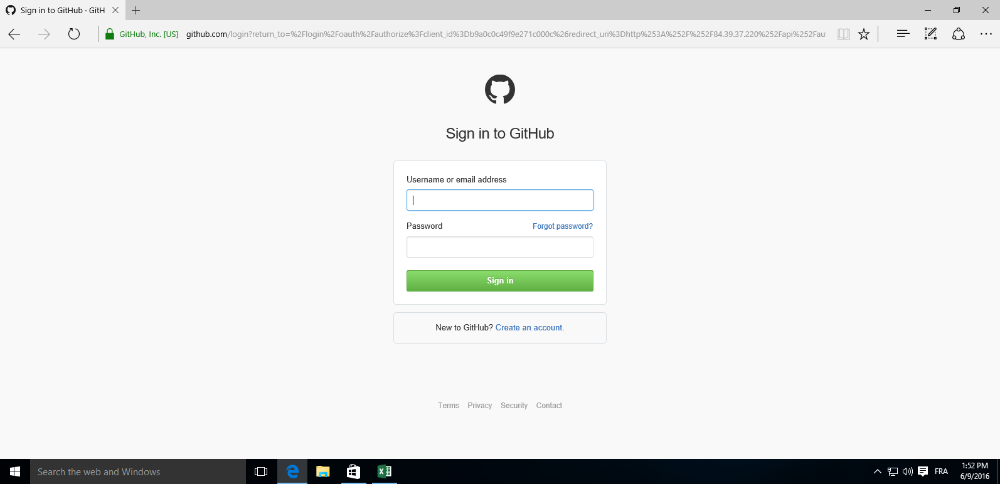
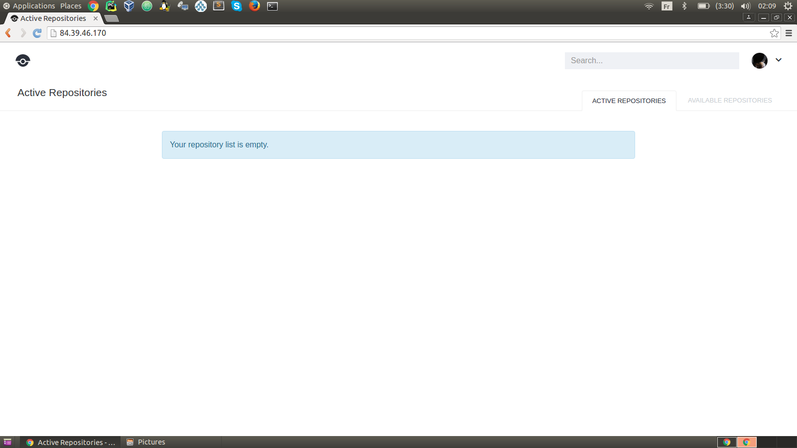
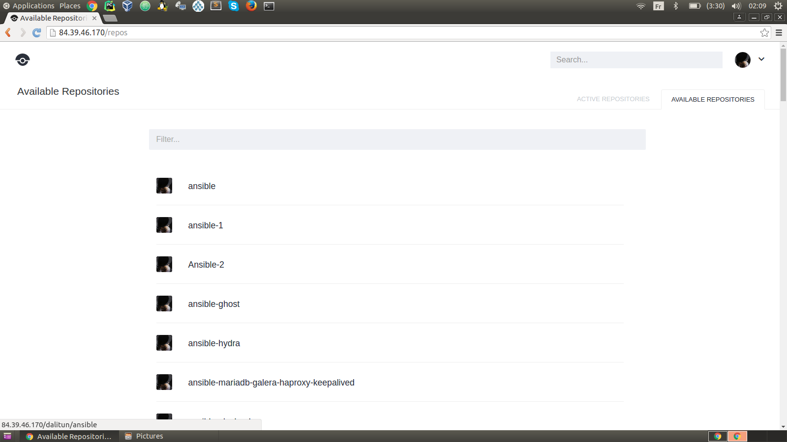
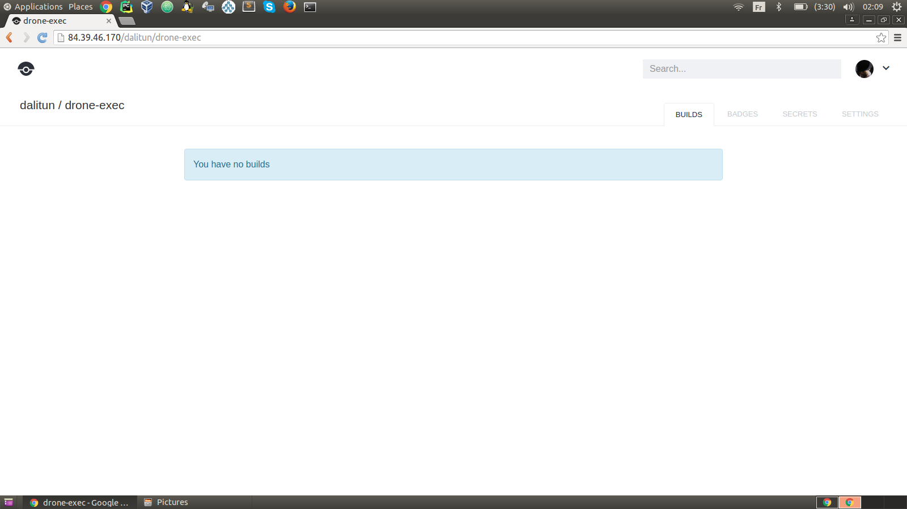
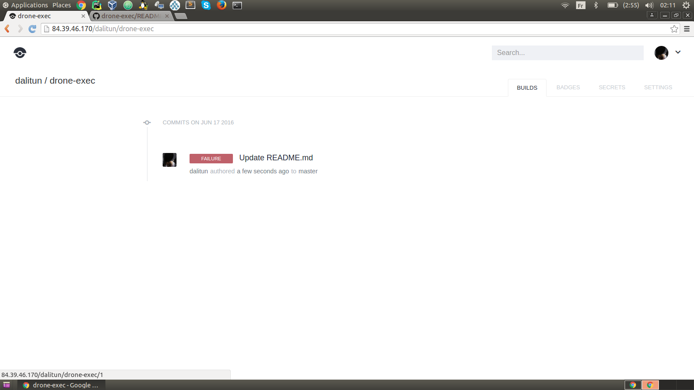

# 5 Minutes Stacks, episode 28 : Drone #

## Episode 28 : Drone

Drone is a hosted continuous integration service. It enables you to conveniently set up projects to automatically build, test, and deploy as you make changes to your code. Drone integrates seamlessly with Github, Bitbucket and Google Code as well as third party services such as Heroku, Dotcloud, Google AppEngine and more.
Drone.io is the name of the SaaS version, Drone the name of the open source one.

## Preparations

### The version
  - CoreOS Stable 899.13.0
  - Docker 1.10.3
  - Drone v0.4

### The prerequisites to deploy this stack

   These should be routine by now:

  * Internet access
  * A Linux shell
  * A [Cloudwatt account](https://www.cloudwatt.com/cockpit/#/create-contact) with a [valid keypair](https://console.cloudwatt.com/project/access_and_security/?tab=access_security_tabs__keypairs_tab)
  * The tools of the trade: [OpenStack CLI](http://docs.openstack.org/cli-reference/content/install_clients.html)
  * A local clone of the [Cloudwatt applications](https://github.com/cloudwatt/applications) git repository

### Size of the instance

By default, the stack deploys on an instance of type "Standard 2" (n1.cw.standard-2). A variety of other instance flavors exist to suit your various needs, allowing you to pay only for the services you need. Instances are charged by the minute and capped at their monthly price (you can find more details on the [Pricing page](https://www.cloudwatt.com/en/pricing.html) on the Cloudwatt website).
Stack parameters, of course, are yours to tweak at your fancy.

### By the way...

If you do not like command lines, you can go directly to the "run it thru the console" section or "run it by the 1-clic" section by clicking [here](#console).

## What will you find in the repository

Once you have cloned the github, you will find in the `blueprint-coreos-drone/` repository:
* `blueprint-coreos-drone.heat.yml`: HEAT orchestration template. It will be used to deploy the necessary infrastructure.
* `stack-start.sh`: Stack launching script. This is a small script that will save you some copy-paste.

## Start-up

### Initialize the environment

Have your Cloudwatt credentials in hand and click [HERE](https://console.cloudwatt.com/project/access_and_security/api_access/openrc/).
If you are not logged in yet, you will go thru the authentication screen then the script download will start. Thanks to it, you will be able to initiate the shell accesses towards the Cloudwatt APIs.

Source the downloaded file in your shell. Your password will be requested.

~~~ bash
$ source COMPUTE-[...]-openrc.sh
Please enter your OpenStack Password:

~~~

Once this done, the Openstack command line tools can interact with your Cloudwatt user account.

### Adjust the parameters

In the `blueprint-coreos-drone.heat.yml` file (heat template), you will find a section named `parameters` near the top. The only mandatory parameter is the `keypair_name`. The `keypair_name`'s `default` value should contain a valid keypair with regards to your Cloudwatt user account, if you wish to have it by default on the console.

Within these heat templates, you can also adjust (and set the defaults for) the instance type by playing with the `flavor_name` parameter accordingly.

By default, the stack network and subnet are generated for the stack. This behavior can be changed within the `blueprint-coreos-drone.heat.yml` file as well, if need be, although doing so may be cause for security concerns.

~~~ yaml
heat_template_version: 2013-05-23

description: Bundle CoreOS Drone

  parameters:
    keypair_name:        <-- Indicate here your keypair
      description: Keypair to inject in instance
      label: SSH Keypair
      type: string

    flavor_name:      
      default: n1.cw.standard-1     <-- Indicate here flavor size
      description: Flavor to use for the deployed instance
      type: string
      label: Instance Type (Flavor)
      constraints:
        - allowed_values:
          - n1.cw.standard-1
          - n1.cw.standard-2
          - n1.cw.standard-4
          - n1.cw.standard-8
          - n1.cw.standard-12
          - n1.cw.standard-16
    drone_driver:
      default: github     <-- Indicate here VCS type
      description: Flavor to use for the deployed instance
      type: string
      label: drone driver
      constraints:
        - allowed_values:
            - github
            - gitlab
            - bitbucket
    drone_driver_url:     <-- Indicate here VCS url
      default: https://github.com
      description:  drone driver url for example https://github.com, https://bitbucket.org/ or your gitlab url
      label:  drone github client
      type: string
    drone_client:        <-- Indicate here OAuth client id
      description: OAuth id client
      label:  OAuth id client
      type: string
    drone_secret:        <-- Indicate here secret code OAuth client for VCS used
      description: OAuth secret client
      label: OAuth secret client
      type: string
 [...]
 ~~~

### Start the stack

In a shell, run the script `stack-start.sh`:

 ~~~ bash
 $ ./stack-start.sh Drone
 +--------------------------------------+------------+--------------------+----------------------+
 | id                                   | stack_name | stack_status       | creation_time        |
 +--------------------------------------+------------+--------------------+----------------------+
 | xixixx-xixxi-ixixi-xiixxxi-ixxxixixi | Drone    | CREATE_IN_PROGRESS | 2025-10-23T07:27:69Z |
 +--------------------------------------+------------+--------------------+----------------------+
 ~~~

Within 5 minutes the stack will be fully operational. (Use watch to see the status in real-time)

 ~~~ bash
 $ watch -n 1 heat stack-list
 +--------------------------------------+------------+-----------------+----------------------+
 | id                                   | stack_name | stack_status    | creation_time        |
 +--------------------------------------+------------+-----------------+----------------------+
 | xixixx-xixxi-ixixi-xiixxxi-ixxxixixi | Drone    | CREATE_COMPLETE | 2025-10-23T07:27:69Z |
 +--------------------------------------+------------+-----------------+----------------------+
 ~~~

<a name="console" />

## That's fine but...

### I already came out of my shell in order to drone... do I have to go back?

Nah, you can keep your eyes on the browser: all Drone setup can be accomplished from the console.

To create our Drone stack from the console:

1.	Go the Cloudwatt Github in the [applications/blueprint-coreos-drone](https://github.com/cloudwatt/applications/edit/master/blueprint-coreos-drone/) repository
2.	Click on the file named `blueprint-coreos-drone.heat.yml`
3.	Click on RAW, a web page will appear containing purely the template
4.	Save the file to your PC. You can use the default name proposed by your browser (just remove the .txt)
5.  Go to the «[Stacks](https://console.cloudwatt.com/project/stacks/)» section of the console
6.	Click on «Launch stack», then «Template file» and select the file you just saved to your PC, and finally click on «NEXT»
7.	Name your stack in the «Stack name» field
8.	Enter the name of your keypair in the «SSH Keypair» field and few other fields required
9.	Choose your instance size using the «Instance Type» dropdown and click on «LAUNCH»

The stack will be automatically generated (you can see its progress by clicking on its name). When all modules become green, the creation will be complete. You can then go to the "Instances" menu to find the floating-IP, or simply refresh the current page and check the Overview tab for a handy link.

If you've reached this point, Drone is running!

### A one-click sounds really nice...

... Good! Go to the [Apps page](https://www.cloudwatt.com/en/apps/) on the Cloudwatt website, choose the apps, press **DEPLOY** and follow the simple steps... 2 minutes later, a green button appears... **ACCESS**: you have your Drone!

## Enjoy

Once all of this done, stack's description can be obtained with the following command :

 ~~~ bash
 $ heat stack-show Drone
 +-----------------------+--------------------------------------------------------------------------------------------------------------------------------------+
| Property              | Value                                                                                                                                |
+-----------------------+--------------------------------------------------------------------------------------------------------------------------------------+
| capabilities          | []                                                                                                                                   |
| creation_time         | 2016-06-09T10:53:33Z                                                                                                                 |
| description           | Bundle CoreOS Drone                                                                                                                  |
| disable_rollback      | True                                                                                                                                 |
| id                    | a754ce3f-870b-47f9-9863-9ddbe41a0267                                                                                                 |
| links                 | https://orchestration.fr1.cloudwatt.com/v1/7da34701e2fe488683d8a8382ee6f454/stacks/drone/a754ce3f-870b-47f9-9863-9ddbe41a0267 (self) |
| notification_topics   | []                                                                                                                                   |
| outputs               | [                                                                                                                                    |
|                       |   {                                                                                                                                  |
|                       |     "output_value": "http://flottingIp",                                                                                           |
|                       |     "description": "Drone URL",                                                                                                      |
|                       |     "output_key": "floating_ip_url"                                                                                                  |
|                       |   }                                                                                                                                  |
|                       | ]                                                                                                                                    |
| parameters            | {                                                                                                                                    |
|                       |   "OS::project_id": "7da34701e2fe488683d8a8382ee6f454",                                                                              |
|                       |   "OS::stack_id": "a754ce3f-870b-47f9-9863-9ddbe41a0267",                                                                            |
|                       |   "OS::stack_name": "drone",                                                                                                         |
|                       |   "keypair_name": "testkey",                                                                                                         |
|                       |   "drone_driver": "github",                                                                                                          |
|                       |   "drone_client": "********************",                                                                                            |
|                       |   "flavor_name": "n1.cw.standard-1",                                                                                                 |
|                       |   "drone_secret": "****************************************",                                                                        |
|                       |   "drone_url": "https://github.com"                                                                                                  |
|                       | }                                                                                                                                    |
| parent                | None                                                                                                                                 |
| stack_name            | drone                                                                                                                                |
| stack_owner           | youremail@cloudwatt.com                                                                                                 |
| stack_status          | CREATE_COMPLETE                                                                                                                      |
| stack_status_reason   | Stack CREATE completed successfully                                                                                                  |
| stack_user_project_id | eb79ff46f2e44090ada252dc32f62b4a                                                                                                     |
| template_description  | Bleuprint CoreOS Drone                                                                                                                  |
| timeout_mins          | 60                                                                                                                                   |
| updated_time          | None                                                                                                                                 |
+-----------------------+--------------------------------------------------------------------------------------------------------------------------------------+

 ~~~

Once this is done you can connect via a web browser on the postfixamdin interface from this url http://flottingIp.

Then authenticate on github, bitbucket or gitlab.

Then you arrive at this page.

You choose the drone project and activate it.

Then commit anything in this project and you will see the result.

After commit.

For creating OAuth see this links:

* [for github](http://readme.drone.io/setup/remotes/github/)
* [for gitlab](http://readme.drone.io/setup/remotes/gitlab/)
* [for bitbucket](http://readme.drone.io/setup/remotes/bitbucket/)

##### systemd - init system for Drone service

 To start the service :
~~~ bash
sudo systemctl start drone.service
~~~

Logs can be seen with the following command:
~~~ bash
journalctl -f -u drone.service
~~~

To stop the service:
~~~ bash
sudo systemctl stop drone.service
~~~

#### Configurations files
`/home/core/drone.env`: File contains the environment variables.

## So watt?

The goal of this tutorial is to accelerate your start. At this point **you** are the master of the stack.
You now have an SSH access point on your virtual machine through the floating-IP and your private keypair (default user name `cloud`).

### Other resources you could be interested in:

* [CoreOS homepage](https://coreos.com/)
* [Docker Documentation](https://docs.docker.com/)
* [Drone Documentation](https://drone.io/)

-----

Have fun. Hack in peace.
