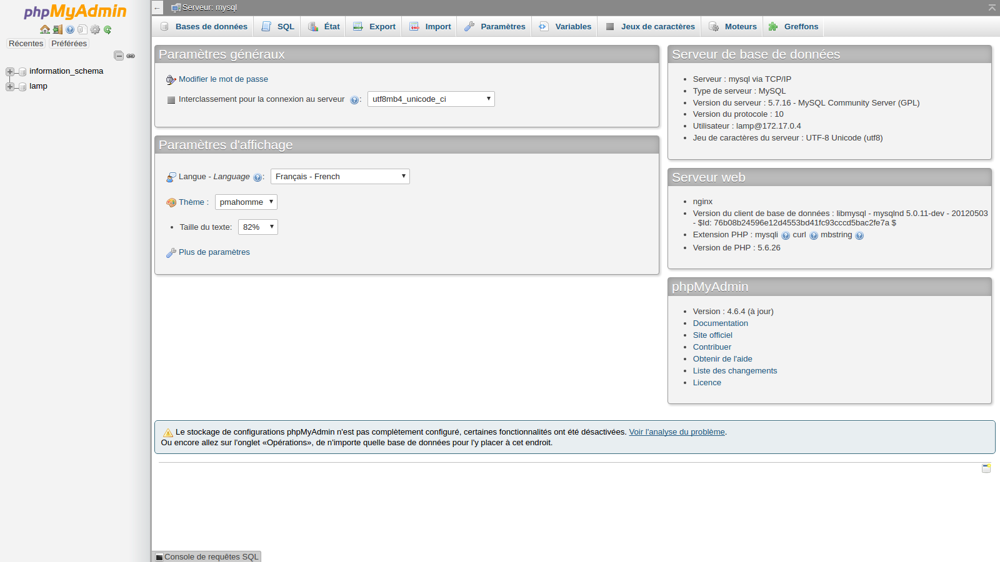

# 5 Minutes Stacks, épisode 42 : LAMP #

## Episode 42 : LAMP

LAMP est un serveur web composé de 4 logiciels libres :
 - **L**inux pour le système d'exploitation accueillant le système
 - **A**pache pour le serveur HTTP qui est en communication avec le client
 - **M**ySQL pour le serveur de bases de données
 - **P**HP pour l'exécution de pages web dynamiques

## Preparations

### Les versions
 - CoreOS Stable 1010.6
 - Apache2
 - MySQL 5.7.15
 - PHP 7.0

### Les pré-requis pour déployer cette stack

Ceci devrait être une routine à présent :
 * Un accès internet
 * Un shell linux
 * Un [compte Cloudwatt](https://www.cloudwatt.com/cockpit/#/create-contact) avec une [paire de clés existante](https://console.cloudwatt.com/project/access_and_security/?tab=access_security_tabs__keypairs_tab)
 * Les outils [OpenStack CLI](http://docs.openstack.org/cli-reference/content/install_clients.html)
 * Un clone local du dépôt git [Cloudwatt applications](https://github.com/cloudwatt/applications)

### Taille de l'instance
Par défaut, le script propose un déploiement sur une instance de type "standard-1" (n1.cw.standard-1). Il existe une variété d'autres types d'instances pour la satisfaction de vos multiples besoins. Les instances sont facturées à la minute, vous permettant de payer uniquement pour les services que vous avez consommés et plafonnées à leur prix mensuel (vous trouverez plus de détails sur la [Page tarifs](https://www.cloudwatt.com/fr/produits/tarifs.html) du site de Cloudwatt).

 Vous pouvez ajuster les parametres de la stack à votre goût.

### Au fait...

Si vous n’aimez pas les lignes de commande, vous pouvez passer directement à la version ["Je lance avec la console"](#console)...

## Tour du propriétaire

Une fois le dépôt cloné, vous trouverez le répertoire `blueprint-coreos-lamp/`

* `blueprint-coreos-lamp.heat.yml`: Template d'orchestration HEAT, qui servira à déployer l'infrastructure nécessaire.
* `stack-start.sh`: Script de lancement de la stack, qui simplifie la saisie des parametres et sécurise la création du mot de passe admin.
* `stack-get-url.sh`: Script de récupération de l'IP d'entrée de votre stack, qui peut aussi se trouver dans les parametres de sortie de la stack.

## Démarrage

### Initialiser l'environnement

Munissez-vous de vos identifiants Cloudwatt, et cliquez [ICI](https://console.cloudwatt.com/project/access_and_security/api_access/openrc/).
Si vous n'êtes pas connecté, vous passerez par l'écran d'authentification, puis le téléchargement d'un script démarrera. C'est grâce à celui-ci que vous pourrez initialiser les accès shell aux API Cloudwatt.

Sourcez le fichier téléchargé dans votre shell et entrez votre mot de passe lorsque vous êtes invité à utiliser les clients OpenStack.

 ~~~ bash
 $ source COMPUTE-[...]-openrc.sh
 Please enter your OpenStack Password:

 ~~~

Une fois ceci fait, les outils de ligne de commande d'OpenStack peuvent interagir avec votre compte Cloudwatt.

### Ajuster les paramètres

Dans le fichier `blueprint-coreos-lamp.heat.yml` vous trouverez en haut une section `parameters`. Le seul paramètre obligatoire à ajuster est celui nommé `keypair_name` dont la valeur `default` doit contenir le nom d'une paire de clés valide dans votre compte utilisateur. Vous devrez aussi saisir le mot de passe qui sera donné au compte `lamp` du serveur FTP et de votre base `MySQL`.
C'est dans ce même fichier que vous pouvez ajuster la taille de l'instance par le paramètre `flavor`.

 ~~~ yaml
heat_template_version: 2013-05-23

description: Blueprint CoreOS LAMP

parameters:
  keypair_name:
    description: Keypair to inject in instance
    label: SSH Keypair
    type: string

  flavor_name:
    default: n1.cw.standard-1
    description: Flavor to use for the deployed instance
    type: string
    label: Instance Type (Flavor)
    constraints:
      - allowed_values:
          - n1.cw.standard-1
          - n1.cw.standard-2
          - n1.cw.standard-4
          - n1.cw.standard-8
          - n1.cw.standard-12
          - n1.cw.standard-16

  pass:
    description: "password ftp et sql (user: lamp)"
    type: string
    hidden: true
[...]
 ~~~
### Démarrer la stack

Dans un shell, lancer le script `stack-start.sh` en passant en paramètre le nom que vous souhaitez lui attribuer :

~~~ bash
 $ ./stack-start.sh LAMP
 +--------------------------------------+------------+--------------------+----------------------+
 | id                                   | stack_name | stack_status       | creation_time        |
 +--------------------------------------+------------+--------------------+----------------------+
 | ed4ac18a-4415-467e-928c-1bef193e4f38 | LAMP       | CREATE_IN_PROGRESS | 2015-04-21T08:29:45Z |
 +--------------------------------------+------------+--------------------+----------------------+
~~~

Enfin, attendez **5 minutes** que le déploiement soit complet.

 ~~~ bash
 $ watch heat resource-list LAMP
 +------------------+-----------------------------------------------------+---------------------------------+-----------------+----------------------+
 | resource_name    | physical_resource_id                                | resource_type                   | resource_status | updated_time         |
 +------------------+-----------------------------------------------------+---------------------------------+-----------------+----------------------+
 | floating_ip      | 44dd841f-8570-4f02-a8cc-f21a125cc8aa                | OS::Neutron::FloatingIP         | CREATE_COMPLETE | 2015-11-25T11:03:51Z |
 | security_group   | efead2a2-c91b-470e-a234-58746da6ac22                | OS::Neutron::SecurityGroup      | CREATE_COMPLETE | 2015-11-25T11:03:52Z |
 | network          | 7e142d1b-f660-498d-961a-b03d0aee5cff                | OS::Neutron::Net                | CREATE_COMPLETE | 2015-11-25T11:03:56Z |
 | subnet           | 442b31bf-0d3e-406b-8d5f-7b1b6181a381                | OS::Neutron::Subnet             | CREATE_COMPLETE | 2015-11-25T11:03:57Z |
 | server           | f5b22d22-1cfe-41bb-9e30-4d089285e5e5                | OS::Nova::Server                | CREATE_COMPLETE | 2015-11-25T11:04:00Z |
 | floating_ip_link | 44dd841f-8570-4f02-a8cc-f21a125cc8aa-`floating IP`  | OS::Nova::FloatingIPAssociation | CREATE_COMPLETE | 2015-11-25T11:04:30Z |
   +------------------+-----------------------------------------------------+-------------------------------+-----------------+----------------------
 ~~~

   Le script `start-stack.sh` s'occupe de lancer les appels nécessaires sur les API Cloudwatt pour :

   * démarrer une instance basée sur Coreos y déposer le conteneur *Apache2* rattaché à sa database *MySQL*,

   * l'exposer sur Internet via une IP flottante.

<a name="console" />

## C’est bien tout ça, mais...

### Vous n’auriez pas un moyen de lancer l’application par la console ?

Et bien si ! En utilisant la console, vous pouvez déployer LAMP :

1.	Allez sur le Github Cloudwatt dans le répertoire [applications/blueprint-coreos-lamp](https://github.com/cloudwatt/applications/tree/master/blueprint-coreos-lamp)
2.	Cliquez sur le fichier nommé `blueprint-coreos-lamp.heat.yml`
3.	Cliquez sur RAW, une page web apparait avec le détail du script
4.	Enregistrez-sous le contenu sur votre PC dans un fichier avec le nom proposé par votre navigateur (enlever le .txt à la fin)
5.  Rendez-vous à la section « [Stacks](https://console.cloudwatt.com/project/stacks/) » de la console.
6.	Cliquez sur « Lancer la stack », puis cliquez sur « fichier du modèle » et sélectionnez le fichier que vous venez de sauvegarder sur votre PC, puis cliquez sur « SUIVANT »
7.	Donnez un nom à votre stack dans le champ « Nom de la stack »
8.	Entrez votre keypair dans le champ « keypair_name »
9.  Donner votre passphrase qui servira pour le compte lamp du serveur FTP et votre base de données MySQL
10.	Choisissez la taille de votre instance parmi le menu déroulant « flavor_name » et cliquez sur « LANCER »

La stack va se créer automatiquement (vous pouvez en voir la progression cliquant sur son nom). Quand tous les modules deviendront « verts », la création sera terminée. Vous pourrez alors aller dans le menu « Instances » pour découvrir l’IP flottante qui a été générée automatiquement. Ne vous reste plus qu'à vous connecter en ssh avec votre keypair.

C’est (déjà) FINI !

### Vous n’auriez pas un moyen de lancer l’application en 1-clic ?

Bon... en fait oui ! Allez sur la page [Applications](https://www.cloudwatt.com/fr/applications/) du site de Cloudwatt, choisissez l'appli, appuyez sur DEPLOYER et laisser vous guider... 2 minutes plus tard un bouton vert apparait... ACCEDER : vous avez votre serveur LAMP !

## Enjoy

Une fois tout ceci fait vous pouvez vous connecter sur votre serveur en SSH en utilisant votre keypair préalablement téléchargée sur votre poste.

Vous êtes maintenant en possession de votre propre serveur LAMP. Vous pouvez y acceder via l'url `http://ip-floatingip`. Votre url complète sera présente dans la vue d'ensemble de votre stack sur la console horizon Cloudwatt.

Voici la page d'accueil par défaut de votre site web :

Vous avez la possibilité de gérer votre base de données grâce à phpMyAdmin :

Pour transférer de nouveaux fichiers accessibles en http, vous pouvez utiliser un client FTP tel que *FileZilla* :

Vous pouvez à présent mettre en place votre site web, celui-ci étant hébergé en France dans un environnement maîtrisé, vous pouvez avoir une totale confiance dans ce produit.

## So watt ?

Ce tutoriel a pour but d'accélerer votre démarrage. A ce stade **vous** êtes maître(sse) à bord.

Vous avez un point d'entrée sur votre machine virtuelle en SSH via l'IP flottante exposée et votre clé privée (utilisateur `core` par défaut).

* Il ne vous reste plus qu'à copier vos fichiers via le serveur FTP sur le port 2176 et ils seront accessibles en http via l'IP flottante indiquée dans la sortie de votre stack sur la console horizon Cloudwatt.
* Vous pouvez gérer vos bases de données directement avec phpMyAdmin en http sur le port 8059.

----
Have fun. Hack in peace.
