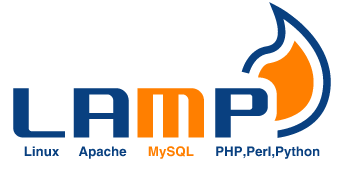

# 5 Minutes Stacks, episode X : LAMP #

## Episode X : LAMP

LAMP is a web server composed by 4 open-source tools:
 - **L**inux for the Operating System which host the server
 - **A**pache for the HTTP server which is in link with the client
 - **M**ySQL for the databases server
 - **P**HP to execute dynamic web pages

## Preparations

### The Versions
 - CoreOS Stable 1010.6
 - Apache2
 - MySQL 5.7.15
 - PHP 7.0

### The prerequisites to deploy this stack

These should be routine by now:
 * An Internet access
 * A Linux shell
 * A [Cloudwatt account](https://www.cloudwatt.com/cockpit/#/create-contact) with a [valid keypair](https://console.cloudwatt.com/project/access_and_security/?tab=access_security_tabs__keypairs_tab)
 * The tools of the trade: [OpenStack CLI](http://docs.openstack.org/cli-reference/content/install_clients.html)
 * A local clone of the [Cloudwatt applications](https://github.com/cloudwatt/applications) git repository (if you are creating your stack from a shell)

### Size of the instance

By default, the stack deploys on an instance of type "Standard 1" (n1.cw.standard-1). A variety of other instance types exist to suit your various needs, allowing you to pay only for the services you need. Instances are charged by the minute and capped at their monthly price (you can find more details on the [Pricing page](https://www.cloudwatt.com/en/pricing.html) on the Cloudwatt website).

 Stack parameters, of course, are yours to tweak at your fancy.

### By the way...

If you do not like command lines, you can go directly to the "run it thru the console" section by clicking [here](#console)

## What will you find in the repository

 Once you have cloned the github, you will find in the `bundle-trusty-lamp/` repository:

 * `blueprint-coreos-lamp.heat.yml`: HEAT orchestration template. It will be use to deploy the necessary infrastructure.
 * `stack-start.sh`: Stack launching script. This is a small script that will save you some copy-paste.
 * `stack-get-url.sh`: Flotting IP recovery script.

## Start-up

### Initialize the environment

Have your Cloudwatt credentials in hand and click [HERE](https://console.cloudwatt.com/project/access_and_security/api_access/openrc/).
If you are not logged in yet, you will go thru the authentication screen then the script download will start. Thanks to it, you will be able to initiate the shell accesses towards the Cloudwatt APIs.

Source the downloaded file in your shell. Your password will be requested.

~~~ bash
$ source COMPUTE-[...]-openrc.sh
Please enter your OpenStack Password:

~~~

Once this done, the Openstack command line tools can interact with your Cloudwatt user account.

### Adjust the parameters

With the `blueprint-coreos-lamp.heat.yml` file, you will find at the top a section named `parameters`. The sole mandatory parameter to adjust is the one called `keypair_name`. Its `default` value must contain a valid keypair with regards to your Cloudwatt user account.You will also enter the `root` password account of your `MySQL` database. This is within this same file that you can adjust the instance size by playing with the `flavor` parameter.

~~~ yaml
heat_template_version: 2013-05-23

description: Blueprint CoreOS LAMP

parameters:
  keypair_name:
    description: Keypair to inject in instance
    label: SSH Keypair
    type: string

  flavor_name:
    default: n1.cw.standard-1
    description: Flavor to use for the deployed instance
    type: string
    label: Instance Type (Flavor)
    constraints:
      - allowed_values:
          - n1.cw.standard-1
          - n1.cw.standard-2
          - n1.cw.standard-4
          - n1.cw.standard-8
          - n1.cw.standard-12
          - n1.cw.standard-16

  sqlpass:
    description: password root sql
    type: string
    hidden: true
[...]
~~~
### Start stack

 In a shell, run the script `stack-start.sh` with his name in parameter:

 ~~~ bash
 ./stack-start.sh stack_name
 +--------------------------------------+-----------------+--------------------+----------------------+
 | id                                   | stack_name      | stack_status       | creation_time        |
 +--------------------------------------+-----------------+--------------------+----------------------+
 | ee873a3a-a306-4127-8647-4bc80469cec4 | LAMP            | CREATE_IN_PROGRESS | 2015-11-25T11:03:51Z |
 +--------------------------------------+-----------------+--------------------+----------------------+
 ~~~

 Within **5 minutes** the stack will be fully operational. (Use `watch` to see the status in real-time)

 ~~~
 $ watch heat resource-list LAMP
 +------------------+-----------------------------------------------------+---------------------------------+-----------------+----------------------+
 | resource_name    | physical_resource_id                                | resource_type                   | resource_status | updated_time         |
 +------------------+-----------------------------------------------------+---------------------------------+-----------------+----------------------+
 | floating_ip      | 44dd841f-8570-4f02-a8cc-f21a125cc8aa                | OS::Neutron::FloatingIP         | CREATE_COMPLETE | 2015-11-25T11:03:51Z |
 | security_group   | efead2a2-c91b-470e-a234-58746da6ac22                | OS::Neutron::SecurityGroup      | CREATE_COMPLETE | 2015-11-25T11:03:52Z |
 | network          | 7e142d1b-f660-498d-961a-b03d0aee5cff                | OS::Neutron::Net                | CREATE_COMPLETE | 2015-11-25T11:03:56Z |
 | subnet           | 442b31bf-0d3e-406b-8d5f-7b1b6181a381                | OS::Neutron::Subnet             | CREATE_COMPLETE | 2015-11-25T11:03:57Z |
 | server           | f5b22d22-1cfe-41bb-9e30-4d089285e5e5                | OS::Nova::Server                | CREATE_COMPLETE | 2015-11-25T11:04:00Z |
 | floating_ip_link | 44dd841f-8570-4f02-a8cc-f21a125cc8aa-`floating IP`  | OS::Nova::FloatingIPAssociation | CREATE_COMPLETE | 2015-11-25T11:04:30Z |
   +------------------+-----------------------------------------------------+-------------------------------+-----------------+----------------------
 ~~~

 The `start-stack.sh` script takes care of running the API necessary requests to execute the normal heat template which:

 * Starts an CoreOS based instance with the docker container *Apache2* attached to his *MySQL* database
 * Expose it on the Internet via a floating IP.

<a name="console" />

## All of this is fine, but...

### You do not have a way to create the stack from the console?

 We do indeed! Using the console, you can deploy LAMP:

 1.	Go the Cloudwatt Github in the [applications/blueprint-coreos-lamp](https://github.com/cloudwatt/applications/tree/master/blueprint-coreos-lamp) repository
 2.	Click on the file named `blueprint-coreos-lamp.heat.yml`
 3.	Click on RAW, a web page will appear containing purely the template
 4.	Save the file to your PC. You can use the default name proposed by your browser (just remove the .txt)
 5.  Go to the « [Stacks](https://console.cloudwatt.com/project/stacks/) » section of the console
 6.	Click on « Launch stack », then « Template file » and select the file you just saved to your PC, and finally click on « NEXT »
 7.	Name your stack in the « Stack name » field
 8.	Enter the name of your keypair in the « SSH Keypair » field
 9.  Write a passphrase that will be used for the database root user
 10.	Choose your instance size using the « Instance Type » dropdown and click on « LAUNCH »

 The stack will be automatically generated (you can see its progress by clicking on its name). When all modules become green, the creation will be complete. You can then go to the "Instances" menu to find the floating IP, or simply refresh the current page and check the Overview tab for a handy link.

 If you've reached this point, you're already done! Go enjoy LAMP!

### A one-click deployment sounds really nice...

 ... Good! Go to the [Apps page](https://www.cloudwatt.com/en/apps/) on the Cloudwatt website, choose the apps, press **DEPLOY** and follow the simple steps... 2 minutes later, a green button appears... **ACCESS**: you have your LAMP server.

## Enjoy

 Once all this makes you can connect on your server in SSH by using your keypair beforehand downloaded on your compute,

 You are now in possession of your own LAMP server, you can enter via the URL `http://ip-floatingip`. Your full URL will be present in your stack overview in horizon Cloudwatt console.

## So watt?

The goal of this tutorial is to accelerate your start. At this point **you** are the master of the stack.

You now have an SSH access point on your virtual machine through the floating-IP and your private keypair (default userusername `core`).

* You have access to the web interface via the address specified in your output stack in horizon console.

----
Have fun. Hack in peace.
