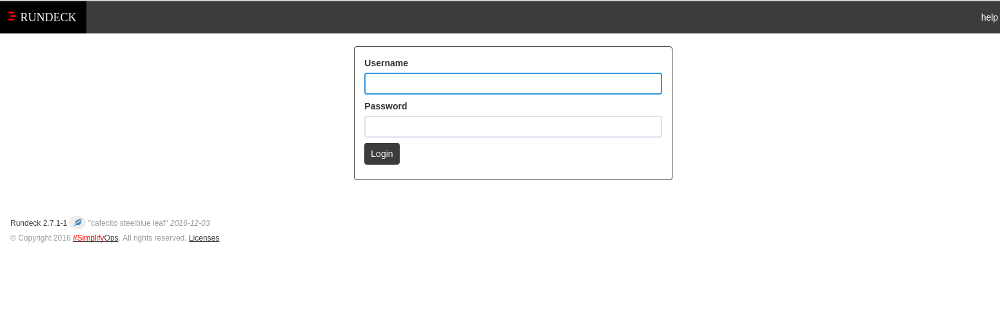
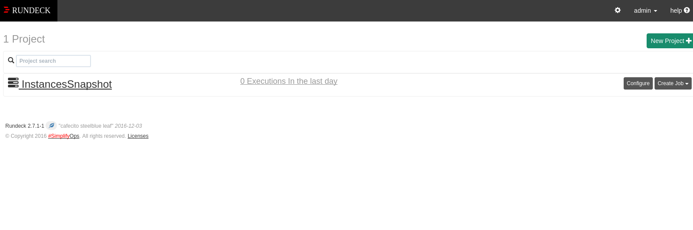
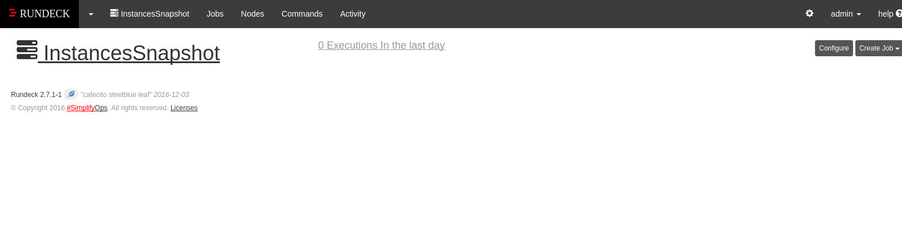
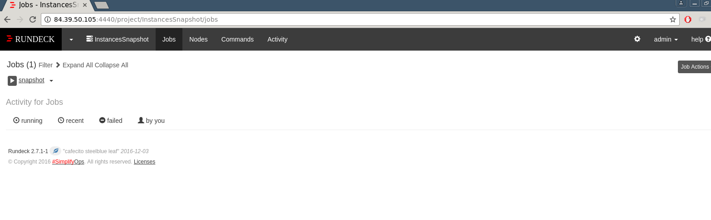
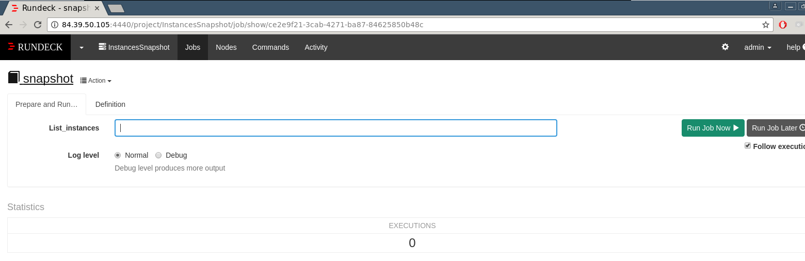

# 5 Minutes Stacks, episode 51 : Rundeck! #

## Episode 51 : Rundeck!

Rundeck is open source software that helps you automate routine operational procedures in data center or cloud environments. There are a lot of features that Rundeck offers, one of the ones I use is the ability to create jobs and workflows that allow me to execute commands on remote machines, capture the results, (success or failure) and then process that result and either continue on with the workflow or terminate it. I can have the system notify me via email or webhooks as well as many other options through the plugin system for notifications. In a nutshell, Rundeck is a feature rich tool to schedule and run your tasks on one or thousands of systems.

We created a job that will create snapshots of your instances.

## Preparations

### The Versions
- CoreOS Stable 1010.6
- Rundeck 2.7.1
- Rundeck-cli 1.0.3

### The prerequisites to deploy this stack

These should be routine by now:
 * An Internet access
 * A Linux shell
 * A [Cloudwatt account](https://www.cloudwatt.com/cockpit/#/create-contact) with a [valid keypair](https://console.cloudwatt.com/project/access_and_security/?tab=access_security_tabs__keypairs_tab)
 * The tools of the trade: [OpenStack CLI](http://docs.openstack.org/cli-reference/content/install_clients.html)
 * A local clone of the [Cloudwatt applications](https://github.com/cloudwatt/applications) git repository (if you are creating your stack from a shell)

### Size of the instance

By default, the stack deploys on an instance of type "Standard 1" (n1.cw.standard-1). A variety of other instance types exist to suit your various needs, allowing you to pay only for the services you need. Instances are charged by the minute and capped at their monthly price (you can find more details on the [Pricing page](https://www.cloudwatt.com/en/pricing.html) on the Cloudwatt website).

 Stack parameters, of course, are yours to tweak at your fancy.

### By the way...

If you do not like command lines, you can go directly to the "run it thru the console" section by clicking [here](#console)

## What will you find in the repository

 Once you have cloned the github, you will find in the `blueprint-coreos-rundeck/` repository:

 * `blueprint-coreos-rundeck.heat.yml`: HEAT orchestration template. It will be use to deploy the necessary infrastructure.
 * `stack-start.sh`: Stack launching script. This is a small script that will save you some copy-paste.

## Start-up

### Initialize the environment

Have your Cloudwatt credentials in hand and click [HERE](https://console.cloudwatt.com/project/access_and_security/api_access/openrc/).
If you are not logged in yet, you will go thru the authentication screen then the script download will start. Thanks to it, you will be able to initiate the shell accesses towards the Cloudwatt APIs.

Source the downloaded file in your shell. Your password will be requested.

~~~ bash
$ source COMPUTE-[...]-openrc.sh
Please enter your OpenStack Password:

~~~

Once this done, the Openstack command line tools can interact with your Cloudwatt user account.

### Adjust the parameters

In the `blueprint-coreos-rundeck.heat.yml` file (heat template), you will find a section named `parameters` near the top. The only mandatory parameter is the `keypair_name`. The `keypair_name`'s `default` value should contain a valid keypair with regards to your Cloudwatt user account, if you wish to have it by default on the console.

Within these heat templates, you can also adjust (and set the defaults for) the instance type by playing with the `flavor_name` parameter accordingly.

By default, the stack network and subnet are generated for the stack. This behavior can be changed within the `blueprint-coreos-rundeck.heat.yml` file as well, if need be, although doing so may be cause for security concerns.

~~~ yaml

parameters:

  keypair_name:
    description: Keypair to inject in instance
    label: SSH Keypair
    type: string

  flavor_name:
    default: n1.cw.standard-1
    description: Flavor to use for the deployed instance
    type: string
    label: Instance Type (Flavor)
    constraints:
      - allowed_values:
          - n1.cw.standard-1
          - n1.cw.standard-2
          - n1.cw.standard-4
          - n1.cw.standard-8
          - n1.cw.standard-12
          - n1.cw.standard-16

  volume_size:
    default: 10
    label: Backup Volume Size
    description: Size of Volume for rundeck Storage (Gigabytes)
    type: number
    constraints:
      - range: { min: 5, max: 10000 }
        description: Volume must be at least 10 gigabytes

  volume_type:
    default: standard
    label: Backup Volume Type
    description: Performance flavor of the linked Volume for rundeck Storage
    type: string
    constraints:
      - allowed_values:
          - standard
          - performant

  os_region_name:
      default: fr1
      label: OpenStack region
      description: OpenStack region
      type: string
      constraints:
        - allowed_values:
          - fr1
          - fr2

  os_username:
    description: OpenStack Username
    label: OpenStack Username
    type: string

  os_password:
    description: OpenStack Password
    label: OpenStack Password
    type: string
    hidden: true

  os_tenant_name:
    description: OpenStack Tenant Name
    label: OpenStack Tenant Name
    type: string

  os_auth_url:
    description: OpenStack Auth URL
    default: https://identity.fr1.cloudwatt.com/v2.0
    label: OpenStack Auth URL
    type: string

  mysql_root_password:
   description: mysql root password
   label: Mysql Root Password
   type: string
   hidden: true

  rundeck_password :
    description: Rundeck Admin Password
    label: Rundeck Admin Password
    type: string
    hidden: true
[...]
 ~~~
### Start stack

 In a shell, run the script `stack-start.sh` with his name in parameter:

 ~~~ bash
 ./stack-start.sh rundeck
 +--------------------------------------+-----------------+--------------------+----------------------+
 | id                                   | stack_name      | stack_status       | creation_time        |
 +--------------------------------------+-----------------+--------------------+----------------------+
 | ee873a3a-a306-4127-8647-4bc80469cec4 | rundeck          | CREATE_IN_PROGRESS | 2017-01-12T16:36:05Z |
 +--------------------------------------+-----------------+--------------------+----------------------+
 ~~~

 Within **5 minutes** the stack will be fully operational. (Use `watch` to see the status in real-time)

 ~~~
 $ watch heat resource-list rundeck
 +-------------------+-------------------------------------------------------------------------------------+---------------------------------+-----------------+----------------------+
| resource_name     | physical_resource_id                                                                | resource_type                   | resource_status | updated_time         |
+-------------------+-------------------------------------------------------------------------------------+---------------------------------+-----------------+----------------------+
| cinder_volume     | 24016996-f5c4-4086-b351-d5613072792d                                                | OS::Cinder::Volume              | CREATE_COMPLETE | 2017-01-12T16:36:05Z |
| floating_ip       | 22d6e3eb-7562-472e-9f3b-e434d1f689b2                                                | OS::Neutron::FloatingIP         | CREATE_COMPLETE | 2017-01-12T16:36:05Z |
| floating_ip_link  | 855900                                                                              | OS::Nova::FloatingIPAssociation | CREATE_COMPLETE | 2017-01-12T16:36:05Z |
| interface         | 7129e80e-2214-45f4-a1f3-135c7578854e:subnet_id=a613b683-d94e-4343-9148-5b8e3e1900f6 | OS::Neutron::RouterInterface    | CREATE_COMPLETE | 2017-01-12T16:36:05Z |
| network           | a06ae947-6021-4440-b3bd-ea4fcf93f877                                                | OS::Neutron::Net                | CREATE_COMPLETE | 2017-01-12T16:36:05Z |
| ports             | 842e6b17-78a9-466d-8b21-fe6b5cd8b52d                                                | OS::Neutron::Port               | CREATE_COMPLETE | 2017-01-12T16:36:05Z |
| router            | 7129e80e-2214-45f4-a1f3-135c7578854e                                                | OS::Neutron::Router             | CREATE_COMPLETE | 2017-01-12T16:36:05Z |
| security_group    | c9f8660e-9be5-4df8-ae67-a8b1c7cbcd2f                                                | OS::Neutron::SecurityGroup      | CREATE_COMPLETE | 2017-01-12T16:36:05Z |
| server            | a5354423-5008-4206-8703-348c130a82a6                                                | OS::Nova::Server                | CREATE_COMPLETE | 2017-01-12T16:36:05Z |
| subnet            | a613b683-d94e-4343-9148-5b8e3e1900f6                                                | OS::Neutron::Subnet             | CREATE_COMPLETE | 2017-01-12T16:36:05Z |
| volume_attachment | 24016996-f5c4-4086-b351-d5613072792d                                                | OS::Cinder::VolumeAttachment    | CREATE_COMPLETE | 2017-01-12T16:36:05Z |
+-------------------+-------------------------------------------------------------------------------------+---------------------------------+-----------------+----------------------+
 ~~~

 The `start-stack.sh` script takes care of running the API necessary requests to execute the normal heat template which:

 * Starts an CoreOS based instance with the docker container *Rundeck* attached to his database *Mysql*
 * Expose it on the Internet via a floating IP.

<a name="console" />

## All of this is fine, but...

### You do not have a way to create the stack from the console?

 We do indeed! Using the console, you can deploy Joomla!:

 1.	Go the Cloudwatt Github in the [applications/blueprint-coreos-joomla](https://github.com/cloudwatt/applications/tree/master/blueprint-coreos-rundeck) repository
 2.	Click on the file named `blueprint-coreos-joomla.heat.yml`
 3.	Click on RAW, a web page will appear containing purely the template
 4.	Save the file to your PC. You can use the default name proposed by your browser (just remove the .txt)
 5.  Go to the « [Stacks](https://console.cloudwatt.com/project/stacks/) » section of the console
 6.	Click on « Launch stack », then « Template file » and select the file you just saved to your PC, and finally click on « NEXT ».
 7.	Name your stack in the « Stack name » field.
 8.	Enter the name of your keypair in the « SSH Keypair » field.
 9. Choose your instance size using the « Instance Type » dropdown.
 10.Enter the backup volume size in « Backup Volume Size » field, then choose the volume type in « Backup Volume Type » field.
 11.Enter your account Cloudwatt credentials in « OpenStack region », « OpenStack Username », « OpenStack Password »,
    « OpenStack Tenant Name » et « OpenStack Auth URL » fields.
 12.Enter the mysql root password in « Mysql Root Password » field.
 13.Enter the rundeck admin password in « Rundeck Admin Password » field and click on « LAUNCH ».
 The stack will be automatically generated (you can see its progress by clicking on its name). When all modules become green, the creation will be complete. You can then go to the "Instances" menu to find the floating IP, or simply refresh the current page and check the Overview tab for a handy link.

 If you've reached this point, you're already done! Go enjoy Rundeck!

### A one-click deployment sounds really nice...

 ... Good! Go to the [Apps page](https://www.cloudwatt.com/en/apps/) on the Cloudwatt website, choose the apps, press **DEPLOY** and follow the simple steps... 2 minutes later, a green button appears... **ACCESS**: you have your Rundeck!.

## Enjoy

 Once all this makes you can connect on your server in SSH by using your keypair beforehand downloaded on your compute,

 You are now in possession of your own Rundeck! website, you can enter via the URL `http://ip-floatingip:4440`. Your full URL will be present in your stack overview in horizon Cloudwatt console.

For logging you use **admin@mail_domain** as login and **password_admin** as password, you have to arrive on this page:

In order to start the job that will create the snapshots of the instances, you have to click on the project `InstancesSnapshot`.

Click on the tab `jobs`.

Click on `snapshot` job and enter the list of the instances Ids that you want to snapshot in `List_instances` the field, then click on `Run Job Now` .

Then check your instances were snapshot with the command.

~~~shell
$ glance image-list | grep id_instance1
~~~

To retrieve the IDs of your instances run this command:
  ~~~bash
  $ nova list
  +--------------------------------------+-------------------------------------------------------+--------+------------+-------------+-------------------------------------------------------+
  | ID                                   | Name                                                  | Status | Task State | Power State | Networks                                              |
  +--------------------------------------+-------------------------------------------------------+--------+------------+-------------+-------------------------------------------------------+
  | 627fd0b7-0af0-4a53-bb40-2b921f228c3b | factory-server-ctwk3vwqiesv                           | ACTIVE | -          | Running     | factory-dmz-6a4ysedl3h73=10.42.42.100                 |
  | 5b00d121-9998-4143-8504-298a2857f181 | ku-sj47pz-6otjy4e7bn6a-rqe6zfiitpz3-node-drjqqgaz4jw2 | ACTIVE | -          | Running     | kube-network-ih7t7tdomdz6=10.1.1.11                   |
  +--------------------------------------+-------------------------------------------------------+--------+------------+-------------+-------------------------------------------------
  ~~~
Snaphosts are in form `name_instance-date-temps`, for example `name_instance-2017-01-13-1123`.

## So watt?

The goal of this tutorial is to accelerate your start. At this point **you** are the master of the stack.

You now have an SSH access point on your virtual machine through the floating-IP and your private keypair (default userusername `core`).

* You have access to the web interface via the address specified in your output stack in horizon console.

* Here are some news sites to learn more:

- http://rundeck.org/

----
Have fun. Hack in peace.
