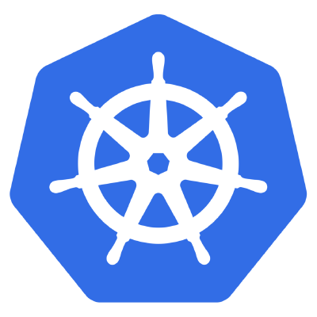
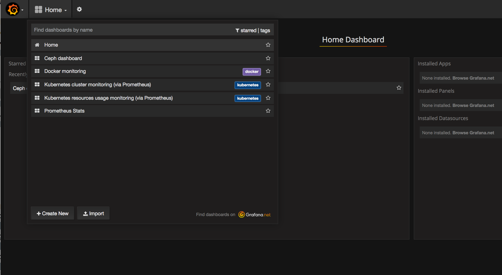
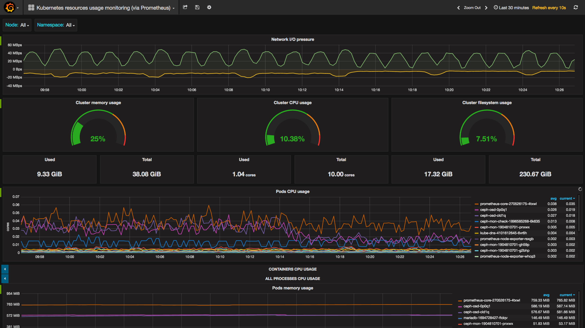
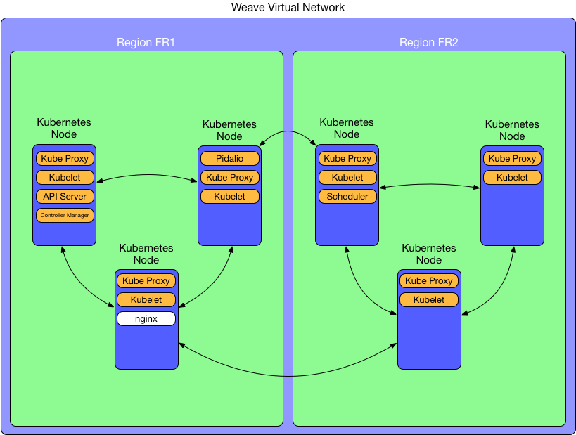

# Blueprint: Kubernetes HA multi-tenant multi-region #



Kubernetes is an open-source platform for automating deployment, scaling, and operations of application containers across clusters of hosts, providing container-centric infrastructure.
With Kubernetes, you are able to quickly and efficiently respond to customer demand:
* Deploy your applications quickly and predictably.
* Scale your applications on the fly.
* Seamlessly roll out new features.
* Optimize use of your hardware by using only the resources you need.
Our goal is to foster an ecosystem of components and tools that relieve the burden of running applications in public and private clouds.

This stack allows you to deplay a  multi-tenant multi-region HA Kubernetes cluster in few clicks.

## Preparations

### Versions

  - CoreOS Stable 1010.6
  - Docker 1.10.3
  - Kubernetes 1.5.1
  - Ceph 10

### The prerequisites

This should be a routine now:

 * Internet access

 * A linux shell or an access to the Cloudwatt console

 * A [Cloudwatt account](https://www.cloudwatt.com/cockpit/#/create-contact) with an [ existing keypair](https://console.cloudwatt.com/project/access_and_security/?tab=access_security_tabs__keypairs_tab)

 * The Openstack Client [OpenStack CLI](http://docs.openstack.org/cli-reference/content/install_clients.html)

 * A local clone of the [Cloudwatt applications](https://github.com/cloudwatt/applications) repository

### Instance Size

By default, the script proposes a deployment on an instance of type "standard-1" (n1.cw.standard-1). There are a variety of other types of instances for meeting your multiple needs. The instances are invoiced per minute, allowing you to pay only for the services you have consumed and capped at their monthly price (you will find more details on the [rates page](https://www.cloudwatt.com/en/pricing.html) of the Cloudwatt website).

You can adjust the stack parameters to suit your taste.

### By the way...

If you do not like the command lines, you can go directly to the version **"I launch in 1-click"** or **"I launch with the console"** by clicking on [this link](#console) ...


## Tour of the owner

Once the repository is cloned, you will find the `blueprint-kubernetes-ha/` directory

* `stack-fr1-cli.yml`: HEAT orchestration template for region FR1, it will be used to deploy the necessary infrastructure.
* `stack-fr2-cli.yml`: HEAT orchestration template for region FR2, it will be used to deploy the necessary infrastructure.
* `stack-start.sh`: Script to launch the stack, which simplifies the input of the parameters.

## Start-up

### Initializing the environment

Have your Cloudwatt credentials in hand and click [HERE](https://console.cloudwatt.com/project/access_and_security/api_access/openrc/).
If you are not logged in yet, you will go thru the authentication screen then the script download will start. Thanks to it, you will be able to initiate the shell accesses towards the Cloudwatt APIs.

Source the downloaded file in your shell. Your password will be requested.

~~~ bash
$ source COMPUTE-[...]-openrc.sh
Please enter your OpenStack Password:
~~~

Once this done, the Openstack command line tools can interact with your Cloudwatt user account.

### Launch the stack

In a shell, run the `stack-start.sh` script:

 ~~~ bash
 $ ./stack-start.sh
 ~~~

The script will ask you several questions, then, once the stack create you will display four lines:

 ~~~ bash
scale_dn_url: ...
scale_up_url: ...
scale_storage_dn_url: ...
scale_storage_up_url: ...
 ~~~

scale_dn_url is a url that you can call to decrease the capacity of your cluster

scale_up_url is a url that you can call to increase the capacities of your cluster

scale_storage_up_url is a url that you can call to increase the capacity of the cluster Ceph

scale_storage_dn_url is a url that you can call to decrease the capacity of the cluster Ceph, in this scenario, please look at the FAQ.

### Et ensuite

Each node has a public and private ip.

The cluster will take about ten minutes to initialize, once this time has elapsed, you can connect throught ssh to the public ip of one of them.

Then, to list the state of the Kubernetes components, you can execute this command:

~~~bash
$ fleetctl list-units
~~~

It should show you this:

~~~
UNIT                       MACHINE                  ACTIVE SUB
pidalio-apiserver.service  62bf699b.../84.39.36.87  active running
pidalio-controller.service b8cc10ee.../84.39.35.207 active running
pidalio-node.service       4f723b52.../84.39.36.13  active running
pidalio-node.service       62bf699b.../84.39.36.87  active running
pidalio-node.service       b8cc10ee.../84.39.35.207 active running
pidalio-proxy.service      4f723b52.../84.39.36.13  active running
pidalio-proxy.service      62bf699b.../84.39.36.87  active running
pidalio-proxy.service      b8cc10ee.../84.39.35.207 active running
pidalio-scheduler.service  4f723b52.../84.39.36.13  active running
pidalio.service            4f723b52.../84.39.36.13  active running
~~~

Pidalio is a utility to easily bootstrapp a Kubernetes cluster.

It is composed of six parts:

	- pidalio: It makes available all the certificates and resources necessary for the operation of the cluster.
	- pidalio-apiserver: corresponds to the Kubernetes API Server component
	- pidalio-controller: corresponds to the Controller Manager component of Kubernetes, it takes care of your Pods
	- pidalio-scheduler: corresponds to the Scheduler component, it distributes the pods in your cluster
	- pidalio-proxy: corresponds to the Kube Proxy component, it takes care of your iptables to automatically route Kubernetes services ip to the correct pods
	- pidalio-node: corresponds to the Kubelet, the Kubernetes agent on each node.

You can use the Kubernetes client from any node.

We will use it to run a nginx server in our cluster :

~~~bash
kubectl run --image=nginx --port=80 nginx
~~~

Then we will make this server available on the internet :

~~~bash
kubectl expose deployment nginx --type=NodePort
kubectl describe service nginx
~~~

This last command will show you the details about the nginx service:

~~~bash
Name:  					nginx
Namespace:     			default
Labels:					run=nginx
Selector:      			run=nginx
Type:  					NodePort
IP:    					10.18.203.177
Port:  					<unset>	80/TCP
NodePort:      			<unset>	24466/TCP
Endpoints:     			10.40.0.2:80
Session Affinity:      	None
No events.
~~~

Look at the NodePort, it's the one you can use to access to this service throught any public ip of your cluster, be careful to open the ports on the cluster security group.

To access nginx, you can go to any public ip in your cluster on port 24466.

### I would like to persist my data

It is sometimes useful to persist container data but the task is often far from easy.

That's why the stack gives you a Ceph cluster out-of-the-box.

Type this command to list the volumes:

```bash
rbd ls
```

First, run this command to create a volume of 10GB :

```bash
rbd create db --size=10G
```

We will now launch a MariaDB database with an attached volume.

```bash
cat <<EOF | kubectl create -f -
apiVersion: extensions/v1beta1
kind: Deployment
metadata:
  name: mariadb
  labels:
    app: mariadb
spec:
  replicas: 1
  template:
    metadata:
      labels:
        app: mariadb
    spec:
      containers:
        - image: mariadb
          name: mariadb
          env:
            - name: MYSQL_ALLOW_EMPTY_PASSWORD
              value: "true"
          volumeMounts:
            - name: mariadb-persistent-storage
              mountPath: /var/lib/mysql
      volumes:
	     - name: mariadb-persistent-storage
	       rbd:
             monitors:
	           - ceph-mon.ceph:6789
             user: admin
             image: db
             pool: rbd
             secretRef:
               name: ceph-admin-key
EOF
```

Since Kubernetes 1.5, you can also use volume autoprovisionning.

Example :

```bash
cat <<EOF | kubectl create -f -
apiVersion: storage.k8s.io/v1beta1
kind: StorageClass
metadata:
   name: ceph
provisioner: kubernetes.io/rbd
parameters:
  monitors: ceph-mon.ceph:6789
  adminId: admin
  adminSecretName: ceph-admin-key
  adminSecretNamespace: ceph
  userId: admin
  userSecretName: ceph-admin-key
---
apiVersion: v1
kind: PersistentVolumeClaim
metadata:
  name: db
  annotations:
    "volume.beta.kubernetes.io/storage-class": ceph
spec:
  accessModes:
    - ReadWriteOnce
  resources:
    requests:
      storage: 30Gi
---
apiVersion: extensions/v1beta1
kind: Deployment
metadata:
  name: mariadb
  labels:
    app: mariadb
spec:
  replicas: 1
  template:
    metadata:
      labels:
        app: mariadb
    spec:
      containers:
        - image: mariadb
          name: mariadb
          env:
            - name: MYSQL_ALLOW_EMPTY_PASSWORD
              value: "true"
          volumeMounts:
            - name: mariadb-persistent-storage
              mountPath: /var/lib/mysql
      volumes:
        - name: mariadb-persistent-storage
          persistentVolumeClaim:
            claimName: db
EOF
```

### Monitoring

It is very important to monitor the status of your cluster, so if you have checked the Monitoring option during the creation of the stack, a Grafana is automatically available on any machine from port 31000.

You will get a list of different dashboards by clicking on the Home menu:



For example, click on Kubernetes resources usage monitoring (via Prometheus) for detailed monitoring of your Kubernetes cluster.

You should get this screen:




### And high availability in all this?

Nothing simpler, run again the stack-start.sh script but on a different region of the first one and choose Join mode.
Once the stack is created, the two clusters will join together to form one. Simple not?

### It's magical but how does it work?

Each node connects securely to a Weave virtual network, in this way, all containers can chat with each other regardless of their location.

Once interconnected, Fleet takes over to dispatch the various Kubernetes components through the cluster and Pidalio provides them with everything they need to function properly.

There you go !

### A little diagram?




## All of this is fine, but...

### A one-click chat sounds really nice...

... Good! Go to the Apps page on the Cloudwatt website, choose the apps, press DEPLOY and follow the simple steps... 2 minutes later, a green button appears... ACCESS: you have your owncloud server!


## Huston we have a problem!

### Cluster fails to launch correctly

If your cluster does not launch properly, try to rebuild the stack.

### You have lost a Ceph node, how to properly remove it

When you add a storage node, your Ceph cluster automatically boosts.
But when a node falls or is removed, we can not know if it will come back someday, which is why it is not automatically deleted from Ceph.

Before you delete your node, determine which osd to delete:

```bash
echo $(kubectl --namespace=ceph get pods -o json | jq -r '.items[] | select(.metadata.labels.daemon=="osd") | select(.spec.nodeName=="ip_de_la_machine") | .metadata.name')
```

This will give you the name of one of the osd, example: ceph-osd-5mi7g

Then you have to find the number of this osd:

```bash
echo $(ceph osd crush tree | jq '.[].items[] | select(.name=="ceph-osd-5mi7g") | .items[].id')
```

We will now output this OSD from the cluster:

```bash
ceph osd out numero_de_l_osd
```

Then you have to wait for Ceph to finish moving the data, you can check the progress status with the command:

```bash
ceph -s
```

When the cluster is back in a normal state (HEALTH_OK), you can go on:

```bash
ceph osd crush remove nom_de_l_osd
ceph auth del osd.numero_de_l_osd
ceph osd rm numero_de_l_osd
```

There you go ! You can now delete the machine.

### Some Ceph volumes are locked

Sometimes a container blocks a Ceph volume, to remove the lock, run this:

```bash
rbd lock list nom_du_volume
```

Should display this:

```bash
rbd lock rm nom_du_volume id_du_lock locker
```

Example:

```bash
rbd lock rm grafana kubelet_lock_magic_to-hfw3u7-e3pnkzd34lhp-22iuiamqx2s4-node-f644cpr26t7l.novalocal client.14105
```

## So watt ?

This tutorial is intended to accelerate your startup. At this stage **you** are master on board.

You have an entry point on your virtual machine in SSH via the exposed floating IP and your private key (user `core` by default).

### Other sources you might be interested in

* [CoreOS homepage](https://coreos.com/)
* [Docker Documentation](https://docs.docker.com/)
* [Kubernetes Documentation](https://kubernetes.io/)

-----
Have fun. Hack in peace.
