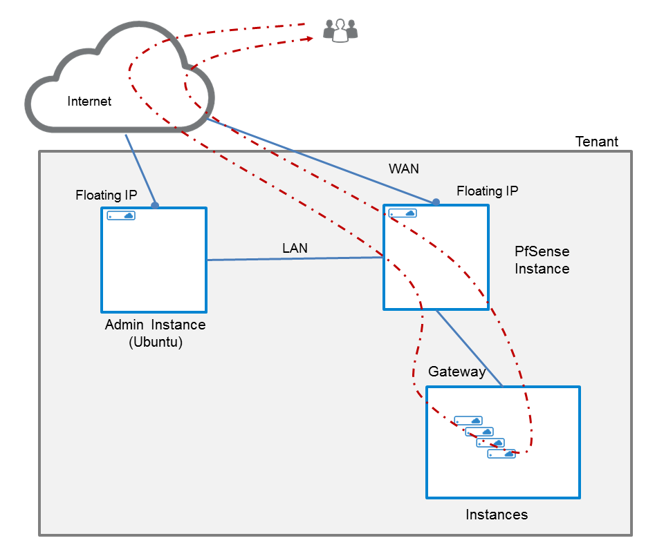
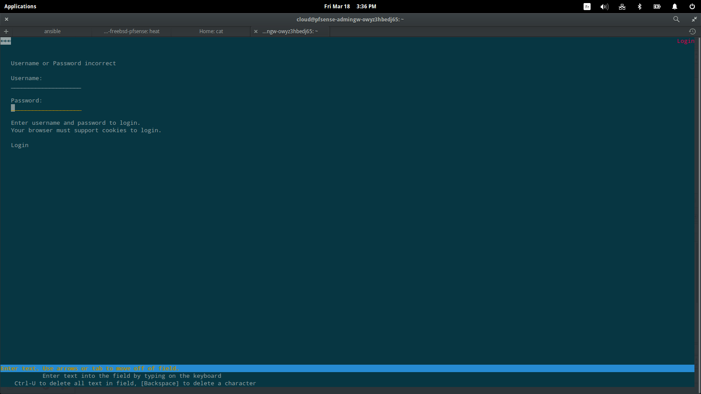
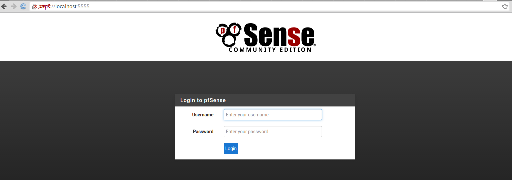
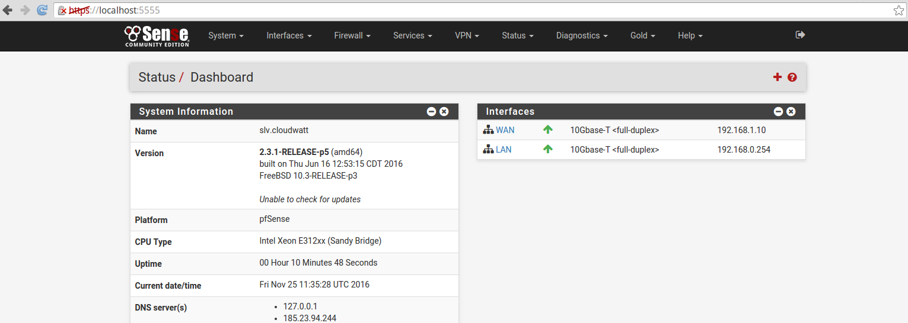
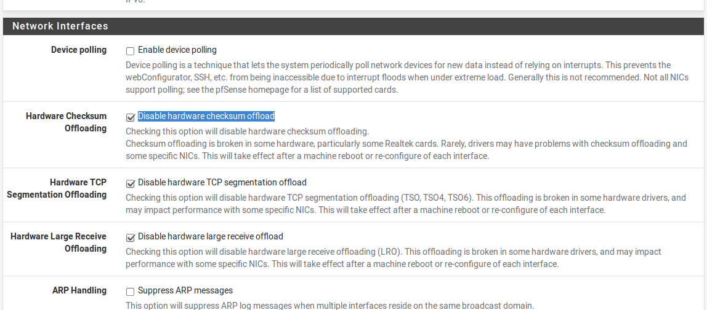

# 5 Minutes Stacks, épisode 25 : Pfsense #

## Episode 25 : Pfsense

pfSense est un routeur/pare-feu open source basé sur le système d'exploitation FreeBSD. À l'origine d'un fork de m0n0wall, il utilise le pare-feu Packet Filter, des fonctions de routage et de NAT lui permettant de connecter plusieurs réseaux informatiques.Il a pour but d'assurer la sécurité périmétrique.Il comporte l'équivalent libre des outils et services utilisés habituellement sur des routeurs professionnels propriétaires.

Cette stack va déployer 2 instances: l'une portant l'application Pfsense et la deuxième servant à l'administration de Pfsense, basée sur Ubuntu. Voici le schéma d'architecture.

## Preparations

### Les versions
  - Pfsense 2.3
  - Ubuntu Trusty 14.04

### Les pré-requis pour déployer cette stack

Ceci devrait être une routine à présent:
 * Un accès internet
 * Un shell linux
 * Un [compte Cloudwatt](https://www.cloudwatt.com/cockpit/#/create-contact) avec une [ paire de clés existante](https://console.cloudwatt.com/project/access_and_security/?tab=access_security_tabs__keypairs_tab)
 * Les outils [OpenStack CLI](http://docs.openstack.org/cli-reference/content/install_clients.html)
 * Un clone local du dépôt git [Cloudwatt applications](https://github.com/cloudwatt/applications)

### Taille de l'instance
Par défaut, le script propose un déploiement sur une instance de type "standard-1" (n2.cw.standard-1). Il existe une variété d'autres types d'instances pour la satisfaction de vos multiples besoins. Les instances sont facturées à la minute, vous permettant de payer uniquement pour les services que vous avez consommés et plafonnées à leur prix mensuel (vous trouverez plus de détails sur la [Page tarifs](https://www.cloudwatt.com/fr/produits/tarifs.html) du site de Cloudwatt).

Vous pouvez ajuster les paramètres de la stack à votre goût.

### Au fait...

Si vous n’aimez pas les lignes de commande, vous pouvez passer directement à la version ["Je lance avec la console"](#console)...

## Tour du propriétaire

Une fois le dépôt cloné, vous trouverez le répertoire `bundle-freebsd-pfsense/`

* `bundle-freebsd-pfsense.heat.yml`: Template d'orchestration HEAT, qui servira à déployer l'infrastructure nécessaire.
* `stack-get-url.sh`: Script de récupération de l'IP d'entrée de votre stack, qui peut aussi se trouver dans les parametres de sortie de la stack.

* `stack-start.sh`: Script de lancement de la stack, qui simplifie la saisie des parametres et sécurise la création du mot de passe admin.

## Démarrage

### Initialiser l'environnement

Munissez-vous de vos identifiants Cloudwatt, et cliquez [ICI](https://console.cloudwatt.com/project/access_and_security/api_access/openrc/).
Si vous n'êtes pas connecté, vous passerez par l'écran d'authentification, puis le téléchargement d'un script démarrera. C'est grâce à celui-ci que vous pourrez initialiser les accès shell aux API Cloudwatt.

Sourcez le fichier téléchargé dans votre shell et entrez votre mot de passe lorsque vous êtes invité à utiliser les clients OpenStack.

~~~ bash
 $ source COMPUTE-[...]-openrc.sh
 Please enter your OpenStack Password:
~~~

Une fois ceci fait, les outils de ligne de commande d'OpenStack peuvent interagir avec votre compte Cloudwatt.

### Ajuster les paramètres

Dans le fichier `bundle-freebsd-pfsense.heat.yml` vous trouverez en haut une section `parameters`. Afin de pouvoir déployer votre stack sans problèmes, il faut compléter l'ensemble des paramètres ci-dessous.
C'est dans ce même fichier que vous pouvez ajuster la taille des instances par les paramètres `flavor_name_fw` et `flavor_name_client`.

~~~ yaml

parameters:
  keypair_name:
    description: Keypair for IPSEC server access
    label: SSH Keypair
    type: string

  flavor_name_fw:
    default: n2.cw.standard-1
    description: Flavor to use for the deployed instance
    type: string
    label: Flavor for Pfsense
    constraints:
      - allowed_values:
        - t1.cw.tiny
        - s1.cw.small-1
        - n2.cw.standard-1
        - n2.cw.standard-2
        - n2.cw.standard-4
        - n2.cw.standard-8
        - n2.cw.standard-16
        - n2.cw.highmem-2
        - n2.cw.highmem-4
        - n2.cw.highmem-8
        - n2.cw.highmem-16
  flavor_name_client:
      default: t1.cw.tiny
      description: Flavor to use for the deployed instance
      type: string
      label: Flavor for clients and admin machine
      constraints:
        - allowed_values:
          - t1.cw.tiny
          - s1.cw.small-1
          - n2.cw.standard-1
          - n2.cw.standard-2
          - n2.cw.standard-4
          - n2.cw.standard-8
          - n2.cw.standard-16
          - n2.cw.highmem-2
          - n2.cw.highmem-4
          - n2.cw.highmem-8
          - n2.cw.highmem-16

  public_net_cidr:
    description: /24 cidr of public network
    type: string

  private_net_cidr:
    description: /24 cidr of private network
    type: string
 [...]
 ~~~
### Démarrer la stack

Dans un shell, lancer le script `stack-start.sh` en passant en paramètre le nom que vous souhaitez lui attribuer :

~~~ bash
$ ./stack-start.sh Pfsense Votre_keypair_name private_net public_net
+--------------------------------------+------------+--------------------+----------------------+
| id                                   | stack_name | stack_status       | creation_time        |
+--------------------------------------+------------+--------------------+----------------------+
| ed4ac18a-4415-467e-928c-1bef193e4f38 | Pfsense    | CREATE_IN_PROGRESS | 2016-03-16T08:29:45Z |
+--------------------------------------+------------+--------------------+----------------------+
~~~
* private_net : Adresse du réseau Lan (ex: 192.168.0.0/24)
* public_net : Adresse du réseau Wan (ex : 10.0.0.0/24)

Enfin, attendez **5 minutes** que le déploiement soit complet.

~~~bash
$ heat resource-list Pfsense
+--------------------------+---------------------------------------------------------------------------+------------------------------------+-----------------+----------------------+
| resource_name            | physical_resource_id                                                      | resource_type                      | resource_status | updated_time         |
+--------------------------+---------------------------------------------------------------------------+------------------------------------+-----------------+----------------------+
| admin_floating_ip        | 2c97b35b-5beb-4aec-b1d4-845161d956ef                                      | OS::Neutron::FloatingIP            | CREATE_COMPLETE | 2016-03-18T13:39:39Z |
| admin_sg                 | f29f1bee-ddba-4647-b172-84b4a06cfab1                                      | OS::Neutron::SecurityGroup         | CREATE_COMPLETE | 2016-03-18T13:39:40Z |
| network                  | af9e4d4c-d6ff-481a-be4e-9c454c4a4b1f                                      | OS::Neutron::Net                   | CREATE_COMPLETE | 2016-03-18T13:39:40Z |
| privatenet               | d24b9ce1-c405-414c-bc82-adcb710bcd47                                      | OS::Neutron::Net                   | CREATE_COMPLETE | 2016-03-18T13:39:40Z |
| fw_sg                    | 995c7cfc-4801-4faf-8c92-dacf601ad243                                      | OS::Neutron::SecurityGroup         | CREATE_COMPLETE | 2016-03-18T13:39:42Z |
| fw_floating_ip           | abb864b2-ca78-444a-a142-6223f1083264                                      | OS::Neutron::FloatingIP            | CREATE_COMPLETE | 2016-03-18T13:39:43Z |
| fw_postboot              | 3d4b341c-89b2-4405-9073-1438952c1166                                      | OS::Heat::SoftwareConfig           | CREATE_COMPLETE | 2016-03-18T13:39:43Z |
| fw_init                  | 09e2052d-474c-4879-8d90-109f94e98676                                      | OS::Heat::MultipartMime            | CREATE_COMPLETE | 2016-03-18T13:39:44Z |
| subnet_private           | 467c9629-4456-4f39-9b02-fa240910ac46                                      | OS::Neutron::Subnet                | CREATE_COMPLETE | 2016-03-18T13:39:44Z |
| admin_postboot           | 7b670a20-3259-4071-895c-44a37e4ea94d                                      | OS::Heat::SoftwareConfig           | CREATE_COMPLETE | 2016-03-18T13:39:46Z |
| subnet_public            | bed623b8-57d2-47fd-8da7-414ae30afb8d                                      | OS::Neutron::Subnet                | CREATE_COMPLETE | 2016-03-18T13:39:47Z |
| admin_init               | bb6de5bc-79d8-4108-a19b-1e36c705ed8d                                      | OS::Heat::MultipartMime            | CREATE_COMPLETE | 2016-03-18T13:39:49Z |
| fw_private_port          | 738ec53e-2f35-4cf0-a34e-8311ab5b387e                                      | OS::Neutron::Port                  | CREATE_COMPLETE | 2016-03-18T13:39:50Z |
| fw_public_port           | 2642a85e-1f92-4398-b136-8db010dabdb8                                      | OS::Neutron::Port                  | CREATE_COMPLETE | 2016-03-18T13:39:50Z |
| firewall                 | 94c3797e-760a-4d65-8bb4-b5ed50866b43                                      | OS::Nova::Server                   | CREATE_COMPLETE | 2016-03-18T13:39:51Z |
| admingw                  | 88aeceff-e7b8-4ada-a92e-d3dd7c5afcc2                                      | OS::Nova::Server                   | CREATE_COMPLETE | 2016-03-18T13:39:53Z |
| fw_floating_ass          | abb864b2-ca78-444a-a142-6223f1083264:2642a85e-1f92-4398-b136-8db010dabdb8 | OS::Neutron::FloatingIPAssociation | CREATE_COMPLETE | 2016-03-18T13:39:54Z |
| admingw_internet_surface | 2c97b35b-5beb-4aec-b1d4-845161d956ef-`admin_floating_ip`                         | OS::Nova::FloatingIPAssociation    | CREATE_COMPLETE | 2016-03-18T13:40:14Z |
+--------------------------+---------------------------------------------------------------------------+------------------------------------+-----------------+----------------------+

~~~
Le script `start-stack.sh` s'occupe de lancer les appels nécessaires sur les API Cloudwatt pour :

* Démarrer une instance basée sur freebsd, pré-provisionnée avec la stack pfsense.
* Démarrer une instance basée sur Ubuntu Trusty, afin de pouvoir administrer votre Pfsense et lui associer une FloatingIP que vous retrouverez via le paramètre `admin_floating_ip`.

<a name="console" />

## C’est bien tout ça, mais...

### Vous n’auriez pas un moyen de lancer l’application par la console ?

Et bien si ! En utilisant la console, vous pouvez déployer un serveur pfsense:

1.	Allez sur le Github Cloudwatt dans le répertoire [applications/bundle-freebsd-pfsense](https://github.com/cloudwatt/applications/tree/master/bundle-freebsd-pfsense)
2.	Cliquez sur le fichier nommé `bundle-freebsd-pfsense.heat.yml`
3.	Cliquez sur RAW, une page web apparaît avec le détail du script.
4.	Enregistrez-sous le contenu sur votre PC dans un fichier avec le nom proposé par votre navigateur (enlever le .txt à la fin)
5.  Rendez-vous à la section « [Stacks](https://console.cloudwatt.com/project/stacks/) » de la console.
6.	Cliquez sur « Lancer la stack », puis cliquez sur « fichier du modèle » et sélectionnez le fichier que vous venez de sauvegarder sur votre PC, puis cliquez sur « SUIVANT »
7.	Donnez un nom à votre stack dans le champ « Nom de la stack »
8.	Renseignez l'ensemble des paramètres demandés
9.	Choisissez la taille de votre instance parmi le menu déroulant « flavor_name » et cliquez sur « LANCER »

La stack va se créer automatiquement (vous pouvez en voir la progression cliquant sur son nom). Quand tous les modules deviendront « verts », la création sera terminée. Vous pourrez alors aller dans le menu « Instances » pour découvrir l’IP flottante qui a été générée automatiquement. Ne vous reste plus qu'à vous connecter en ssh avec votre keypair.

C’est (déjà) FINI !

## Enjoy
Dans cet exemple vous avez un serveur pfsense qui est connecté sur deux réseaux LAN et WAN et vous avez aussi une machine ubuntu 14.04 qui est connecté sur le même réseaux LAN que pfsense.
Vous pouvez administrer votre firewall à partir de votre machine admin (ubuntu 14.04) en tapant la commande suivante sur le terminal

~~~bash
$ lynx https://private_ip_pfsense
~~~

Pour s'authenfier vous utilisez **Username:admin** et **Password:pfsense**.

Vous pouvez installer une interface GUI sur votre machine Admin ou vous pouvez aussi utiliser une machine windows,
sinon vous pouvez créez deux tunnels ssh pour administrer pfsense à partir de votre machine local, suivez les étapes suivantes:

1) Tapez la commande suivante dans la machine Admin (ubuntu)

~~~bash
$ sudo ssh private_ip_pfsense -l root -i $YOU_KEYPAIR_PATH -L 443:localhost:443 -i private_key
~~~

Dans ce cas il faut utliser votre clé privée.

Ou

~~~bash
$ sudo ssh private_ip_pfsense -l root -L 443:localhost:443
~~~

le mot de passe de root c'est **pfsense**, je vous conseille de le changer.

2) Sur votre machine local tapez la commande suivante pour ouvrir le tunnel entre votre machine et la machine admin.

~~~bash
$ sudo ssh flotting_ip_admin -l cloud -i $YOU_KEYPAIR_PATH -L 5555:localhost:443
~~~

3) Puis vous pouvez administrer votre pfsense en tapant cet url `https://localhost:5555` dans le navigateur

avec **username:admin** et **password:pfsense**.

Maintenant vous pouvez configurer votre firewall:

Si vous rencontrez des problèmes de débit sur les instances connecté à votre PFsense, vous pouvez aller sur la page **System>Advanced>Networking**, puis cocher l'option **Disable hardware checksum offload**.

Si cela ne corrige pas le problème, nous vous rappelons que la bande passante des instances ne sont pas tous les mêmes par exemple pour avoir une bande passante égale à 800 Mb/s il faut choisir l'une de ces flavors (n1.cw.standard-4,n2.cw.standard-4,n1.cw.highcpu-4,n1.cw.highmem-4,n2.cw.highmem-4 ou i2.cw.largessd-4).
Pour connaître la bande passante de nos flavors [Cliquez-ici](https://www.cloudwatt.com/fr/produits/serveurs/tarifs.html).

------
## So watt ?

Ce tutoriel a pour but d'accélerer votre démarrage. A ce stade vous êtes maître(sse) à bord.

Vous avez un point d'entrée sur votre machine virtuelle en SSH via l'IP flottante exposée et votre clé privée (utilisateur `cloud` par défaut).

* Vous avez accès à l'interface web en https via l'adresse ip lan que vous avez défini pour Pfsense depuis le server ubuntu.

### Voici quelques sites d'informations pour aller plus loin

- https://www.pfsense.org/
- https://forum.pfsense.org

----
Have fun. Hack in peace.
