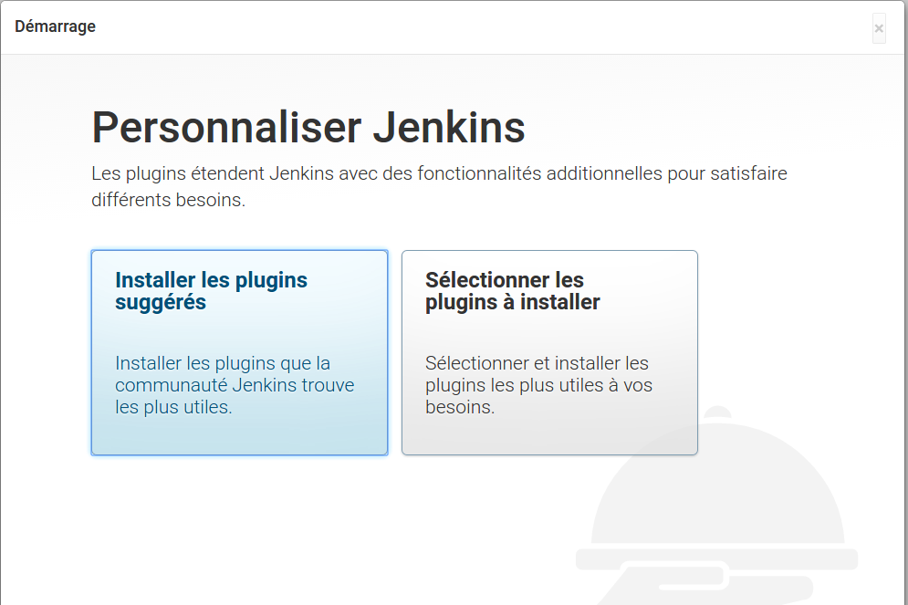
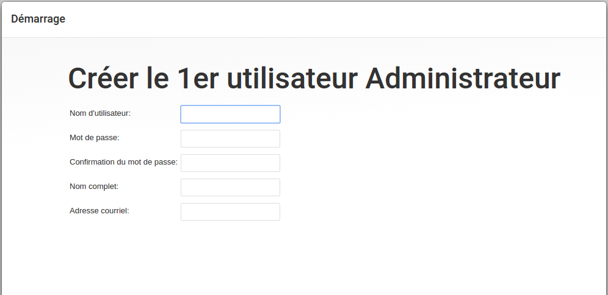
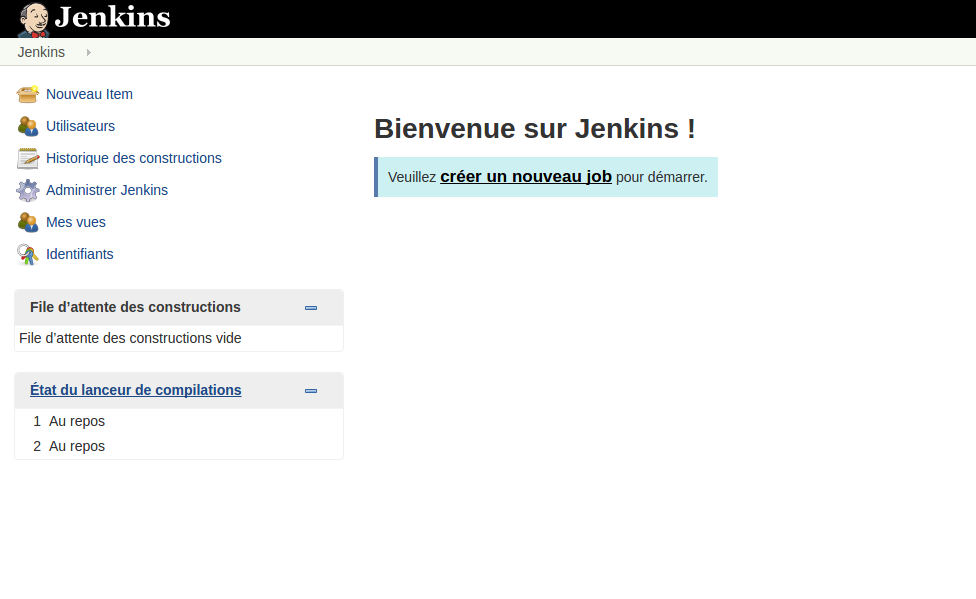
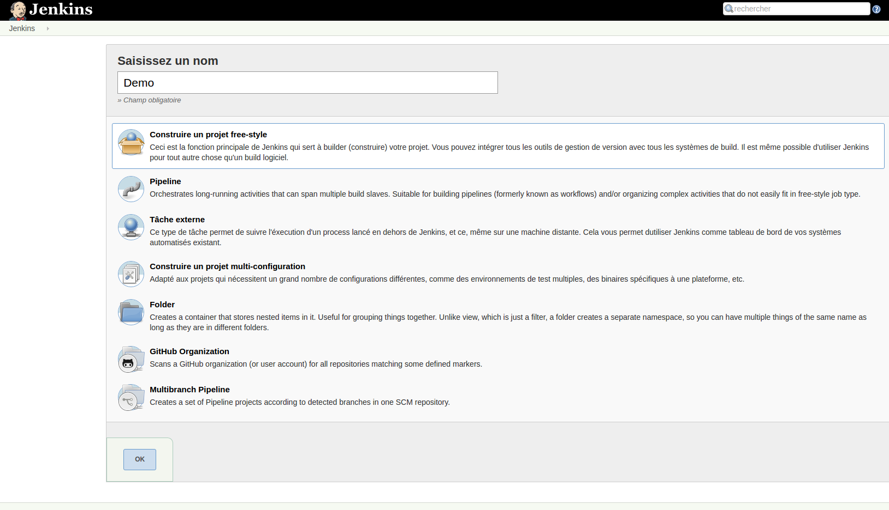
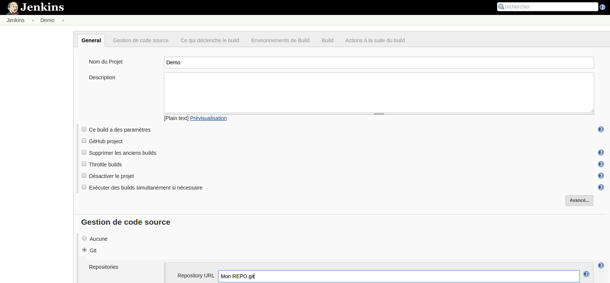
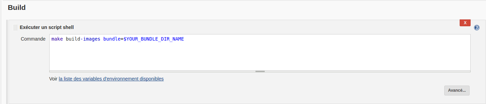

# OpenStack Image Factory

Si vous nous suivez, vous avez pu voir passer les différents épisodes des [Stacks 5
Minutes](http://dev.cloudwatt.com/fr/recherche.html?q=5+minutes+stacks&submit=submit). Nous allons passer dans
les coulisses et vous expliquer comment construire les vôtres. Suivez le guide et faites attention où vous marchez.

## L'usine

Dans chaque épisode, vous trouverez des stacks HEAT, qui s'appuient sur des images serveur différentes. Ces images
sont préparées avec une pile applicative complète, pour avoir un démarrage plus rapide.

La boîte à outils pour assembler ces images est full Open Source, simple et efficace :

* *Debian Jessie :* Comme système de référence pour l'usine.
* *Openstack CLI :* Indispensable pour interagir avec notre plate-forme
* *Packer :* Créé par Hashicorp, cet outil s'appuie sur un système de Builder et de Provisionners pour faire de l'assemblage
d'images serveurs pour différentes plates-formes, notamment Openstack.
* *Ansible :* Outil de gestion de configuration, de la même famille que Puppet, Chef ou SaltStack. Sa principale
particularité est de fonctionner sans agent.
* *Shell :* What Else ?


Pour faciliter la création de vos propres images, nous avons rassemblé notre chaîne de montage
[dans un projet Github](https://github.com/cloudwatt/os_image_factory). 

Nous vous avons également préparé une stack HEAT qui vont vous fournir un serveur de build d'image avec tous les outils nécessaires. Pour un peu
plus de confort, nous avons ajouté un serveur Jenkins dans la boîte à outils. Donc, pour démarrer votre propre usine :

* Munissez vous de :
    * votre [compte Cloudwatt](https://www.cloudwatt.com/cockpit/#/create-contact), 
    * une [paire de clés existante](https://console.cloudwatt.com/project/access_and_security/?tab=access_security_tabs__keypairs_tab)
    * Lancez la stack HEAT qui va assembler l'usine via le [OneClick](https://www.cloudwatt.com/fr/applications/) ou directement en recupérant le template Heat sur [le github de Cloudwatt](https://github.com/cloudwatt/os_image_factory/tree/master/setup) 

Le provisionning de ce serveur se fait en partant d'une image dites **bundle** avec l'ensemble des outils necessaires. Pour minimiser les risques, nous avons pris le parti de n'autoriser que des connexions via SSH. Pour accéder au Jenkins de l'usine, il faut donc établir
un tunnel SSH avec forward de port, entre votre machine et le serveur de la stack :

```
ssh $FACTORY_IP -l cloud -i $YOU_KEYPAIR_PATH -L 8080:localhost:8080
```

Vous devriez pouvoir accéder au Jenkins de l'usine en cliquant [ici](http://localhost:8080)

Pour finaliser l'installation, une opération manuelle est nécessaire. Vous devez aller manuellement chercher le contenu du fichier  ```/var/lib/jenkins/secrets/initialAdminPassword``` via la connexion SSH lors de la première initialisation.

```
sudo cat /var/lib/jenkins/secrets/initialAdminPassword
```

Installer les plugins suggéré
 
 
 
Entrez à présent vos informations qui serviront à sécuriser votre jenkins. Pour rappel celui-ci a connaissance de vos indentifiants Cloudwatt et est donc capable de piloter votre tenant.
 
 
Jenkins est à présent initialisé.
  
Avant tout commençons par découvrir la chaine d'assemblage afin de maitriser le processus de bout en bout.
   
## La chaîne d'assemblage
 
Sur le github de [Cloudwatt](https://github.com/cloudwatt/os_image_factory) vous trouverez l'ensemble de nos scripts. 
Dans le répertoire ```images/``` vous trouverez 4 fichiers, génériques pour toutes les images à assembler :
 
 * ```ansible_local_inventory``` : fichier de définition de groupe Ansible, injecté par Packer dans les images à
 provisionner, pour permettre à Ansible de cibler le serveur.
 * ```build.packer.json``` : fichier de build Packer. Il prend des paramètres qui lui seront fournis par le playbook
 de pilotage de build.
 * ```build.playbook.yml``` : playbook Ansible de pilotage de build.
 * ```build.sh``` : Micro script shell pour faciliter l'utilisation du playbook de build
 
Les répertoires placés sous ```images/``` sont des exemples de build. Pour écrire les vôtres, il vous suffit de respecter la norme suivante :
 
 ```
 images/
     my_bundle/      # <-- répertoire du build
         ansible/
             bootstrap.yml       # <-- playbook de provisionning du serveur
         output/
             my_stack_heat.yml.j2    # <-- template à générer à la fin du build, couramment une stack HEAT
         build-vars.yml          # <-- variables de description du build, exploité par Packer et le playbook de pilotage
 ```
 
Les templates que vous placez dans le répertoire output de votre bundle seront interprétés par le playbook de pilotage
de build. Nous l'utilisons pour générer des stacks HEAT en insérant au bon endroit l'ID de l'image serveur créée en cours de build :
 
 ```
 server:
     type: OS::Nova::Server
     properties:
       key_name: { get_param: keypair_name }
       image: {{ result_img_id }}                <-- result_img_id entre moustache sera remplacé
       flavor: { get_param: flavor_name }            par l'id de la nouvelle image serveur
       networks:
 ```
 
Le fichier ```build-vars.yml``` contient les variables fournies au playbook de pilotage de build. Dans sa
plus simple expression, voici un exemple :
 
```
 bundle:
   name: bundle-trusty-lamp                          # <-- le nom de votre image
   img_base: ae3082cb-fac1-46b1-97aa-507aaa8f184f    # <-- l'id glance de l'image de base à utiliser
   properties:                                       # <-- les propriétés que vous souhaitez voir
     img_os: Ubuntu                                  #     appliquées sur l'image finale provisionnée
     cw_bundle: LAMP
     cw_origin: Cloudwatt
     hw_cpu_max_sockets: 1
     hw_rng_model :virtio     
 
``` 
 
Maintenant que vous avez connaissance de l'ensemble des la chaine de montage d'un image, vous pouvez vous lancer dans la construction de votre propre image bundle.
 
## Fabrication image Bundle
**1.** Assurez-vous d'avoir fait un copie du dếpot **os_image_factory** vers un dépôt Git distant; Github, Bitbucket, tout ce que vous utilisez.

**2.** Cliquez sur **"Créer un nouveau job"**
 
 
 
**3.** Choisissez de faire un projet de type **free-style**
 
 
 
**4.** Donnez maintenant un nom à votre projet, puis spécifiez le repos github à cloner pour lancer le build de votre image.
 
 
 
**5.** Configurez maintenant la commande à exécuter pour lancer votre build, si vous avez cloner notre repos [OS_image_factory](https://github.com/cloudwatt/os_image_factory.git)

**6.** En fin de page, choisissez **Exécuter un script shell** sous **Build**, puis saisissez les éléments suivants (remplacez `$ BUNDLE_DIR_NAME`):
 
```
make build-images bundle=$YOUR_BUNDLE_DIR_NAME
```
```$YOUR_BUNDLE_NAME``` doit correspondre au nom du répertoire sous ```images/``` dans lequel vous avez créé votre
 bundle.
 
  
**7.** Sélectionnez **Archiver les artefacts** sous **Ajouter une action post-build** et saisir ```packer.latest.log, images/target/$BUNDLE_DIR_NAME/output/*``` . Cela n'est pas obligatoire, mais ca vous empêchera d'avoir des problèmes à générer le template HEAT ou les logs du playbook. En outre, les outputs sont enregistrés à chaque lancement de projet, ce qui signifie que vous pourrez retrouver les logs de vos anciennes actions.

**8.**  Lancez maintenant votre projet
 
## Fabrication d'image OS  
 
La factory nous sert aussi à fabriquer nos propres images d'OS que l'on propose aux clients de cloudwatt.
Vous trouverez l'ensemble des scripts de création dans le répertoire **OS** sur le repo github [OS_image_factory](https://github.com/cloudwatt/os_image_factory.git)
 
La démarche pour fabriquer une image OS et image image bundle est là même, c'est juste la commande à lancer qui est un peu différente car effectivement il faut télécharger l'image au format QCOW2 et l'uploader dans votre glance avant de lancer le build. 
Voici comment faire, vous pouvez démarrer un build en lançant la commande suivante :
 
```
make build-os os=$OS_DIR_NAME
```


Si vous avez regardé le script ```build.sh``` qui se trouve dans chaque répertoire des OS, vous avez pu remarqué qu'une suite de test unitaire était lancé afin de tester l'image dans notre environnement Openstack.
Celle ci est ecrite en Python et vous retrouverez l'ensemble des scripts dans le répertoire **test-tools/pytesting_os**.
Pour information rien ne vous empeche d'ajouter vos propres tests ou de modifier les notres si besoin.


## L'entrepôt

Lors d'un build, deux outputs sont attendus :

* Les images serveurs elles-mêmes, qui atterrissent dans votre catalogue d'images privées Glance. L'ID de l'image
assemblée est visible dans les traces d'exécution du script ```build.sh```.

* Les sorties des templates placés dans votre répertoire output : Une fois interprétés, ils sont placés dans le
répertoire **images/target/my_bundle/output**.

## Voici les clés

Le squelette est posé et la boite à outils rôdée. Si vous souhaitez faire vos propres réalisations, prenez exemple
sur les builds présents dans le repository, approfondissez [Ansible](http://docs.ansible.com/ansible/index.html), ou hackez
le ```build.packer.json``` pour utiliser plutôt Puppet ou Chef.

Nous espérons que cela pourra vous servir pour bâtir vos propres architectures dans le futur.

-------
Have fun. Hack in peace.