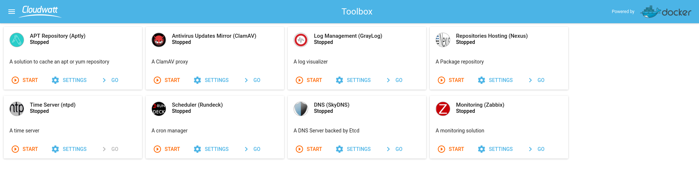
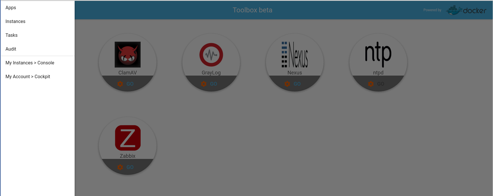
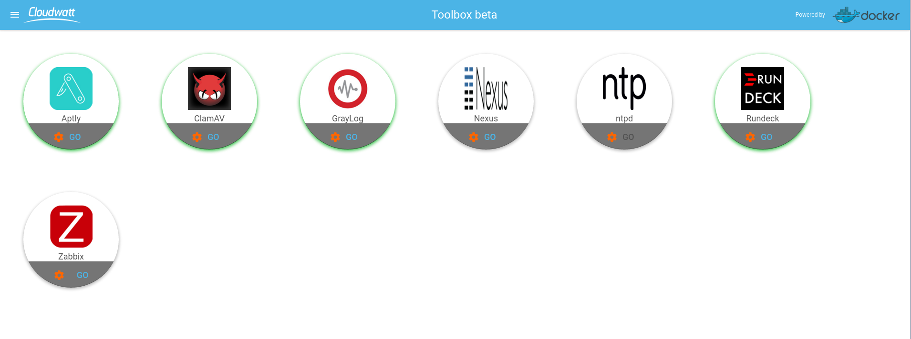
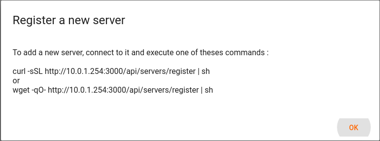
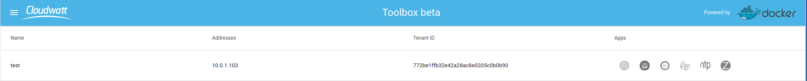
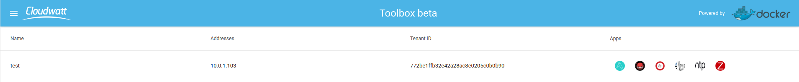
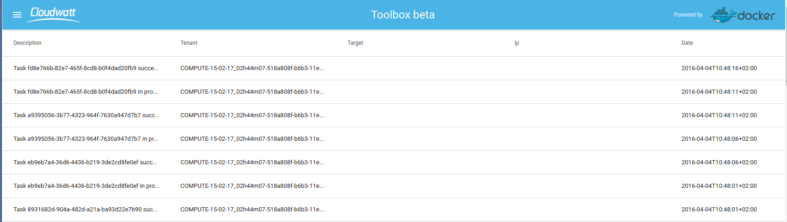

# 5 Minutes Stacks, épisode 26 : Toolbox #

## Episode 26 : Toolbox


La toolbox est une stack différente de tout ce qu'on a pu faire jusqu'à présent. Celle-ci a pour but de vous apporter un ensemble d'outils afin d'unifier, d'harmoniser et monitorer votre/vos tenant(s).En effet celle-ci renferme un lot d'applications qui a pour vocation de vous aider dans la gestion de vos instances.

Cette toolbox a entièrement été développée par l'équipe CAT (Cloudwatt Automation Team). L'interface utilisateur est faite en technologie react; elle repose sur une instance CoreOS et l'ensemble des applications se déploie via des conteneurs Docker. De plus depuis l'interface vous pouvez installer ou configurer l'ensemble des applications sur vos instances via des playbooks Ansible.

Afin de sécuriser au maximum cette toolbox aucun port n'est exposé sur internet mis à part le port 22 afin de pouvoir récupérer un fichier de configuration Openvpn. Cette méthode est expliquée plus bas dans l'article.


## Preparations

### Les versions

  - CoreOS Stable 899.13.0
  - Docker 1.10.3
  - Zabbix 3.0
  - Rundeck 2.6.2
  - Graylog 1.3.4
  - Nexus 2.12.1-01
  - Nginx 1.9.12
  - Aptly  0.9.6
  - SkyDNS 2.5.3a
  - Etcd 2.0.3

### Les pré-requis pour déployer cette stack

Ceci devrait être une routine à présent:
 * Un accès internet
 * Un shell linux
 * Un [compte Cloudwatt](https://www.cloudwatt.com/cockpit/#/create-contact) avec une [ paire de clés existante](https://console.cloudwatt.com/project/access_and_security/?tab=access_security_tabs__keypairs_tab)
 * Les outils [OpenStack CLI](http://docs.openstack.org/cli-reference/content/install_clients.html)
 * Un clone local du dépôt git [Cloudwatt applications](https://github.com/cloudwatt/applications)
 * Un client [Openvpn](https://openvpn.net/)

### Taille de l'instance
Par défaut, le script propose un déploiement sur une instance de type "standard-4" (n2.cw.standard-4). Il existe une variété d'autres types d'instances pour la satisfaction de vos multiples besoins. Les instances sont facturées à la minute, vous permettant de payer uniquement pour les services que vous avez consommés et plafonnées à leur prix mensuel (vous trouverez plus de détails sur la [Page tarifs](https://www.cloudwatt.com/fr/produits/tarifs.html) du site de Cloudwatt).

Vous pouvez ajuster les paramètres de la stack à votre goût.

### Au fait...

Si vous n’aimez pas les lignes de commande, vous pouvez passer directement à la version ["Je lance avec la console"](#console)...

## Tour du propriétaire

Une fois le dépôt cloné, vous trouverez le répertoire `bundle-toolbox/`

* `bundle-toolbox.heat.yml`: Template d'orchestration HEAT, qui servira à déployer l'infrastructure nécessaire.

## Démarrage

### Initialiser l'environnement

Munissez-vous de vos identifiants Cloudwatt, et cliquez [ICI](https://console.cloudwatt.com/project/access_and_security/api_access/openrc/).
Si vous n'êtes pas connecté, vous passerez par l'écran d'authentification, puis le téléchargement d'un script démarrera. C'est grâce à celui-ci que vous pourrez initialiser les accès shell aux API Cloudwatt.

Sourcez le fichier téléchargé dans votre shell et entrez votre mot de passe lorsque vous êtes invité à utiliser les clients OpenStack.

 ~~~ bash
 $ source COMPUTE-[...]-openrc.sh
 Please enter your OpenStack Password:

 ~~~

Une fois ceci fait, les outils de ligne de commande d'OpenStack peuvent interagir avec votre compte Cloudwatt.

### Ajuster les paramètres

Dans le fichier `bundle-toolbox.heat.yml` vous trouverez en haut une section `parameters`. Cette stack à besoin de l'ensemble de vos informations utilisateur afin de pouvoir interagir avec l'ensemble de vos instances qui seront connecté au *routeur* de cette Toolbox.

**Un conseil** : Afin que la toolbox n'ait pas l'ensemble des droits sur votre tenant, vous pouvez lui créer un compte avec des droits restreint. Un compte avec les droits de lecture suffit (TENANT_SHOW).
C'est dans ce même fichier que vous pouvez ajuster la taille de l'instance par le paramètre `flavor`. Afin de ne pas avoir de problème nous vous conseillons d'utiliser une instance de type "standard-4".

~~~ yaml
heat_template_version: 2013-05-23


description: CoreOS stack for Cloudwatt


parameters:
  keypair_name:
    description: Keypair to inject in instance
    label: SSH Keypair
    type: string

  os_username:
    description: OpenStack Username
    label: OpenStack Username
    type: string

  os_password:
    description: OpenStack Password
    label: OpenStack Password
    type: string

  os_tenant:
    description: OpenStack Tenant Name
    label: OpenStack Tenant Name
    type: string

  os_auth:
    description: OpenStack Auth URL
    default: https://identity.fr1.cloudwatt.com/v2.0
    label: OpenStack Auth URL
    type: string


  flavor_name:
    default: n2.cw.standard-4
    description: Flavor to use for the deployed instance
    type: string
    label: Instance Type (Flavor)
    constraints:
      - allowed_values:
          - s1.cw.small-1
          - n2.cw.standard-1
          - n2.cw.standard-2
          - n2.cw.standard-4
          - n2.cw.standard-8
          - n2.cw.standard-12
          - n2.cw.standard-16

 ~~~
### Démarrer la stack

Dans un shell, lancer le script `stack-start.sh` en passant en paramètre le nom que vous souhaitez lui attribuer :

~~~ bash
$ ./stack-start.sh Toolbox
+--------------------------------------+------------+--------------------+----------------------+
| id                                   | stack_name | stack_status       | creation_time        |
+--------------------------------------+------------+--------------------+----------------------+
| ed4ac18a-4415-467e-928c-1bef193e4f38 | Toolbox    | CREATE_IN_PROGRESS | 2016-03-24T08:29:45Z |
+--------------------------------------+------------+--------------------+----------------------+
~~~

Enfin, attendez **5 minutes** que le déploiement soit complet.

~~~bash
$ heat resource-list Toolbox
+-------------------+-------------------------------------------------------------------------------------+---------------------------------+-----------------+----------------------+
| resource_name     | physical_resource_id                                                                | resource_type                   | resource_status | updated_time         |
+-------------------+-------------------------------------------------------------------------------------+---------------------------------+-----------------+----------------------+
| floating_ip       | c683dbfa-3c9a-4cd6-a38d-2839fb203e9c                                                | OS::Neutron::FloatingIP         | CREATE_COMPLETE | 2016-03-15T10:34:01Z |
| network           | b87a5d95-61fb-4586-ba1c-d531d2f638c9                                                | OS::Neutron::Net                | CREATE_COMPLETE | 2016-03-15T10:34:02Z |
| security_group    | 8d7745dd-c517-461a-bf57-b95cc1fcbeba                                                | OS::Neutron::SecurityGroup      | CREATE_COMPLETE | 2016-03-15T10:34:02Z |
| router            | b0977098-3fa4-461a-9a79-6715d3604822                                                | OS::Neutron::Router             | CREATE_COMPLETE | 2016-03-15T10:34:03Z |
| subnet            | 7f531a2c-4a3e-41d3-aa33-64396cb5f2d2                                                | OS::Neutron::Subnet             | CREATE_COMPLETE | 2016-03-15T10:34:04Z |
| ports             | ab7791ee-3a07-4cc3-9a3b-da7cc53fb8aa                                                | OS::Neutron::Port               | CREATE_COMPLETE | 2016-03-15T10:34:09Z |
| toolbox_interface | b0977098-3fa4-461a-9a79-6715d3604822:subnet_id=7f531a2c-4a3e-41d3-aa33-64396cb5f2d2 | OS::Neutron::RouterInterface    | CREATE_COMPLETE | 2016-03-15T10:34:09Z |
| server            | f45d47a2-9686-44a9-9634-22d6012ef497                                                | OS::Nova::Server                | CREATE_COMPLETE | 2016-03-15T10:34:11Z |
| floating_ip_link  | c683dbfa-3c9a-4cd6-a38d-2839fb203e9c-84.39.44.44                                    | OS::Nova::FloatingIPAssociation | CREATE_COMPLETE | 2016-03-15T10:34:34Z |
+-------------------+-------------------------------------------------------------------------------------+---------------------------------+-----------------+----------------------+

~~~
Le script `start-stack.sh` s'occupe de lancer les appels nécessaires sur les API Cloudwatt pour :

* démarrer une instance basée sur coreos,
* lancer le conteneur **toolbox**
* lancer le conteneur **SkyDNS**

## C’est bien tout ça, mais...

### Vous n’auriez pas un moyen de lancer l’application par la console ?

Et bien si ! En utilisant la console, vous pouvez déployer la Toolbox:

1.	Allez sur le Github Cloudwatt dans le répertoire [applications/bundle-toolbox](https://github.com/cloudwatt/applications/tree/master/bundle-trusty-cozycloud)
2.	Cliquez sur le fichier nommé `bundle-toolbox.heat.yml`
3.	Cliquez sur RAW, une page web apparait avec le détail du script
4.	Enregistrez-sous le contenu sur votre PC dans un fichier avec le nom proposé par votre navigateur (enlever le .txt à la fin)
5.  Rendez-vous à la section « [Stacks](https://console.cloudwatt.com/project/stacks/) » de la console.
6.	Cliquez sur « Lancer la stack », puis cliquez sur « fichier du modèle » et sélectionnez le fichier que vous venez de sauvegarder sur votre PC, puis cliquez sur « SUIVANT »
7.	Donnez un nom à votre stack dans le champ « Nom de la stack »
8.	Entrez votre keypair dans le champ « keypair_name »
9.  Donner l'ensemble des informations du compte pouvant accéder à votre tenant,
10.	Choisissez la taille de votre instance parmi le menu déroulant « flavor_name » et cliquez sur « LANCER »

La stack va se créer automatiquement (vous pouvez en voir la progression cliquant sur son nom). Quand tous les modules deviendront « verts », la création sera terminée. Ne vous reste plus qu'à récupérer le fichier de configuration **Openvpn** `cloud.ovpn`.

```bash
scp -i ~/.ssh/your_keypair core@FloatingIP:cloud.ovpn .
```
Si celui-ci n'est pas disponible, attendez **2 minutes** que l'ensemble de la stack soit disponible.
Une fois cette opération réalisée ajoutez le fichier de configuration à votre client openvpn et connectez-vous à votre toolbox.

C’est (déjà) FINI !

### Vous n’auriez pas un moyen de lancer l’application en 1-clic ?

Bon... en fait oui ! Allez sur la page [Applications](https://www.cloudwatt.com/fr/applications/index.html) du site de Cloudwatt, choisissez l'appli, appuyez sur DEPLOYER et laisser vous guider... 2 minutes plus tard un bouton vert apparait... ACCEDER : vous avez votre toolbox !

## Enjoy

Une fois connecté au VPN sur la stack vous avez maintenant accès à l'interface d'administration via l'url *http://manager*. L'accès a l'interface et aux différentes applications se fait via des nom **DNS**. En effet un conterneur **SkyDNS** est lancé au démarrage ce qui vous permet de bénéficier de l'ensemble des noms courts mis en place. Vous pourrez accéder aux différentes interface web des applications en cliquant sur **Go** ou via une requête URL (ex : http://zabbix/).

#### Présentation de l'interface :

Voici l'accueil de la toolbox, chaque vignette représente une application prête à être lancée. Afin d'être le plus scalable et flexible possible, l'ensemble des applications de cette toolbox sont des conteneurs (Docker).



Un menu est présent en haut en gauche de la page, il permet de vous déplacer dans les différentes séctions de la toolbox, je vais vous les détailler par la suite.



Les **tasks** servent à avoir un suivi des actions effectuées sur la toolbox.


L'ensemble des conteneurs présent peuvent être paramétrés grace au bouton **Settings**  présent sur chaque vignette.


 Comme vous pouvez le constater, nous les avons séparés en différentes section.
 

Dans la section **Infos** vous allez retrouver une présentation de l'application avec quelques liens utile sur l'application concerné.


Dans la section **Environnements** vous pouvez ici inscrire l'ensemble des paramètres qui serviront à configurer les variables d'environnement du conteneur à son lancement.


Dans la section **Paramètres** vous pouvez ici inscrire l'ensemble des paramètres de configuration des diffèrentes applications.


Afin d'identifier les applications lancées nous avons mis en place un code couleur. Une application démarrée sera entourée d'un halo vert.


#### Ajouter des instances à ma Toolbox :

Afin d'ajouter des instances à la toolbox 2 choses sont à penser :

  * Attacher votre instance au routeur de la toolbox
  * Lancer le script d'attachement

*Attacher son instance au routeur de l'instance:*

 ~~~bash
 $ neutron router-interface-add $Toolbox_ROUTER_ID $Instance_subnet_ID
 ~~~

Vous retrouverez l'ensemble des informations en inspectant les ressources de la stack via la commande heat suivante :

~~~bash
$ heat resource-list $stack_name
~~~

Un fois ceci effectué vous êtes maintenant dans la capacité d'ajouter votre instance à la toolbox afin de l'instrumentaliser.

*Lancer le script d'attachement :*

Aller dans le menu **instance** et cliquer le bouton  en bas a droite.

Vous devez avoir 2 commandes, un **Curl** et un **Wget** sélectionnez *celle de votre choix* et copier là sur l'instance à instrumentaliser.



Une fois le script appliqué sur l'instance choisie celle-ci doit apparaitre dans le menu **instance** de votre toolbox.



Comme vous pouvez le voir, l'ensemble des logos des applications de la toolbox sont grisés.

Afin de vous aider au maximum nous avons créé des playbooks Ansible afin de pouvoir installer et configurer automatiquement les agents des différentes applications.

Pour cela il suffit de cliquer sur la ou les application(s) que vous souhaitez installer sur votre machine. Le playbook Ansible concerné va s'installer automatiquement.

Une fois l'application installer le logo de l'application passe en couleur, ce qui vous permet d'avoir un suivi des applications installées sur vos instances.



il vous ait possible d'annuler une taches en attente en cas d'erreur dans le menu **tasks** en cliquant sur  ce qui vous affichera ensuite ce logo .

Nous avons aussi mis en place une section **d'audit** afin que vous puissiez voir l'ensemble de actions effectuées sur chacune de vos instances.



Toujours de le but de vous aider au maximum nous avons intégré 2 liens dans le menu de la toolbox **My Instances** et **My Account**, ils servent respectivement à accéder à vos instances via la console cloudwatt et à accéder la gestion de votre compte via la console Cockpit.

## Entrée dans la matière

Dans cette section je vais vous présenter les différentes applications de cette Toolbox.

* **Aptly** : C'est un gestionnaire de paquet *APT*. Il permet de faire un miroir d'un répetoire APT exposé sur internet afin de pouvoir le distribuer à l'ensemble des machines de votre tenant qui elles n'ont pas forcement accès à internet via un serveur Nginx. Pour aller plus loin voici quelque liens utiles:
    * https://www.aptly.info/
    * http://korben.info/aptly-loutil-ultime-pour-gerer-vos-depots-debian.html/


* **ClamAV** : Celui-ci est un serveur Ngnix. Un script **CRON** va s'exécuter chaque jour afin d'aller chercher la dernière définition des virus distribué par ClamAV et ensuite le paquet récupéré sera exposé à vos instance via Ngnix. Ce qui vous permettra d'avoir des clients **ClamAV** à jour sans que vos instances n'aient accès à internet.
Pour aller plus loin voici quelque liens utiles:
  * https://www.clamav.net/documents/private-local-mirrors
  * https://github.com/vrtadmin/clamav-faq/blob/master/mirrors/MirrorHowto.md


* **Graylog**: C'est une plateforme open source de gestion de logs capable de manipuler et présenter les données à partir de pratiquement n'importe quelle source. Ce conteneur est celui proposer officiellement par les équipes Graylog.
  * L'interface graphique web de Graylog est un outil puissant qui permet à quiconque de manipuler la totalité de ce que Graylog a à offrir grâce à cette application Web intuitive et attrayante.
  * Le cœur de Graylog est son moteur. Le serveur Graylog interagit avec tous les autres composants à l'aide d'interfaces API REST de sorte que chaque composant du système peut être adapté sans pour autant compromettre l'intégrité du système dans son ensemble.
  * Des résultats de recherche en temps réel quand vous les voulez et comment vous les voulez: Graylog est en mesure de vous fournir ceci grâce à la puissance éprouvée d'ElasticSearch. Les nœuds ElasticSearch donnent à Graylog la vitesse qui en fait un vrai plaisir à utiliser.

  Bénéficiant de cette architecture impressionnante ainsi que d'une vaste bibliothèque de plugins, Graylog se place comme une solution solide et polyvalente de gestion des logs.

  Pour aller plus loin voici quelque liens utiles:
  * https://www.graylog.org/
  * http://docs.graylog.org/en/1.2/pages/getting_started.html#get-messages-in
  * http://docs.graylog.org/en/1.3/pages/architecture.html
  * https://www.elastic.co/products/elasticsearch
  * https://docs.mongodb.org/manual/tutorial/install-mongodb-on-ubuntu/


* **Nexus**: Nexus est une application pouvant exposer n'importe quel type de répertoire via un serveur Ngnix. Ici notre volonté est de vous proposer une application pouvant exposer un répertoire YUM à l'ensemble de vos instances.

  Pour aller plus loin voici quelque liens utiles:
  * https://books.sonatype.com/nexus-book/reference/index.html
  * https://books.sonatype.com/nexus-book/reference/yum-configuration.html


* **Ntp**: Le conteneur NTP est ici utiliser afin que l'ensemble de vos instances n'ayant pas accès à internet puissent être à la même heure.

  Pour aller plus loin voici quelque liens utiles:
  * http://www.pool.ntp.org/fr/


* **Rundeck**: L'application Rundeck va vous permettre de programmer et d'organiser l'ensemble des jobs que vous voulez déployer régulièrement sur l'ensemble de votre tenant via son interface web. Dans notre cas nous avons voulu vous donner la possibilité de mettre en place un script vous permettant de sauvegarder vos serveurs comme nous l'avons vu dans le cadre du *bundle* Duplicity.

  Pour aller plus loin voici quelque liens utiles:
  * http://rundeck.org/
  * http://blog.admin-linux.org/administration/rundeck-ordonnanceur-centralise-opensource-vient-de-sortir-sa-v2-0
  * http://dev.cloudwatt.com/fr/blog/5-minutes-stacks-episode-vingt-trois-duplicity.html


* **Zabbix**: Zabbix est un logiciel libre permettant de surveiller l'état de divers services réseau, serveurs et autres matériels réseau; et produisant des graphiques dynamiques de consommation des ressources. Zabbix utilise MySQL, PostgreSQL ou Oracle pour stocker les données. Selon l'importance du nombre de machines et de données à surveiller, le choix du SGBD influe grandement sur les performances. Son interface web est écrite en PHP et fourni une vision temps réel sur les métriques collectées.

    Pour aller plus loin voici quelque liens utiles:
  * http://www.zabbix.com/
  * https://www.zabbix.com/documentation/3.0/start


## So watt  ?

Ce tutoriel a pour but d'accélerer votre démarrage. A ce stade vous êtes maître(sse) à bord.

Vous avez un point d'entrée sur votre machine virtuelle en SSH via l'IP flottante exposée et votre clé privée (utilisateur `core` par défaut).

* Récupérer le fichier de configuration openvpn sur l'instance de la toolbox.

* Une fois connecté en VPN à la toolbox, vous avez acces à l'interface web via l'url http://manager.

* Voici quelques sites d'informations avant d'aller plus loin :
  -
