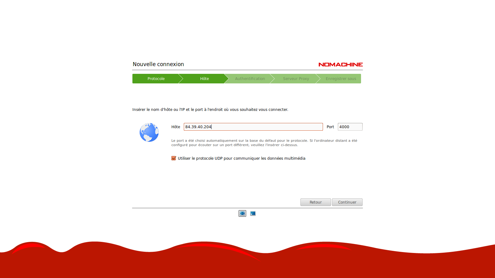
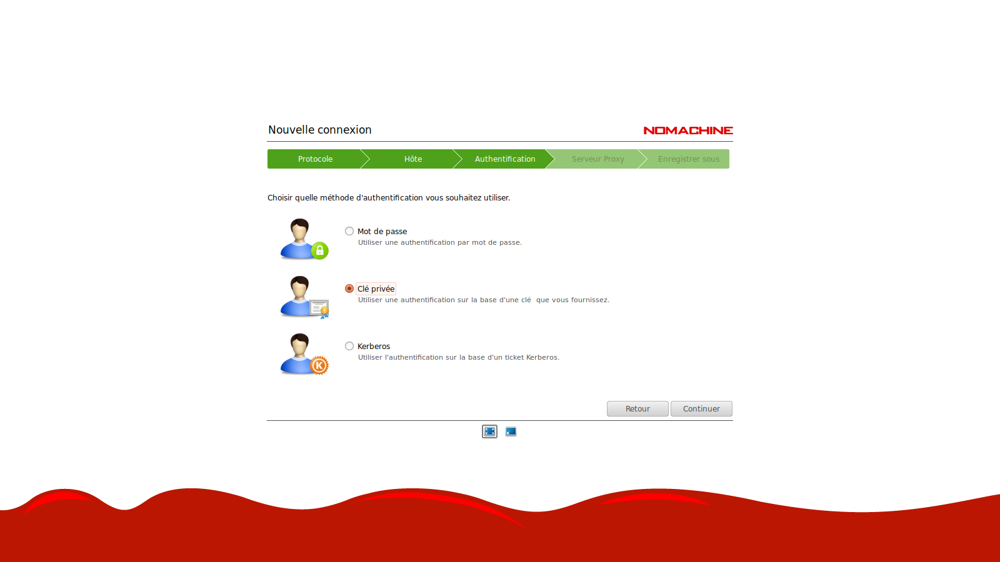
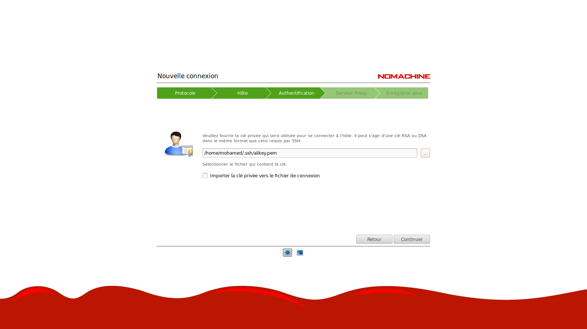
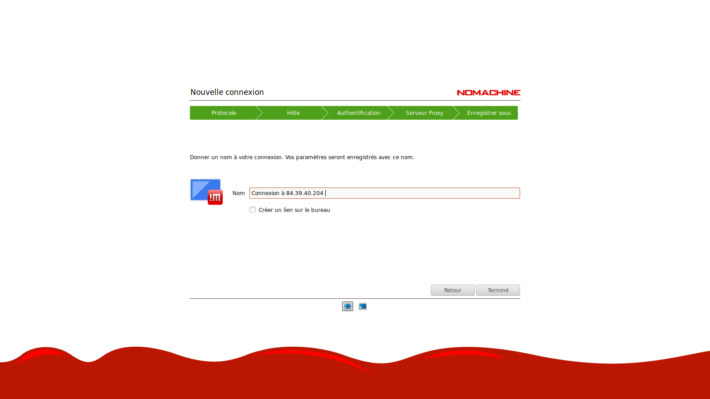
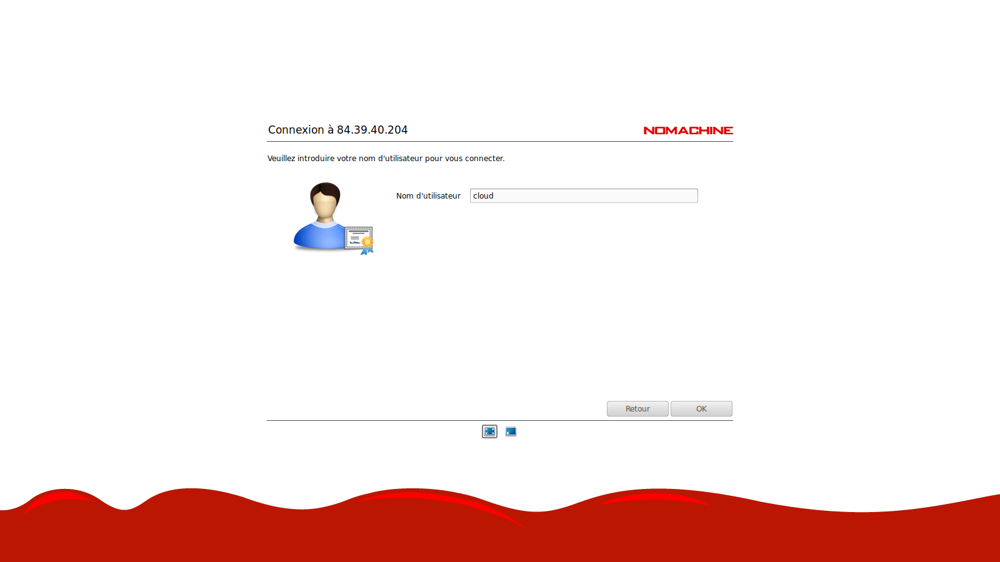
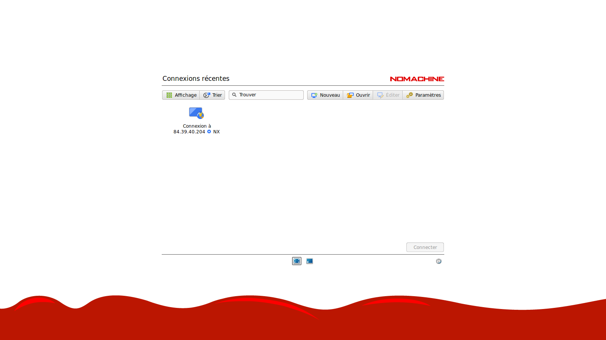
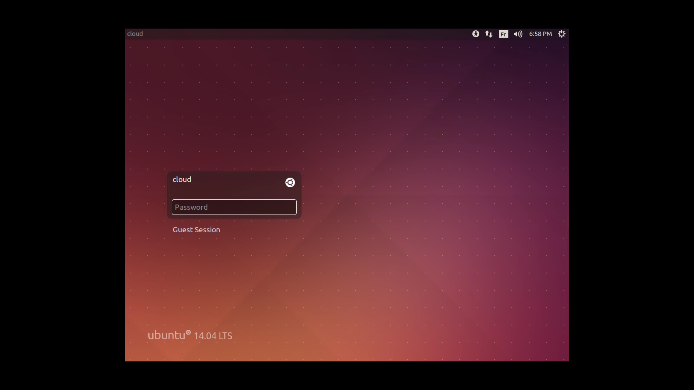
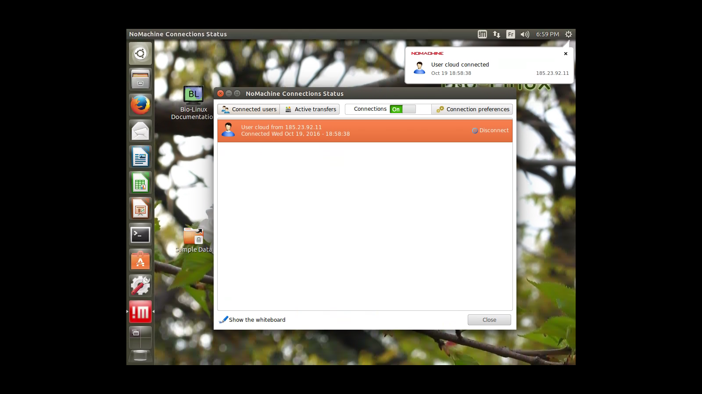

# 5 Minutes Stacks, épisode 39 : BioLinux 8 #

## Episode 39 : BioLinux 8

Bio-Linux 8 est une plate-forme puissante bioinformatique libres, poste de travail qui peut être installé sur quoi que ce soit à partir d'un ordinateur portable à un gros serveur, ou courir comme une machine virtuelle. Bio-Linux 8 ajoute plus de 250 paquets de bioinformatique à une base LTS Ubuntu Linux 14.04, fournissant environ 50 applications graphiques et plusieurs centaines d'outils de ligne de commande. L'environnement Galaxy pour l'analyse basée sur le navigateur des données et la construction de workflow est également incorporé dans Bio-Linux 8.

### Les versions

* BioLinux 8
* Vous trouverez la liste des packages dans cette [page](http://environmentalomics.org/bio-linux-software-list/)

### Les pré-requis pour déployer cette stack

* un accès internet
* un shell Linux
* un [compte Cloudwatt](https://www.cloudwatt.com/cockpit/#/create-contact), avec une [paire de clés existante](https://console.cloudwatt.com/project/access_and_security/?tab=access_security_tabs__keypairs_tab)
* les outils [OpenStack CLI](http://docs.openstack.org/cli-reference/content/install_clients.html)
* un clone local du dépôt git [Cloudwatt applications](https://github.com/cloudwatt/applications)

### Taille de l'instance
Par défaut, le script propose un déploiement sur une instance de type "Standard" (n1.cw.standard-1). Il
existe une variété d'autres types d'instances pour la satisfaction de vos multiples besoins. Les instances sont facturées à la minute, vous permettant de payer uniquement pour les services que vous avez consommés et plafonnées à leur prix mensuel (vous trouverez plus de détails sur la [Page tarifs](https://www.cloudwatt.com/fr/produits/tarifs.html) du site de Cloudwatt).

Vous pouvez ajuster les parametres de la stack à votre goût.

### Au fait...

Si vous n’aimez pas les lignes de commande, vous pouvez passer directement à la version ["Je lance avec la console"](#console)...

## Tour du propriétaire

Une fois le dépôt cloné, vous trouverez le répertoire `bundle-trusty-biolinux/`

* `bundle-trusty-biolinux.heat.yml`: Template d'orchestration HEAT, qui servira à déployer l'infrastructure nécessaire.
* `stack-start.sh`: Scipt de lancement de la stack, qui simplifie la saisie des parametres et sécurise la création du mot de passe admin.
* `stack-get-url.sh`: Script de récupération de l'IP d'entrée de votre stack, qui peut aussi se trouver dans les parametres de sortie de la stack.

## Démarrage

### Initialiser l'environnement

Munissez-vous de vos identifiants Cloudwatt, et cliquez [ICI](https://console.cloudwatt.com/project/access_and_security/api_access/openrc/).
Si vous n'êtes pas connecté, vous passerez par l'écran d'authentification, puis le téléchargement d'un script démarrera. C'est grâce à celui-ci que vous pourrez initialiser les accès shell aux API Cloudwatt.

Sourcez le fichier téléchargé dans votre shell et entrez votre mot de passe lorsque vous êtes invité à utiliser les clients OpenStack.

~~~ bash
$ source COMPUTE-[...]-openrc.sh
Please enter your OpenStack Password:

~~~

Une fois ceci fait, les outils de ligne de commande d'OpenStack peuvent interagir avec votre compte Cloudwatt.

### Ajuster les paramètres

Dans le fichier `bundle-trusty-biolinux.heat.yml` vous trouverez en haut une section `parameters`. Le seul paramètre obligatoire à ajuster
est celui nommé `keypair_name` dont la valeur `default` doit contenir le nom d'une paire de clés valide dans votre compte utilisateur.
C'est dans ce même fichier que vous pouvez ajuster la taille de l'instance par le paramètre `flavor`.

~~~ yaml
heat_template_version: 2013-05-23
description: All-in-one Biolinux stack
parameters:
  keypair_name:
    label: SSH Keypair
    description: Keypair to inject in instance
    type: string
    default: my-keypair-name            <-- Mettez ici le nom de votre keypair
  flavor_name:
    label: Instance Type (Flavor)
    description: Flavor to use for the deployed instance
    type: string
    default: n1.cw.standard-1            <-- Mettez ici l'identifiant de votre flavor
    constraints:
      - allowed_values:
        - n1.cw.highcpu-2
        - n1.cw.highcpu-4
        - n1.cw.highcpu-8
        - n1.cw.standard-1
        - n1.cw.standard-2
        - n1.cw.standard-4
        - n1.cw.standard-8
        - n1.cw.standard-12
        - n1.cw.standard-16
        - n1.cw.highmem-2
        - n1.cw.highmem-4
        - n1.cw.highmem-8
        - n1.cw.highmem-12

resources:
[...]
~~~
### Démarrer la stack

Dans un shell,lancer le script `stack-start.sh`:

~~~
./stack-start.sh nom_de_votre_stack
~~~

Exemple :

~~~bash
$ ./stack-start.sh EXP_STACK
+--------------------------------------+-----------------+--------------------+----------------------+
| id                                   | stack_name      | stack_status       | creation_time        |
+--------------------------------------+-----------------+--------------------+----------------------+
| ee873a3a-a306-4127-8647-4bc80469cec4 | nom_de_votre_stack       | CREATE_IN_PROGRESS | 2016-10-21T11:03:51Z |
+--------------------------------------+-----------------+--------------------+----------------------+
~~~

Puis attendez **5 minutes** que le déploiement soit complet.

~~~bash
$ heat resource-list nom_de_votre_stack
+------------------+-----------------------------------------------------+---------------------------------+-----------------+----------------------+
| resource_name    | physical_resource_id                                | resource_type                   | resource_status | updated_time         |
+------------------+-----------------------------------------------------+---------------------------------+-----------------+----------------------+
| floating_ip      | 44dd841f-8570-4f02-a8cc-f21a125cc8aa                | OS::Neutron::FloatingIP         | CREATE_COMPLETE | 2016-10-21T11:03:51Z |
| security_group   | efead2a2-c91b-470e-a234-58746da6ac22                | OS::Neutron::SecurityGroup      | CREATE_COMPLETE | 2016-10-21T11:03:52Z |
| network          | 7e142d1b-f660-498d-961a-b03d0aee5cff                | OS::Neutron::Net                | CREATE_COMPLETE | 2016-10-21T11:03:56Z |
| subnet           | 442b31bf-0d3e-406b-8d5f-7b1b6181a381                | OS::Neutron::Subnet             | CREATE_COMPLETE | 2016-10-21T11:03:57Z |
| server           | f5b22d22-1cfe-41bb-9e30-4d089285e5e5                | OS::Nova::Server                | CREATE_COMPLETE | 2016-10-21T11:03:00Z |
| floating_ip_link | 44dd841f-8570-4f02-a8cc-f21a125cc8aa-`floating IP`  | OS::Nova::FloatingIPAssociation | CREATE_COMPLETE | 2016-10-21T11:03:30Z |
+------------------+-----------------------------------------------------+---------------------------------+-----------------+----------------------
~~~

Le script `start-stack.sh` s'occupe de lancer les appels nécessaires sur les API Cloudwatt pour :

* démarrer une instance basée sur Ubuntu trusty, pré-provisionnée avec la stack Biolinux
* l'exposer sur Internet via une IP flottante

## C’est bien tout ça,
### mais vous n’auriez pas un moyen de lancer l’application par la console ?

Et bien si ! En utilisant la console, vous pouvez déployer un serveur Biolinux:

1.	Allez sur le Github Cloudwatt dans le répertoire [applications/bundle-trusty-biolinux](https://github.com/cloudwatt/applications/tree/master/bundle-trusty-biolinux)
2.	Cliquez sur le fichier nommé `bundle-trusty-biolinux.heat.yml`
3.	Cliquez sur RAW, une page web apparait avec le détail du script
4.	Enregistrez-sous le contenu sur votre PC dans un fichier avec le nom proposé par votre navigateur (enlever le .txt à la fin)
5.  Rendez-vous à la section « [Stacks](https://console.cloudwatt.com/project/stacks/) » de la console.
6.	Cliquez sur « Lancer la stack », puis cliquez sur « fichier du modèle » et sélectionnez le fichier que vous venez de sauvegarder sur votre PC, puis cliquez sur « SUIVANT »
7.	Donnez un nom à votre stack dans le champ « Nom de la stack »
8.	Entrez votre keypair dans le champ « keypair_name »
9.  Donner votre passphrase qui servira pour le chiffrement des sauvegardes
10.	Choisissez la taille de votre instance parmi le menu déroulant « flavor_name » et cliquez sur « LANCER »

La stack va se créer automatiquement (vous pouvez en voir la progression cliquant sur son nom). Quand tous les modules deviendront « verts », la création sera terminée. Vous pourrez alors aller dans le menu « Instances » pour découvrir l’IP flottante qui a été générée automatiquement. Ne vous reste plus qu'à vous connecter en ssh avec votre keypair.

C’est (déjà) FINI !

### Vous n’auriez pas un moyen de lancer l’application en 1-clic ?

Bon... en fait oui ! Allez sur la page [Applications](https://www.cloudwatt.com/fr/applications/index.html) du site de Cloudwatt, choisissez l'appli, appuyez sur DEPLOYER et laisser vous guider... 2 minutes plus tard un bouton vert apparait... ACCEDER : vous avez votre Biolinux !

### Enjoy

Pour accéder à la machine, vous avez deux choix :

1) Via ssh.
~~~bash
 $ ssh cloud@floating_ip -i your_key_pair.pem
~~~

2) Via le client [nomachine](https://www.nomachine.com/download) pour vous connecter à l'interface graphique GNOME.
L'utilsateur est **cloud** et le mot de passe par defaut **cloud**.

Pour changer le mot de passe de l'ulisateur cloud tapez la commande suivante.
~~~ bash
$ sudo passwd cloud
~~~

### Autres sources pouvant vous intéresser:

* [BioLinux homepage](http://environmentalomics.org/bio-linux/)

-----
Have fun. Hack in peace.
