# 5 Minutes Stacks, Episode 11: DevKit

## Episode 11: DevKit

I present to you, hackers and gentlefolk, a true gem of a bundle: the DevKit.

* **GitLab** is an amazing project management utility, providing a truly personal GitHub for you and your team.
* **Jenkins** is our favorite (and soon to be your favorite) build tool, handling your builds however you wish and no matter the project, thanks to it's amazing plugin library and strong core, maintained by a lively community.
* **Dokuwiki** is a highly versatile wiki software that functions entirely without a database. Easy to edit and maintain, the uses of Dokuwiki can extend much further than those of a traditional wiki.
* **OpenLDAP** is a respected implementation of the Lightweight Directory Access Protocol (LDAP). The DevKit makes use of OpenLDAP to centralize user management and modification, greatly simplifying things for you or your team manager. Log in with the same username and password everywhere across the DevKit!
* **LDAP Account Manager**, or LAM, is a PHP-based frontend designed to make LDAP management as easy as possible for the user. It abstracts from the technical details of LDAP, allowing even those without a technical background to manage LDAP entries. If one still wishes to play with the nitty-gritty of their LDAP database, they can directly edit entries via the integrated LDAP browser.
* **Let's Chat** is a quality web-chat application tailored for small development teams. Developed by [Security Compass](http://securitycompass.com/), Let's Chat is a solid tool for any team, boasting features including persistent messages (with searchable archives), infinite rooms, browser notifications, mentions, file uploads and image embedding, code pasting recognition, private rooms and more!

Of course, each and every one of these tools is completely **Open Source**, and each and every tool uses **shared internal LDAP authentication**.

Together, these tools provide anyone the foundations of a development environment. **Code** and commit your work using the tried and true practices of Git with GitLab. **Compile** and test your project with the aid of Jenkins for immediate feedback as you progress. **Communicate** and collaborate internally using the fun and fluid Let's Chat. **Corroborate** your ideas and document your creations and practices with your team and beyond thanks to Dokuwiki. **Control** all user accounts quickly and efficiently through LAM, allowing you to easily adjust your team as contributers come and go.

## Preparations

### The Versions

* GitLab :: 7.14.3-ce.0
* Jenkins :: 1.628
* Dokuwiki :: 2015-08-10a "Detritus"
* OpenLDAP :: 2.4.31-1
* LDAP Account Manager :: 4.4-1
* Let's Chat :: 0.4.2

### The prerequisites to deploy this stack

These should be routine by now:

* Internet access
* A Linux shell
* A [Cloudwatt account](https://www.cloudwatt.com/authentification) with a [valid keypair](https://console.cloudwatt.com/project/access_and_security/?tab=access_security_tabs__keypairs_tab)
* The tools of the trade: [OpenStack CLI](http://docs.openstack.org/cli-reference/content/install_clients.html)
* A local clone of the [Cloudwatt applications](https://github.com/cloudwatt/applications) git repository
* The ID of an Neutron Subnet containing servers who need to connect to your LDAP instance.

### Size of the instance

The DevKit Stack installs all tools onto the same instance, simplifying volume backup, setup, and security. This does make for a mentionable payload, however, and thus we recommend that your instance be at least of type "Standard-2" (n1.cw.standard-2). A variety of other instance types exist to suit your tastes: whether that means more CPU for greater performance, greater disk memory to accommodate further tools you wish to install or vast plugin libraries... our plethora of instance types allow you to pay only for the services you want. Instances are charged by the minute and capped at their monthly price (you can find more details on the [Tarifs page](https://www.cloudwatt.com/fr/produits/tarifs.html) on the Cloudwatt website).

DevKit stacks follow in the footsteps of our previous GitLab and LDAP stacks, making good use of Cinder Volume Storage to ensure the protection of your data and allowing you to pay only for the space you use. Volume size is fully adjustable, and the DevKit stack can support tens to tens of hundreds of gigabytes worth of project space.

Stack parameters, of course, are yours to tweak at your fancy.

### By the way...

As with the other volume-friendly bundles, the `.restore` heat template and `backup.sh` script enable you to manipulate Cinder Volume Storage. With these files, you may create Cinder Volume Backups: Save states of your DevKit stack's volume for you to redeploy with the `.restore` heat template when needed.

Both normal and 'restored' stacks can be launched from the [console](#console), but our nifty `stack-start.sh` also allows you to create both kinds of stacks easily from a [terminal](#startup).

Backups must be initialized with our handy `backup.sh` script and take a curt 5 minutes from start to full return of functionality. [(More about backing up and restoring your DevKit...)](#backup)

## What will you find in the repository

Once you have cloned the github, you will find in the `bundle-trusty-devkit/` repository:

* `bundle-trusty-devkit.heat.yml`: HEAT orchestration template. It will be use to deploy the necessary infrastructure.
* `bundle-trusty-devkit.restore.heat.yml`: HEAT orchestration template. It deploys the necessary infrastructure, and restores your data from a previous [backup](#backup).
* `backup.sh`: Backup creation script. Completes a full volume backup for safe-keeping.
* `stack-start.sh`: Stack launching script which simplifies the parameters.
* `stack-get-url.sh`: Returns the floating-IP in a URL which can also be found in the stack output.

## Start-up

### Initialize the environment

Have your Cloudwatt credentials in hand and click [HERE](https://console.cloudwatt.com/project/access_and_security/api_access/openrc/).
If you are not logged in yet, complete the authentication and save the credentials script.
With it, you will be able to wield the amazing powers of the OpenStack APIs.

Source the downloaded file in your shell and enter your password when prompted to begin using the OpenStack clients.

~~~ bash
$ source ~/Downloads/COMPUTE-[...]-openrc.sh
Please enter your OpenStack Password:

~~~

Once this done, the Openstack command line tools can interact with your Cloudwatt user account.

### Adjust the parameters

In the `.heat.yml` files (the heat templates), you will find a section named `parameters` near the top. The only mandatory parameter is the `keypair_name`. You should set the `default` value to a valid keypair with regards to your Cloudwatt user account, as this is how you connect to your stack remotely. A keypair can be generated from the `Key Pairs` tab under `Access & Security` on the console. Make sure to save the public key, otherwise you will not be able to connect to your machine by SSH.

It is within this same file that you can adjust (and set the defaults for) the instance type, volume size, and volume type by playing with the `flavor`, `volume_size`, and `volume_type` parameters accordingly.

By default, the stack network and subnet are generated for the stack, in which the DevKit server sits alone. This behavior can be changed within the `.heat.yml` as well, if need be.

~~~ yaml
heat_template_version: 2013-05-23

description: All-in-one DevKit stack

parameters:
  keypair_name:
    default: my-keypair-name                <-- Indicate your keypair here
    label: SSH Keypair
    description: Keypair to inject in instance
    type: string

  flavor_name:
    default: n1.cw.standard-2               <-- Indicate your instance type here
    label: Instance Type (Flavor)
    description: Flavor to use for the deployed instance
    type: string
    constraints:
      - allowed_values:
        [...]

  volume_size:
    default: 10                             <-- Indicate your volume size here
    default: 10
    label: DevKit Volume Size
    description: Size of Volume for DevKit Storage (Gigabytes)
    type: number
    constraints:
      - range: { min: 10, max: 10000 }
        description: Volume must be at least 10 gigabytes

  volume_type:
    default: standard                       <-- Indicate your volume type here
    label: DevKit Volume Type
    description: Performance flavor of the linked Volume for DevKit Storage
    type: string
    constraints:
      - allowed_values:
          - standard
          - performant

resources:
  network:
    type: OS::Neutron::Net

  subnet:
    type: OS::Neutron::Subnet
    properties:
      network_id: { get_resource: network }
      ip_version: 4
      cidr: 10.0.1.0/24
      allocation_pools:
        - { start: 10.0.1.100, end: 10.0.1.199 }
[...]
~~~

<a name="startup" />

### Start up the stack

In a shell, run the script `stack-start.sh`:

~~~ bash
$ ./stack-start.sh OMNITOOL «my-keypair-name»
+--------------------------------------+------------+--------------------+----------------------+
| id                                   | stack_name | stack_status       | creation_time        |
+--------------------------------------+------------+--------------------+----------------------+
| xixixx-xixxi-ixixi-xiixxxi-ixxxixixi | OMNITOOL   | CREATE_IN_PROGRESS | 2025-10-23T07:27:69Z |
+--------------------------------------+------------+--------------------+----------------------+

~~~

Within 5 minutes the stack will be fully operational. (Use `watch` to see the status in real-time)

~~~ bash
$ watch -n 1 heat stack-list
+--------------------------------------+------------+-----------------+----------------------+
| id                                   | stack_name | stack_status    | creation_time        |
+--------------------------------------+------------+-----------------+----------------------+
| xixixx-xixxi-ixixi-xiixxxi-ixxxixixi | OMNITOOL   | CREATE_COMPLETE | 2025-10-23T07:27:69Z |
+--------------------------------------+------------+-----------------+----------------------+

~~~

### Enjoy

Once all of this done, you can run the `stack-get-url.sh` script.

~~~ bash
$ ./stack-get-url.sh OMNITOOL
OMNITOOL  http://70.60.637.17

~~~

As shown above, it will parse the assigned floating-IP of your stack into a URL link. You can then click or paste this into your browser of choice, confirm the use of the self-signed certificate, and bask in the glory of your own powerful DevKit.

### In the background

The `start-stack.sh` script runs the necessary OpenStack API requests to execute the heat template which:
* Starts a Ubuntu Trusty Tahr based instance
* Attaches an exposed floating-IP for the DevKit
* Starts, attaches, and formats a fresh volume for all of the DevKit data, or restores one from a provided backup_id
* Reconfigures the DevKit to store its data in the volume
* Configures the DevKit to use the exposed floating-IP address. (This is then further handled by scripts internally.)

<a name="console" />

### Command line sounds as friendly as military management

Lucky for you then, all of the setup for the DevKit can be accomplished using only the web-interfaces of each tool. As usual though, backing up your beloved DevKit involves our super handy `backup.sh` script.

To create your DevKit stack from the console:

1.	Go the Cloudwatt Github in the [applications/bundle-trusty-devkit](https://github.com/cloudwatt/applications/tree/master/bundle-trusty-devkit) repository
2.	Click on the file named `bundle-trusty-devkit.heat.yml` (or `bundle-trusty-devkit.restore.heat.yml` to [restore from backup](#backup))
3.	Click on RAW, a web page will appear containing purely the template
4.	Save the file to your PC. You can use the default name proposed by your browser (just remove the .txt)
5.  Go to the «[Stacks](https://console.cloudwatt.com/project/stacks/)» section of the console
6.	Click on «Launch stack», then «Template file» and select the file you just saved to your PC, and finally click on «NEXT»
7.	Name your stack in the «Stack name» field
8.	Enter the name of your keypair in the «SSH Keypair» field
9.	Confirm the volume size (in gigabytes) and type in the «DevKit Volume Size» and «DevKit Volume Type» fields
10.	Choose your instance size using the «Instance Type» dropdown and click on «LAUNCH»

The stack will be automatically generated (you can see its progress by clicking on its name). When all modules become green, the creation will be complete. You can then go to the "Instances" menu to find the floating-IP, or simply refresh the current page and check the Overview tab for a handy link.

If you've reached this point, your stack is up! Go enjoy the DevKit!

Each tool will need to be configured, however. It won't take long: I've written this little guide below to help!

## Tweak your toolbox

Getting your DevKit tools ready is simple, but maybe not the first time: follow this guide and you will be good to go.

For the sake of simplicity, we'll omit the IP address when naming links: if your floating-IP URL is `http://70.60.637.17`, then `/some/path` would be `http://70.60.637.17/some/path`.

Since the DevKit uses self-signed SSL certificates, it rubs a few browsers the wrong way, **Firefox worst of all**. (You've been warned.) Don't worry about what your browser says: validate the SSL exceptions and whatnot, and from then on the browser shouldn't bother you any further.

#### LAM

**LAM** can be found at `/lam`, and password for the main login (username: *Administrator*), the *master* password, and the *server preferences* password are all **c10udw477** by default. Just log in through the main login for now.

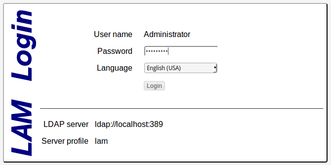

Now create your first LDAP account. The `cloudwatt` account already present is the administrative account for LDAP (the one you just logged in with), and while changing it's password is recommended, modifying it in any other way could interfere with the functionality of LAM, and thus I strongly urge you not to do so unless you are confident you understand the implications.

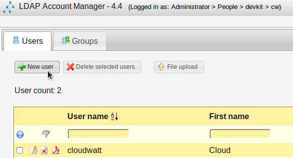

Once on the user creation page, enter the details of your new user. On this first tab (the Personal tab), the only information LAM requires is the last name, but also fill in the email field, as it is requested by GitLab and Dokuwiki. Once you are satisfied, move to the Unix tab.

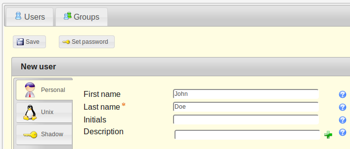

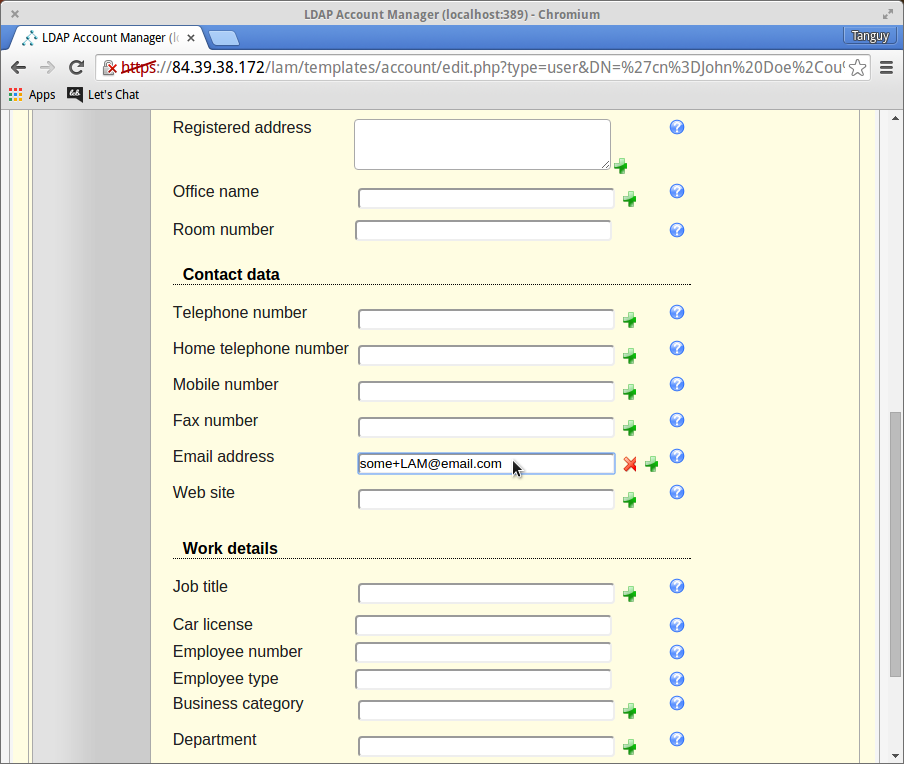

The `User name` and `Common name` fields are filled with examples generated by LAM, but replace them with whatever you wish. The `User name` is what will be used to log in to every tool in DevKit, **and is the only field that cannot be changed later**. The `Common name` is often the name the DevKit will use to refer to you, rather than your `User name`. For standard usage of the DevKit, you may ignore the remained fields: their default values are fine.

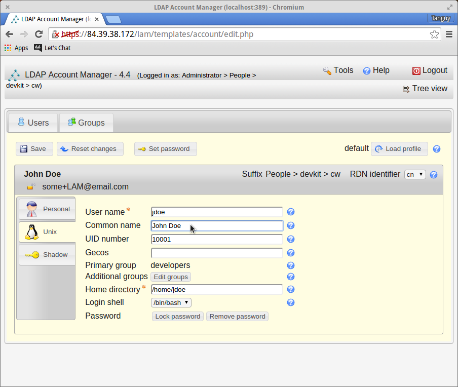

Do not save your new user account yet! First, set the user's password: the button is located to the right of the save button.

You can generate a random password or input one yourself, either way, the change will not take effect until you save. If you generate a random password, make sure to copy it elsewhere before saving the account.

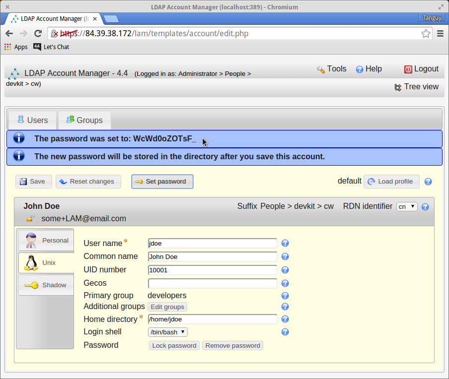

Alright, done creating a user! **Make sure to save the user before exiting.** These users cannot access LAM by default, but this can be changed through the `Edit server profiles` LAM configuration page. Users logged into LAM (other than the *Administrator*) will only be able to modify their own account.

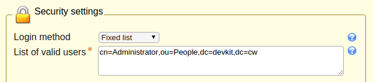

Before moving on to the next tool, we recommend you change the *master* password (for `Edit general settings`) and the *server preferences* password (for `Edit server profiles`). Log out of LAM (top-right) to return to the login page. From the login page you can access the two LAM configuration pages (also top-right). Remember that all LAM passwords are **c10udw477** by default.

`Edit general settings`

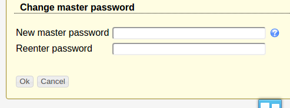

`Edit server profiles`

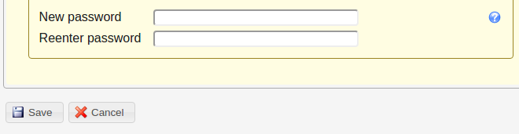

#### GitLab

**GitLab** is next! You may have noticed you fell onto the GitLab login page when you entered the DevKit IP address. We put GitLab at the root to simplify the usage of Git. Before you begin using GitLab, you will want to configure the admin account.

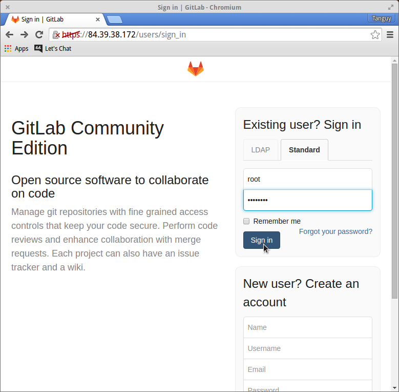

To log into the admin account for the first time, switch to the `Standard` sign-in tab and log in with *root*, the admin username. The default password is **5iveL!fe**, but it won't stick: you will be prompted to make a new password immediately.

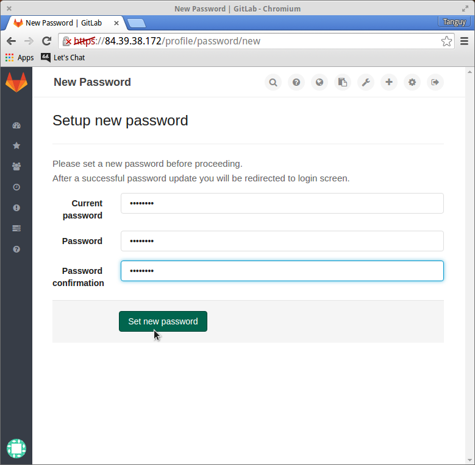

Log back in with your new password to access your GitLab for the first time! Since you are logged in as admin, you have access to a special configuration area of GitLab.

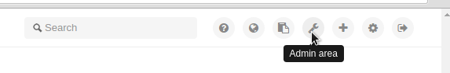

There's a ton of cool stuff here, but the GitLab documentation is better suited to teach you all about it. For the setup of the DevKit, you only really need to change a few settings.

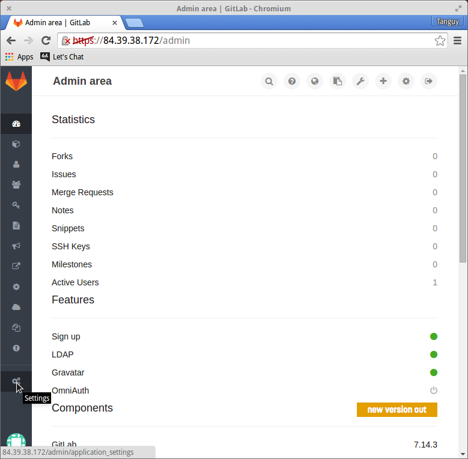

By default, the GitLab's `Visibility and Access Controls` are pretty severe, I recommend the setup below, but of course it's up to you.

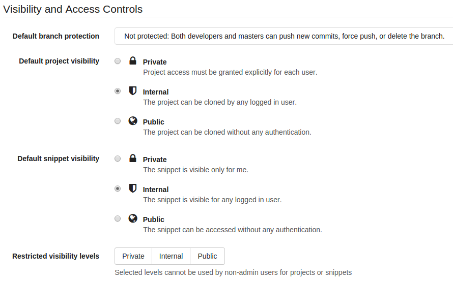

The only setting that is truly important for the DevKit is likely the `Sign-up enabled` setting. **If this is left checked, then anyone can create an account and access your projects.** Without it, only accounts created through LDAP and the *root* admin account will still have access to GitLab; no one else can enter.

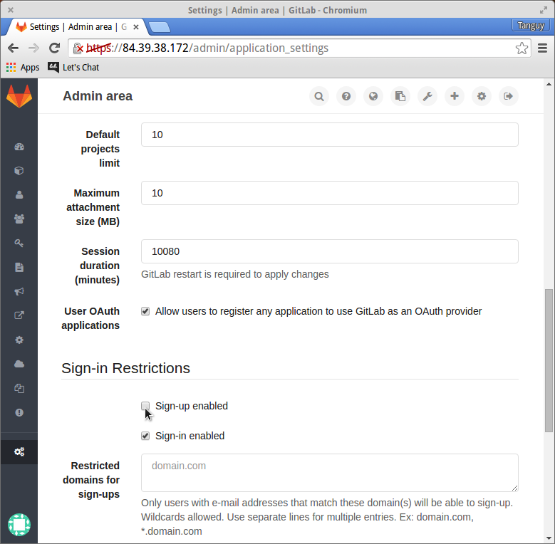

**Don't forget to save at the bottom of the Settings page!** If you don't save, none of the changes will be taken into account. Also remember that only the *root* account has access to the administrative section of GitLab, and that the *root* account is NOT managed by LDAP.

On a side note, if you ever need to receive mail from the DevKit (whichever tool it's from), *check your Spam*. Email from fresh new servers behind an domain-less IP address is a surefire way to the Spam folder, so make that your first stop after your inbox.

That's it for the GitLab setup! Once you are satisfied with the settings, log out of the *root* account and head on to `/dokuwiki`!

#### Dokuwiki

**Dokuwiki** has it's own port, `:8081`, so validate the HTTPS certificate again (depending on your browser) and you will reach the homepage, `:8081/doku.php`. (For convenience, `/dokuwiki` rewrites to `:8081`.)

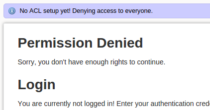

Don't worry, it looks worse than it is! Dokuwiki just wants you to finish the setup. Simply go to `:8081/install.php` to "install" Dokuwiki.

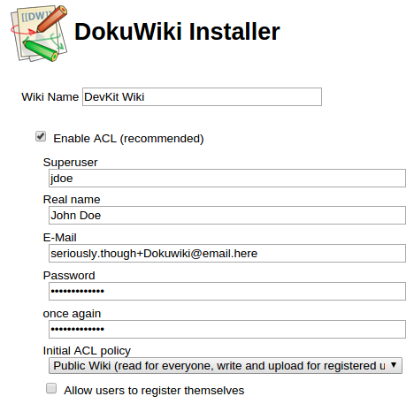

A few things of note here:

* Name the wiki whatever you wish.
* You definitely want ACL enabled.
* The `Superuser` **must be a valid LDAP user**. They will be the only one with access to the Dokuwiki admin panel by default.
* The `Real Name` and `E-Mail` and `Password` fields will not be taken into account at all, and will be replaced with what you entered in LAM (LDAP).
* Set the ACL level to suit your needs.
* Allowing users to register themselves is counterproductive, unless you don't mind your wiki being a free-for-all. LDAP users will automatically have access.

Below it will ask you to pick a license for your wiki, study up if you wish, then make your pick and save. Dokuwiki is now ready: follow the link on the page you were redirected to (or go to `:8081/doku.php?id=wiki:welcome`) and sign in to start using your wiki!

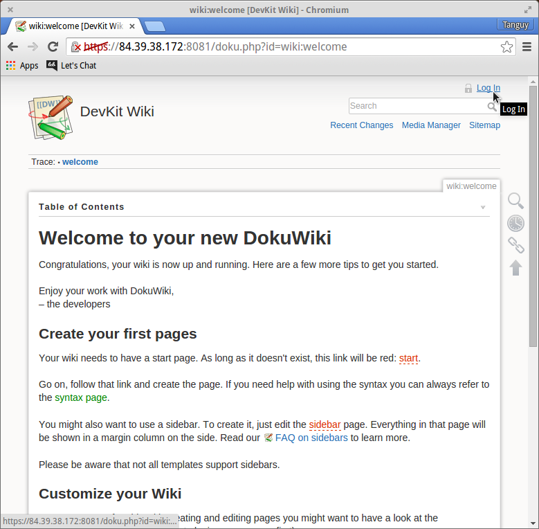

#### Jenkins

**Jenkins** has the easiest setup, and is found at `/jenkins`. There is actually *no* setup. Login in with any LDAP user and start making builds!

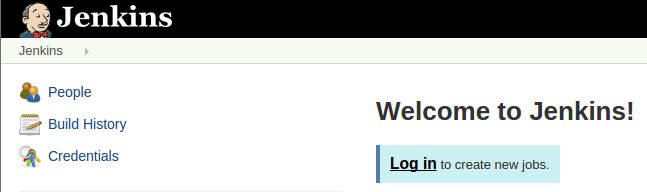

#### Let's Chat

**Let's Chat**, just like Dokuwiki, can be found on a separate port: `:8082`, (`/lets-chat` redirects there for convenience). Log in with an LDAP account (with a valid email!) to start chatting! Your avatar will be inherited from Gravatar (thanks to your email), so take the time to make a free Gravatar account for a unique user picture.

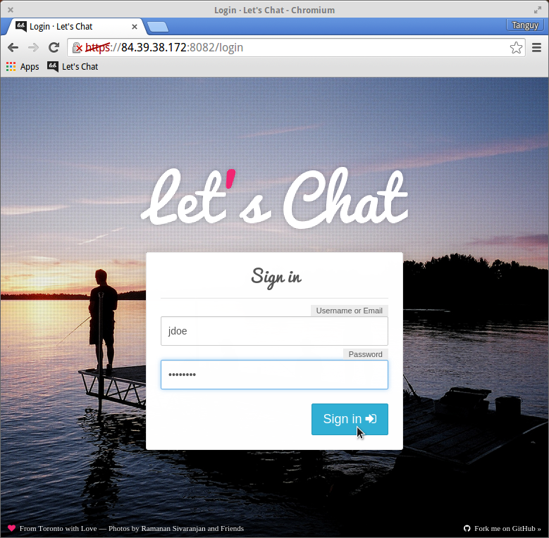

Let's Chat will soon become second nature, but the minimalistic interface may be jarring at first. Start by creating a room to chat in with the **+** button on the upper right.

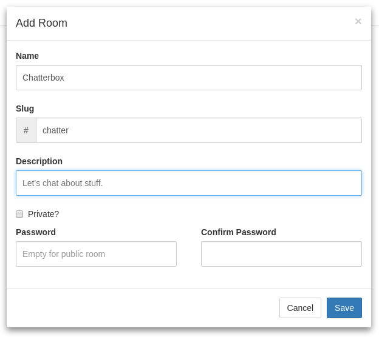

Once you've saved it, voila! Your room exists! The room you just made should be added to the list. On the right of the room information there is a toggle switch: This allows you to choose whether or not you want notifications from that room, and if you want it in your "room bar" on the left. Click on the room name to enter it!

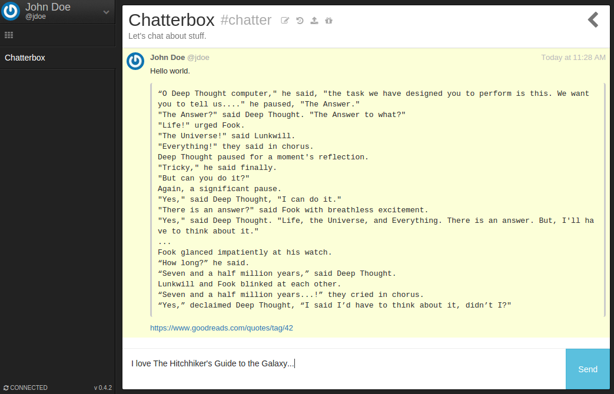

Voila! Messages are written at the bottom of the page. The arrow on the top-right lets you see who's in the room and a list of uploaded files. Near the room name is a set of buttons to edit the room, see/search the archives, upload files, and send gifs.

Let's Chat had become the established messaging application within my team *days* after I introduced it for field-testing. I hope your experience with it is as pleasant as it has been for us.

<a name="backup" />

## Back up and Restoration

Backing your DevKit, sounds like great idea, right? After all, *ipsa scientia potestas est*, and you never feel as powerless as when you lose your code.
Thankfully we've worked hard to make saving your work quick and easy.

~~~ bash
$ ./backup.sh OMNITOOL
~~~

And five minutes later you're back in business and your conscience is at ease!
Restoration is as simple as building another stack, although this time with the `.restore.heat.yml`, and specifying the ID of the backup you want. The new volume size should not be smaller than the original in order to avoid data loss/corruption. A list of backups can be found in the «Volume Backups» tab under «Volumes» in the console, or from the command line with the Cinder API:

~~~ bash
$ cinder backup-list

+------+-----------+-----------+-------------------------------------+------+--------------+---------------+
|  ID  | Volume ID |   Status  |                 Name                | Size | Object Count |   Container   |
+------+-----------+-----------+-------------------------------------+------+--------------+---------------+
| XXXX | XXXXXXXXX | available | OMNITOOL-backup-2025/10/23-07:27:69 |  10  |     206      | volumebackups |
+------+-----------+-----------+-------------------------------------+------+--------------+---------------+

~~~

Remember however, that while we have greatly simplified the restoration process and entirely handled the change in floating-IP within the DevKit, **other services interfacing with the DevKit will not take into account changes in IP address, namely your Git configurations**. Your local Git SSH Keys will still be valid, but you should make sure to correct any hosts and project remote addresses before continuing your work.

## So watt?

The goal of this tutorial is to accelerate your start. At this point **you** are the master of the stack.

You now have an SSH access point on your virtual machine through the floating-IP and your private keypair (default user name *cloud*).

The interesting directories are:

- `/dev/vdb`: Volume mount point
- `/mnt/vdb/`: `/dev/vdb` mounts here: contains all DevKit data, save that of Let's Chat
- `/mnt/vdb/stack_public_entry_point`: Contains last known floating-IP address, used to replace the floating-IP address in all locations when it changes
- `/etc/nginx/`: Nginx configuration files
- `/etc/devkit/ssl/`: The server's `.key` and self-signed `.crt` for HTTPS
- `/etc/devkit/devkit-volume.sh`: Script run upon reboot to remount the volume and verify the DevKit is ready to function again

- `/var/opt/gitlab`: Gitlab volume mount point
- `/var/www/dokuwiki`: Dokuwiki volume mount point
- `/var/lib/ldap`: Ldap volume mount point
- `/var/lib/jenkins`: Jenkins volume mount point
- `/var/lib/lets-chat`: Let's Chat installation point

Other resources you could be interested in:

* [LAM Manual](https://www.ldap-account-manager.org/static/doc/manual-onePage/index.html)
* [OpenLDAP Documentation Catalog](http://www.openldap.org/doc/)
* [Doc for GitLab CE](http://doc.gitlab.com/ce/)
* [Jenkins Homepage](https://jenkins-ci.org/)
* [Jenkins Wiki](https://wiki.jenkins-ci.org/display/JENKINS/Home)
* [Let's Chat Documentation](https://github.com/sdelements/lets-chat/wiki)
* [Dokuwiki Homepage](https://www.dokuwiki.org)
* [Nginx - How to Configure Nginx](https://www.linode.com/docs/websites/nginx/how-to-configure-nginx)
* [Nginx - Rewrite Module](http://nginx.org/en/docs/http/ngx_http_rewrite_module.html)
* [Nginx - Logging](http://nginx.org/en/docs/debugging_log.html)
* [Nginx - Guide to Nginx](https://www.nginx.com/resources/admin-guide/nginx-web-server/)
* [Nginx - Dokuwiki & Nginx #1](https://www.dokuwiki.org/install:nginx#dokuwiki_with_nginx_on_ubuntu_linux_1204_and_newer)
* [Nginx - Dokuwiki & Nginx #2](https://wiki.boetes.org/dokuwiki_on_nginx)
* [Nginx - Dokuwiki & Nginx #3](http://wiki.nginx.org/Dokuwiki)
* [Nginx - LAM & Nginx](https://www.ldap-account-manager.org/static/doc/manual/apbs07.html)
* [Nginx - Jenkins & Nginx](https://wiki.jenkins-ci.org/display/JENKINS/Jenkins+behind+an+NGinX+reverse+proxy)

-----
Have fun. Hack in peace.
