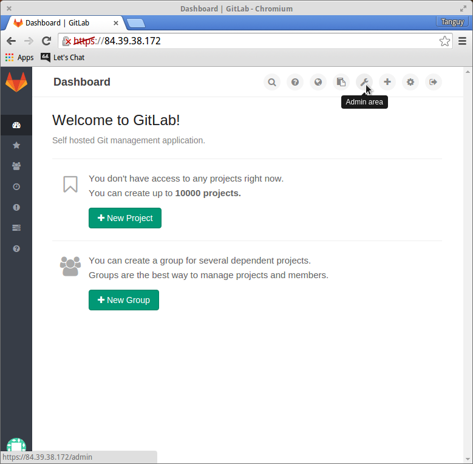

#### GitLab

Puis vient **GitLab** ! Vous avez pu remarquer que la page par défaut d'atterrissage sur le DevKit
est celle de GitLab. GitLab est en frontal pour simplifier les usages de git. Avant de commencer à l'utiliser
vous voudrez configurer le compte administrateur.

Pour vous connecter au compte administrateur pour la première fois, afficher l'onglet `Standard`
et loggez vous avec l'utilisateur *root*, le mot de passe par défaut est **5iveL!fe**, mais pas pour
longtemps puisque GitLab vous forcera à le changer à la première connexion.

Re-loggez vous avec votre mot de passe tout neuf. Puisque vous êtes admin, vous aurez accès à l'espace de
configuratio de GitLab.

Il y a plein de choses sympas à faire, mais la documentation de GitLab est certainement mieux qualifiée
que nous pour faire votre éducation sur le sujet. Pour les besoins du DevKit vous n'aurez besoin de changer
que quelques détails.

Par défaut, les réglages de `Visibility and Access Controls` sont plutôt sévères. Je vous recommande
la configuration ci-dessous, mais c'est votre choix.

Le seul détail à modifier impérativement est `Sign-up enabled`. Si vous le laissez actif, n'importe quel
internaute pourra s'inviter chez vous. Désactivez le, de façon à ce que seuls les utilisateurs LDAP puissent
utiliser votre GitLab.

**Pensez à sauvegarder vos modification**. Rappelez vous que seul le compte **root** permet de gérer GitLab
et que ce compte n'est pas lié à LDAP.

Voilà pour le setup de GitLab. Une fois satisfait de votre configuration, déplacez vous vers l'url `/dokuwiki`!
