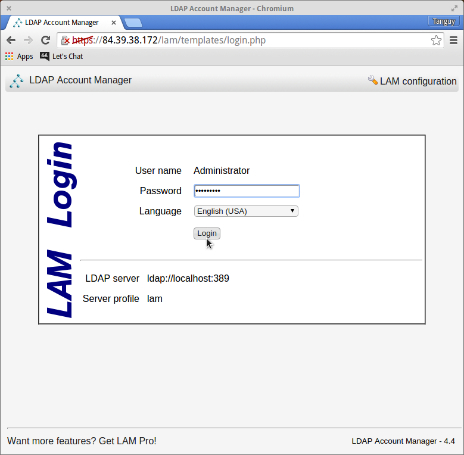
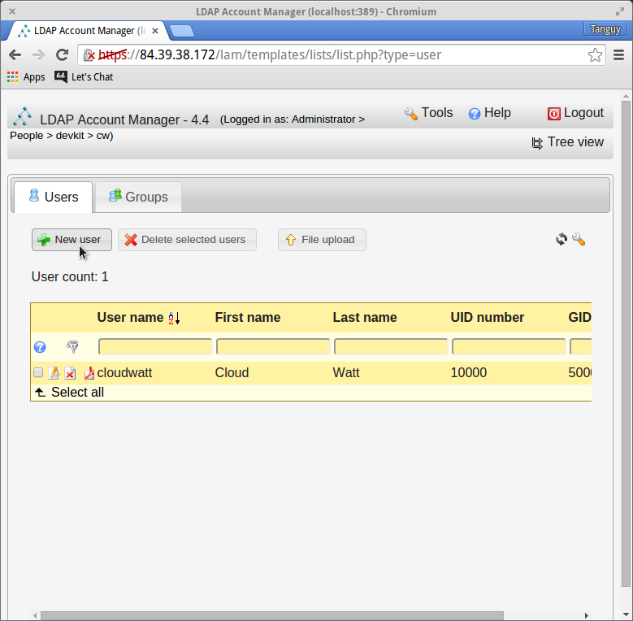
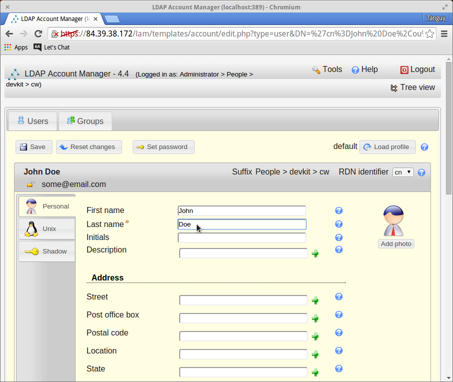
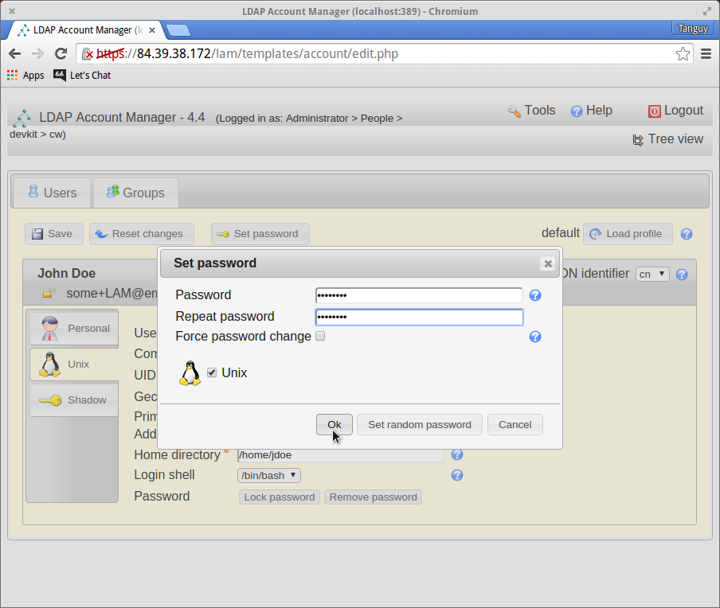
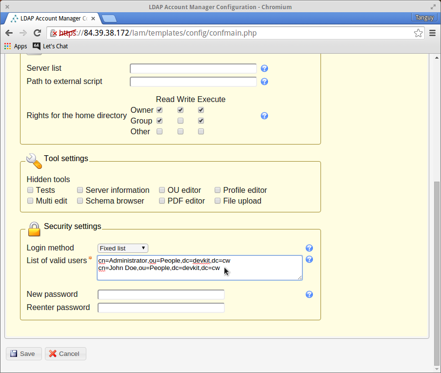
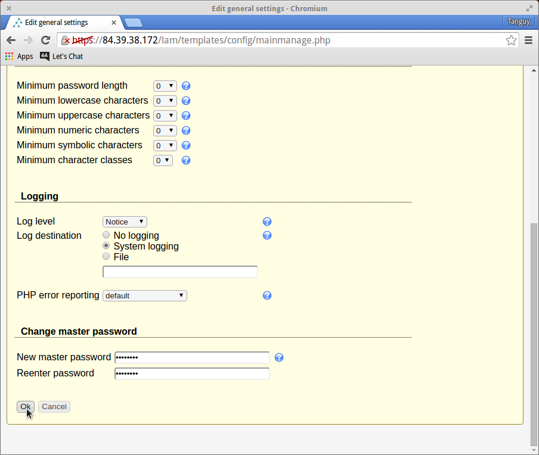
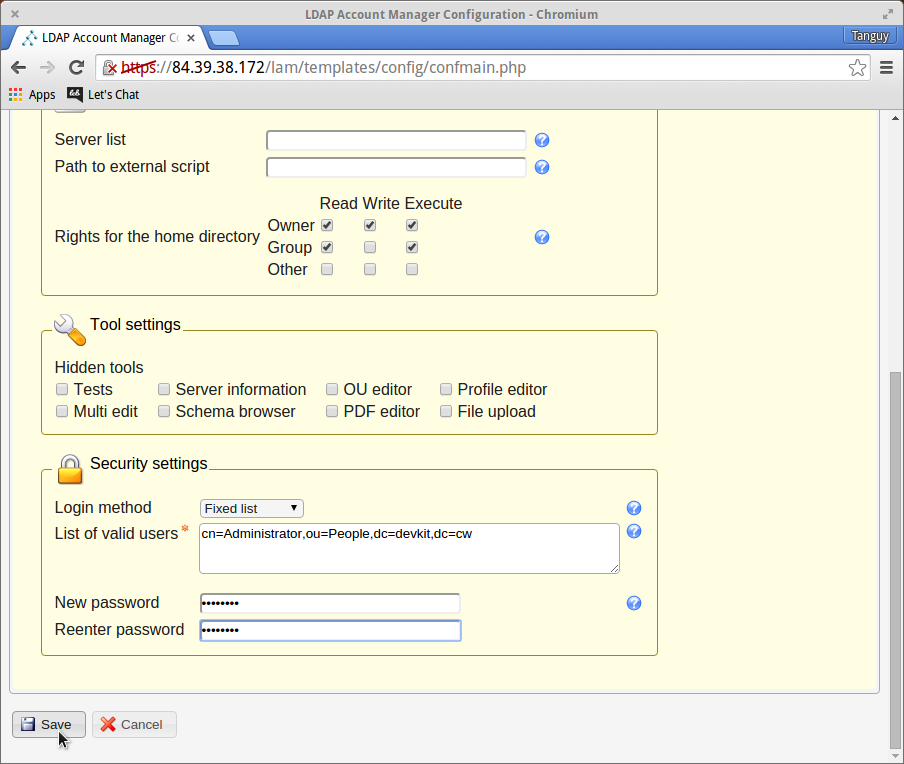

#### LAM

**LAM** can be found at `/lam`, and password for the main login (username: *Administrator*), the *master* password, and the *server preferences* password are all **c10udw477** by default. Just log in through the main login for now.

Now create your first LDAP account. The `cloudwatt` account already present is the administrative account for LDAP (the one you just logged in with), and while changing it's password is recommended, modifying it in any other way could interfere with the functionality of LAM, and thus I strongly urge you not to do so unless you are confident you understand the implications.

Once on the user creation page, enter the details of your new user. On this first tab (the Personal tab), the only information LAM requires is the last name, but also fill in the email field, as it is requested by GitLab, Let's Chat, and Dokuwiki. Once you are satisfied, move to the Unix tab.

The `User name` and `Common name` fields are filled with examples generated by LAM, but replace them with whatever you wish. The `User name` is what will be used to log in to every tool in DevKit, **and is the only field that cannot be changed later**. The `Common name` is often the name the DevKit will use to refer to you, rather than your `User name`. For standard usage of the DevKit, you may ignore the remained fields: their default values are fine.

Do not save your new user account yet! First, set the user's password: the button is located to the right of the save button.

You can generate a random password or input one yourself, either way, the change will not take effect until you save. If you generate a random password, make sure to copy it elsewhere before saving the account.

Alright, done creating a user! **Make sure to save the user before exiting.** These users cannot access LAM by default, but this can be changed through the `Edit server profiles` LAM configuration page. Users logged into LAM (other than the *Administrator*) will only be able to modify their own account.

Before moving on to the next tool, we recommend you change the *master* password (for `Edit general settings`) and the *server preferences* password (for `Edit server profiles`). Log out of LAM (top-right) to return to the login page. From the login page you can access the two LAM configuration pages (also top-right). Remember that all LAM passwords are **c10udw477** by default.

`Edit general settings`

`Edit server profiles`

