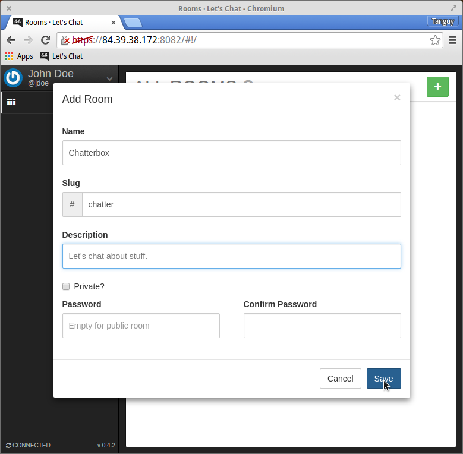

#### Let's Chat

**Let's Chat**, just like Dokuwiki, can be found on a separate port: `:8082`, (`/lets-chat` redirects there for convenience). Log in with an LDAP account (with a valid email!) to start chatting! Your avatar will be inherited from Gravatar (thanks to your email), so take the time to make a free Gravatar account for a unique user picture.

Let's Chat will soon become second nature, but the minimalistic interface may be jarring at first. Start by creating a room to chat in with the **+** button on the upper right.

Once you've saved it, voila! Your room exists! The room you just made should be added to the list. On the right of the room information there is a toggle switch: This allows you to choose whether or not you want notifications from that room, and if you want it in your "room bar" on the left. Click on the room name to enter it!

Voila! Messages are written at the bottom of the page. The arrow on the top-right lets you see who's in the room and a list of uploaded files. Near the room name is a set of buttons to edit the room, see/search the archives, upload files, and send gifs.

Let's Chat became the established messaging application within my team *days* after I introduced it for field-testing. I hope your experience with it is as pleasant as it has been for us.
