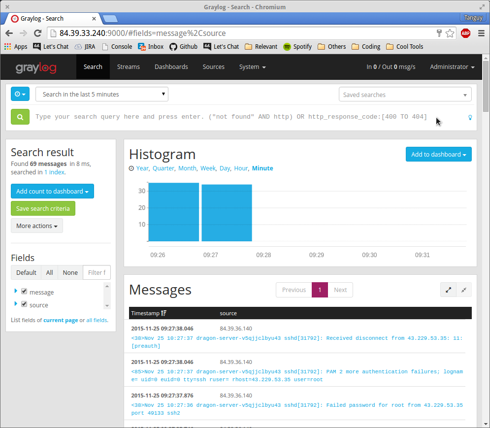
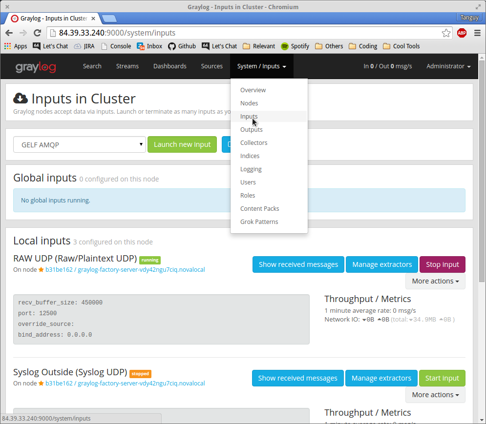
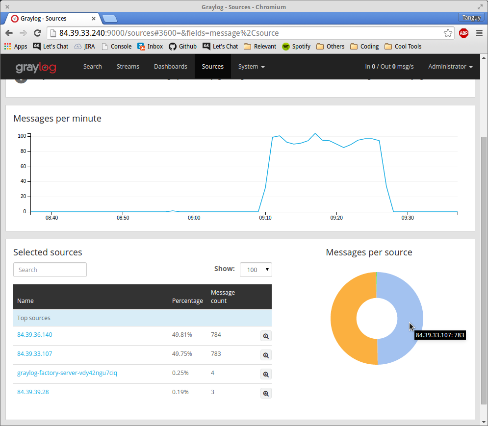
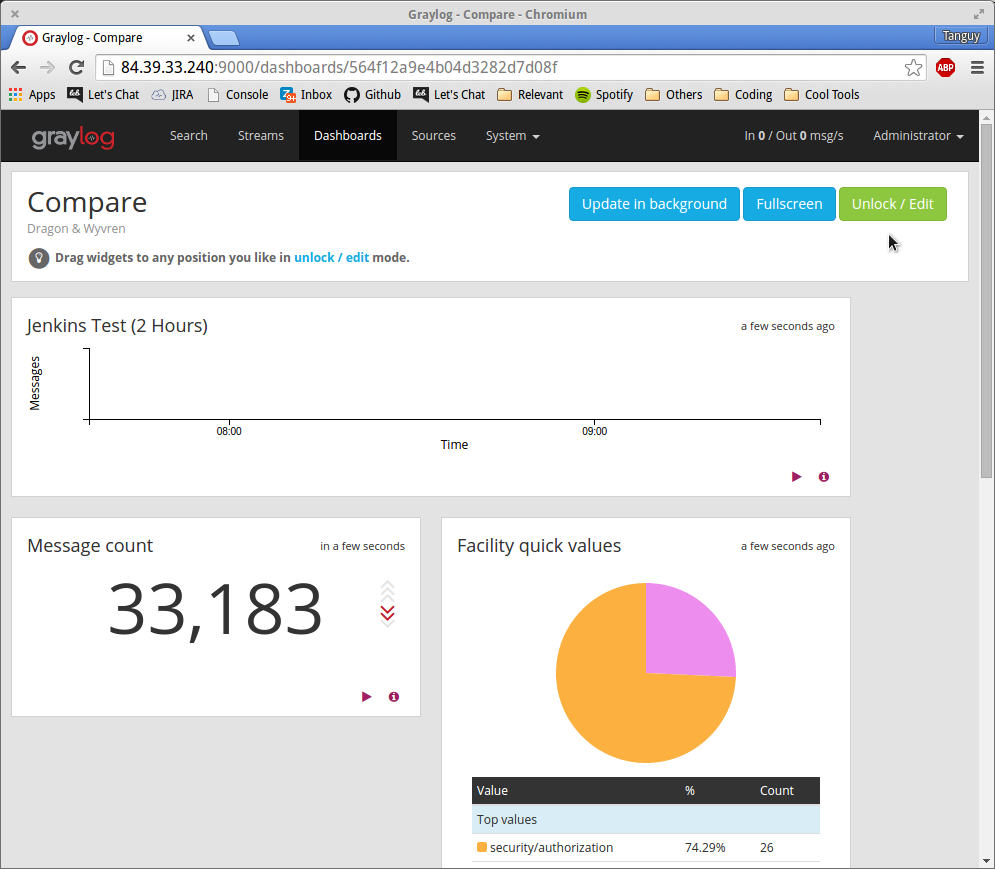

# 5 Minutes Stacks, Episode 14: Graylog

## Episode 14: Graylog

**Projet - Image actuellement non disponible...**

Graylog est une plateforme open source de gestion de logs capable de manipuler et présenter les données à partir de pratiquement n'importe quelle source. Graylog se compose d'une architecture 3-tier:

* L'interface graphique web de Graylog est un outil puissant qui permet à quiconque de manipuler la totalité de ce que Graylog a à offrir grâce à cette application Web intuitive et attrayante.
* Au cœur de Graylog est son propre logiciel forte. Le Graylog serveur interagit avec tous les autres composants à l'aide d'interfaces API REST de sorte que chaque composant du système peut être adapté sans pour autant compromettre l'intégrité du système dans son ensemble.
* Des résultats de recherche en temps réel quand vous les voulez et comment vous les voulez: Graylog est en mesure de vous fournir ceci grâce à la puissance éprouvée d'ElasticSearch. Les nœuds ElasticSearch donnent à Graylog la vitesse qui en fait un vrai plaisir à utiliser.

Bénéficiant de cette architecture impressionnante ainsi que d'une vaste bibliothèque de plugins, Graylog se place comme une solution solide et polyvalente de gestion des logs.

En suivant ce tutoriel, vous allez déployer une version tout-en-un mais entièrement fonctionnelle de Graylog: L'UI web de Graylog, le serveur ainsi que ElasticSearch sont tous déployés sur une seule instance. Ceci est une excellente façon de découvrir le potentiel de Graylog et d'explorer son interface Web polyvalente sans dépenser beaucoup de ressources.

## Préparations

### La version

* Graylog (graylog-server/graylog-web) 1.2.2-1
* Elasticsearch (elasticsearch) 1.7.3
* MongoDB (mongodb-org) 3.0.7

### Les pré-requis pour déployer cette stack

Ceci devrait être une routine à présent:

* Un accès internet
* Un shell linux
* Un [compte Cloudwatt](https://www.cloudwatt.com/authentification) avec une [ paire de clés existante](https://console.cloudwatt.com/project/access_and_security/?tab=access_security_tabs__keypairs_tab)
* Les outils [OpenStack CLI](http://docs.openstack.org/cli-reference/content/install_clients.html)
* Un clone local du dépôt git [Cloudwatt applications](https://github.com/cloudwatt/applications)

### Taille de l'instance

Par défaut, le script propose un déploiement sur une instance de type "Small" (s1.cw.small-1). Il existe une variété d'autres types d'instances pour la satisfaction de vos multiples besoins. Les instances sont facturés à la minute, vous permettant de payer uniquement pour les services que vous avez consommés et plafonnés à leur prix mensuel (vous trouverez plus de détails sur la [Page tarifs ](https://www.cloudwatt.com/fr/produits/tarifs.html) du site de Cloudwatt).

Vous pouvez ajuster les parametres de la stack à votre goût.

### Au fait...

Si vous n’aimez pas les lignes de commande, vous pouvez passer directement à la version "Je lance avec la console" en cliquant sur [ce lien](#console)...

## Tour du propriétaire

Une fois le dépôt cloné, vous trouverez le répertoire `bundle-trusty-graylog/`

* `bundle-trusty-graylog.heat.yml`: Template d'orchestration HEAT, qui servira à déployer l'infrastructure nécessaire.
* `stack-start.sh`: Stack launching script, which simplifies the parameters and secures the admin password creation.
* `stack-get-url.sh`: Script de récupération de l'IP d'entrée de votre stack, qui peut aussi se trouver dans les parametres de sortie de la stack.

## Démarrage

### Initialiser l'environnement

Munissez-vous de vos identifiants Cloudwatt, et cliquez [ICI](https://console.cloudwatt.com/project/access_and_security/api_access/openrc/).
Si vous n'êtes pas connecté, vous passerez par l'écran d'authentification, puis le téléchargement d'un script démarrera. C'est grâce à celui-ci que vous pourrez initialiser les accès shell aux API Cloudwatt.

Sourcez le fichier téléchargé dans votre shell et entrez votre mot de passe lorsque vous êtes invité à utiliser les clients OpenStack.

~~~ bash
$ source COMPUTE-[...]-openrc.sh
Please enter your OpenStack Password:

$ [whatever mind-blowing stuff you have planned...]
~~~

Une fois ceci fait, les outils de ligne de commande d'OpenStack peuvent interagir avec votre compte Cloudwatt.

### Ajuster les paramètres

In the `.heat.yml` files (heat templates), you will find a section named `parameters` near the top. The mandatory parameters are the `keypair_name` and the `password` for the Graylog *admin* user.

You can set the `keypair_name`'s `default` value to save yourself time, as shown below.
Remember that key pairs are created [from the console](https://console.cloudwatt.com/project/access_and_security/?tab=access_security_tabs__keypairs_tab), and only keys created this way can be used.

The `password` field provides the password for Graylog's default *admin* user. You will need it upon initial login, but you can always create other users later. You can also adjust (and set the default for) the instance type by playing with the `flavor` parameter accordingly.

Par défaut, le réseau et sous-réseau de la stack sont générés pour la stack, dans lequel le serveur Graylog est seul installé. Ce comportement peut être modifié si necessaire dans fichier` .heat.yml`.

~~~ yaml
heat_template_version: 2013-05-23

description: All-in-one Graylog stack

parameters:
  keypair_name:
    label: SSH Keypair
    description: Keypair to inject in instance
    type: string
    default: my-keypair-name                <-- Mettez ici le nom de votre keypair

  password:
    label: Password
    description: Graylog root user password
    type: string
    hidden: true
    constraints:
      - length: { min: 6, max: 96 }
        description: Password must be between 6 and 96 characters

  flavor_name:
    label: Instance Type (Flavor)
    description: Flavor to use for the deployed instance
    type: string
    default: s1.cw.small-1
    constraints:
      - allowed_values:
        [...]

resources:
  network:
    type: OS::Neutron::Net

  subnet:
    type: OS::Neutron::Subnet
    properties:
      network_id: { get_resource: network }
      ip_version: 4
      cidr: 10.0.1.0/24
      allocation_pools:
        - { start: 10.0.1.100, end: 10.0.1.199 }
[...]
~~~

<a name="startup" />

### Démarrer la stack

Dans un shell, lancer le script `stack-start.sh`:

~~~ bash
$ ./stack-start.sh TICKERTAPE «my-keypair-name»
Enter your new admin password:
Enter your new password once more:
Creating stack...
+--------------------------------------+------------+--------------------+----------------------+
| id                                   | stack_name | stack_status       | creation_time        |
+--------------------------------------+------------+--------------------+----------------------+
| xixixx-xixxi-ixixi-xiixxxi-ixxxixixi | TICKERTAPE | CREATE_IN_PROGRESS | 2025-10-23T07:27:69Z |
+--------------------------------------+------------+--------------------+----------------------+
~~~

Au bout de **5 minutes**, la stack sera totalement opérationnelle. (Vous pouvez utiliser la commande `watch` pour voir le statut en temps réel).

~~~ bash
$ watch -n 1 heat stack-list
+--------------------------------------+------------+-----------------+----------------------+
| id                                   | stack_name | stack_status    | creation_time        |
+--------------------------------------+------------+-----------------+----------------------+
| xixixx-xixxi-ixixi-xiixxxi-ixxxixixi | TICKERTAPE | CREATE_COMPLETE | 2025-10-23T07:27:69Z |
+--------------------------------------+------------+-----------------+----------------------+
~~~

### Profitez - Stack URL with a terminal

Une fois tout ceci fait, vous pouvez lancer le script 'stack-get-url.sh'.

~~~ bash
$ ./stack-get-url.sh TICKERTAPE
TICKERTAPE  http://70.60.637.17:9000/
~~~

Comme indiqué ci-dessus, il va analyser les IP flottantes attribuées à votre stack dans un lien URL.
Vous pouvez alors cliquer ou le coller dans un navigateur de votre choix, et profitez de votre nouvelle instance Graylog.

<a name="console" />

## C’est bien tout ça, mais...

### Vous n’auriez pas un moyen de lancer l’application par la console ?

Et bien si ! En utilisant la console, vous pouvez déployer votre Graylog :

1.	Allez sur le Github Cloudwatt dans le dépôt [applications/bundle-trusty-graylog](https://github.com/cloudwatt/applications/tree/master/bundle-trusty-graylog)
2.	Cliquez sur le fichier nommé `bundle-trusty-graylog.heat.yml`
3.	Cliquez sur RAW, une page web apparait avec les détails du template
4.	Enregistrez le fichier sur votre PC. Vous pouvez utiliser le nom proposé par votre navigateur (il faudrait juste enlever le .txt)
5.  Allez dans la section «[Stacks](https://console.cloudwatt.com/project/stacks/)»  de la console
6.	Cliquez sur «Launch stack», puis «Template file» et sélectionner le fichier que vous venez d'enregistrer sur votre PC, et pour finir cliquez sur «NEXT»
7.	Donnez un nom à votre stack dans le champ «Stack name»
8.	Entrez le nom de votre keypair dans le champ «SSH Keypair»
9.	Entrez le mot de passe que vous avez choisi pour l'utilisateur par defaut *admin*
10.	Choisissez la taille de votre instance dans le menu déroulant « Type d'instance » et cliquez sur «LANCER»

La stack va se créer automatiquement (vous pourrez voir la progression en cliquant sur son nom). Quand tous les modules passeront au vert, la création sera terminée. Vous pourrez alors aller dans le menu « Instances » pour retrouver l’IP flottante qui a été générée, ou rafraichir la page en cours pour avoir le lien.

Souvenez vous que l'UI de Graylog se trouve sur le port 9000, pas sur le 80 !

Si vous avez atteint ce point, alors vous y êtes arrivé ! Profitez de Graylog !

## So watt?

Le but de ce tutoriel est d'accélerer votre démarrage. Dès à présent, **vous** êtes maître(sse) à bord. 

L'utilisateur par défaut est *admin* avec le mot de passe que vous avez défini lors de la création de la stack. Un moyen facile de [commencer](http://docs.graylog.org/en/1.2/pages/getting_started.html#get-messages-in) est d'avoir les logs de votre serveur Graylog lui-même !

Comme Graylog collecte les logs d'une pléthore de ports et protocoles, je vous recommande de prendre le temps de vous documenter sur ses possibilités. Rappelez-vous que tous les ports d'entrée et de sortie doivent être définies explicitement dans le [groupe de sécurité](https://console.cloudwatt.com/project/access_and_security/?tab=access_security_tabs__security_groups_tab) de la stack. Pour ajouter une entrée, cliquez sur **GERER LES REGLES** pour le groupe de sécurité de votre stack, ensuite dans la page *GESTION GROUPES DE SÉCURITÉ* cliquez sur **AJOUTER UNE REGLE**. Si les logs ne remontent pas à votre instance Graylog, vérifiez le [groupe de sécurité](https://console.cloudwatt.com/project/access_and_security/?tab=access_security_tabs__security_groups_tab) d'abord !

Une fois que vous recevez des logs depuis plusieurs sources, les dashboards vont certainement devenir votre outil préféré. Les résultats de recherche peuvent être convertis en des widgets qui sont mis à jour en temps réel et des dashboards vous permettent d'organiser ces widgets en panneaux d'information. Ainsi vous avez la visibilité des informations essentielles sur l'état de votre environnement. Prenez le temps de créer un dashboard qui affiche les informations que vous vous souciez, et le suivi de vos machines virtuelles va surement devenir une expérience plus agréable.

Vous avez aussi maintenant un point d'accès SSH sur votre machine virtuelle à travers l'IP flottante et votre keypair privée (nom d'utilisateur par défaut `cloud`). Attention, la connexion par défaut du navigateur à l'UI de Graylog n'est pas chiffrée (HTTP): si vous utilisez votre instance Graylog pour stocker des données sensibles, vous voudrez peut-être vous connecter plutôt avec un tunnel SSH.

~~~ bash
user@home$ cd applications/bundle-trusty-graylog/
user@home$ ./stack-get-url.sh TICKERTAPE
TICKERTAPE  http://70.60.637.17:9000/
user@home$ ssh 70.60.637.17 -l cloud -i /path/to/your/.ssh/keypair.pem -L 5000:localhost:9000
[...]
cloud@graylog-server$ █
~~~

En faisant ce qui précède, je peux accéder à mon serveur Graylog depuis http://localhost:5000/ dans mon navigateur.

## The State of Affairs

Cet appli déploie la configuration minimale de Graylog pour une utilisation dans des cas de petites configurations non-critiques ou de test. Aucun des composants ne sont redondants donc cette stack est rapide à lancer et peu chère à utiliser.

La configuration de Graylog est naturellement bien plus "généreuse" si vous visez un environnement de production plus grand, mais apporte un certain nombre d'avantages, l'un d'entre eux étant une scalabilité horizontale fluide. Cela permet à Graylog de grossir ou se réduire pour répondre à sa charge de travail à un instant t. Si vous êtes intéressé par un tel environnement, consultez le lien *Graylog server configuration* ci-dessous.

#### Les dossiers importants sont:

- `/etc/graylog/server/server.conf`: Graylog server configuration
- `/etc/graylog/web/web.conf`: Graylog web UI configuration
- `/etc/elasticsearch/elasticsearch.yml`: Elasticsearch configuration

#### Autres ressources qui pourraient vous être utiles :

* [Graylog Homepage](https://www.graylog.org/)
* [Graylog - Getting Started](http://docs.graylog.org/en/1.2/pages/getting_started.html#get-messages-in)
* [Graylog architectural considerations](http://docs.graylog.org/en/1.3/pages/architecture.html)
* [Elasticsearch Homepage](https://www.elastic.co/products/elasticsearch)
* [Installing MongoDB on Ubuntu](https://docs.mongodb.org/manual/tutorial/install-mongodb-on-ubuntu/)

-----
Have fun. Hack in peace.
