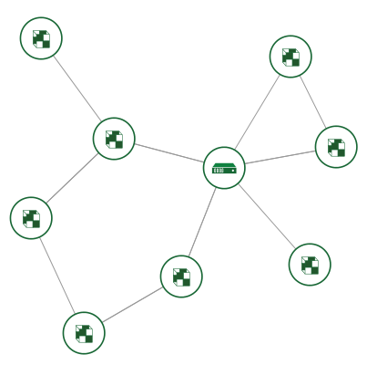

# 5 Minutes Stacks, Episode 13: Let's Chat

## Préparation

### La version

* Let's Chat v0.4.2

### Les pré-requis pour déployer cette stack

Ceci devrait maintenant être de la routine :

* Un accès Internet
* Un shell Linux
* Un [compte Cloudwatt](https://www.cloudwatt.com/authentification) avec [une paire de clé existante](https://console.cloudwatt.com/project/access_and_security/?tab=access_security_tabs__keypairs_tab)
* Les outils Openstack [OpenStack CLI](http://docs.openstack.org/cli-reference/content/install_clients.html)
* Un clone local du dépôt git [Cloudwatt applications](https://github.com/cloudwatt/applications) (si la création de votre stack se fait depuis un shell)

### Taille de l'instance

Par défaut, la stack est déployée sur une instance de type "Small" (s1.cw.small-1). Il existe d'autres types
d'instances pour la satisfaction de vos besoins, vous permettant de payer uniquement pour les services dont
vous avez besoin. Les instances sont facturées à la minute, vous permettant de payer uniquement pour les
services que vous avez consommés et plafonnés à leur prix mensuel (vous trouverez plus de détails
sur [La page Tarifs](https://www.cloudwatt.com/fr/produits/tarifs.html) du site de Cloudwatt).

Les paramètres de la Stack sont, bien sûr, modifiables selon vos souhaits.

### Au fait...

Si vous n’aimez pas les lignes de commande, vous pouvez passer directement à la version **"Je lance en 1-clic"** ou **"Je lance avec la console"** en cliquant sur [ce lien](#console)...

## Que trouverez-vous dans le dépôt

Une fois le github cloné, vous trouverez dans le dépôt `bundle-trusty-letschat/`:

* `bundle-trusty-letschat.heat.yml`: Template d'orchestration HEAT, qui servira à déployer l'infrastructure nécessaire.
* `stack-start.sh`: Script de lancement de la stack, qui simplifie les paramètres.
* `stack-get-url.sh`: Script de récupération de l'IP d'entrée de votre stack, qui peut aussi se trouver dans la sortie de la stack.

### Initialiser l'environnement

Se connecter à [la console Cloudwatt](https://console.cloudwatt.com) et munissez-vous de vos identifiants Cloudwatt, et cliquez [Télécharger un script d'identité 'Cloudwatt API' ](https://console.cloudwatt.com/project/access_and_security/api_access/openrc/).
Avec cela, vous serez en possession de pouvoirs extraordinaires sur les API Opensatck.

Sourcez le fichier téléchargé dans votre shell et entrez votre mot de passe lorsque vous êtes invité à utiliser les clients OpenStack.

~~~ bash
$ source ~/Downloads/COMPUTE-[...]-openrc.sh
Please enter your OpenStack Password:

~~~

Seulement alors les outils de commande en ligne d'OpenStack peuvent interagir avec votre compte utilisateur Cloudwatt

<a name="parameters" />

### Ajuster les paramètres

Dans le fichier '.heat.yml' (templates heat), vous trouverez en haut une section paramètres. Le seul paramètre qui n'est pas par défaut est la `keypair_name`. Réglez la valeur `default` à une paire de clés valides en rapport avec votre compte utilisateur Cloudwatt, comme **ce sera la paire de clés que vous utiliserez pour vous connecter à votre stack à distance** Une keypair peut être génerée depuis [l'onglet `Key Pairs` sous `Access & Security` de la console](https://console.cloudwatt.com/project/access_and_security/?tab=access_security_tabs__keypairs_tab).
Assurez-vous d'enregistrer la clé publique, sinon vous ne serez pas en mesure de vous connecter à votre machine par SSH.

Il est également possible dans les templates heat d'ajuster et définir les valeurs par défaut pour le type d'instance.

Par défaut, le réseau et sous-réseau de la stack sont générés pour la stack, dans lequel le serveur Dokiwiki est seul installé. Ce comportement peut être modifié si necessaire dans le template heat.

~~~ yaml

  default: my-keypair-name                <-- Indicate your keypair here
    default: s1.cw.small-1                  <-- Indicate your instance type here
        [...]
[...]

~~~

<a name="startup" />

## Start-up

Dans un shell, lancer le script `stack-start.sh` (assurez-vous [avoir défini la valeur par défaut](#parameters) pour le paramètre `flavor_name`):

~~~ bash
$ ./stack-start.sh THATCHAT «my-keypair-name»
+--------------------------------------+------------+--------------------+----------------------+
| id                                   | stack_name | stack_status       | creation_time        |
+--------------------------------------+------------+--------------------+----------------------+
| xixixx-xixxi-ixixi-xiixxxi-ixxxixixi | THATCHAT   | CREATE_IN_PROGRESS | 2025-10-23T07:27:69Z |
+--------------------------------------+------------+--------------------+----------------------+

~~~

Au bout de 5 minutes, la stack sera totalement opérationnelle; vous pouvez utiliser la commande `watch` pour voir le statut en temps réel.

~~~ bash
$ watch -n 1 heat stack-list
+--------------------------------------+------------+-----------------+----------------------+
| id                                   | stack_name | stack_status    | creation_time        |
+--------------------------------------+------------+-----------------+----------------------+
| xixixx-xixxi-ixixi-xiixxxi-ixxxixixi | THATCHAT   | CREATE_COMPLETE | 2025-10-23T07:27:69Z |
+--------------------------------------+------------+-----------------+----------------------+

~~~

### Profitez

Une fois que le `stack_status` est `CREATE_COMPLETE`, alors vous pouvez lancer le script `stack-get-url.sh`.

~~~ bash

$ ./stack-get-url.sh THATCHAT
THATCHAT  http://70.60.637.17

~~~

Comme indiqué ci-dessus, il va analyser le l'IP flottante attribuée à votre stack dans un lien URL. Vous pourrez alors cliquer ou coller cela dans le navigateur de votre choix, confirmer l'utilisation du certificat auto-signé, et [ être prêt au wiki~](#using_stack)

As shown above, it will parse the assigned floating-IP of your stack into a URL link. You can then click or paste this into your browser of choice, confirm the use of the self-signed certificate, and enjoy the simplicity of Let's Chat.

### En arrière plan

Le script `start-stack.sh` execute les requettes des API OpenStack nécessaires pour le template heat qui :

* Démarre une instance basée Ubuntu Trusty Tahr
* Attache une IP-flottante pour Let's Chat
* Configure Let's Chat pour utiliser l'IP-flottante

<a name="console" />

## C’est bien tout ça, mais...

### Une Ligne de commande semble aussi amical qu'un management à la militaire

Heureusement pour vous alors, la totalité de la configuration de Let's Chat peut être faite en utilisant uniquement l'interface web. 

Pour créer votre stack Let's Chat depuis la [Console Cloudwatt](https://console.cloudwatt.com):

1.	Allez sur le Github Cloudwatt dans le dépôt [applications/bundle-trusty-letschat](https://github.com/cloudwatt/applications/tree/master/bundle-trusty-letschat)
2.	Cliquez sur le fichier nommé `bundle-trusty-letschat.heat.yml`
3.	Cliquez sur RAW, une page web apparait avec uniquement le template
4.	Enregistrez le fichier sur votre PC. Vous pouvez utiliser le nom proposé par défaut par votre navigateur (juste enlever le `.txt` si besoin)
5.  Allez dans la section [Stacks](https://console.cloudwatt.com/project/stacks/) de la console
6.	Cliquez sur `LAUNCH STACK`, puis `Browse` sous `Template file` et selectionnez le fichier que vous venez d'enregistrer sur votre PC et puis cliquez finalement sur `NEXT`
7.	Nommez votre stack dans le champs `Stack Name`
8.	Entrez le nom de votre keypair dans le champs `SSH Keypair`
9.	Choisissez votre instance flavor en utilisant le menu déroulant `Instance Type` et cliquez sur `LAUNCH`

La stack sera automatiquement générée (vous pourrez voir sa progression en cliquant sur son nom). Lorsque tous les modules passeront au vert, la création sera complète. Vous pouvez alors aller dans le menu "instances" pour trouver l'IP-flottante, ou simplement rafraîchir la page courante et vérifier l'onglet Présentation.

Si vous avez atteint ce point, alors votre stack est fonctionnelle! Mettez en place et profitez de Let's Chat.

### Vous n’auriez pas un moyen de lancer l’application en 1-clic ?

Bon... en fait oui ! Allez sur la page [Applications](https://www.cloudwatt.com/fr/applications/index.html) du site de Cloudwatt, choisissez l'appli, appuyez sur DEPLOYER et laisser vous guider... 2 minutes plus tard un bouton vert apparait... ACCEDER : Tchatter maintenant !

<a name="using_stack" />

~~~

## So watt?

Le but de ce tutoriel est d'accélerer votre démarrage. A ce ce niveau **vous** êtes mâitre de votre stack.

Vous avez un point d'accès en SSH sur votre machine virtuelle à travers l'IP flottante et votre keypair privée
(nom d'utilisateur par défaut *cloud*).

Les dossiers importants sont:

- `/some/path`: FIXME

Autres ressources qui pourraient vous être utiles :

* [Ubuntu](https://help.ubuntu.com/)

-----
Have fun. Hack in peace.
