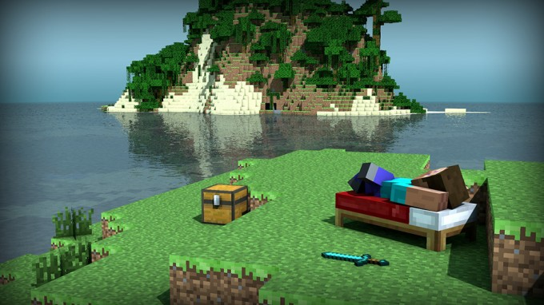

# 5 Minutes Stacks, Episode 17: Minecraft

## Episode 17: Minecraft

Minecraft is a game about breaking and placing blocks. Originally a sandbox video game created by Swedish programmer Notch, Minecraft is now developed and published by Mojang. Integrating exploration, resource gathering, crafting, and combat into a rewarding experience, Minecraft stays fresh through hours of play. Multiplayer provides yet another layer of depth as players band together to create vast structures beyond your imagination.

With this bundle anyone can easily deploy their own Minecraft server, easily accessible from the Minecraft launcher for play with friends or strangers.

## Preparations

### The version

* Minecraft (minecraft_server.1.8.9.jar) 1.8.9

### The prerequisites to deploy this stack

These should be routine by now:

* Internet access
* A Linux shell
* A [Cloudwatt account](https://www.cloudwatt.com/cockpit/#/create-contact) with a [valid keypair](https://console.cloudwatt.com/project/access_and_security/?tab=access_security_tabs__keypairs_tab)
* The tools of the trade: [OpenStack CLI](http://docs.openstack.org/cli-reference/content/install_clients.html)
* A local clone of the [Cloudwatt applications](https://github.com/cloudwatt/applications) git repository

### Size of the instance

By default, the stack deploys on an instance of type "Small" (s1.cw.small-1). A variety of other instance types exist to suit your various needs, allowing you to pay only for the services you need. Instances are charged by the minute and capped at their monthly price (you can find more details on the [Tarifs page](https://www.cloudwatt.com/en/pricing.html) on the Cloudwatt website).

Stack parameters, of course, are yours to tweak at your fancy.

## What will you find in the repository

Once you have cloned the github repository, you will find in the `bundle-trusty-minecraft/` directory:

* `bundle-trusty-minecraft.heat.yml`: Heat orchestration template. It will be use to deploy the necessary infrastructure.
* `stack-start.sh`: Stack launching script, which simplifies the parameters and secures the admin password creation.
* `minecraft-server-address.sh`: Returns the floating-IP in a URL, which can also be found in the stack output.

## Start-up

### Initialize the environment

Have your Cloudwatt credentials in hand and click [HERE](https://console.cloudwatt.com/project/access_and_security/api_access/openrc/).
If you are not logged in yet, complete the authentication and save the credentials script.
With it, you will be able to wield the amazing powers of the Cloudwatt APIs.

Source the downloaded file in your shell and enter your password when prompted to begin using the OpenStack clients.

~~~ bash
$ source COMPUTE-[...]-openrc.sh
Please enter your OpenStack Password:

~~~

Once this done, the Openstack command line tools can interact with your Cloudwatt user account.

### Adjust the parameters

In the `.heat.yml` files (heat templates), you will find a section named `parameters` near the top. The mandatory parameters are the `keypair_name` and the `admin_username` for the Minecraft *op* user.

You can set the `keypair_name`'s `default` value to save yourself time, as shown below.
Remember that key pairs are created [from the console](https://console.cloudwatt.com/project/access_and_security/?tab=access_security_tabs__keypairs_tab), and only keys created this way can be used.

The `admin_username` field provides the username for Minecraft's default *op* user. You will need it to set other players as *op* and use administrative commands. You can also adjust (and set the default for) the instance type by playing with the `flavor` parameter accordingly.

~~~ yaml
heat_template_version: 2013-05-23

description: All-in-one Minecraft stack

parameters:
  keypair_name:
    label: SSH Keypair
    description: Keypair to inject in instance
    type: string
    default: my-keypair-name                <-- Indicate your key pair name here

  flavor_name:
    label: Instance Type (Flavor)
    description: Flavor to use for the deployed instance
    type: string
    default: s1.cw.small-1
    constraints:
      - allowed_values:
        [...]

  admin_username:
    label: Admin Username
    description: Minecraft username to become first admin
    type: string

resources:
  network:
    type: OS::Neutron::Net

  subnet:
    type: OS::Neutron::Subnet
    properties:
      network_id: { get_resource: network }
      ip_version: 4
      cidr: 10.0.1.0/24
      allocation_pools:
        - { start: 10.0.1.100, end: 10.0.1.199 }
[...]
~~~

<a name="startup" />

### Stack up with a terminal

In a shell, run the script `stack-start.sh`:

~~~ bash
$ ./stack-start.sh GOLDDIGGER «my-keypair-name»
Enter the username of the first admin: bob1337
Enter the admin username again: bob1337
Creating stack...
+--------------------------------------+------------+--------------------+----------------------+
| id                                   | stack_name | stack_status       | creation_time        |
+--------------------------------------+------------+--------------------+----------------------+
| xixixx-xixxi-ixixi-xiixxxi-ixxxixixi | GOLDDIGGER | CREATE_IN_PROGRESS | 2025-10-23T07:27:69Z |
+--------------------------------------+------------+--------------------+----------------------+
~~~

Within 5 minutes the stack will be fully operational. (Use watch to see the status in real-time)

~~~ bash
$ watch -n 1 heat stack-list
+--------------------------------------+------------+-----------------+----------------------+
| id                                   | stack_name | stack_status    | creation_time        |
+--------------------------------------+------------+-----------------+----------------------+
| xixixx-xixxi-ixixi-xiixxxi-ixxxixixi | GOLDDIGGER | CREATE_COMPLETE | 2025-10-23T07:27:69Z |
+--------------------------------------+------------+-----------------+----------------------+
~~~

### Stack URL with a terminal

Once all of this done, you can run the `minecraft-server-address.sh` script.

~~~ bash
$ ./minecraft-server-address.sh GOLDDIGGER
GOLDDIGGER  70.60.637.17
~~~

As shown above, it will display the assigned address of your minecraft server. You can then paste this into Minecraft and bask in the glory of a fresh Minecraft server.

<a name="console" />

### Please console me

There there, it's okay... Minecraft stacks can be spawned from our console as well!

To create our Minecraft stack from the console:

1.	Go the Cloudwatt Github in the [applications/bundle-trusty-minecraft](https://github.com/cloudwatt/applications/tree/master/bundle-trusty-minecraft) repository
2.	Click on the file named `bundle-trusty-minecraft.heat.yml`
3.	Click on RAW, a web page will appear containing purely the template
4.	Save the page to your PC. You can use the default name proposed by your browser (just remove the .txt if needed)
5.  Go to the [Stacks](https://console.cloudwatt.com/project/stacks/) section of the console
6.	Click on **Launch stack**, then **Template file** and select the file you just saved to your PC, and finally click on **NEXT**
7.	Name your stack in the **Stack name** field
8.	Enter the name of your keypair in the **SSH Keypair** field
9.	Enter the password for the default *admin* user
10.	Choose your instance size using the **Instance Type** dropdown and click on **LAUNCH**

The stack will be automatically generated (you can see its progress by clicking on its name). When all modules become green, the creation will be complete. You can then go to the "Instances" menu to find the floating-IP, or simply refresh the current page and check the Overview tab for a handy link.

## So watt?

The goal of this tutorial is to accelerate your start. At this point **you** are the master of the stack. The default game mode is survival, but the admin can change that. Go to multiplayer and enjoy yourself!

## The State of Affairs

This bundle deploys a stable Minecraft setup for use in fun, non-critical setups. None of the components are redundant but it is resource-light and quick to launch.

#### The interesting directories are:

- `/opt/minecraft`: Minecraft server configuration

#### Resources you could be interested in:

* [Minecraft Homepage](https://minecraft.net/)
* [Minecraft Wiki](http://minecraft.gamepedia.com/Minecraft_Wiki)
* [Minecraft Commands](http://minecraft.gamepedia.com/Commands)

-----
Have fun. Hack in peace.
