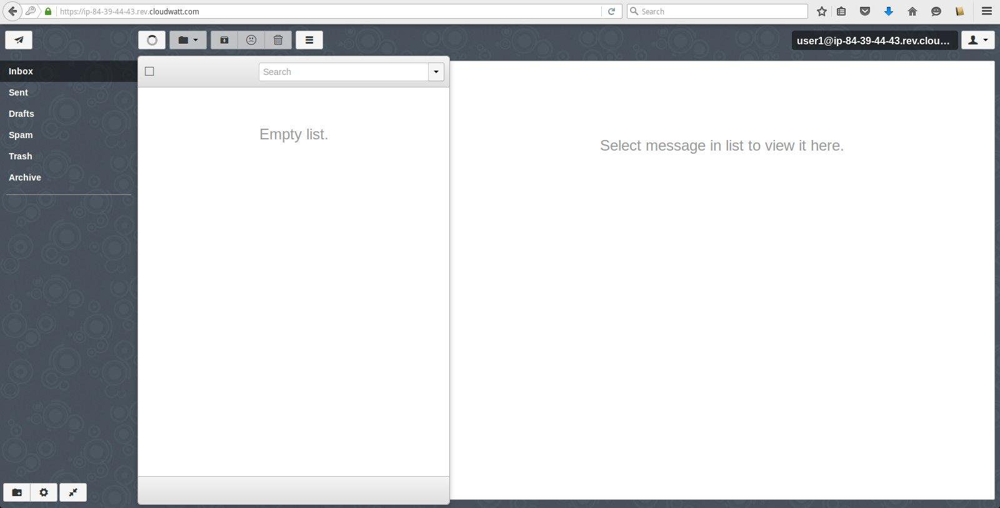
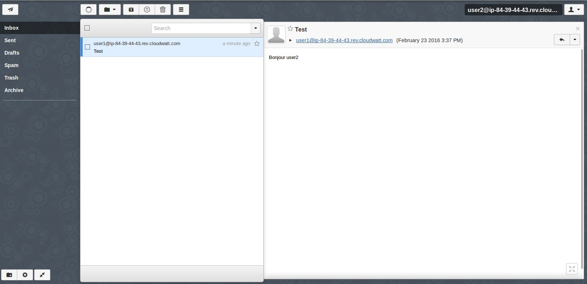
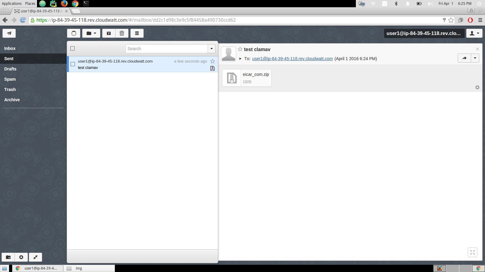
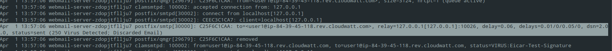
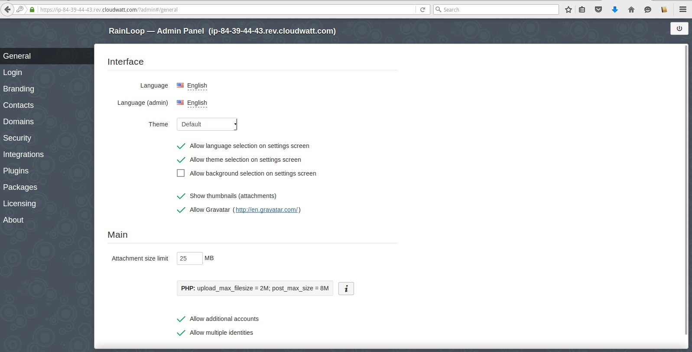

# 5 Minutes Stacks, épisode 25 : Webmail #

## Episode 25 : Webmail

Un serveur de messagerie électronique est un logiciel serveur de courrier électronique (courriel). Il a pour vocation de transférer les messages électroniques d'un serveur à un autre. Un utilisateur n'est jamais en contact direct avec ce serveur mais utilise soit un client de messagerie, soit un Webmail, qui se charge de contacter le serveur pour envoyer ou recevoir les messages.
Dans cet episode nous avons utilisé Rainloop comme webmail opensource qui est développé en PHP et qui se veut complet et simple d'utilisation. Il gère très bien les protocoles IMAP/SMTP et dispose d'une interface moderne (HTML5/CSS3) très érgonomique, c'est plutôt agréable. Du côté des fonctionnalités, on retrouve toutes celles d'un client mail classique, avec en plus un système de plugins.

Dans cet épisode, nous allons vous montrer comment monter votre stack webmail et comment la sécuriser grâce à **ClamAV** et **SpamAssassin**, respectivement un antivirus et un antispam.

## Preparations

### Les versions
 - Ubuntu Trusty 14.04
 - Postfix 2.11.0
 - Postfixadmin-2.93
 - Dovecot 2.2.9
 - SpamAssassin 3.4.0
 - Clamsmtpd 1.10
 - Apache 2.4.7
 - Mysql 5.5.47
 - Rainloop

### Les pré-requis pour déployer cette stack
Ceci devrait être une routine à présent:

* Un accès internet
* Un shell linux
* Un [compte Cloudwatt](https://www.cloudwatt.com/cockpit/#/create-contact) avec une [ paire de clés existante](https://console.cloudwatt.com/project/access_and_security/?tab=access_security_tabs__keypairs_tab)
* Les outils [OpenStack CLI](http://docs.openstack.org/cli-reference/content/install_clients.html)
* Un clone local du dépôt git [Cloudwatt applications](https://github.com/cloudwatt/applications)

### Taille de l'instance
Par défaut, le script propose un déploiement sur une instance de type "Small" (s1.cw.small-1). Il
existe une variété d'autres types d'instances pour la satisfaction de vos multiples besoins. Les instances sont facturées à la minute, vous permettant de payer uniquement pour les services que vous avez consommés et plafonnées à leur prix mensuel (vous trouverez plus de détails sur la [Page tarifs](https://www.cloudwatt.com/fr/produits/tarifs.html) du site de Cloudwatt).

Vous pouvez ajuster les parametres de la stack à votre goût.

### Au fait...

Si vous n’aimez pas les lignes de commande, vous pouvez passer directement à la version ["Je lance avec la console"](#console)...

## Tour du propriétaire

Une fois le dépôt cloné, vous trouverez le répertoire `bundle-trusty-webmail/`

* `bundle-trusty-webmail.heat.yml`: Template d'orchestration HEAT, qui servira à déployer l'infrastructure nécessaire.
* `stack-start.sh`: Scipt de lancement de la stack, qui simplifie la saisie des parametres et sécurise la création du mot de passe admin.
* `stack-get-url.sh`: Script de récupération de l'IP d'entrée de votre stack, qui peut aussi se trouver dans les parametres de sortie de la stack.

## Démarrage

### Initialiser l'environnement

Munissez-vous de vos identifiants Cloudwatt, et cliquez [ICI](https://console.cloudwatt.com/project/access_and_security/api_access/openrc/).
Si vous n'êtes pas connecté, vous passerez par l'écran d'authentification, puis le téléchargement d'un script démarrera. C'est grâce à celui-ci que vous pourrez initialiser les accès shell aux API Cloudwatt.

Sourcez le fichier téléchargé dans votre shell et entrez votre mot de passe lorsque vous êtes invité à utiliser les clients OpenStack.

~~~ bash
$ source COMPUTE-[...]-openrc.sh
Please enter your OpenStack Password:

~~~

Une fois ceci fait, les outils de ligne de commande d'OpenStack peuvent interagir avec votre compte Cloudwatt.

### Ajuster les paramètres

Dans le fichier `bundle-trusty-webmail.heat.yml` vous trouverez en haut une section `parameters`. Le seul paramètre obligatoire à ajuster
est celui nommé `keypair_name` dont la valeur `default` doit contenir le nom d'une paire de clés valide dans votre compte utilisateur.
C'est dans ce même fichier que vous pouvez ajuster la taille de l'instance par le paramètre `flavor`.

~~~ yaml
heat_template_version: 2013-05-23

description: All-in-one Web mail stack

parameters:
  keypair_name:
    label: SSH Keypair
    description: Keypair to inject in instance
    type: string
    default: my-keypair-name                <-- Mettez ici le nom de votre keypair
  mysql_password:
     description: Mysql password
     label: Mysql password
     type: string
     default: changeme                     <-- Mettez ici le mot de passe de votre base de données
  postfix_admin_pass:
     description: postfixadmin password
     label: postfixadmin password
     type: string
     default: changeme                    <-- Mettez ici le mot de passe de votre admin postfix
  mail_domain:
     description: mail domain
     label: mail domain
     type: string
     default: exemple.com                 <-- Mettez ici votre nom de domaine
  flavor_name:
    label: Instance Type (Flavor)
    description: Flavor to use for the deployed instance
    type: string
    default: n2.cw.standard-1
    constraints:
      - allowed_values:
        - t1.cw.tiny
        - s1.cw.small-1
        - n2.cw.standard-1
        - n2.cw.standard-2
        - n2.cw.standard-4
        - n2.cw.standard-8
        - n2.cw.standard-16
        - n2.cw.highmem-2
        - n2.cw.highmem-4
        - n2.cw.highmem-8
        - n2.cw.highmem-12
[...]
~~~
### Démarrer la stack

Dans un shell,lancer le script `stack-start.sh`:

~~~
./stack-start.sh nom_de_votre_stack votre_nom_clé mysql_password postfix_admin_pass mail_domain
~~~

Exemple :

~~~bash
$ ./stack-start.sh EXP_STACK
+--------------------------------------+-----------------+--------------------+----------------------+
| id                                   | stack_name      | stack_status       | creation_time        |
+--------------------------------------+-----------------+--------------------+----------------------+
| ee873a3a-a306-4127-8647-4bc80469cec4 | nom_de_votre_stack       | CREATE_IN_PROGRESS | 2015-11-25T11:03:51Z |
+--------------------------------------+-----------------+--------------------+----------------------+
~~~

Puis attendez **5 minutes** que le déploiement soit complet.

~~~bash
$ heat resource-list nom_de_votre_stack
+------------------+-----------------------------------------------------+---------------------------------+-----------------+----------------------+
| resource_name    | physical_resource_id                                | resource_type                   | resource_status | updated_time         |
+------------------+-----------------------------------------------------+---------------------------------+-----------------+----------------------+
| floating_ip      | 44dd841f-8570-4f02-a8cc-f21a125cc8aa                | OS::Neutron::FloatingIP         | CREATE_COMPLETE | 2015-11-25T11:03:51Z |
| security_group   | efead2a2-c91b-470e-a234-58746da6ac22                | OS::Neutron::SecurityGroup      | CREATE_COMPLETE | 2015-11-25T11:03:52Z |
| network          | 7e142d1b-f660-498d-961a-b03d0aee5cff                | OS::Neutron::Net                | CREATE_COMPLETE | 2015-11-25T11:03:56Z |
| subnet           | 442b31bf-0d3e-406b-8d5f-7b1b6181a381                | OS::Neutron::Subnet             | CREATE_COMPLETE | 2015-11-25T11:03:57Z |
| server           | f5b22d22-1cfe-41bb-9e30-4d089285e5e5                | OS::Nova::Server                | CREATE_COMPLETE | 2015-11-25T11:04:00Z |
| floating_ip_link | 44dd841f-8570-4f02-a8cc-f21a125cc8aa-`floating IP`  | OS::Nova::FloatingIPAssociation | CREATE_COMPLETE | 2015-11-25T11:04:30Z |
+------------------+-----------------------------------------------------+---------------------------------+-----------------+----------------------
~~~

Le script `start-stack.sh` s'occupe de lancer les appels nécessaires sur les API Cloudwatt pour :

* démarrer une instance basée sur Ubuntu trusty, pré-provisionnée avec la stack Webmail
* l'exposer sur Internet via une IP flottante

## C’est bien tout ça,
### mais vous n’auriez pas un moyen de lancer l’application par la console ?

Et bien si ! En utilisant la console, vous pouvez déployer un serveur mail:

1.	Allez sur le Github Cloudwatt dans le répertoire [applications/bundle-trusty-mail](https://github.com/cloudwatt/applications/tree/master/bundle-trusty-webmail)
2.	Cliquez sur le fichier nommé `bundle-trusty-webmail.heat.yml`
3.	Cliquez sur RAW, une page web apparait avec le détail du script
4.	Enregistrez-sous le contenu sur votre PC dans un fichier avec le nom proposé par votre navigateur (enlever le .txt à la fin)
5.  Rendez-vous à la section « [Stacks](https://console.cloudwatt.com/project/stacks/) » de la console.
6.	Cliquez sur « Lancer la stack », puis cliquez sur « fichier du modèle » et sélectionnez le fichier que vous venez de sauvegarder sur votre PC, puis cliquez sur « SUIVANT »
7.	Donnez un nom à votre stack dans le champ « Nom de la stack »
8.	Entrez votre keypair dans le champ « keypair_name »
9.  Donner votre passphrase qui servira pour le chiffrement des sauvegardes
10.	Choisissez la taille de votre instance parmi le menu déroulant « flavor_name » et cliquez sur « LANCER »

La stack va se créer automatiquement (vous pouvez en voir la progression cliquant sur son nom). Quand tous les modules deviendront « verts », la création sera terminée. Vous pourrez alors aller dans le menu « Instances » pour découvrir l’IP flottante qui a été générée automatiquement. Ne vous reste plus qu'à vous connecter en ssh avec votre keypair.

C’est (déjà) FINI !

### Vous n’auriez pas un moyen de lancer l’application en 1-clic ?

Bon... en fait oui ! Allez sur la page [Applications](https://www.cloudwatt.com/fr/applications/index.html) du site de Cloudwatt, choisissez l'appli, appuyez sur DEPLOYER et laisser vous guider... 2 minutes plus tard un bouton vert apparait... ACCEDER : vous avez votre Webmail !

## Enjoy
Une fois tout ceci est fait vous pouvez vous connecter sur l'inteface de postfixamdin via un navigateur web à partir de cet url `https://ip-floatingip.rev.cloudwatt.com/postfixadmin` ou `https://floatingIP/postfixadmin` afin d'ajouter votre domaines et emails pour s'authentifier vous utilisez le login **admin@ip-floatingip.rev.cloudwatt.com** et le password  **password_admin**:

Pour savoir comment administrer le postfixadmin vous pouvez
Consulter ce lien [postfixadmin](http://postfixadmin.sourceforge.net/screenshots/).

Pour consulter les boites emails vous consultez cet url  `https://ip-floatingip.rev.cloudwatt.com/` ou `https://floatingIP`.

Vous devez arriver sur ces pages :

user1 envoie un email à user2.

user2 reçoit l'email de user1.

Pour tester le spamassassin ça marche bien ,envoyez un email qui contient ce texte `XJS*C4JDBQADN1.NSBN3*2IDNEN*GTUBE-STANDARD-ANTI-UBE-TEST-EMAIL*C.34X`
Vous allez avoir un email qui est marqué [SPAM].

Pour tester le ClamAv ça marche bien ,envoyez ce virus `http://eicar.org/download/eicar_com.zip`
Vous n'allez pas recevoir l'email car il va être bloqué par le ClamAv,vous pouvez vérifier les logs dans le fichier `/var/log/mail.log`.

Voici les logs dans le fichier `/var/log/mail.log`.

Dans cet exemple nous avons utilisé le nom de domaine fourni par Cloudwatt(`https://ip-floatingip.rev.cloudwatt.com`  remplacez les "." par "-" de votre floatingIP ( example: ip-10-11-12-13.rev.cloudwatt.com )).

Si vous voulez changer le domaine de votre serveur de mail, afin de pouvoir y paramétrer le votre, voici la méthode:

Dans `/etc/postfix/main.cf` inscrire votre nom de domaine dans les paramètres ci-dessous:

      - mydomain:
      - myhostname:
      - mydestination:

Dans `/etc/apache2/sites-available/vhost.conf` inscrire votre nom de domaine dans les paramètres ci-dessous :

      - ServerName
      - ServerAdmin: ce paramètre permet de définir l'adresse Email de l'administrateur

Dans `/var/www/cw/data/_data_/_default_/domains/domain.ini`:

      - smtp_host
      - imap_host

N'oubliez pas d'éditer les deux fichiers `/etc/hosts` et `/etc/hostname` .

**Redémarrez ensuite  les services suivants Postfix, Dovecot et Apache2**

~~~ bash
# service postfix restart
# service dovecot restart
# service apache2 restart
~~~
Faites un refresh sur l'url `http://floatingIP/`

**Si vous voulez changer la configuration de rainloop**

 Connectez vous sur l'interface d'admin sur l'adresse `https://floatingIP/?admin` ou `https://ip-floatingip.rev.cloudwatt.com/?admin` à partir de votre navigateur. Il faut ensuite s'authenfier avec l'utilisateur **admin** et le mot de passe **12345**.
 

**Pour plus de sécurité** n'oubliez pas de changer le mot de passe admin à partir de cette interface.

Un certificat SSL est automatiquement généré via Let's encrypt et celui-ci est renouvellé via un job CRON tous les 90 jours.
Les signatures Clamav et SpamAssassin sont mises à jour via un job cron chaque jour.
## So watt?

Les chemins intéressants sur votre machine :

`/etc/apache2`: Fichiers de configuration Apache

`/etc/postfix`: Fichiers de configuration Postfix

`/etc/dovecot`: Fichiers de configuration Dovecot

`/etc/clamsmtpd.conf`:Fichier de configuration Clamav

`/etc/spamassassin/`: Fichiers de configuration SpamAssassin

`/var/www/cw/data/_data_/_default_/`: Fichiers de configuration Rainloop

### Autres sources pouvant vous intéresser:
* [ Postfix Home page](http://www.postfix.org/documentation.html)
* [ Dovecot Documentation](http://www.dovecot.org/)
* [ Rainloop Documentation](http://www.rainloop.net)
* [ ClamAv Documentation](http://www.clamav.net/)

----
Have fun. Hack in peace.
