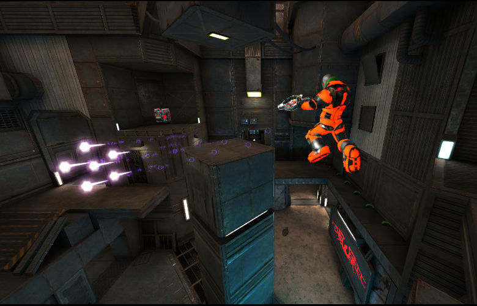
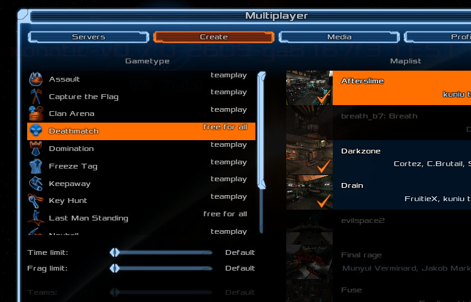

# 5 Minutes Stacks, Episode 18: Xonotic

## Episode 18: Xonotic, the free and fast arena shooter

**Draft - Image not yet available...**

Xonotic is an addictive, arena-style first person shooter with crisp movement and a wide array of weapons. It combines intuitive mechanics with in-your-face action to elevate your heart rate. Xonotic is and will always be free-to-play. It is available under the copyleft-style GPLv2 license.

The game has clients for Windows, Linux, and Mac OS, adapting to any system to provide an excellent play experience. This bundle deploys your personal Xonotic server in minutes, public or private, so that you can start playing with your friends in minutes.

## Préparations

### Les versions

* Xonotic v0.8.1

### Les pré-requis pour déployer cette stack

Ceci devrait être une routine à présent:

* Un accès internet
* Un shell linux
* Un [compte Cloudwatt](https://www.cloudwatt.com/cockpit/#/create-contact) avec une [ paire de clés existante](https://console.cloudwatt.com/project/access_and_security/?tab=access_security_tabs__keypairs_tab)
* Les outils [OpenStack CLI](http://docs.openstack.org/cli-reference/content/install_clients.html)
* Un clone local du dépôt git [Cloudwatt applications](https://github.com/cloudwatt/applications)

### Taille de l'instance

Par défaut, le script propose un déploiement sur une instance de type "Small" (s1.cw.small-1). Il existe une variété d'autres types d'instances pour la satisfaction de vos multiples besoins. Les instances sont facturées à la minute, vous permettant de payer uniquement pour les services que vous avez consommés et plafonnées à leur prix mensuel (vous trouverez plus de détails sur la [Page tarifs](https://www.cloudwatt.com/fr/produits/tarifs.html) du site de Cloudwatt).

Vous pouvez ajuster les parametres de la stack à votre goût.

### Au fait...

Si vous n’aimez pas les lignes de commande, vous pouvez passer directement à la version ["Je lance avec la console ou en 1-clic"](#console)...

## Tour du propriétaire

Une fois le dépôt cloné, vous trouverez le répertoire `bundle-trusty-xonotic/` :

* `bundle-trusty-xonotic.heat.yml`: Template d'orchestration HEAT, qui servira à déployer l'infrastructure nécessaire.
* `stack-start.sh`: Script de lancement de la stack, qui simplifie la saisie des parametres et sécurise la création du mot de passe admin.
* `stack-get-ip.sh`: Script de récupération de l'IP d'entrée de votre stack, qui peut aussi se trouver dans les parametres de sortie de la stack.

## Démarrage

### Initialiser l'environnement

Munissez-vous de vos identifiants Cloudwatt, et cliquez [ICI](https://console.cloudwatt.com/project/access_and_security/api_access/openrc/).
Si vous n'êtes pas connecté, vous passerez par l'écran d'authentification, puis le téléchargement d'un script démarrera. C'est grâce à celui-ci que vous pourrez initialiser les accès shell aux API Cloudwatt.

Sourcez le fichier téléchargé dans votre shell et entrez votre mot de passe lorsque vous êtes invité à utiliser les clients OpenStack.

~~~ bash
$ source COMPUTE-[...]-openrc.sh
Please enter your OpenStack Password:

~~~

Une fois ceci fait, les outils de ligne de commande d'OpenStack peuvent interagir avec votre compte Cloudwatt.

### Ajuster les paramètres

In the `.heat.yml` files (heat templates), you will find a section named `parameters` near the top. The mandatory parameters are the `keypair_name` and the server fields for the Xonotic settings.

You can set the `keypair_name`'s `default` value to save yourself time, as shown below.
Remember that key pairs are created [from the console](https://console.cloudwatt.com/project/access_and_security/?tab=access_security_tabs__keypairs_tab), and only keys created this way can be used.

The server fields provide some settings for the Xonotic server. You can change the server settings later with SSH. You can also adjust (and set the default for) the instance type by playing with the `flavor` parameter accordingly.

~~~ yaml
heat_template_version: 2013-05-23

description: All-in-one Xonotic stack

parameters:
  keypair_name:
    label: SSH Keypair
    description: Keypair to inject in instance
    type: string
    default: my-keypair-name                <-- Indicate your key pair name here

  flavor_name:
    label: Instance Type (Flavor)
    description: Flavor to use for the deployed instance
    type: string
    default: s1.cw.small-1
    constraints:
      - allowed_values:
        [...]

  server_hostname:
    default: Xonotic Server
    label: Xonotic Server Hostname
    description: Server name for public server list
    type: string

  is_shown:
    default: 1
    label: Xonotic Server is Public
    description: Server is included on the public server list
    type: string
    constraints:
      - allowed_values:
        - 0
        - 1

  server_port:
    default: 26000
    label: Xonotic Server Port
    description: Server port for player connections
    type: number
    constraints:
      - range: { min: 1025, max: 65534 }
        description: Must be a valid free port (1025 - 65534)

resources:
  network:
    type: OS::Neutron::Net

  subnet:
    type: OS::Neutron::Subnet
    properties:
      network_id: { get_resource: network }
      ip_version: 4
      cidr: 10.0.1.0/24
      allocation_pools:
        - { start: 10.0.1.100, end: 10.0.1.199 }
[...]
~~~

<a name="startup" />

### Démarrer la stack

Dans un shell, lancer le script `stack-start.sh`:

~~~ bash
$ ./stack-start.sh PLASMABURN «my-keypair-name»
Enter your server hostname: ComeAtMeScrublordImRipped
Creating stack...
+--------------------------------------+------------+--------------------+----------------------+
| id                                   | stack_name | stack_status       | creation_time        |
+--------------------------------------+------------+--------------------+----------------------+
| xixixx-xixxi-ixixi-xiixxxi-ixxxixixi | PLASMABURN | CREATE_IN_PROGRESS | 2025-10-23T07:27:69Z |
+--------------------------------------+------------+--------------------+----------------------+
~~~

Au bout de **5 minutes**, la stack sera totalement opérationnelle. (Vous pouvez utiliser la commande `watch` pour voir le statut en temps réel).

~~~ bash
$ watch -n 1 heat stack-list
+--------------------------------------+------------+-----------------+----------------------+
| id                                   | stack_name | stack_status    | creation_time        |
+--------------------------------------+------------+-----------------+----------------------+
| xixixx-xixxi-ixixi-xiixxxi-ixxxixixi | PLASMABURN | CREATE_COMPLETE | 2025-10-23T07:27:69Z |
+--------------------------------------+------------+-----------------+----------------------+
~~~

### Stack URL with a terminal

Une fois ceci fait, vous pouvez lancer le script `stack-get-ip.sh`.

~~~ bash
$ ./stack-get-ip.sh PLASMABURN
PLASMABURN  70.60.637.17
~~~

As shown above, it will ouput the assigned floating-IP. You can then paste this into Xonotic and immediately get fragging!

<a name="console" />

## C’est bien tout ça, mais...

### Vous n’auriez pas un moyen de lancer l’application par la console ?

Et bien si ! En utilisant la console, vous pouvez déployer votre Xonotic :

1.	Allez sur le Github Cloudwatt dans le dépôt [applications/bundle-trusty-xonotic](https://github.com/cloudwatt/applications/tree/master/bundle-trusty-xonotic) repository
2.	Cliquez sur le fichier nommé `bundle-trusty-xonotic.heat.yml`
3.	Cliquez sur RAW, une page web apparait avec les détails du template
4.	Enregistrez le fichier sur votre PC. Vous pouvez utiliser le nom proposé par votre navigateur (il faudrait juste enlever le .txt)
5.  Allez dans la section «[Stacks](https://console.cloudwatt.com/project/stacks/)»  de la console
6.	Cliquez sur «Launch stack», puis «Template file» et sélectionner le fichier que vous venez d'enregistrer sur votre PC, et pour finir cliquez sur «NEXT»
7.	Donnez un nom à votre stack dans le champ «Stack name»
8.	Entrez le nom de votre keypair dans le champ «SSH Keypair»
9.	Entrez le mot de passe que vous avez choisi pour l'utilisateur par defaut *admin*
10.	Choisissez la taille de votre instance dans le menu déroulant « Type d'instance » et cliquez sur «LANCER»

La stack va se créer automatiquement (vous pourrez voir la progression en cliquant sur son nom). Quand tous les modules passeront au vert, la création sera terminée. Vous pourrez alors aller dans le menu « Instances » pour retrouver l’IP flottante qui a été générée, ou rafraichir la page en cours pour avoir le lien.

Si vous avez atteint ce point, alors votre stack est fonctionnelle ! Profitez de Xonotic.

### Vous n’auriez pas un moyen de lancer l’application en 1-clic ?

Bon... en fait oui ! Allez sur la page [Applications](https://www.cloudwatt.com/fr/applications/index.html) du site de Cloudwatt, choisissez l'appli, appuyez sur DEPLOYER et laisser vous guider... 2 minutes plus tard un bouton vert apparait... ACCEDER : Jouer maintenant !

## So watt?

Le but de ce tutoriel est d'accélerer votre démarrage. Dès à présent, **vous** êtes maître(sse) à bord.

The default game mode is deathmatch, but the admin can change that with SSH. Go to multiplayer and enjoy yourself!

Modify the server settings by connecting with SSH and heading to the file `/opt/xonotic/.xonotic/data/server.cfg`. Edit the contents to your liking and then run the command

~~~ bash
$ sudo initctl restart xonotic
~~~

to reload the configuration. Try some capture the flag, or add some bots!

## The State of Affairs

This bundle deploys a stable Xonotic setup that is resource-light and quick to launch, but can be very fast and even support dozens of players on a high-cpu instance.

#### Les dossiers importants sont:

- `/opt/xonotic`: Xonotic home directory
- `/opt/xonotic/.xonotic/data/server.cfg`: Xonotic server configuration

#### Autres ressources qui pourraient vous être utiles :

* [Xonotic Homepage](http://www.xonotic.org/)
* [Xonotic Wiki](https://gitlab.com/xonotic/xonotic/wikis/home)
* [Xonotic Official Game Download](http://dl.xonotic.org/xonotic-0.8.1.zip)

-----
Have fun. Hack in peace.
