# 5 Minutes Stacks, XX episode : Bundle Windows RDS #
############ TODO ##################

Remote Desktop Services (RDS) est une solution logiciel provenant de Microsoft pour exposer des applications à des utilisateurs sans avoir besoin de les installer sur les ordinateurs des utilisateurs. 

Les applications peuvent être exposées soit à partir des bureaux virtuels (fonctionnalité "Remote Desktops") accédés par le protocole RDP,  soit individuellement dans leur propres fenêtres, par le mécanisme de virtulization aplicative (fonctionnalité "RemoteApp").

 RDS se compose des rôles et fonctionnalités de Windows Server et se base une architecture flexible et puissante. Un ferme RDS implique en même temps un déploiement distribué sur plusieurs serveurs. Pour plus de détails sur les principes et l'architecture RDS,  aller à [cet article](https://blogs.technet.microsoft.com/yungchou/2010/01/04/remote-desktop-services-rds-architecture-explained). 

Afin de simplifier drastiquement ce déploiement sur Cloudwatt, nous avons préparé pour vous une stack Heat dédiée. 

Le scénario couvert est la publication (sur internet) de bureaux mobiles sécurisés via une ferme RDS d'essai. Cette configuration d'essai pourra ensuite se faire évoluer dans une ferme de production. 

La stack RDS inclut 3 serveurs : 

 1. Controller de Domaine (contenant aussi le rôle de Licence Server RDS) 
 2. Serveur RDS Principal : contient les rôles Gateway, Web Access, and Connection Broker
 3. Session Host (hôte de session) #01: un premier serveur d'une pool de machines contenant le rôle Session Host, la configuration de bureau et les applications à exposer à distance. 

Dans la stack proposée, tous les trois serveurs sont basés sur des images Windows Server 2012 R2, avec entre 1 et 2 vCPUs et totalisant 4 vCPUs. En fonction des performances désirées (ex. nombre d'utilisateurs, complexité de l'applicatif), les serveurs sont sujet à une mise à l'échelle (changement de taille des machines). 

## Déploiement de la stack Remote Desktop Services

Le déploiement se fait de manière très simple, comme pour n'importe quelle autre stack Cloudwatt : en sélectionnant le fichier de configuration de la stack [bundle-windows-rds.heat.yml](bundle-windows-rds.heat.yml) et en remplissant les paramètres associés :

  - key_name:  
    type: string  
    description: Le nom d'une KeyPair afin de pouvoir accéder individuellement à distances les instances Windows
  - ad_srv_name:  
    type: string  
    description : Le nom du serveur Domain Controller (Active Directory) dans la ferme [NE PAS CHANGER, GARDER VALEUR DEFAUT]  
    default: rds-farm-ad
  - rds_gw_name:  
    type: string  
    description: Le nom du serveur principal RDS dans la ferme [NE PAS CHANGER, GARDER VALEUR DEFAUT]  
    default: rds-farm-gw
  - rds_shost_name:  
    type: string  
    description: Le nom du premier serveur Session Host dans la ferme [NE PAS CHANGER, GARDER VALEUR DEFAUT]  
    default: rds-farm-sh01  
  - rds_shost_image:  
    type: string  
    description: L'ID de l'image pour le (premier) serveur Session Host  
    default: (l'ID de l'image Windows Server 2012 R2 EN)
  - domain_name:  
    type: string  
    description: Le nom du domaine Active Directory qui sera configuré  
    default: rdsfarm.local
  - domain_netbios:  
    type: string  
    description: Le nom NetBios du domaine Active Directory qui sera configuré  
    default: RDSFARM
  - domain_password:  
    type: string  
    description: Le mot de passe administratif du domaine Active Directory qui sera configuré  
    default: Pa$$w0rd
  - ad_ip: 
    type: string  
    description: L'IP du serveur Controlleur de Domaine (AD)  
    default: 10.0.250.100  
  - floating_network_id:   
    type: string  
    description: L'ID du floating network à utiliser pour l'IP public qui sera provisionné   

Avertissement : à ce stade, il faudra garder les valeurs défaut pour certains paramétres dans la stack : ad_srv_name, rds_gw_name, rds_shost_name.

Autres valeurs importantes à connaître (utilisées en dur à ce stade) :

- Nom du compte administrateur de domaine (case insensitive) : Administrator  
  (Utiliser combiné avec le nom du domaine; ex : rdsfarm\administrator) 
- Le mode du domaine : Win2012R2
- Collection RDS : RDS Demo Collection 
- Base de données de domaine : uniquement sur le disque C (C:\Windows\SYSVOL)
- Utilisateur(s) de session RDP : le même = Administrator
- Mot de passe du certificat à installer (voir ci-dessous) : le même (par défaut: Pa$$w0rd) 

Le déploiement dure jusqu'à 10 minutes (attention, même si la stack est marquée comme terminée, la plupart des configurations se passe après cela, au niveau des serveurs). 

## Vérification du déploiement

Comment vérifier l'état du déploiement ?

### 1. Connection au portail web RDS de la ferme

Dans un navigateur, se connecter à l'adresse :  
https://[Cloudwatt-public-address]/RDWeb  
 où "Cloudwatt public address" est le sousdomaine d'adresse publique réservé par Cloudwatt; cela correspond à la valeur de l'IP public fourni par la plateforme Cloudwatt, transformée après le pattern suivant: ip-[N1]-[N2]-[N3]-[N4].rev.cloudwatt.com/RDWeb

Exemple : https://ip-123-45-67-89.rev.cloudwatt.com/RDWeb

(Note : vous pourrez accéder aussi l'endpoint via l'IP public directement, mais vous aurez un avertissement/erreur de certificat non valide.)

A ce point, vous serez redirigé vers la page suivante:

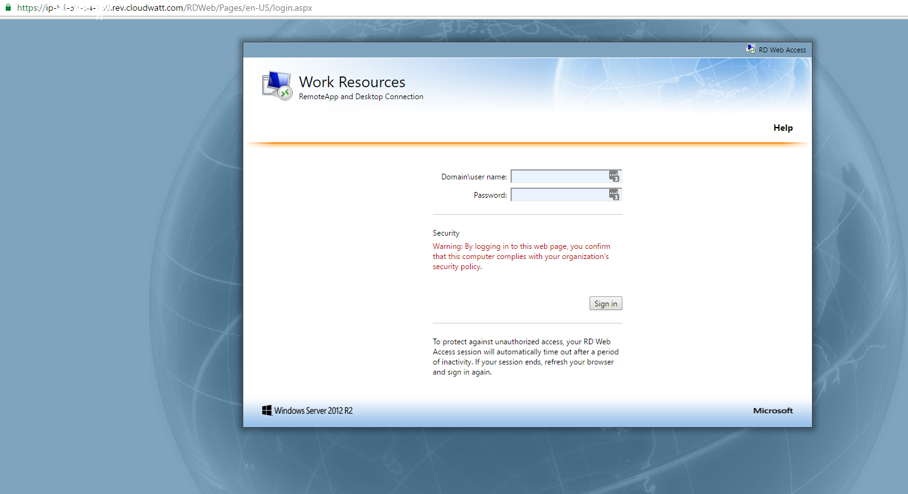

Connectez-vous avec les credentiels configurés (par défaut : rdsfarm\administrator | Pa$$w0rd ) et vous arriveres sur le dashboard de RDS Web Access :

### 2. Installation locale de certificat

Afin de pouvoir vous connecter à une session RDP de votre ferme RDS depuis une machine hors cloud (plus précisément hors domaine local de la ferme), vous devez installer localement un certificat (fourni par ferme, dans la version initiale).

L'exemple suivant corespond à une configuration de machine Windows. Vous aurez besoin de droits d'administrateur local sur la machine.

Une fois la session sur le portail web RDS ouverte, vous pouvez télécharger le certificat à l'adresse :

https://[Cloudwatt-public-address]/RDWeb/RDSCertificate.pfx

(adresse typique :
https://ip-123-45-67-89.rev.cloudwatt.com/RDWeb/RDSCertificate.pfx )

Une fois ce fichier téléchargé localement, double-click sur le fichier certificat :

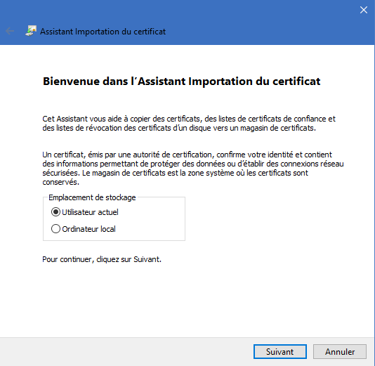

ATTENTION : Sélectionnez "Ordinateur Local" ("Local Machine" en anglais) et pas "Utilisateur Local" ("Local User") : 

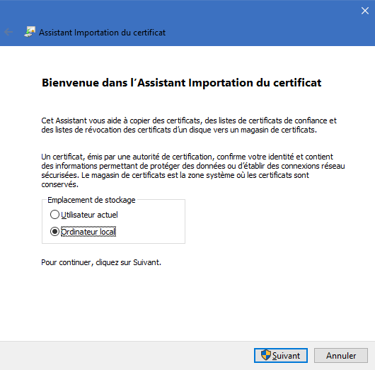

Vous aurez par la suite besoin de confirmer l'action en tant qu'administrateur de la machine.  
Confirmez ensuite le chemin du certificat à importer (rien à changer) :

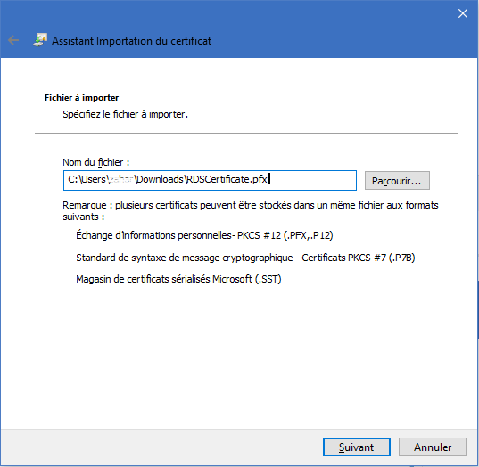

Tapez ensuite le mot de passe du certificat (le même que celui administratif, par défaut: Pa$$w0rd )

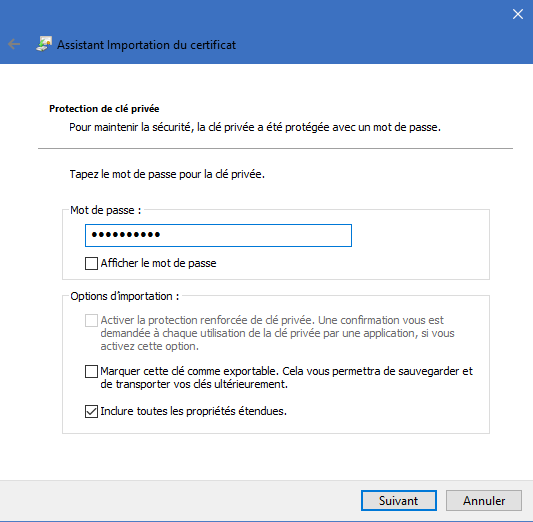

Important : ensuite sélectionnez "Placer dans le magasin suivant", puis "Authorités de certification racines de confiance" ("Trusted Root Certificates" en anglais)

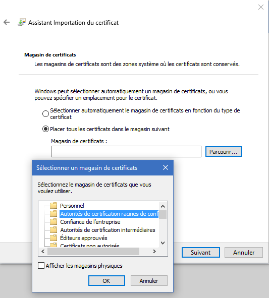

A la fin confirmez tout le processus :

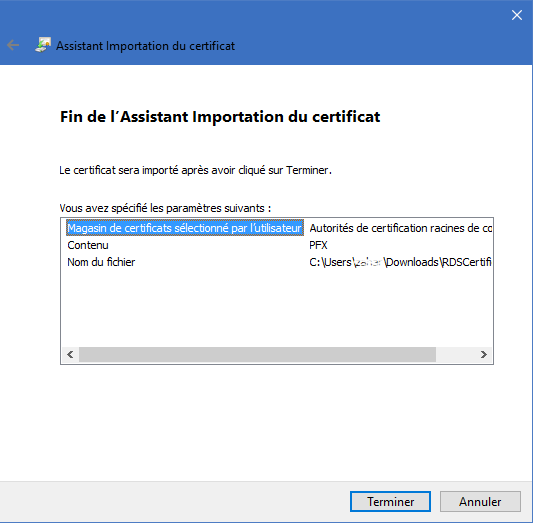

Après l'importation du certificat, vous aurez la confirmation :

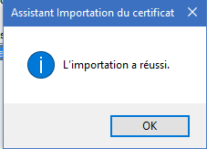

### 3. Démarrage d'une session de bureau à distance (RDP)

A ce stade vous pourrez profiter de la ferme RDS provisionnée.

Dans le portail d'accès web RDS, cliquez sur l'icone de la collection "RDS Demo Collection" dans notre cas); vous téléchargerez alors un fichier RDP (nommé typiquement cpub-RDS_Demo_Collect-RDS_Demo_Collect-CmsRdsh.rdp ). 

Ouvrez ce fichier avec une application client RDP :

Une fois sélectionner Connexion, vous devez saisir les credentiels d'utilisateur de session RDS :

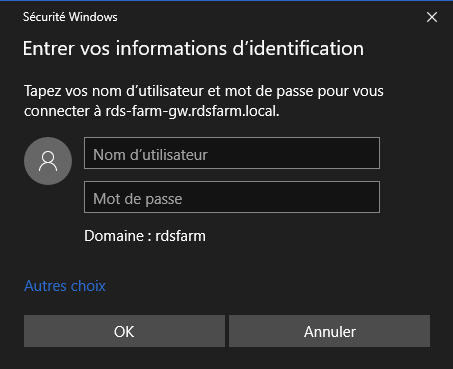

Pour simplicité on utilise les mêmes credentiels que ci-dessus. La première connexion prendra quelques minutes pour le provisionnement :

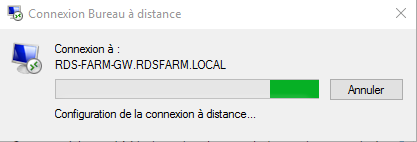

Si le certificat n'est pas servi d'une authorité de confiance (le cas pour l'installation défaut de cette ferme), le message suivant apparaît :

Après ignorer cet avertissement, vous aurez une fenetre de connexion à distance à une session de bureau réservée pour vous dans la ferme : 

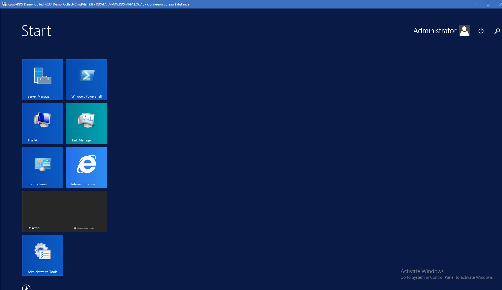
