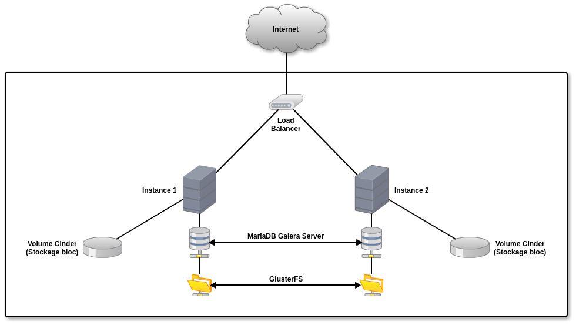
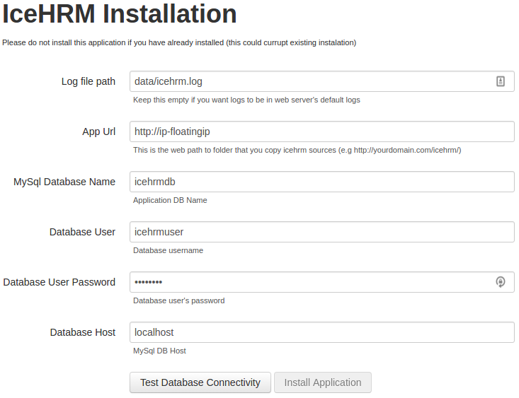
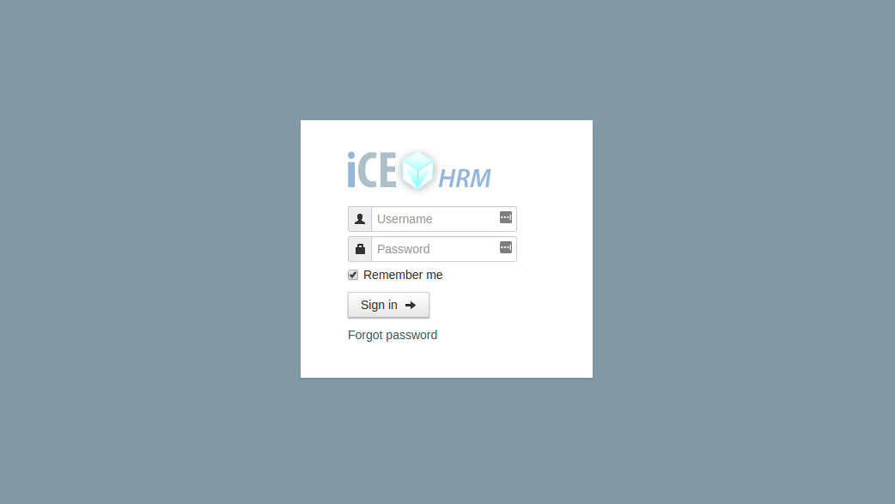
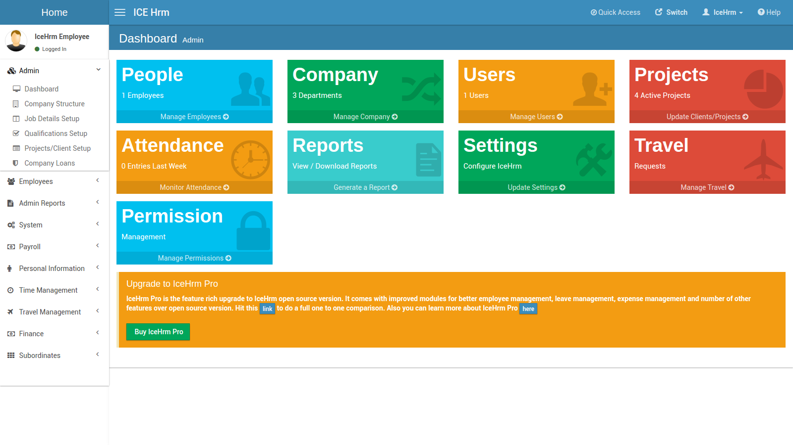

# 5 Minutes Stacks, épisode 52 : iceHRM #

## Episode 52 : iceHRM

WORK IN PROGRESS .....

iceHRM est un outil de Ressources Humaines permettant de gérer une entreprise et ses salariés. Il est ainsi possible d'y enregistrer leurs informations personnelles, de gérer les plannings et les absences, de générer des fiches de paie, mais aussi de mettre en place des projets.

L'interface de iceHRM permet une utilisation intuitive de l'outil.

iceHRM est développé en PHP et utilise une base de données MariaDB pour sauvegarder les informations diverses.

Cet épisode va vous permettre de déployer iceHRM de manière hautement disponible (HA) sur deux instances derrière un load-balancer, les deux instances étant répliquées mutuellement en temps réel.

## Préparations

### Les versions
 - Ubuntu 16.04
 - Apache 2.4.18
 - MariaDB Galera Cluster 5.5.53
 - GlusterFS 3.7.6
 - iceHRM 18.0.OS

### Les pré-requis pour déployer cette stack

Ceci devrait être une routine à présent :
 * Un accès internet
 * Un shell linux
 * Un [compte Cloudwatt](https://www.cloudwatt.com/cockpit/#/create-contact) avec une [paire de clés existante](https://console.cloudwatt.com/project/access_and_security/?tab=access_security_tabs__keypairs_tab)
 * Les outils [OpenStack CLI](http://docs.openstack.org/cli-reference/content/install_clients.html)
 * Un clone local du dépôt git [Cloudwatt applications](https://github.com/cloudwatt/applications)

### Taille de l'instance
Par défaut, le script propose un déploiement sur deux instances de type "standard-1" (n1.cw.standard-1). Il existe une variété d'autres types d'instances pour la satisfaction de vos multiples besoins. Les instances sont facturées à la minute, vous permettant de payer uniquement pour les services que vous avez consommés et plafonnées à leur prix mensuel (vous trouverez plus de détails sur la [Page tarifs](https://www.cloudwatt.com/fr/produits/tarifs.html) du site de Cloudwatt).

 Vous pouvez ajuster les parametres de la stack à votre goût.

### Au fait...

Si vous n’aimez pas les lignes de commande, vous pouvez passer directement à la version ["Je lance avec la console"](#console)...

## Tour du propriétaire

Une fois le dépôt cloné, vous trouverez le répertoire `blueprint-xenial-icehrm/`

* `bundle-xenial-icehrm.heat.yml`: Template d'orchestration HEAT, qui servira à déployer l'infrastructure nécessaire.
* `stack-start.sh`: Script de lancement de la stack, qui simplifie la saisie des parametres et sécurise la création du mot de passe admin.
* `stack-get-url.sh`: Script de récupération de l'IP d'entrée de votre stack, qui peut aussi se trouver dans les parametres de sortie de la stack.

## Démarrage

### Initialiser l'environnement

Munissez-vous de vos identifiants Cloudwatt, et cliquez [ICI](https://console.cloudwatt.com/project/access_and_security/api_access/openrc/).
Si vous n'êtes pas connecté, vous passerez par l'écran d'authentification, puis le téléchargement d'un script démarrera. C'est grâce à celui-ci que vous pourrez initialiser les accès shell aux API Cloudwatt.

Sourcez le fichier téléchargé dans votre shell et entrez votre mot de passe lorsque vous êtes invité à utiliser les clients OpenStack.

 ~~~ bash
 $ source COMPUTE-[...]-openrc.sh
 Please enter your OpenStack Password:

 ~~~

Une fois ceci fait, les outils de ligne de commande d'OpenStack peuvent interagir avec votre compte Cloudwatt.

### Ajuster les paramètres

Dans le fichier `bundle-xenial-icehrm.heat.yml` vous trouverez en haut une section `parameters`. Les paramètres obligatoires à ajuster sont `keypair_name` et `sqlpass` dont la valeur `default` doit contenir respectivement le nom d'une paire de clés valide dans votre compte utilisateur et le mot de passe de votre choix pour la base de données de iceHRM. 
C'est dans ce même fichier que vous pouvez ajuster la taille de l'instance par le paramètre `flavor`.

~~~ yaml
heat_template_version: 2013-05-23

description: All-in-one iceHRM stack

parameters:
  keypair_name:
    description: Keypair to inject in instances
    label: SSH Keypair
    type: string

  flavor_name:
    default: n1.cw.standard-1
    description: Flavor to use for the deployed instance
    type: string
    label: Type instance - Instance Type (Flavor)
    constraints:
      - allowed_values:
          - t1.cw.tiny
          - s1.cw.small-1
          - n1.cw.standard-1
          - n1.cw.standard-2
          - n1.cw.standard-4
          - n1.cw.standard-8
          - n1.cw.standard-12
          - n1.cw.standard-16
          - n1.cw.highmem-2
          - n1.cw.highmem-4
          - n1.cw.highmem-8
[...]
~~~
### Démarrer la stack

Dans un shell, lancer le script `stack-start.sh` en passant en paramètre le nom que vous souhaitez lui attribuer :

~~~ bash
 $ ./stack-start.sh iceHRM
+--------------------------------------+-----------------------+--------------------+----------------------+
| id                                   | stack_name            | stack_status       | creation_time        |
+--------------------------------------+-----------------------+--------------------+----------------------+
| 4785c76e-3681-4b02-8a91-a7a3cc4a6440 | iceHRM                | CREATE_IN_PROGRESS | 2016-12-21T13:53:56Z |
+--------------------------------------+-----------------------+--------------------+----------------------+
~~~

Enfin, attendez **5 minutes** que le déploiement soit complet.

 ~~~ bash
 $ watch heat resource-list iceHRM
+-----------------------+------------------------------------+-----------------+----------------------+
| resource_name         | resource_type                      | resource_status | updated_time         |
+-----------------------+------------------------------------+-----------------+----------------------+
| inst1                 | OS::Nova::Server                   | CREATE_COMPLETE | 2016-12-21T13:53:57Z |
| inst1_cinder          | OS::Heat::ResourceGroup            | CREATE_COMPLETE | 2016-12-21T13:53:57Z |
| inst1_port            | OS::Neutron::Port                  | CREATE_COMPLETE | 2016-12-21T13:53:57Z |
| inst2                 | OS::Nova::Server                   | CREATE_COMPLETE | 2016-12-21T13:53:57Z |
| inst2_cinder          | OS::Heat::ResourceGroup            | CREATE_COMPLETE | 2016-12-21T13:53:57Z |
| inst2_port            | OS::Neutron::Port                  | CREATE_COMPLETE | 2016-12-21T13:53:57Z |
| lbaas                 | OS::Neutron::LoadBalancer          | CREATE_COMPLETE | 2016-12-21T13:53:57Z |
| lbaas_pool            | OS::Neutron::Pool                  | CREATE_COMPLETE | 2016-12-21T13:53:57Z |
| lbaas_pool_vip        | OS::Neutron::FloatingIPAssociation | CREATE_COMPLETE | 2016-12-21T13:53:57Z |
| lbaas_vip_floating_ip | OS::Neutron::FloatingIP            | CREATE_COMPLETE | 2016-12-21T13:53:57Z |
| lbaas_vip_port        | OS::Neutron::Port                  | CREATE_COMPLETE | 2016-12-21T13:53:57Z |
| network               | OS::Neutron::Net                   | CREATE_COMPLETE | 2016-12-21T13:53:57Z |
| security_group        | OS::Neutron::SecurityGroup         | CREATE_COMPLETE | 2016-12-21T13:53:57Z |
| subnet                | OS::Neutron::Subnet                | CREATE_COMPLETE | 2016-12-21T13:53:57Z |
+-----------------------+------------------------------------+-----------------+----------------------+
 ~~~

   Le script `start-stack.sh` s'occupe de lancer les appels nécessaires sur les API Cloudwatt pour :

   * démarrer deux instances basées sur Ubuntu Xenial, pré-provisionnées avec la stack iceHRM

   * l'exposer sur Internet via une IP flottante.

<a name="console" />

## C’est bien tout ça, mais...

### Vous n’auriez pas un moyen de lancer l’application par la console ?

Et bien si ! En utilisant la console, vous pouvez déployer iceHRM :

1.	Allez sur le Github Cloudwatt dans le répertoire [applications/bundle-xenial-icehrm](https://github.com/cloudwatt/applications/tree/master/bundle-xenial-icehrm)
2.	Cliquez sur le fichier nommé `bundle-xenial-icehrm.heat.yml`
3.	Cliquez sur RAW, une page web apparait avec le détail du script
4.	Enregistrez-sous le contenu sur votre PC dans un fichier avec le nom proposé par votre navigateur (enlever le .txt à la fin)
5.  Rendez-vous à la section « [Stacks](https://console.cloudwatt.com/project/stacks/) » de la console.
6.	Cliquez sur « Lancer la stack », puis cliquez sur « fichier du modèle » et sélectionnez le fichier que vous venez de sauvegarder sur votre PC, puis cliquez sur « SUIVANT »
7.	Donnez un nom à votre stack dans le champ « Nom de la stack »
8.	Entrez votre keypair dans le champ « keypair_name »
9.  Donnez votre passphrase qui servira pour le compte icehrmuser de votre base de données
10.	Choisissez la taille de votre instance parmi le menu déroulant « flavor_name » et cliquez sur « LANCER »

La stack va se créer automatiquement (vous pouvez en voir la progression cliquant sur son nom). Quand tous les modules deviendront « verts », la création sera terminée. Vous trouverez dans les informations de sortie de la stack l’IP flottante qui a été générée automatiquement.

C’est (déjà) FINI !

### Vous n’auriez pas un moyen de lancer l’application en 1-clic ?

Bon... en fait oui ! Allez sur la page [Applications](https://www.cloudwatt.com/fr/applications/) du site de Cloudwatt, choisissez l'appli, appuyez sur DEPLOYER et laisser vous guider... 2 minutes plus tard un bouton vert apparait... ACCEDER : vous avez accès à iceHRM !

## Enjoy

Vous êtes maintenant en possession de iceHRM. Vous pouvez y acceder via l'url `http://ip-floatingip`. Votre url complète sera présente dans la vue d'ensemble de votre stack sur la console horizon Cloudwatt.

La stack se compose ainsi :

Lors de votre première connexion, il vous sera demandé de saisir les informations pour accéder à la base de données ; remplissez les champs comme ci-dessous, le mot de passe étant celui choisi lors de la création de la stack :

L'identifiant et le mot de passe par défaut pour vous connecter à iceHRM sont `admin`.

Vous pouvez maintenant découvrir l'interface de iceHRM :

Vous pouvez à présent mettre en place votre outil de Ressources Humaines, celui-ci étant hébergé en France dans un environnement maîtrisé, vous pouvez avoir une totale confiance dans ce produit.

## So watt ?

Ce tutoriel a pour but d'accélerer votre démarrage. A ce stade **vous** êtes maître(sse) à bord.

Quelques liens utiles:

* [Home iceHRM](https://www.icehrm.com/)
* [Help iceHRM](http://blog.icehrm.com/docs/home/)

----
Have fun. Hack in peace.
