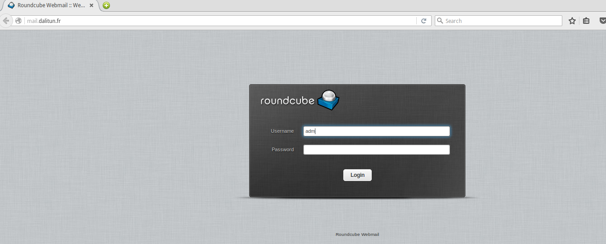
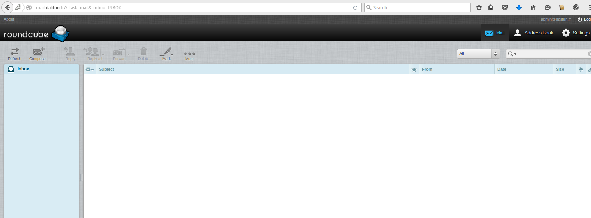
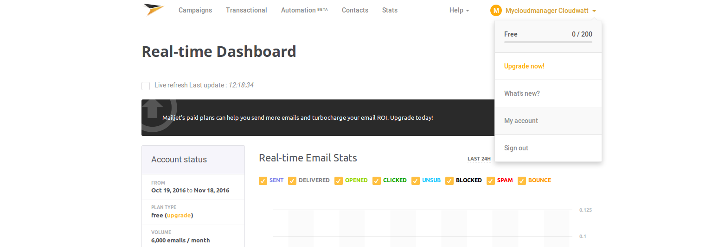
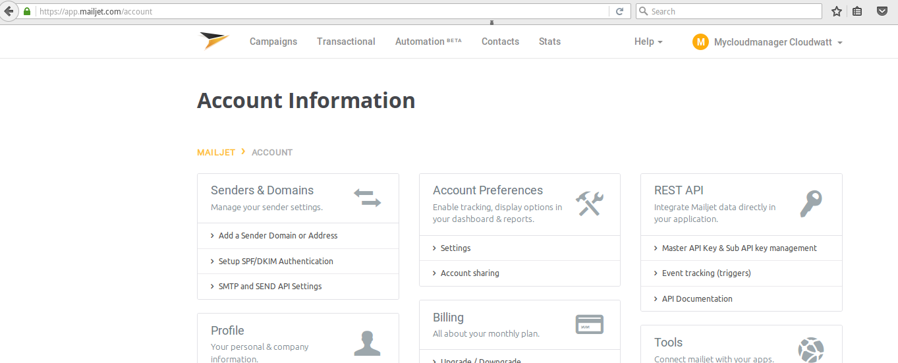
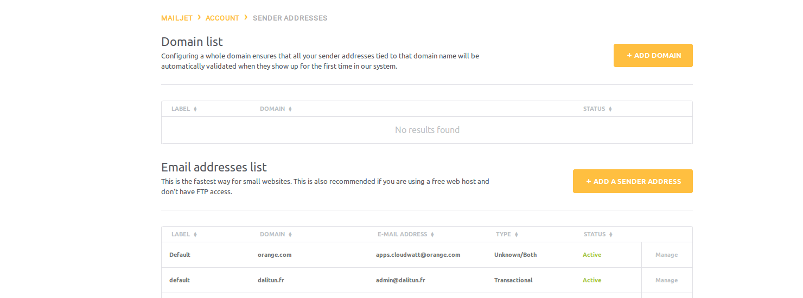
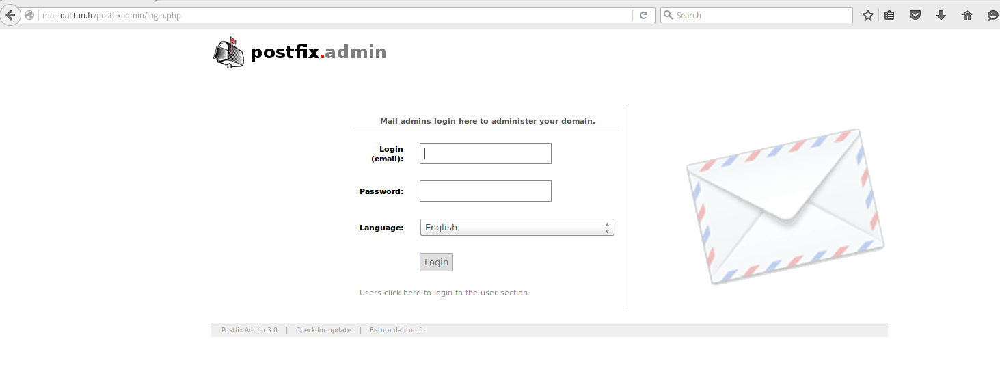

# 5 Minutes Stacks, 45 episode : Webmail with email providers (relay SMTP) #

## Episode 45 : Webmail with email providers

An email server is a mail server software (email). It aims to transfer emails from one server to another. An user is never in direct contact with this server uses either a mail client or a webmail client, which is responsible to contact the server to send or receive messages.
In this episode we used Roundcube as open source webmail that is developed in PHP and designed to be comprehensive and easy to use. It manages very well IMAP / SMTP protocols and has a modern interface (HTML5 / CSS3) very ergonomic, it is rather pleasant. In terms of features, there are all those of a conventional mail client, plus a system of plugins.

In this episode we'll show you how to build your stack webmail using email service like Mailjet.
There are many email providers service as SendGrid, Mandrill, Sendy ...

## Preparations

### The version
 - Ubuntu Xenial 16.04
 - Postfix 3.1.0
 - Postfixadmin 3.0
 - Dovecot 2.2.22
 - Apache 2.4.18
 - Mysql 5.7.16
 - Roundcube

### The prerequisites to deploy this stack

 * an internet acces
 * a Linux shell
 * a [Cloudwatt account](https://www.cloudwatt.com/cockpit/#/create-contact), with an [existing keypair](https://console.cloudwatt.com/project/access_and_security/?tab=access_security_tabs__keypairs_tab)
 * the tools [OpenStack CLI](http://docs.openstack.org/cli-reference/content/install_clients.html)
 * a local clone of the git repository [Cloudwatt applications](https://github.com/cloudwatt/applications)

### Size of the instance

 Per default, the script is proposing a deployement on an instance type "Standard" (n2.cw.standard-1).  Instances are charged by the minute and capped at their monthly price (you can find more details on the [Tarifs page](https://www.cloudwatt.com/fr/produits/tarifs.html) on the Cloudwatt website). Obviously, you can adjust the stack parameters, particularly its defaut size.

### By the way...

 If you do not like command lines, you can go directly to the "run it through the console" section by clicking [here](#console)

## What will you find in the repository

 Once you have cloned the github, you will find in the `bundle-xenial-webmail-with-email-providers/` repository:

 * `bundle-xenial-webmail-with-email-providers.heat.yml`: HEAT orchestration template. It will be use to deploy the necessary infrastructure.
 * `stack-start.sh`: Stack launching script. This is a small script that will save you some copy-paste.
 * `stack-get-url.sh`: Flotting IP recovery script.

## Start-up

### Initialize the environment

 Have your Cloudwatt credentials in hand and click [HERE](https://console.cloudwatt.com/project/access_and_security/api_access/openrc/).
 If you are not logged in yet, you will go thru the authentication screen then the script download will start. Thanks to it, you will be able to initiate the shell accesses towards the Cloudwatt APIs.

 Source the downloaded file in your shell. Your password will be requested.

 ~~~ bash
 $ source COMPUTE-[...]-openrc.sh
 Please enter your OpenStack Password:

 ~~~

Once this done, the Openstack command line tools can interact with your Cloudwatt user account.

### Adjust the parameters

 With the `bundle-xenial-webmail-with-email-providers.heat.yml` file, you will find at the top a section named `parameters`.In order to be able to deploy your stack without problems, you complete all the parameters below.This is within this same file that you can adjust the instance size by playing with the flavor parameter.

 ~~~ yaml
 [...]
 parameters:
   keypair_name:
     description: Keypair to inject in instance
     label: SSH Keypair
     type: string
     default: my-keypair-name                  <-- Indicate here your keypair
   admin_pass:
     description: admin password
     label: admin password
     type: string
     default: changeme                         <-- Indicate here your admin password
   mail_domain:
     description: mail domain
     label: mail domain
     type: string
     default: exemple.com                       <-- Indicate here your domain name
   hostname:
      description: host name machine
      label: hostname
      type: string
      default: mail                             <-- Indicate here machine hostname
   smtp_server:
      description: smtp server Mailjet or SenGrid
      label: relay SMTP
      type: string
      default: in-v3.mailjet.com                <-- Indicate here smtp relay server name
   smtp_username:
      description: Username (API Key)
      label: Username (API Key)
      type: string
      default: xxxxxxxxxxxxxxxxxxxxxxxxxxxxx    <-- Indicate here the username (API Key)
   smtp_password:
      description: Password (Secret Key)
      label: Password (Secret Key)
      type: string
      default: xxxxxxxxxxxxxxxxxxxxxxxxxxxxxx   <-- Indicate here the  password (Secret Key)
   flavor_name:
     default: n2.cw.standard-1                  <-- Indicate here the flavor size
     description: Flavor to use for the deployed instance
     type: string
     label: Openstack Flavor
     constraints:
       - allowed_values:
         - t1.cw.tiny
         - s1.cw.small-1
         - n2.cw.standard-1
         - n2.cw.standard-2
         - n2.cw.standard-4
         - n2.cw.standard-8
         - n2.cw.standard-16
         - n2.cw.highmem-2
         - n2.cw.highmem-4
         - n2.cw.highmem-8
         - n2.cw.highmem-16
 [...]
 ~~~
 
### Start stack

 In a shell, run the script `stack-start.sh`:

 ~~~ bash
 ./stack-start.sh your_stack_name
 ~~~
 Exemple :

 ~~~bash
 $ ./stack-start.sh EXP_STACK

 +--------------------------------------+------------+--------------------+----------------------+
 | id                                   | stack_name | stack_status       | creation_time        |
 +--------------------------------------+------------+--------------------+----------------------+
 | xixixx-xixxi-ixixi-xiixxxi-ixxxixixi | your_stack_name | CREATE_IN_PROGRESS | 2025-10-23T07:27:69Z |
 +--------------------------------------+------------+--------------------+----------------------+
 ~~~

 Wait **5 minutes** the stack will be fully operational. (Use watch to see the status in real-time)

 ~~~ bash
 $ watch -n 1 heat stack-list
 +--------------------------------------+------------+-----------------+----------------------+
 | id                                   | stack_name | stack_status    | creation_time        |
 +--------------------------------------+------------+-----------------+----------------------+
 | xixixx-xixxi-ixixi-xiixxxi-ixxxixixi | your_stack_name | CREATE_COMPLETE | 2025-10-23T07:27:69Z |
 +--------------------------------------+------------+-----------------+----------------------+
 ~~~
 ~~~bash
$ watch heat resource-list your_stack_name
+------------------+-----------------------------------------------------+---------------------------------+-----------------+----------------------+
| resource_name    | physical_resource_id                                | resource_type                   | resource_status | updated_time         |
+------------------+-----------------------------------------------------+---------------------------------+-----------------+----------------------+
| floating_ip      | 44dd841f-8570-4f02-a8cc-f21a125cc8aa                | OS::Neutron::FloatingIP         | CREATE_COMPLETE | 2016-11-04T11:03:51Z |
| security_group   | efead2a2-c91b-470e-a234-58746da6ac22                | OS::Neutron::SecurityGroup      | CREATE_COMPLETE | 2016-11-04T11:03:52Z |
| network          | 7e142d1b-f660-498d-961a-b03d0aee5cff                | OS::Neutron::Net                | CREATE_COMPLETE | 2016-11-04T11:03:56Z |
| subnet           | 442b31bf-0d3e-406b-8d5f-7b1b6181a381                | OS::Neutron::Subnet             | CREATE_COMPLETE | 2016-11-04T11:03:57Z |
| server           | f5b22d22-1cfe-41bb-9e30-4d089285e5e5                | OS::Nova::Server                | CREATE_COMPLETE | 2016-11-04T11:04:00Z |
| floating_ip_link | 44dd841f-8570-4f02-a8cc-f21a125cc8aa-`floating IP`  | OS::Nova::FloatingIPAssociation | CREATE_COMPLETE | 2016-11-04T11:04:30Z |
+------------------+-----------------------------------------------------+---------------------------------+-----------------+----------------------
~~~

The `start-stack.sh` script takes care of running the API necessary requests to execute the normal heat template which:

* Starts an Ubuntu Xenial based instance
* Expose it on the Internet via a floating IP.

## All of this is fine,
### but you do not have a way to create the stack from the console?

We do indeed! Using the console, you can deploy a mail server:

1.	Go the Cloudwatt Github in the [applications/bundle-xenial-webmail-with-email-providers]https://github.com/cloudwatt/applications/tree/master/bundle-xenial-webmail-with-email-providers) repository
2.	Click on the file named `bundle-xenial-webmail-with-email-providers.heat.yml` (or `bundle-xenial-webmail-with-email-providers.restore.heat.yml` to [restore from backup](#backup))
3.	Click on RAW, a web page will appear containing purely the template
4.	Save the file to your PC. You can use the default name proposed by your browser (just remove the .txt)
5.  Go to the « [Stacks](https://console.cloudwatt.com/project/stacks/) » section of the console
6.	Click on « Launch stack », then « Template file » and select the file you just saved to your PC, and finally click on « NEXT »
7.	Name your stack in the « Stack name » fieldd
8.  Fill in all required parameters
9.	Choose your instance size using the « Instance Type » dropdown and click on « LAUNCH »

The stack will be automatically generated (you can see its progress by clicking on its name). When all modules become green, the creation will be complete. You can then go to the "Instances" menu to find the floating IP, or simply refresh the current page and check the Overview tab for a handy link.

If you've reached this point, you're already done! Go enjoy Webmail!

### A one-click chat sounds really nice...

... Good! Go to the [Apps page](https://www.cloudwatt.com/fr/applications/index.html) on the Cloudwatt website, choose the apps, press **DEPLOYER** and follow the simple steps... 2 minutes later, a green button appears... **ACCEDER**: you have your Webmail server!

## Enjoy

Once this is done you can connect via a web browser on roundcube interface from this url `http://hostname.mail_domain/` or `http://floatingIP/` for logging you use **admin@mail_domain** as login and **password_admin** as password, you have to arrive on these pages:

Before you start sending and receiving emails, you must allow your email address to send emails on your email sending service (in our example [Mailjet](https://app.mailjet.com/signup)), follow these steps:

Connect with your email and your password.

Then click on `My account`.

Then click on `Add a Sender Domain or Address` in order to allow an email box or all the email boxes in your domains to send and to receive emails.

For creating new email boxes, you can log on postfixamdin inteface via a web browser from this URL
`http://hostname.mail_domain/postfixadmin` or `http://floatingIP/postfixadmin`, to authenticate you use the login **admin@mail_domain** and the password **password_admin**.

For knowing how to manager the postfixadmin you can see this link [postfixadmin](http://postfixadmin.sourceforge.net/screenshots/).

------
## So watt?
The interesting directories and files are:

`/etc/apache2`: Apache configuration files

`/etc/postfix`: Postfix configuration files

`/etc/dovecot`: Dovecot configuration files

`/var/www/cw`: Roundcube and Postfixadmin folder.

### Other resources you could be interested in:
* [ Postfix Home page](http://www.postfix.org/documentation.html)
* [ Dovecot Documentation](http://www.dovecot.org/)
* [ Roundcube Documentation](https://roundcube.net/)
* [ Postfixadmin Documentation ](http://postfixadmin.sourceforge.net/)
* [Mailjet](https://www.mailjet.com/)
* [SendGrid](https://sendgrid.com/)

----
Have fun. Hack in peace.
