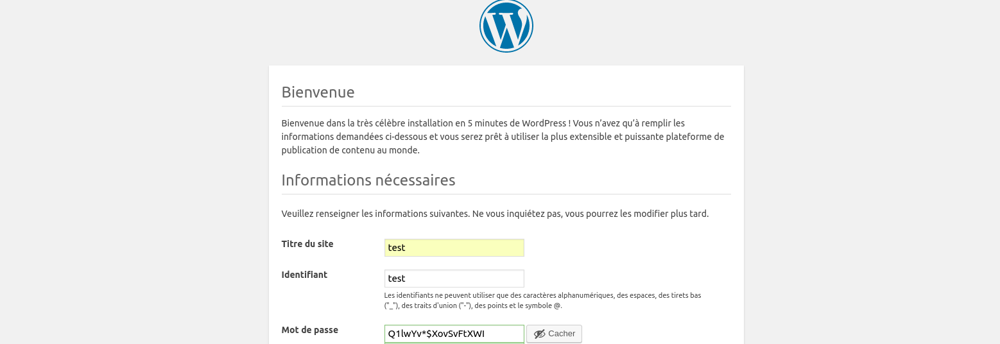
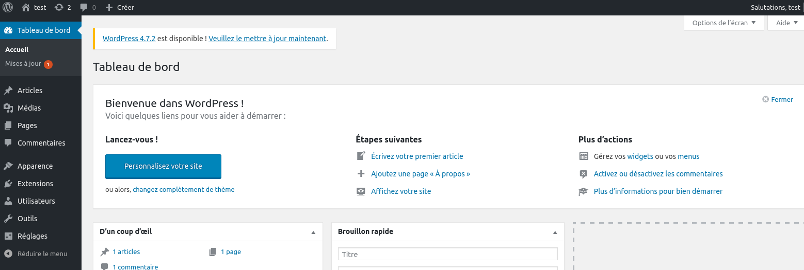

# 5 Minutes Stacks, episode two : WordPress - English version

## Episode Two : Wordpress

In the CMS Open-Source galaxy, WordPress is the most used in term of community, available features and user adoption.
The Automattic compagny, which develop and distribute Wordpress, provides a SaaS offer allowing a user to create its blog in few minutes. However, those who experiments know that limits can be easily found by the wordpress.com hosting capabilities.

Today, Cloudwatt provides the necessary toolset to start your Wordpress instance in a few minutes and to become its master.

The deployement base is an Ubuntu xenial instance. The Apache and MariaDB servers are deployed on a single instance.

## Preparations

### The versions

* Ubuntu 16.04
* Apache 2.4.18
* Wordpress 4.7.1
* MariaDB 10.0.28
* PHP 7.0.13

## A one-click deployment sounds really nice...

 ... Good! Go to the [Apps page](https://www.cloudwatt.com/en/apps/) on the Cloudwatt website, choose the apps, press **DEPLOY** and follow the simple steps... 2 minutes later, a green button appears... **ACCESS**: you have your Wordpress!.

### All of this is fine, but you do not have a way to run the stack thru the console ?

Yes ! Using the console, you can deploy a Wordpress server:

1.	Go the Cloudwatt Github in the applications/bundle-xenial-wordpress repository
2.	Click on the file nammed bundle-xenial-wordpress.heat.yml
3.	Click on RAW, a web page appear with the script details
4.	Save as its content on your PC. You can use the default name proposed by your browser (just remove the .txt)
5.  Go to the « [Stacks](https://console.cloudwatt.com/project/stacks/) » section of the console
6.	Click on « Launch stack », then click on « Template file » and select the file you've just saved on your PC, then click on « NEXT »
7.	Named your stack in the « Stack name » field
8.	Enter your keypair in the « keypair_name » field
9.	Choose the instance size using the « flavor_name » popup menu and click on « LAUNCH »

The stack will be automatically created (you can see its progress by clicking on its name). When all its modules will become "green", the creation will be completed. Then you can go on the "Instances" menu to discover the flotting IP value that has been automatically generated. Now, just run this IP adress in your browser and enjoy !

It is (already) FINISH !

## Install cli

If you like only the command line, you can go directly to the "CLI launch" version by clicking [this link](# cli)

## For further
<a name="install" />

### Install your Wordpress

 

### Homepage + BackOffice

### Configuration of the database

The configuration of the database is in `/data/wordpress/wp-config.php` file.

## So watt ?

The goal of this tutorial is to accelarate your start. At this point you are the master of the stack.
You have a SSH access point on your virtual machine thru the flotting IP and your private keypair (default user name `cloud`).

The interesting entry access points are:

- `/data/wordpress` : Wordpress installation repository.
- `/data/mysql` : Mariadb nodes datadir is a cinder volume.

#### Resources you could be interested in:

* [wordpress](https://wordpress.com/)

<a name="cli" />

## Install cli

### The prerequisites to deploy this stack

* an internet acces
* a Linux shell
* a [Cloudwatt account](https://www.cloudwatt.com/cockpit/#/create-contact), with an [existing keypair](https://console.cloudwatt.com/project/access_and_security/?tab=access_security_tabs__keypairs_tab)
* the tools [OpenStack CLI](http://docs.openstack.org/cli-reference/content/install_clients.html)
* a local clone of the git repository [Cloudwatt applications](https://github.com/cloudwatt/applications)

### Size of the instance

Per default, the script is proposing a deployement on an instance type "Small" (s1.cw.small-1).  Instances are charged by the minute and capped at their monthly price (you can find more details on the [Tarifs page](https://www.cloudwatt.com/fr/produits/tarifs.html) on the Cloudwatt website). Obviously, you can adjust the stack parameters, particularly its defaut size.

### By the way...

If you do not like command lines, you can go directly to the "run it thru the console" section by clicking [here](#console)

## What will you find in the repository

Once you have cloned the github, you will find in the  `bundle-xenial-wordpress/` repository:

* `bundle-xenial-wordpress.heat.yml` : HEAT orchestration template. It will be use to deploy the necessary infrastructure.
* `stack-start.sh` : Stack launching script. This is a small script that will save you some copy-paste.
* `stack-get-url.sh` : Flotting IP recovery script.

## Start-up

### Initialize the environment

Have your Cloudwatt credentials in hand and click [HERE](https://console.cloudwatt.com/project/access_and_security/api_access/openrc/).
If you are not logged in yet, you will go thru the authentication screen then the script download will start. Thanks to it, you will be able to initiate the shell acccesses towards the Cloudwatt APIs.

Source the downloaded file in your shell. Your password will be requested.

~~~ bash
$ source COMPUTE-[...]-openrc.sh
Please enter your OpenStack Password:

~~~

Once this done, the Openstack command line tools can interact with your Cloudwatt user account.

### Adjust the parameters

With the `bundle-xenial-wordpress.heat.yml` file, you will find at the top a section named `parameters`. The sole mandatory parameter to adjust is the one called `keypair_name`. Its `default` value must contain a valid keypair with regards to your Cloudwatt user account. This is within this same file that you can adjust the instance size by playing with the `flavor` parameter.

~~~ yaml
heat_template_version: 2015-04-30

description: All-in-one Wordpress stack

parameters:
  keypair_name:
    default: amaury-ext-compute         <-- Indicate here your keypair
    description: Keypair to inject in instances
    type: string

  flavor_name:
      default: s1.cw.small-1              <-- Indicate here the flavor size
      description: Flavor to use for the deployed instance
      type: string
      constraints:
        - allowed_values:
            - s1.cw.small-1
            - n1.cw.standard-1
            - n1.cw.standard-2
            - n1.cw.standard-4
            - n1.cw.standard-8
            - n1.cw.standard-12
            - n1.cw.standard-16

[...]
~~~

### Start up the stack

In a shell, run the script `stack-start.sh` with the name you want to give it as parameter:

~~~ bash
$ ./stack-start.sh Wordpress
+--------------------------------------+------------+--------------------+----------------------+
| id                                   | stack_name | stack_status       | creation_time        |
+--------------------------------------+------------+--------------------+----------------------+
| ed4ac18a-4415-467e-928c-1bef193e4f38 | Wordpress  | CREATE_IN_PROGRESS | 2015-04-21T08:29:45Z |
+--------------------------------------+------------+--------------------+----------------------+
~~~

Last, wait 5 minutes until the deployement been completed.

At each new deployement of the stack, a  password is generated directly in the `/data/wordpress/config-default.php` configuration file.

### Enjoy

Once all of this done, you can run the `stack-get-url.sh` script.

~~~ bash
./stack-get-url.sh Wordpress
Wordpress 82.40.34.249
~~~

It will gather the assigned flotting IP of your stack. You can then paste this IP in your favorite browser and start to configure your Wordpress instance.

## In the background

The  `start-stack.sh` script is taking care of running the API necessary requests to:

* start an Ubuntu Xenial based instance
* do an update of the system packages
* install Apache, PHP, MariaDB and Wordpress
* configure MariaDB with a wordpress dedicated user and database, with a generated password
* show a flotting IP on the internet

-----
Have fun. Hack in peace.
