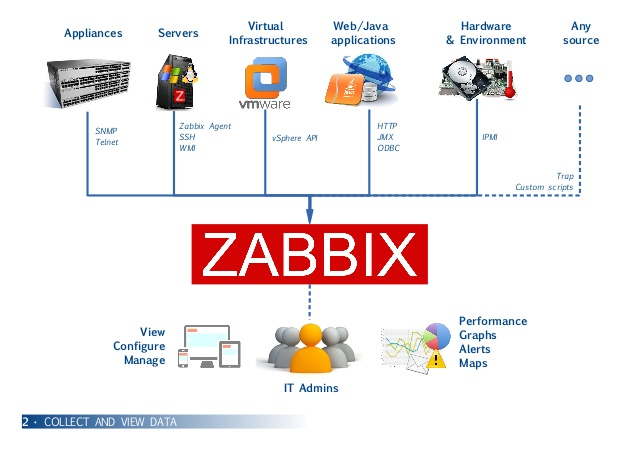
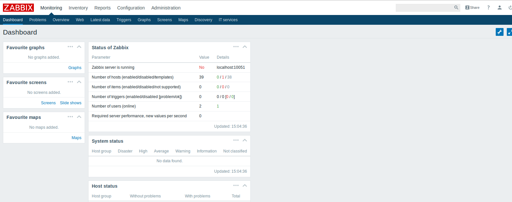

# 5 Minutes Stacks, épisode 36 : Zabbix #

## Episode 36 : Zabbix-server

Zabbix is free software to monitor the status of various network services, servers and other network equipment; and producing dynamic graphics resource consumption. Zabbix uses MySQL, PostgreSQL or Oracle to store data. According to the importance of the number of machines and data to monitor, the choice of the DBMS greatly affects performance. Its web interface is written in PHP.

Zabbix-server in a network is as follows:

We note in this architecture as Zabbix-server can monitor the hosts that are installed zabbix-agent or via SNMP daemon.

## Preparations

### The version

* Ubuntu 16.04
* Zabbix 3.2
* Mysql 5.7

### The prerequisites to deploy this stack

These should be routine by now:

* Internet access
* A Linux shell
* A [Cloudwatt account](https://www.cloudwatt.com/authentification) with a [valid keypair](https://console.cloudwatt.com/project/access_and_security/?tab=access_security_tabs__keypairs_tab)
* The tools of the trade: [OpenStack CLI](http://docs.openstack.org/cli-reference/content/install_clients.html)
* A local clone of the [Cloudwatt applications](https://github.com/cloudwatt/applications) git repository

### Size of the instance

By default, the stack deploys on an instance of type "Small" (s1.cw.small-1). A variety of other instance types exist to suit your various needs, allowing you to pay only for the services you need. Instances are charged by the minute and capped at their monthly price (you can find more details on the [Tarifs page](https://www.cloudwatt.com/fr/produits/tarifs.html) on the Cloudwatt website).

Stack parameters, of course, are yours to tweak at your fancy.

## What will you find in the repository

Once you have cloned the github repository, you will find in the `bundle-xenial-zabbix/` directory:

* `bundle-xenial-zabbix.heat.yml`: Heat orchestration template. It will be use to deploy the necessary infrastructure.
* `stack-start.sh`: Stack launching script, which simplifies the parameters and secures the admin password creation.
* `stack-get-url.sh`: Returns the floating-IP in a URL, which can also be found in the stack output.

## Start-up

### Initialize the environment

Have your Cloudwatt credentials in hand and click [HERE](https://console.cloudwatt.com/project/access_and_security/api_access/openrc/).
If you are not logged in yet, complete the authentication and save the credentials script.
With it, you will be able to wield the amazing powers of the Cloudwatt APIs.

Source the downloaded file in your shell and enter your password when prompted to begin using the OpenStack clients.

~~~ bash
$ source COMPUTE-[...]-openrc.sh
Please enter your OpenStack Password:

~~~

Once this done, the Openstack command line tools can interact with your Cloudwatt user account.

### Adjust the parameters

With the `bundle-xenial-zabbix.heat.yml` file, you will find at the top a section named `parameters`. The sole mandatory parameter to adjust is the one called `keypair_name`. Its `default` value must contain a valid keypair with regards to your Cloudwatt user account. This is within this same file that you can adjust the instance size by playing with the `flavor` parameter.

~~~ yaml

heat_template_version: 2013-05-23

description: All-in-one zabbix stack

parameters:
  keypair_name:
    default:                                   <-- put here your keypair_name
    description: Keypair to inject in instance
    label: SSH Keypair
    type: string

  flavor_name:
    default: s1.cw.small-1                                    
    description: Flavor to use for the deployed instance
    type: string
    label: Instance Type (Flavor)
    constraints:
      - allowed_values:
        - t1.cw.tiny
        - s1.cw.small-1
         [...]

~~~

<a name="startup" />

### Stack up with a terminal

In a shell, go in the directory and run the script `stack-start.sh` with the name you want to give it as parameter:

~~~ bash
$ ./stack-start.sh `name_of_my_stack`
~~~
Exemple :
~~~ bash

$ ./stack-start.sh EXP_STACK
+--------------------------------------+-----------------+--------------------+----------------------+
| id                                   | stack_name      | stack_status       | creation_time        |
+--------------------------------------+-----------------+--------------------+----------------------+
| ee873a3a-a306-4127-8647-4bc80469cec4 | EXP_STACK       | CREATE_IN_PROGRESS | 2015-11-25T11:03:51Z |
+--------------------------------------+-----------------+--------------------+----------------------+

~~~

Within 5 minutes the stack will be fully operational.

~~~ bash
$ heat resource-list EXP_STACK
+------------------+-------------------------------------------------------------------------------------+---------------------------------+-----------------+----------------------+
| resource_name    | physical_resource_id                                                                | resource_type                   | resource_status | updated_time         |
+------------------+-------------------------------------------------------------------------------------+---------------------------------+-----------------+----------------------+
| floating_ip      | 8aa20b7a-129a-4b8c-9d8c-dfec4a25897f                                                | OS::Neutron::FloatingIP         | CREATE_COMPLETE | 2016-09-20T14:01:23Z |
| floating_ip_link | 632178                                                                              | OS::Nova::FloatingIPAssociation | CREATE_COMPLETE | 2016-09-20T14:01:23Z |
| interface        | 5b83fc95-0e3c-41eb-8933-b299b3530045:subnet_id=3109449f-47a0-4a1d-a35d-cb81d2a6a31d | OS::Neutron::RouterInterface    | CREATE_COMPLETE | 2016-09-20T14:01:23Z |
| network          | be3d1095-19e7-4221-84a2-f5846a836fc9                                                | OS::Neutron::Net                | CREATE_COMPLETE | 2016-09-20T14:01:23Z |
| port             | 82c260c2-058b-475a-a055-adfe08aee8df                                                | OS::Neutron::Port               | CREATE_COMPLETE | 2016-09-20T14:01:23Z |
| router           | 5b83fc95-0e3c-41eb-8933-b299b3530045                                                | OS::Neutron::Router             | CREATE_COMPLETE | 2016-09-20T14:01:23Z |
| security_group   | 95ca1f46-855e-4b7f-bf93-d3d244a68785                                                | OS::Neutron::SecurityGroup      | CREATE_COMPLETE | 2016-09-20T14:01:23Z |
| server           | c592398a-a347-4c4d-8b08-729d375f77d6                                                | OS::Nova::Server                | CREATE_COMPLETE | 2016-09-20T14:01:23Z |
| subnet           | 3109449f-47a0-4a1d-a35d-cb81d2a6a31d                                                | OS::Neutron::Subnet             | CREATE_COMPLETE | 2016-09-20T14:01:23Z |
+------------------+-------------------------------------------------------------------------------------+---------------------------------+-----------------+----------------------+
~~~

## All of this is fine,
### but you do not have a way to create the stack from the console?

We do indeed! Using the console, you can deploy a mail server:

1.	Go the Cloudwatt Github in the [applications/bundle-xenial-zabbix]https://github.com/cloudwatt/applications/tree/master/bundle-xenial-zabbix) repository
2.	Click on the file named `bundle-xenial-zabbix.heat.yml` (or `bundle-xenial-zabbix.restore.heat.yml` to [restore from backup](#backup))
3.	Click on RAW, a web page will appear containing purely the template
4.	Save the file to your PC. You can use the default name proposed by your browser (just remove the .txt)
5.  Go to the « [Stacks](https://console.cloudwatt.com/project/stacks/) » section of the console
6.	Click on « Launch stack », then « Template file » and select the file you just saved to your PC, and finally click on « NEXT »
7.	Name your stack in the « Stack name » field
8.	Enter the name of your keypair in the « SSH Keypair » field
9.  Write a passphrase that will be used for encrypting backups
10.	Choose your instance size using the « Instance Type » dropdown and click on « LAUNCH »

The stack will be automatically generated (you can see its progress by clicking on its name). When all modules become green, the creation will be complete. You can then go to the "Instances" menu to find the floating IP, or simply refresh the current page and check the Overview tab for a handy link.

If you've reached this point, you're already done! Go enjoy Mail!

### A one-click chat sounds really nice...

... Good! Go to the [Apps page](https://www.cloudwatt.com/fr/applications/index.html) on the Cloudwatt website, choose the apps, press **DEPLOYER** and follow the simple steps... 2 minutes later, a green button appears... **ACCEDER**: you have your mail server!

### Enjoy

Once all of this done, you can run the `stack-get-url.sh` script to get the floating_network_id

~~~ bash
$ ./stack-get-url.sh `name_of_my_stack`
`name_of_my_stack`  floating_ip
~~~

As shown above, it will parse the assigned floating-IP of your stack into a URL link, with the right port included. You can then click or paste this into your browser of choice and bask in the glory of a fresh Zabbix instance.
For now, our monitoring server and client are configured. We need to access the Zabbix interface using the IP address of our server http://X.X.X.X

* login : admin
* password : zabbix

**Remember to change the default password immediately after your authentication.**

Once authentication is complete you will have access to Zabbix-server.

<a name="console" />

### For monitoring more machines

  It must be ensured that the machines to be monitored:

* are visible on the Zabbix-server network's
* Have a functional zabbix agent
* accept incoming TCP and UDP communications on the 10050 port, listening port of Zabbix agents by default.      

### Example of server Ghost monitoring

Let's see an example of integration of a server instance with the Ghost blog engine.

  * deploy a stack Ghost [as we saw in episode 5](https://dev.cloudwatt.com/fr/blog/5-minutes-stacks-episode-cinq-ghost.html).
  * for your section [Access and Security Cloudwatt console](https://console.cloudwatt.com/project/access_and_security/),   
  add two rules to the security group of the stack Ghost :

  * Rules UDP , Entry, Port 10050
  * Rules TCP , Entry, Port 10050

This will allow the Zabbix server to connect to retrieve the metric of the machine. We must now create the network between our visibility and our stack Zabbix Ghost, through the creation of a Neutron router:

  1. Get the subnet ID of the stack Ghost:

  ~~~ bash

  $ heat resource-list NOM_DE_STACK_GHOST | grep subnet

  | subnet           | bd69c3f5-ddc8-4fe4-8cbe-19ecea0fdf2c              | OS::Neutron::Subnet             | CREATE_COMPLETE | 2015-11-24T15:18:30Z |
  ~~~

  2. Add to a router interface, the subnet of the Ghost stack and  the subnet of the stack Zabbix:

    ~~~bash
    $ neutron router-interface-add Zabbix_ROUTER_ID GHOST_SUBNET_ID
    ~~~

  A few seconds later, the Zabbix and the Ghost servers's will contact each other directly.

  At the moment, it is necessary to make some configuration on the server to monitor. To facilitate you the handling, we prepared you a playbook Ansible which is going to automate these tasks.

  3. Make sure you can logon:
      * SSH
      * user `cloud`
      * Ghost server
      * since Zabbix-server

  4. Since the Zabbix-server, add the connection information in the inventory `/etc/ansible/hosts` :

  ~~~bash         
  [servers]
  xx.xx.xx.xx ansible_ssh_user=cloud ansible_ssh_private_key_file=/home/cloud/.ssh/id_rsa_ghost_server.pem
  ~~~

  7. Start the playbook `servers-monitoring_zabbix.yml` as Zabbix root on the server:
  ~~~bash
  $ ansible-playbook ~cloud/servers-monitoring_zabbix.yml
  ~~~

This playbook  will do all the installation and setup on the Ghost server to integrate monitoring on Zabbix server.

This playbook `servers-monitoring_zabbix.yml` supports these operating systems: Centos (6 et 7), Debian (jessie et wheezy) and Ubuntu (trusty,xenial).

Now, our monitoring server and client are configured. We need to access the Zabbix Web UI using the IP address of our server http://X.X.X.X

## So watt?

This tutorial aims to improve your startup. At this stage you are master on board.
You have an entry point to your virtual machine via SSH floating IP exposed and your private key (`cloud` user by default).
You can start to live your monitoring taking hold of your server.

#### The interesting directories are:

* `/etc/zabbix/zabbix_server.conf`: Containing directory tea tea zabbix-server configuration file
* `/var/lib/mysql`: the directory containing the files in the database zabbix-server-mysql
* `var/log/zabbix/zabbix_server.log`: the file containing the log.
* `/etc/zabbix/zabbix.conf.php`: the directory containing the interface configuration file Zabbix

#### Other resources you could be interested in:

* [Zabbix-monitoring Homepage](http://www.zabbix.com/)
* [Zabbix documentation](https://www.zabbix.com/documentation/2.2/start)
